I **love** to use soft gradients as backdrops when doing graphics programming, a love started by a [Corona Renderer](https://corona-renderer.com/) product shot [sample scene](https://forum.corona-renderer.com/index.php?topic=11345) shared by user [romullus](https://forum.corona-renderer.com/index.php?action=profile;u=9510) and its use of radial gradients to highlight the product. But they are quite horrible from a design standpoint, since they produce awful [color banding](https://en.wikipedia.org/wiki/Colour_banding), also referred to as [posterization](https://en.wikipedia.org/wiki/Posterization). Depending on things like screen type, gradient colors, viewing environment, etc., the effect can be sometimes not present at all, yet sometimes painfully obvious. Let's take a look at what I mean. The following is a WebGL Canvas drawing a black & white, dark and soft half-circle gradient.

<script src="fullscreen-tri.js"></script>
<script  id="vertex_2" type="x-shader/x-vertex"></script>
<script  id="fragment_2" type="x-shader/x-fragment"></script>

<canvas height="200px" id="canvas_2"></canvas>

<script>setupTri("canvas_2", "vertex_2", "fragment_2");</script>
<blockquote>
<details><summary><a href="screenshot_gradient.png">Screenshot</a>, in case WebGL doesn't work</summary>


</details>
<details><summary>WebGL Vertex Shader <a href="fullscreen-tri.vs">fullscreen-tri.vs</a></summary>

```glsl

```

</details>
<details>	
<summary>WebGL Fragment Shader <a href="banding.fs">banding.fs</a></summary>

```glsl

```

</details>
<details>	
<summary>WebGL Javascript <a href="fullscreen-tri.js">fullscreen-tri.js</a></summary>

```javascript

```

</details>
</blockquote>

This produces a 24-bit (8-bits per channel) image with clearly visible banding steps. If you don't see the banding due to being a bright environment or having the screen brightness set to very low, reference the pictures below. Here is what it should look like on an 8-bit panel, specifically the [HP Z24n G2](https://jp.ext.hp.com/monitors/business/z_z24n_g2/) monitor that is connected to my laptop. It should also look the same on a high-end 10-bit or 12-bit panel, since WebGL doesn't allow high bit-depth output. The image is brightness and contrast boosted, to make the steps obvious.

<figure>
	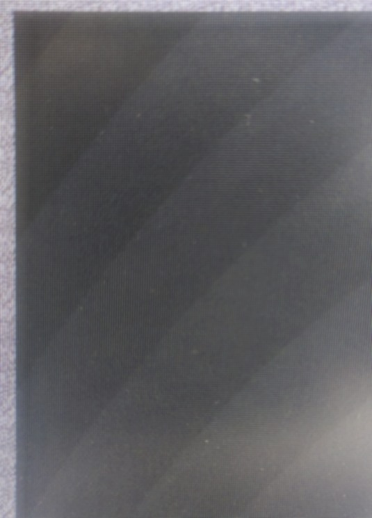
  <figcaption>Photo: WebGL color banding, on a 8-bit panel, contrast and brightness boosted</figcaption>
</figure>

Many Laptop screens are in fact 6-bit panels performing dithering to fake an 8-bit output. This includes even high-priced workstations replacements, like the [HP Zbook Fury 15 G7](https://support.hp.com/us-en/document/c06909298#AbT5) and its [6-bit LCD panel](https://www.panelook.com/N156HCA-GA3__15.6__overview_33518.html), that I sit in front of right now. What you can see are *some* banding steps being a clean uniform color and *some* of them being dithered via the panel's integrated look-up table to achieve a perceived 8-bit output via [ordered dithering](https://en.wikipedia.org/wiki/Ordered_dithering). Though note, how the dithering does **not** result in the banding steps being broken up, it just dithers the color step itself. Capturing this via a photo is a bit difficult, since there is also the pattern of individual pixels messing with the capture and introducing [moiré ](https://en.wikipedia.org/wiki/Moir%C3%A9_pattern) and interference patterns.


<figure>
	
  <figcaption>Photo: WebGL color banding, on a 6-bit panel, contrast and brightness boosted.
	<br>Panel's built-in dithering visualized.</figcaption>
</figure>

<blockquote class="reaction"><div class="reaction_text">It's not obvious from the photo, but the dither pattern is distinctly visible when looking closely with the naked eye.</div></blockquote>

## Magic GLSL One-liner

Let's fix this. The main point of this article is to share how I get banding free gradients in one GLSL fragment shader, rendering in a single pass and without sampling or texture taps to achieve banding free-ness. It involves the best noise one-liner I have ever seen. That genius one-liner is not from me, but from [Jorge Jimenez's presentation on how Gradient noise was implemented in Call of Duty Advanced Warfare](http://www.iryoku.com/next-generation-post-processing-in-call-of-duty-advanced-warfare). You can read it on the presentation's slide 123 onwards. It's described as:

> [...] a noise function that we could classify as being half way between dithered and random, and that we called **_Interleaved Gradient Noise_**.

Here is what the raw noise looks like. The following WebGL Canvas is set to render at the same pixel density as your screen. (Though some Screen DPI and Browser zoom levels will result in it being one pixel off and there being a tiny bit of interpolation)

<canvas id="canvas_noise"></canvas>
<script id="vertex_noise" type="x-shader/x-vertex"></script>
<script id="fragment_noise" type="x-shader/x-fragment"></script>
<script>setupTri("canvas_noise", "vertex_noise", "fragment_noise");</script>
<blockquote>
<details><summary><a href="raw_noise.png">Screenshot</a>, in case WebGL doesn't work</summary>

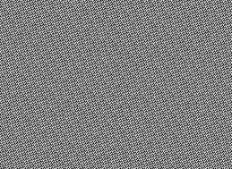

</details>
<details><summary>WebGL Vertex Shader <a href="noise.vs">noise.vs</a></summary>

```glsl

```

</details>
<details>	
<summary>WebGL Fragment Shader <a href="noise.fs">noise.fs</a></summary>

```glsl

```

</details>
<details>	
<summary>WebGL Javascript <a href="fullscreen-tri.js">fullscreen-tri.js</a></summary>

```javascript

```

</details>
</blockquote>

Now let's combine both previous WebGL examples to clear the color banding and get a smooth half-circle gradient.

<canvas height="200px" id="canvas_banding_free"></canvas>
<script  id="vertex_banding_free" type="x-shader/x-vertex"></script>
<script  id="fragment_banding_free" type="x-shader/x-fragment"></script>
<script>setupTri("canvas_banding_free", "vertex_banding_free", "fragment_banding_free");</script>
<blockquote>
<details><summary><a href="screenshot_gradient_dither.png">Screenshot</a>, in case WebGL doesn't work</summary>

You ***have*** to view this at 1:1 pixel scale, otherwise your browser's will counteract the pixel sized dither and re-introduce color banding!


</details>
<details><summary>WebGL Vertex Shader <a href="fullscreen-tri.vs">fullscreen-tri.vs</a></summary>

```glsl

```

</details>
<details>	
<summary>WebGL Fragment Shader <a href="gradient.fs">gradient.fs</a></summary>

```glsl

```

</details>
<details>	
<summary>WebGL Javascript <a href="fullscreen-tri.js">fullscreen-tri.js</a></summary>

```javascript

```

</details>
</blockquote>

<figure>
	
  <figcaption>Photo: Above WebGL Gradient with Interleaved Gradient Noise applied, on an 8-bit panel. Brightness & contrast boosted</figcaption>
</figure>

<blockquote class="reaction"><div class="reaction_text">Perfectly smooth on my monitor with the 8-bit panel! </div></blockquote>

Same monitor and photo setup as the color-banded mess from the beginning of the article. No trickery with different zoom levels or filters. The noise is essentially invisible. It's my own article and still I'm surprised myself at the effectiveness of that simple one-liner.

Technically, the proper way to achieve banding free-ness is to perform [error diffusion dithering](https://en.wikipedia.org/wiki/Error_diffusion), since that would breakup just the quantized steps of the gradient, without touching the color between the steps. But other than [ordered dithering](https://en.wikipedia.org/wiki/Ordered_dithering), there is no GPU friendly way to do this and even very faint [ordered dithering](https://en.wikipedia.org/wiki/Ordered_dithering) is detectable by human vision, since it applies a fixed pattern. When talking about gradients, adding noise works just fine though, even though it's not proper error diffusion. Simply applying noise with the strength of one 8-bit grayscale value `(1.0 / 255.0) * gradientNoise(gl_FragCoord.xy)` side-steps a bunch of issues and the code footprint is tiny to boot. Additionally we subtract the average added brightness of `(0.5 / 255.0)` to keep the brightness the same, since we are introducing the noise via addition, though the difference is barely noticeable. Here is a part of the gradient with a threshold applied and zoomed in, to see how both gradient and noise interact.

<figure>
	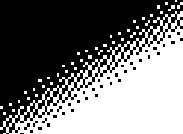
  <figcaption>Above WebGL gradient thresholded and zoomed in</figcaption>
</figure>

Here is how I usually use this Shader setup to draw a background for objects and scenes to live on.

<canvas height="200px" id="canvas_bg_example"></canvas>
<script  id="vertex_bg_example" type="x-shader/x-vertex"></script>
<script  id="fragment_bg_example" type="x-shader/x-fragment"></script>
<script>setupTri("canvas_bg_example", "vertex_bg_example", "fragment_bg_example");</script>
<blockquote>
<details><summary><a href="radial.png">Screenshot</a>, in case WebGL doesn't work</summary>

You ***have*** to view this at 1:1 pixel scale, otherwise your browser's will counteract the pixel sized dither and re-introduce color banding!


</details>
<details><summary>WebGL Vertex Shader <a href="fullscreen-tri.vs">fullscreen-tri.vs</a></summary>

```glsl

```

</details>
<details>	
<summary>WebGL Fragment Shader <a href="full_example.fs">full_example.fs</a></summary>

```glsl

```

</details>
<details>	
<summary>WebGL Javascript <a href="fullscreen-tri.js">fullscreen-tri.js</a></summary>

```javascript

```

</details>
</blockquote>

### Don't Double Dither
But what about that 6-bit laptop screen? Let's take a look, by photographing the dithered gradient like in the beginning of the article...

<figure>
	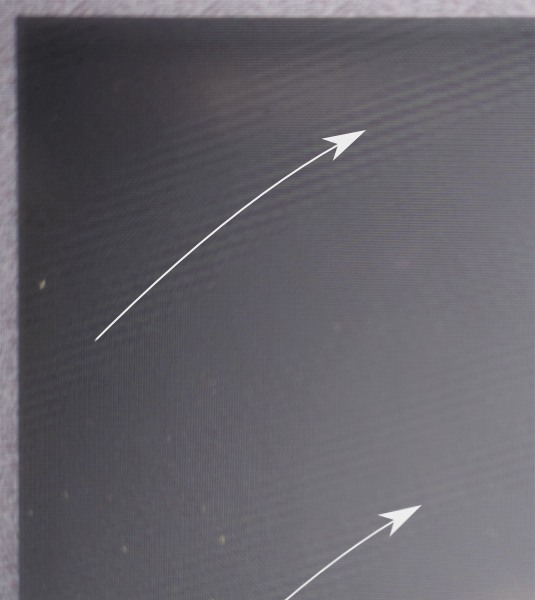
  <figcaption>Interference patterns from both forms of dither interfering
  <br>
  Arrows to show the interference following the gradient direction</figcaption>
</figure>

<blockquote class="reaction"><div class="reaction_text">...ohh you gotta be kidding me</div></blockquote>

Both the 6-bit screen's dithering pattern and our Interleaved Gradient Noise interfere with each other. Exactly the color bands where the panel performs the dithering, we can see the the interference appearing in the form of saw-tooth ridges. Maybe by increasing the noise strength to correspond to 6-bit values? `(1.0 / 64.0) * gradientNoise(gl_FragCoord.xy) - (0.5 / 64.0)` By dividing by 64 instead of 255, we get 6-bit noise. Let's see...

<figure>
	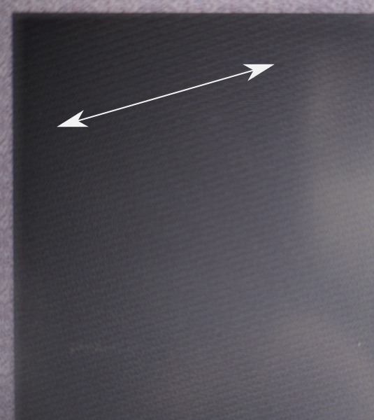
  <figcaption>Interference patterns from both forms of dither interfering with 6-bit noise
  <br>
  Arrows to show the interference direction</figcaption>
</figure>

<blockquote class="reaction"><div class="reaction_text">...it's worse!</div></blockquote>

Clearly obvious diagonal stripes throughout the whole gradient. Yeah, 6-bit panels are a travesty. Especially on a product of this caliber. I mean the old [Thinkpad T500 & X200 I hardware modded](https://www.youtube.com/watch?v=Fs4GjDiOie8) have 6-bit panels, but those are multiple tech generations old. We could tweak the noise algorithm, but it's just not worth to drop our denominator so low. It's 2024 in a couple days and every human being deserves at least 256 different shades in each color channel.

### Bufferless Version
Here is what the shaders look like if you use OpenGL 3.3, OpenGL 2.1 with the [`GL_EXT_gpu_shader4`](https://registry.khronos.org/OpenGL/extensions/EXT/EXT_gpu_shader4.txt) extension (`#version` would have to change) or WebGL2 and want to skip the Vertex Buffer setup by putting the fullscreen triangle into the vertex shader. If you get an error around `gl_VertexID` missing, you don't have [`GL_EXT_gpu_shader4`](https://registry.khronos.org/OpenGL/extensions/EXT/EXT_gpu_shader4.txt) enabled.

These can be rewritten to work with even the most basic OpenGL or WebGL standard by uploading the vertex buffer prior, as done in all the WebGL examples up till now. The fragment shader stays basically the same.

<details><summary>Bufferless Vertex Shader</summary>

```glsl
#version 330
out vec2 tex;

const vec2 pos[3] = vec2[] (
    vec2(-1.0, -1.0),
    vec2( 3.0, -1.0),
    vec2(-1.0,  3.0)
);

void main()
{
    tex = pos[gl_VertexID];
    gl_Position = vec4(pos[gl_VertexID], 0.0, 1.0);
}
```
</details>

<details><summary>Bufferless Fragment Shader</summary>

```glsl
#version 330
in vec2 tex;
out vec4 Out_Color;

/* Gradient noise from Jorge Jimenez's presentation: */
/* http://www.iryoku.com/next-generation-post-processing-in-call-of-duty-advanced-warfare */
float gradientNoise(in vec2 uv)
{
    return fract(52.9829189 * fract(dot(uv, vec2(0.06711056, 0.00583715))));
}

vec3 outsidecolor = vec3(0.22, 0.23, 0.25);
vec3 insidecolor = vec3(0.40, 0.41, 0.45);

void main()
{
    vec3 bgcolor = mix(insidecolor, outsidecolor,
                       sqrt(tex.x * tex.x + tex.y * tex.y));

    /* Add gradient noise to reduce banding. */
    bgcolor += (1.0 / 255.0) * gradientNoise(gl_FragCoord.xy) - (0.5 / 255.0);
    Out_Color = vec4(bgcolor, 1.0);
}
```
</details>

## What are the big-boys doing?
To finish off, let's take a look how color banding is solved in other pieces of software. Not *just* in the context of gradients, but also beyond.

### Alien: Isolation
I consider [Alien: Isolation](https://en.wikipedia.org/wiki/Alien:_Isolation) to be a technical master piece in terms of lighting, especially considering the time it was released. They faked realtime global illumination in a really interesting fashion, with the flashlight lighting up the area when shining directly at a wall fairly close and casting a redish ambiance when shining at a deep red door. It's mostly a hardcoded fake effect working with specific surfaces, but I digress...

Horror games like Alien: Isolation have a lot of dark scenes with lights creating gradient like falloffs. These are very prone to color banding. The programmers over at [creative assembly](https://www.creative-assembly.com/) show multiple ways of tackling this. Let's take a look at how by dissecting this scene.

<figure>
	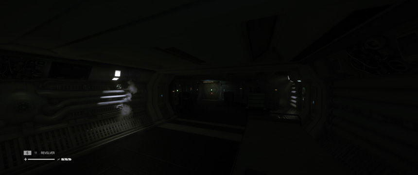
  <figcaption>Stage 5 of <a href="https://en.wikipedia.org/wiki/Alien:_Isolation">Alien: Isolation</a></figcaption>
</figure>

I photographed the middle of the scene, as viewed on my [Alienware AW3423DW](https://www.dell.com/en-us/shop/alienware-34-curved-qd-oled-gaming-monitor-aw3423dw/apd/210-bcye/monitors-monitor-accessories). In this first example, without any color banding mitigation and again with brightness & contrast boosted for clarity within this article. In real-life the color banding is obviously visible when gaming in a dark environment. These are actual photos and not screenshots, which will matter a little later.

<figure>
	
  <figcaption>Photo: Strong Color-Banding under the light, contrast & brightness boosted</figcaption>
</figure>

#### Film grain
There is of course the easy way of just slapping a lot of film grain everywhere and Alien: Isolation is definitely guilty of this. In fact way more egregious than other games, with the VHS aesthetic of huge dark blobs.

<figure>
	
  <figcaption>Screenshot: Use of Filmgrain, right side brightness & contrast boosted</figcaption>
</figure>

It's not quite as bad when turned down to lower settings and during gameplay it's animated, but I'm still not a fan. Let's see if we can do one better...

#### Deep-Color
<figure>
	
  <figcaption>Deep Color setting in Alien: Isolation</figcaption>
</figure>

_Deep Color_ is what Alien: Isolation calls rendering and outputting at 10-bits per channel. The way this setting works is absolutely not obvious though. You can turn it on, but it will only be actually active under a certain set of circumstances:
 * Anti-Aliasing **has** to be disabled.
   * That's a serious bummer. None of the Anti-Aliasing shaders handle the 10-bit signal and just crush the result back down to 8-bit. It's as if you didn't turn it on at all :[
 * Your monitor needs to accept a 10 or 12-bit signal. Otherwise, the game won't switch into that higher bit-depth mode.
   * Interestingly enough, the monitor doesn't need to be in that mode, but that mode just has to be _available_ and the switching happens automatically, which I did not expect. In the case of my monitor, this entails switching from 175hz to 144hz, to unlock the 10-bit color option.
   

<figure>
	
  <figcaption>Photo: No Color-banding thanks to deep-color (contrast & brightness boosted)</figcaption>
</figure>

<blockquote class="reaction"><div class="reaction_text">What an excellent result! All banding banished to the shadow realm.</div></blockquote>

No tricks with different processing of the photo either. The camera captured the exact same exposure and the brightness was boosted in the same way. I suspect, that it's not just the output being 10-bit, that is giving such a good result, but also some passes being merged at a higher bit-depth and thus reducing color banding further. The result is just way too good for being a mere bump from 256 -> 1024 steps per channel. Please note, that this is in no way shape or form related to **the standard** of HDR. In fact, HDR is explicitly disabled in Windows.

Of course, you need to have a rather expensive screen, being able to run 10-bits per channel or higher. And even if, sometimes the graphics card you have doesn't have the right generation of connector, leading you to have to drop color-resolution and/or refresh-rate in order to do so. What else is there?

#### Reshade's Deband Effect
[ReShade](https://reshade.me) (sometimes mistakenly referred to as [SweetFx](https://github.com/CeeJayDK/SweetFX), a shader collection that used to be part of it) is a popular graphics hook, that applies various effects on top of many games, with many presets custom tuned by the community. ReShade's versatility and maturity has proven itself over many years of releases and broad palette of supported games. Among the effects you can apply is "Deband" (Simply called "Dither" in the past). 
<figure>
	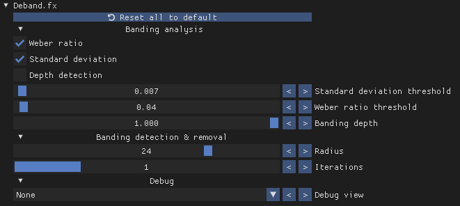
  <figcaption>ReShade's Deband effect menu</figcaption>
</figure>

The `Deband.fx` Shader (Source code below, for reference) applies dithering to areas, that it detects as affected by color banding, based on the ["Weber Ratio"](https://en.wikipedia.org/wiki/Contrast_(vision)#Weber_contrast).

<details>	
<summary><a href="https://reshade.me">ReShade</a>'s <a href="https://github.com/crosire/reshade-shaders/blob/slim/Shaders/Deband.fx">Deband.fx</a> source code, for reference</summary>

```hlsl

```

</details><br>

<figure>
	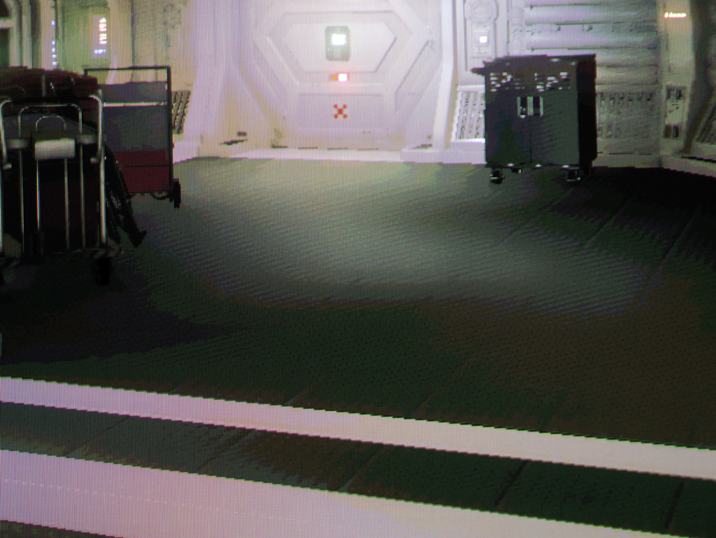
  <figcaption>Photo: Reshade's Deband reducing color banding (contrast & brightness boosted)</figcaption>
</figure>

In the brightness boosted photo, it may look like the effect only did half the job. Whilst technically true, to the naked eye it's surprisingly effective. It takes the edge off the visible color bands and makes it essentially invisible to even my pixel-peeping eyes. It also works with Anti-Aliasing, as it's a mere post-processing shader applied on top.

<blockquote class="reaction"><div class="reaction_text">I seriously recommend injecting this effect, if you have a game where such color banding annoys you.</div></blockquote>

### Adobe After Effects
The **Gradient ramp** "generator" in [Adobe After Effects](https://en.wikipedia.org/wiki/Adobe_After_Effects) is used to generate gradients. It has an interesting "Ramp Scatter" slider, that diffuses the color bands with noise. It does it in a way, that defuses just the color bands though. Here is what the [official documentation](https://helpx.adobe.com/after-effects/using/generate-effects.html) has to say about it:
> **Note:** Ramps often don’t broadcast well; severe banding occurs because the broadcast chrominance signal doesn’t contain sufficient resolution to reproduce the ramp smoothly. The Ramp Scatter control dithers the ramp colors, eliminating the banding apparent to the human eye. 

<figure>
	
  <figcaption>After Effects gradient ramp's ramp scatter. Right side brightness and contrast boosted, with circles showing a zoomed section.</figcaption>
</figure>

When cranked to the max, you can see streaks running through the noise. Surprisingly, the performance is quite bad. At 0 ramp scatter, the gradient renders instantly, regardless of resolution. To do a 4k frame of this at max ramp scatter takes my high-end [AMD Ryzen 9 7900x](https://www.amd.com/en/products/cpu/amd-ryzen-9-7900x) a quarter second though. 4fps playback with nothing, but a mere gradient. Both facts lead me to believe, that there is some kind iterative algorithm at play here, though I can only guess. To be fair, as long as none of the effect's properties are animated, it caches just one frame and that's it. After effects is pretty smart about it. But it's also known to still carry a legacy set of single-threaded slowness across a lot of its features.

### KDE Kwin Blur
Finally, let's talk blur. Blur produces smooth gradients, which quickly suffer from color banding. The [KDE Plasma Desktop](https://kde.org/plasma-desktop/), one of the most popular Desktop Environments for Linux and FreeBSD, uses one of my favorite pieces of graphics programming wizardry, the [Dual Kawase Blur](https://github.com/JujuAdams/Kawase), to blur the backdrops of windows, as [implemented a while back](https://phabricator.kde.org/R108:0179f741bbd4cc01da5866fdf7b6a302869a099b). To defuse said color banding, a noise can be applied on top. The source code for the implementation [can be found here](https://phabricator.kde.org/source/kwin/browse/master/effects/blur/).
<figure>
	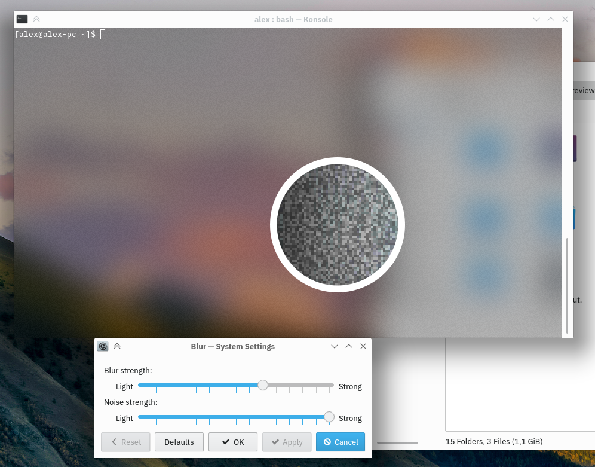
  <figcaption>KDE Plasma's Blur with noise at max strength (<a href="https://phabricator.kde.org/R108:cc0325af41528b4f68e9f376c4d2d27ed1e28f11">Source</a>)<br>Zoomed and contrast boosted in circle</figcaption>
</figure>

### Microsoft Windows Acrylic
To finish off, here is how Windows 11 and its ["Acrylic"](https://learn.microsoft.com/en-us/windows/apps/design/style/acrylic#how-we-designed-acrylic) does it. It applies both blur and noise to achieve the same.
<figure>
	
  <figcaption>Microsoft Acrylic implementation diagram (<a href="https://learn.microsoft.com/en-us/windows/apps/design/style/acrylic#how-we-designed-acrylic">Source</a>)</figcaption>
</figure>

Here is how it looks in the [Microsoft's "New Windows Terminal"](https://github.com/microsoft/terminal). The circle has again brightness and contrast boosted to see the effect more clearly in the context of the article. Even though new Windows terminal is open source, the implementation of acrylic is within the source code of Windows itself, so we cannot take a look at the specific implementation.
<figure>
	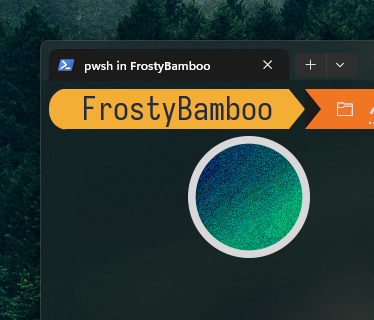
  <figcaption>Microsoft Terminal's use of Blur and Noise, boosted contrast in circle</figcaption>
</figure>

And that warps up our little journey through all things color and hopefully none things banding.

## Addendum
[Lobste.rs](https://lobste.rs/) user [luchs](https://lobste.rs/~luchs) asked [here](https://lobste.rs/s/qxkfhl/how_how_not_fix_color_banding#c_ldjp2e) for a way to determine the bit-depth of the current output, if one does not trust the software stack to do so correctly.
> Do you have any good test images for determining a monitor’s color depth? Between applications, compositors, graphics drivers and monitors, it looks like a lot of things can go wrong. Monitors that accept 8 or 10 bit and then use dithering don’t help either.

This is indeed an interesting test-case, so I quickly whipped up a [16-bit PNG](bitdepth_test.png) of a dark, grayscale gradient, with no dithering. In terms of grayscale value, the gradient goes from `0-2` in **8**-bit, `0-8` in **10**-bit and `0-256` in **16**-bit. The file is 1024px wide, so there is a new grayscale value every 4 pixels.

<figure>
	
  <figcaption>16-bit Test image</figcaption>
</figure>

Here is how the test works. Load up the image, point a camera at it and take a photo with a long enough exposure to distinguish the color bands. The camera does not have to be anything special, an 8bpp jpeg is more than enough. Depending on how many color bands you see, you can determine the true result of the bit-depth-ness hitting your hopefully better than 8-bit eyes.

<figure>
	
  <figcaption>Photo: 16-bit Test image on an 8-bit monitor, 3 distinct stripes. Image shadow brightness boosted.</figcaption>
</figure>

On an 8-bit monitor, you should see 3 distinct stripes. If **the file** is properly decoded with the sRGB gamma curve, then the stripes should be as per the photo above: first and last stripe exactly half the size of the middle one. (Due to the gradient starting and ending on integer boundaries and color bands forming in even sizes in-between)
<figure>
	
  <figcaption>Photo: 16-bit Test image on a 10-bit monitor, 9 distinct stripes. Image shadow brightness boosted.</figcaption>
</figure>

On a 10-bit monitor with proper software support, you should see 9 distinct stripes. All stripes should be the same size, except the first and last one, which should be half-sized. If you see 33, then your monitor and software are in 12-bit mode.
If the stripes are not even or you are seeing more or less than the numbers above, then something is going on in terms of color space during image decoding.

<figure>
	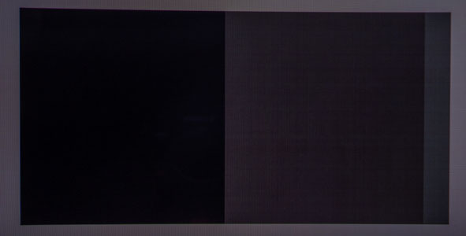
  <figcaption>Photo: 16-bit Test image on an 8-bit monitor, 3 distinct stripes. Skewed result due to improper decoding. Image shadow brightness boosted.</figcaption>
</figure>

 On Windows, Microsoft Edge skews the gradient to one side, whilst Firefox does not. It has either to do with Microsoft Edge applying extra color management or the brightness response curve being approximated [as Gamma 2.2, instead of the piece-wise curve](https://www.colour-science.org/posts/srgb-eotf-pure-gamma-22-or-piece-wise-function/) that it is, leading to a slight shift in how the 16-bit gradient is being displayed on the 8-bit output. Your monitor's color gamut and gamma settings should have zero effect on the number and distribution of stripes, just the decoding and any added conversions applied after.