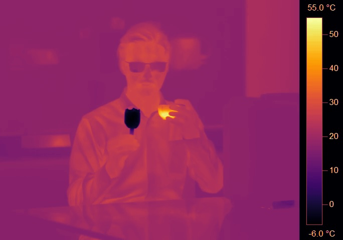
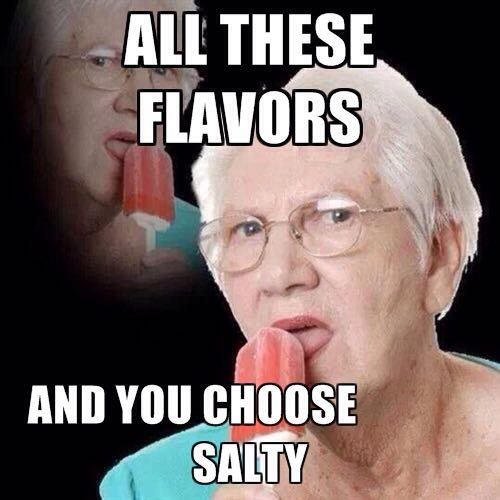
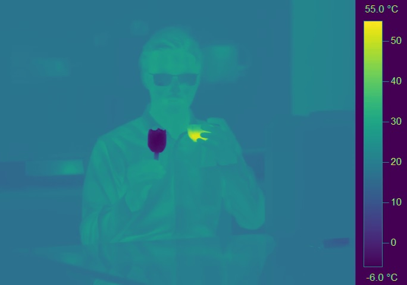
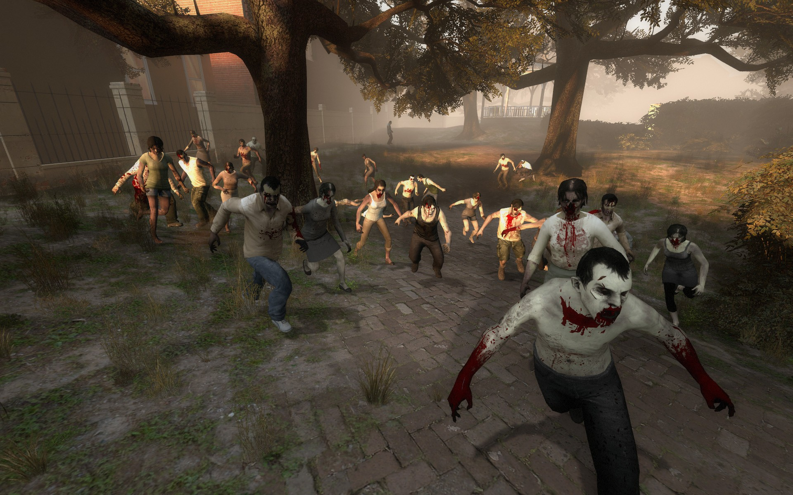
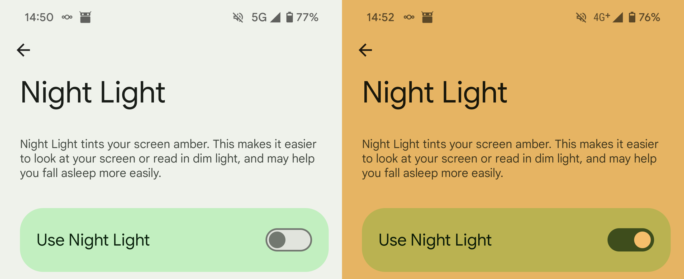
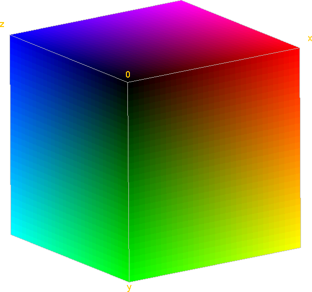
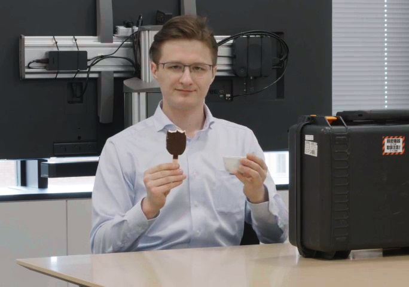
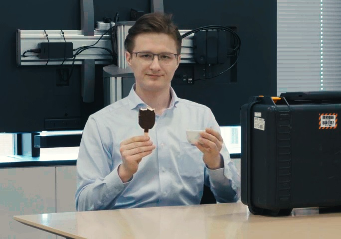

<script src="fullscreen-tri.js"></script>
<script  id="vertex" type="x-shader/x-vertex"></script>

[Look-up-tables](https://en.wikipedia.org/wiki/Lookup_table), more commonly referred to as LUTs, are as old as Mathematics itself. The act of precalculating things into a row or table is nothing new. But in the realm of graphics programming, this simple act unlocks some incredibly creative techniques, which both artists and programmers found when faced with tough technical hurdles.

We'll embark on a small journey, which will take us from simple things like turning grayscale footage into color, to creating limitless variations of blood-lusting zombies, with many interactive WebGL examples along the way, that you can try out with your own videos or webcam. Though this article uses [WebGL](https://en.wikipedia.org/wiki/WebGL), the techniques shown apply to any other graphics programming context, be it [DirectX](https://en.wikipedia.org/wiki/DirectX), [OpenGL](https://en.wikipedia.org/wiki/OpenGL), [Vulkan](https://en.wikipedia.org/wiki/Vulkan), game engines like [Unity](<https://en.wikipedia.org/wiki/Unity_(game_engine)>), or plain scientific data visualization.

<figure>
	<video width="1400" height="480" style="width: unset; max-width: 100%" autoplay playsinline muted controls loop><source src="preview.mp4" type="video/mp4"></video>
	<figcaption>Cold ice cream and hot tea. Left: Panasonic GH6, Right: TESTO 890 + 15°x11° Lens</figcaption>
</figure>

We'll be creating and modifying the video above, though you may substitute the footage with your own at any point in the article. The video is a capture of two cameras, a [Panasonic GH6](https://www.dpreview.com/reviews/panasonic-lumix-dc-gh6-review) and a [TESTO 890](https://www.testo.com/en/testo-890/p/0563-0890-X1) thermal camera. I'm eating cold ice cream and drinking hot tea to stretch the temperatures on display.

## The Setup

We'll first start with the thermal camera footage. The output of the [thermal camera](https://en.wikipedia.org/wiki/Thermographic_camera) is a grayscale video. Instead of this video, you may upload your own or activate the webcam, which even allows you to live stream from a thermal camera using [OBS](https://obsproject.com/)'s virtual webcam output and various input methods.

<blockquote class="reaction"><div class="reaction_text">No data leaves your device, all processing happens on your GPU. Feel free to use videos exposing your most intimate secrets.</div></blockquote>

<input type="file" id="fileInput" accept="video/*" style="display: none;" onchange="changeVideo(this, 'videoPlayer')">

<div class="center-child"><button onclick="document.getElementById('fileInput').click();">Upload Video</button><button onclick="startWebcam('videoPlayer');">Connect Webcam</button></div>

<video width="100%" height="480" autoplay playsinline muted controls loop id="videoPlayer"><source src="bwvid.mp4" type="video/mp4"></video></div>
<blockquote class="reaction"><div class="reaction_text">Don't pause the video, it's the live input for the WebGL examples below</div></blockquote>
<script src="videoSource.js"></script>

Next we upload this footage to the graphics card using WebGL and redisplay it using a [shader](https://learnopengl.com/Getting-started/Hello-Triangle), which leaves the footage untouched. Each frame is transferred as a 2D [texture](https://learnopengl.com/Getting-started/Textures) to the GPU. Though we haven't actually done anything visually yet, we have established a graphics pipeline, which allows us to manipulate the video data in realtime. From here on out, we are mainly interested in the "[Fragment Shader](https://learnopengl.com/Getting-started/Hello-Triangle)". This is the piece of code that runs per pixel of the video to determine its final color.

<blockquote class="reaction"><div class="reaction_text">I'm hardcore simplifying here. Technically there are many shader stages, the fragment shader runs per <a href="https://www.khronos.org/opengl/wiki/Fragment">fragment</a> of the output resolution not per pixel of the input, etc.</div></blockquote>

<script  id="fragment_2" type="x-shader/x-fragment"></script>

<canvas width="100%" height="480" id="canvas_2"></canvas>

<script>setupTri("canvas_2", "vertex", "fragment_2", "videoPlayer", null);</script>

<blockquote>
<details><summary><a href="screenshot_passthrough.jpg">Screenshot</a>, in case WebGL doesn't work</summary>


</details>
<details><summary>WebGL Vertex Shader <a href="fullscreen-tri.vs">fullscreen-tri.vs</a></summary>

```glsl

```

</details>
<details>	
<summary>WebGL Fragment Shader <a href="video-simple.fs">video-simple.fs</a></summary>

```glsl

```

</details>
<details>	
<summary>WebGL Javascript <a href="fullscreen-tri.js">fullscreen-tri.js</a></summary>

```javascript

```

</details>
</blockquote>

Both the video and its WebGL rendition should be identical and playing in sync.

<blockquote class="reaction"><div class="reaction_text">Unless you are on  <a href="https://www.mozilla.org/en-US/firefox/browsers/mobile/android/">Firefox Android</a>, where <a href="https://bugzilla.mozilla.org/show_bug.cgi?id=1709726">video is broken for WebGL</a></div></blockquote>

## Tinting

Before we jump into how LUTs can help us, let's take a look a how we can manipulate this footage. The Fragment Shader below colors the image orange by multiplying the image with the color orange in line `21`. Coloring a texture that way is referred to as "tinting".

`vec3 finalColor = videoColor * vec3(1.0, 0.5, 0.0);` is the line that performs this transformation. `vec3(1.0, 0.5, 0.0)` is the color orange in RGB. Try changing this line and clicking "**Reload Shader**" to get a feel for how this works. Also try out different operations, like addition `+`, division `/` etc.

<pre id="tintingShader"></pre>
<script src="/ace/ace.js" type="text/javascript" charset="utf-8"></script>
<script>
    var editor = ace.edit("tintingShader");
    editor.setTheme("ace/theme/gruvbox_dark_hard");
    editor.session.setMode("ace/mode/glsl");
	editor.session.setOptions({
        useWorker: false
    });
	editor.renderer.setOptions({
		showFoldWidgets: false,
        fontSize: "smaller",
        fontFamily: "Consolas, Monaco, \"Andale Mono\", monospace;",
		showPrintMargin: false,
		maxLines: 50
    })
</script>

<div class="center-child"><button id="shaderReload_3">Reload Shader</button></div>

<canvas width="100%" height="480" id="canvas_3"></canvas>

<script>setupTri("canvas_3", "vertex", "tintingShader", "videoPlayer", null, null, "shaderReload_3");</script>
<blockquote>
<details><summary><a href="screenshot_orange.jpg">Screenshot</a>, in case WebGL doesn't work</summary>


</details>
<details><summary>WebGL Vertex Shader <a href="fullscreen-tri.vs">fullscreen-tri.vs</a></summary>

```glsl

```

</details>
<details>
<summary>WebGL Javascript <a href="fullscreen-tri.js">fullscreen-tri.js</a></summary>

```javascript

```

</details>
</blockquote>

### Performance cost: Zero

**_Depending on the context_**, the multiplication introduced by the tinting has zero performance impact. On a theoretical level, the multiplication has a cost associated with it, since the chip has to perform this multiplication at some point. But you will probably not be able to measure it _in this context_, as the multiplication is affected by "[latency hiding](https://www2.eecs.berkeley.edu/Pubs/TechRpts/2016/EECS-2016-143.pdf)". The act, cost and latency of pushing the video though the graphics pipeline unlocks a lot of manipulations we get for free this way. We can rationalize this from multiple levels, but the main point goes like:

- Fetching the texture from memory takes way more time than a multiplication
  - Even though the result depends on the texture tap, with multiple threads the multiplication is performed while waiting on the texture tap of another pixel

<blockquote class="reaction"><div class="reaction_text">This is about the difference tinting makes, not overall performance. Lot's left on the optimization table, like asynchronously loading the frames to a single-channel texture or processing on every frame, not display refresh</div></blockquote>

In similar vein, it was also talked about in the [recent blog post](https://rosenzweig.io/blog/conformant-gl46-on-the-m1.html) by [Alyssa Rosenzweig](https://rosenzweig.io), about her GPU reverse engineering project achieving proper standard conformant OpenGL Drivers on the Apple M1. Regarding performance implications of a specific additional operation she noted:

> **Alyssa Rosenzweig**: The difference should be small percentage-wise, as arithmetic is faster than memory. With thousands of threads running in parallel, the arithmetic cost may even be hidden by the load’s latency.

### Valve Software's use of tinting

Let's take a look how this is used in the wild. As an example, we have [Valve Software](https://www.valvesoftware.com/)'s [Left 4 Dead](https://en.wikipedia.org/wiki/Left_4_Dead). The in-game developer commentary feature unlocks much shared wisdom form artists and programmers alike. Here is the audio log of developer [Tristan Reidford](https://www.linkedin.com/in/tristan-reidford-b8474a2/) explaining how they utilized tinting to create car variations. In particular they use one extra texture channel to determine extra tinting regions, allowing one to use 2 colors to tint certain regions of the 3D model in a different color.

<audio controls><source src="Tristan-Reidford.mp3" type="audio/mpeg"></audio>

> **Tristan Reidford:** Usually each model in the game has its own unique texture maps painted specifically for that model, which give the object its surface colors and detail. To have a convincing variety of cars using this method would have required as many textures as varieties of car, plus multiple duplicates of the textures in different colors, which would have been far out of our allotted texture memory budget. So we had to find a more efficient way to bring about that same result. For example, the texture on this car is shared with 3 different car models distributed throughout the environment. In addition to this one color texture, there is also a 'mask' texture that allows each instance of the car's painted surfaces to be tinted a different color, without having to author a separate texture. So for the cost of two textures you can get four different car models in an unlimited variety of colors.

<figure>
	
	<figcaption>Screenshot: Left 4 Dead and its use of tinting the same car to get achieve new looks.</figcaption>
</figure>

Note, that it's not just cars. Essentially everything in the [Source Engine](<https://en.wikipedia.org/wiki/Source_(game_engine)>) can be tinted.

## The LUT - Simple, yet powerful

Now that we have gotten an idea of how we can interact and manipulate color in a graphics programming context, let's dive into how a LUT can elevate that. The core of the idea is this: Instead of defining how the colors are changed across their entire range, let's define what color range changes in what way. If you have replaced the above thermal image with an RGB video of your own, then just the red channel will be used going forward.

The following examples make more sense in context of thermal camera footage, so you can click the following button to revert to it, if you wish.

<div class="center-child">
<button onclick='changeVideoURL("bwvid.mp4", "videoPlayer")'>Reload thermal camera footage</button></div>

### The humble 1D LUT

A 1D LUT is a simple array of numbers. If the 1D LUT is an RGB image, then a 1D LUT is a 1D array of colors. According that array, we will color our gray video. In the context of graphics programming, this gets uploaded as a 1D-texture to the graphics card, where it is used to transform the single channel pixels into RGB.

<div class="center-child">
<select id="lutSelector">
    <option value="/assets/LUTs/PerceptuallyUniform/inferno.png">Inferno - 256px wide</option>
    <option value="/assets/LUTs/InfernoSizes/inferno128.png">Inferno - 128px wide</option>
    <option value="/assets/LUTs/InfernoSizes/inferno64.png">Inferno - 64px wide</option>
    <option value="/assets/LUTs/InfernoSizes/inferno32.png">Inferno - 32px wide</option>
    <option value="/assets/LUTs/InfernoSizes/inferno16.png">Inferno - 16px wide</option>
    <option value="/assets/LUTs/InfernoSizes/inferno8.png">Inferno - 8px wide</option>
    <option value="/assets/LUTs/InfernoSizes/inferno4.png">Inferno - 4px wide</option>
    <option value="/assets/LUTs/InfernoSizes/inferno2.png">Inferno - 2px wide</option>
</select>
</div>


<script  id="fragment_4" type="x-shader/x-fragment"></script>

<canvas width="100%" height="480" id="canvas_4"></canvas>

<script>setupTri("canvas_4", "vertex", "fragment_4", "videoPlayer", "lut", "lutSelector")</script>
<blockquote>
<details><summary><a href="screenshot_inferno.jpg">Screenshot</a>, in case WebGL doesn't work</summary>



</details>
<details><summary>WebGL Vertex Shader <a href="fullscreen-tri.vs">fullscreen-tri.vs</a></summary>

```glsl

```

</details>
<details>	
<summary>WebGL Fragment Shader <a href="video-lut.fs">video-lut.fs</a></summary>

```glsl

```

</details>
<details>	
<summary>WebGL Javascript <a href="fullscreen-tri.js">fullscreen-tri.js</a></summary>

```javascript

```

</details>
</blockquote>

An here comes the neat part, looking at the fragment shader, we use the brightness of the video, which goes from `[0.0 - 1.0]` to index into the X-Axis of our 1D LUT, which also has texture coordinates corresponding to`[0.0 - 1.0]`, resulting in the expression `vec4 finalcolor = texture(lut, videoColor);`. In WebGL 1.0, we don't have 1D-Textures, so we use a 2D-Texture of 1px height. `vec4 finalColor = texture2D(lut, vec2(videoColor, 0.5));` Thus the resulting code actually needs the Y coordinate as well, [neither of which particularly matters](https://github.com/tuket/opengl_tex1d_benchmark).

The `0.0` black in the video is mapped to the color on the left and `1.0` white in the video is mapped to the color on the right, with all colors in between being assigned to their corresponding values. ***1D vector in, 3D vector out.***

What makes this map so well to the GPU, is that on GPUs we get bilinear filtering for free when performing texture reads. So if our 8-bits per channel video has 256 distinct shades of grey, but our 1D-Lut is only 32 pixels wide, then the texture access in between two pixels gets linearly interpolated automatically. In the above selection box you can try setting the 1D Lut to different sizes and compare.

<blockquote class="reaction"><div class="reaction_text">Incredible how close the 256 pixel wide and very colorful gradient is reproduced, with only 8 pixels worth of information!</div></blockquote>

#### So many colors

Here is every single colormap that [matplotlib](https://matplotlib.org/) supports, exported as a 1D LUT. Scroll through all of them and choose your favorite!




<script  id="fragment_5" type="x-shader/x-fragment"></script>

<canvas width="684" height="480" style="width: unset; max-width: 100%" id="canvas_5"></canvas>

<script>setupTri("canvas_5", "vertex", "fragment_5", "videoPlayer", "viridis", "lutSelector2");</script>
<blockquote>
<details><summary><a href="screenshot_viridis.jpg">Screenshot</a>, in case WebGL doesn't work</summary>


</details>
<details><summary>WebGL Vertex Shader <a href="fullscreen-tri.vs">fullscreen-tri.vs</a></summary>

```glsl

```

</details>
<details>	
<summary>WebGL Fragment Shader <a href="video-lut.fs">video-lut.fs</a></summary>

```glsl

```

</details>
<details>	
<summary>WebGL Javascript <a href="fullscreen-tri.js">fullscreen-tri.js</a></summary>

```javascript

```

</details>
</blockquote>

Sike! It's a trick question. You don't get to choose. You may think, that you should choose what ever looks best, but in matters of taste, the customer _isn't_ always right.



Unless your data has specific structure, there is actually one colormap type that you should be using or basing your color settings on - "Perceptually Uniform", like the [viridis](https://cran.r-project.org/web/packages/viridis/vignettes/intro-to-viridis.html) family of colormaps. We won't dive into such a deep topic here, but the main points are this:

- If you choose from the Perceptually Uniform ones, then printing your data in black and white will still have the "cold" parts dark and "hot" parts bright
  - This is not a given with colorful options like jet, which modify mainly just the hue whilst ignoring perceived lightness
- People with color blindness will still be able to interpret your data correctly

Reasons for this and why other colormaps are dangerous for judging critical information are presented by [Stefan van der Walt](https://github.com/stefanv) and [Nathaniel J. Smith](https://github.com/njsmith) in this talk.

<iframe width="100%" style="aspect-ratio: 1.78;" src="https://www.youtube.com/embed/xAoljeRJ3lU?si=vxcupZ7q-JhcCXFm&amp;start=50" title="YouTube video player" frameborder="0" allow="accelerometer; autoplay; clipboard-write; encrypted-media; gyroscope; picture-in-picture; web-share" allowfullscreen></iframe>

#### Still performance free?

We talked about tinting being essentially performance free. When talking about (small 1D) LUTs it gets complicated, though the answer is still probably yes. The main concern comes from us creating something called a "dependant texture read". We are triggering one texture read based on the result of another. In graphics programming, a performance sin, as we eliminate a whole class of possible optimized paths, that graphics drivers consider.

GPUs have textures caches, which our LUT will have no problem fitting into and will probably make LUT texture reads very cheap. To measure performance this finely, how caches are hit and the like, we required advanced debugging tools, which are platform specific. There is [Nvidia NSight](https://developer.nvidia.com/blog/identifying-shader-limiters-with-the-shader-profiler-in-nvidia-nsight-graphics/), which allows you to break down the performance of each step in the shader, though OpenGL is unsupported for this. Either way, this is not the topic of this article. There _is_ one more thing though...

You can perform polynomial approximations of a colormap and thus side-step the LUT texture read. The next WebGL fragment shader features a polynomial approximation of viridis. It was created by [Matt Zucker](https://mzucker.github.io/), available on [ShaderToy](https://www.shadertoy.com/view/WlfXRN) including polynomials for other colormaps. Compare both the original colormap exported as a LUT and the approximation exported as a LUT in the following two stripes. Remarkably close.

<script  id="fragment_9" type="x-shader/x-fragment"></script>


<canvas width="684" height="480" style="width: unset; max-width: 100%" id="canvas_9"></canvas>

<script>setupTri("canvas_9", "vertex", "fragment_9", "videoPlayer", null);</script>
<blockquote>
<details><summary><a href="screenshot_viridis_polynomial.jpg">Screenshot</a>, in case WebGL doesn't work</summary>



</details>
<details><summary>WebGL Vertex Shader <a href="fullscreen-tri.vs">fullscreen-tri.vs</a></summary>

```glsl

```

</details>
<details>	
<summary>WebGL Fragment Shader <a href="video-lut_viridis.fs">video-lut_viridis.fs</a></summary>

```glsl

```

</details>
<details>	
<summary>WebGL Javascript <a href="fullscreen-tri.js">fullscreen-tri.js</a></summary>

```javascript

```

</details>
</blockquote>

The resulting shader contains the polynomial in [Horner's method](https://en.wikipedia.org/wiki/Horner's_method) and performs a bunch of Multiply-Adds `c0+t*(c1+t*(c2+t*(c3+t*(c4+t*(c5+t*c6)))));` to get the color, instead of the texture lookup. This is a prime candidate for being optimized into a few [Fused Multiply-Add (FMA)](https://en.wikipedia.org/wiki/Multiply%E2%80%93accumulate_operation#Fused_multiply%E2%80%93add) instructions. Even considering [theoretical details](https://en.wikipedia.org/wiki/Horner%27s_method#Parallel_evaluation), this is as good as it gets. Whether or not this is actually faster than a LUT though, is difficult to judge without deep platform specific analysis.

<blockquote class="reaction"><div class="reaction_text">Saves you from handling the LUT texture, quite the time saver!</div></blockquote>

#### Diversity for Zombies

Let's take a look at how far this technique can be stretched. This time we are looking at the sequel [Left 4 Dead 2](https://en.wikipedia.org/wiki/Left_4_Dead_2). Here is [Bronwen Grimes](http://www.bronwengrimes.com) explaining how Valve Software achieved different color variations of different zombie parts, which simple tinting couldn't deliver well enough, with colors missing luminance variety.

<figure>
	<video width="960" height="540" controls><source src="left4dead_Gradients.mp4" type="video/mp4"></video>
	<figcaption>Video: Creating Zombie variation using gradient ramps
	<br>
	Source: Excerpt from <a href="https://www.gdcvault.com/play/1012264/Shading-a-Bigger-Better-Sequel">"Shading a Bigger, Better Sequel: Techniques in Left 4 Dead 2"</a><br>GDC 2010 talk by <a href="http://www.bronwengrimes.com">Bronwen Grimes</a>
	</figcaption>
</figure>

The resulting variations can be seen in the following screenshot. The most important feature being the ability to create both a bright & dark shade of suit from one texture.

<figure>
	
	<figcaption>Left 4 Dead 2: 1D LUT shader displayed in <a href="https://en.wikipedia.org/wiki/Autodesk_Maya">Autodesk Maya</a>, creating color variations.<br>
	Source: Excerpt from <a href="https://www.gdcvault.com/play/1012264/Shading-a-Bigger-Better-Sequel">"Shading a Bigger, Better Sequel: Techniques in Left 4 Dead 2"</a><br>GDC 2010 talk by <a href="http://www.bronwengrimes.com">Bronwen Grimes</a>
	</figcaption></figcaption>
</figure>

With just a couple of LUTs chosen at random for skin and clothes, the following color variations are achieved. Fitting colorramps were chosen by artists and included in the final game. This is the part I find so remarkable - How such a simple technique was leveled up to bring so much value to the visual experience. All at the cost of a simple texture read.

<figure>
	
	
	<figcaption>LUTs for skin and clothes chosen at random to create color variation<br>
	Source: Excerpt from <a href="https://www.gdcvault.com/play/1012264/Shading-a-Bigger-Better-Sequel">"Shading a Bigger, Better Sequel: Techniques in Left 4 Dead 2"</a><br>GDC 2010 talk by <a href="http://www.bronwengrimes.com">Bronwen Grimes</a>
	</figcaption></figcaption>
</figure>

Checkout the [full talk](https://www.gdcvault.com/play/1012264/Shading-a-Bigger-Better-Sequel) on the GDC page, if you are interested such techniques.

<blockquote class="reaction"><div class="reaction_text">The creativity of them using "Exclusive Masking" blew me away. First time I learned about it. Two textures in one channel, set to specific ranges<br>(Texture 1: 0-128, Texture 2: 128-256) at the cost of color precision</div></blockquote>

#### Precalculating calculations

One more use for 1D LUTs in graphics programming is to cache expensive calculations. One such example is [Gamma correction](https://en.wikipedia.org/wiki/Gamma_correction), especially if the standard conform [sRGB piece-wise curve instead of the Gamma 2.2 approximation](https://www.colour-science.org/posts/srgb-eotf-pure-gamma-22-or-piece-wise-function/) is required.

Unless we talk about various approximations, gamma correction requires the use of the function [pow()](https://docs.gl/sl4/pow), which especially on older GPUs is a very expensive instruction. Add to that a branching path, if the piece-wise curve is needed. Or even worse, if you had to contend with the bananas level awful [4-segment piece-wise approximation the Xbox 360 uses](https://cdn.cloudflare.steamstatic.com/apps/valve/2008/GDC2008_PostProcessingInTheOrangeBox.pdf). Precalculating that into a 1D LUT skips such per-pixel calculations.

<figure>
	
	
	<figcaption>Gamma 2.2 and its inverted counterpart baked into 1D LUTs</figcaption>
</figure>

At the bottom of the LUT collection select box in chapter [So many colors](#so-many-colors), I included two gamma ramps for reference. Gamma 2.2 and inverse of Gamma 2.2. For this example: ***1D vector in, 1D vector out***, but you can also output up to 4D vectors with a 1D LUT, as we have 4 color channels. Whether or not there is benefit from accelerating gamma transformations via 1D LUTs is a question only answerable via benchmarking, but you could imagine other calculations, that would definitely benefit.

An example of this in the wild is tinting the monitor orange during night time [to prevent eye-strain](https://en.wikipedia.org/wiki/Biological_effects_of_high-energy_visible_light#Digital_filters), performed by Software like [Redshift](http://jonls.dk/redshift/). This works by changing the Gamma Ramp, a 1D LUT each for the Red, Green and Blue channel **of the monitor**. To do so it precalculates the Kelvin Warmth -> RGB and additional Gamma calculations by generating 3 1D LUTs, [as seen in Redshift's source code](https://github.com/jonls/redshift/blob/490ba2aae9cfee097a88b6e2be98aeb1ce990050/src/colorramp.c#L289).

<figure>
	
	<figcaption>Night Light feature in Android</figcaption>
</figure>

The approach of Redshift and similar pieces of software is pretty awesome with its truly zero performance impact, as the remapping is done by the monitor, not the graphics card. Though support for this hardware interface is pretty horrible across the board these days and more often than not broken or unimplemented, with graphics stacks like the one of the Raspberry Pi working backwards and [losing support with newer updates](https://github.com/raspberrypi/firmware/issues/1274). Microsoft even warns [developers not to use that Gamma Hardware API](https://learn.microsoft.com/en-us/windows/win32/api/wingdi/nf-wingdi-setdevicegammaramp) with a warning box longer than the API documentation itself.

<blockquote class="reaction"><div class="reaction_text">Quite the sad state for a solution this elegant. A sign of the times, with hardware support deemed too shaky and more features becoming software filters.</div></blockquote>

### The powerful 3D LUT

Let's go 3D! The basic idea is that we represent the entire RGB space in one cube remapping all possible colors, loaded and sampled as a 3D texture. As before, by modifying the LUT, we modify the mapping of the colors. ***3D vector in, 3D vector out***

<blockquote class="reaction"><div class="reaction_text">You can change color balance with a 1D LUT for Red, Green and Blue. So what a 3D LUT can, that 3 1D LUTs cannot, isn't so obvious. 3D LUT cubes are needed for changes requiring a combination of RGB as input, like changes to saturation, hue, specific colors or to perform color isolation.</div></blockquote>

Again, the LUT can be any size, but typically a cube is used. Typically it is saved as a strip or square containing the cube, separated as planes for use in video games or as an ["Iridas/Adobe" .cube file](https://drive.google.com/file/d/143Eh08ZYncCAMwJ1q4gWxVOqR_OSWYvs/view), which video editors use. Here is the 32³px cube as a strip.

<figure>
	
	<figcaption>3D LUT, in its 2D representation, 32³px cube as a 1024px x 32px strip</figcaption>
</figure>

We can load these planes as a 32³px cube and display it in 3D as [voxels](https://en.wikipedia.org/wiki/Voxel).

<figure>
	
	<figcaption>The above 3D LUT, displayed in 3D without interpolation</figcaption>
</figure>

Since it's in 3D, we only see the outer most voxels. We map the Red to X, Green to Y and Blue to Z, since this is identical to the mapping on graphics cards. You may have noticed the origin being in the top left. This is due to DirectX having the texture coordinate origin [in the top left](https://www.puredevsoftware.com/blog/2018/03/17/texture-coordinates-d3d-vs-opengl/), as opposed to OpenGL, which has [its origin in the bottom left](https://learnopengl.com/Getting-started/Textures). Generally the DirectX layout is the unofficial standard, though nothing prevents you from flipping it.

<blockquote class="reaction"><div class="reaction_text">This is the reason why screenshots from OpenGL are sometimes vertically flipped, when handled by tools expecting DirectX layout and vice versa. Many libraries <a href="https://github.com/nothings/stb/blob/ae721c50eaf761660b4f90cc590453cdb0c2acd0/stb_image_write.h#L53">have a switch to handle that</a>.</div></blockquote>

#### Setup

We'll be using this footage shot on the Panasonic GH6. It is shot in its [Panasonic V-Log](https://www.panasonic.com/uk/consumer/cameras-camcorders/lumix-expert-advice-learn/technique-technology/what-is-v-log.html) color profile (what a horrible name, not to be confused with a [vlog](https://en.wikipedia.org/wiki/Vlog)), a [logarithmic profile](https://en.wikipedia.org/wiki/Log_profile) retaining more [dynamic range](https://en.wikipedia.org/wiki/Dynamic_range) and most importantly, having a rigid definition of both Gamut and Gamma, compatible with conversions to other color profiles. Unprocessed, it looks very washed out and very boring.

You may substitute you own footage, though the examples don't make much sense outside of V-Log color profile footage.

<input type="file" id="fileInput" accept="video/*" style="display: none;" onchange="changeVideo(this, 'gh6footage')">

<div class="center-child"><button onclick="document.getElementById('fileInput').click();">Upload Video</button><button onclick="startWebcam('gh6footage');">Connect Webcam</button></div>

<figure>
	<video width="100%" height="480" autoplay playsinline muted controls loop id="gh6footage"><source src="Panasonic-Vlog.mp4" type="video/mp4"></video>
	<figcaption>Panasonic GH6 with "V-Log" logarithmic profile</figcaption>
</figure>

And now we load the footage again into WebGL and process it with a 3D LUT in its initial state, meaning visually there should be no changes.


<script  id="fragment_6" type="x-shader/x-fragment"></script>

<canvas width="100%" height="480" id="canvas_6"></canvas>

<script>setupTri("canvas_6", "vertex", "fragment_6", "gh6footage", "3dlut");</script>
<blockquote>
<details><summary><a href="screenshot_v_log.jpg">Screenshot</a>, in case WebGL doesn't work</summary>


</details>
<details><summary>WebGL Vertex Shader <a href="fullscreen-tri.vs">fullscreen-tri.vs</a></summary>

```glsl

```

</details>
<details>	
<summary>WebGL Fragment Shader <a href="video-3Dlut.fs">video-3Dlut.fs</a></summary>

```glsl

```

</details>
<details>	
<summary>WebGL Javascript <a href="fullscreen-tri.js">fullscreen-tri.js</a></summary>

```javascript

```

</details>
</blockquote>

One technical detail is that for compatibility I'm using WebGL 1.0, so 3D Textures are not supported. We have to implement a 3D texture read, by performing two 2D texture reads and blending between them. This is a fairly well know problem with one typical solution and line by line explanation provided in [this Google I/O 2011 Talk by Gregg Tavares](https://www.youtube.com/watch?v=rfQ8rKGTVlg#t=26m00s), which [this article by webglfundamentals.org](https://webglfundamentals.org/webgl/lessons/webgl-qna-how-to-simulate-a-3d-texture-in-webgl.html) is based on.

Unfortunately, that code contains a mistake around Z-Axis calculation of the cube, shifting the colors blue, a mistake [corrected in 2019](https://github.com/WebGLSamples/WebGLSamples.github.io/commit/b07bf14b53c2666918ff8ae207a7588732012a2b). So if you want to perform the same backwards compatibility to WebGL 1.0, OpenGLES 2 or OpenGL 2.1 without the [OES_texture_3D](https://registry.khronos.org/OpenGL/extensions/OES/OES_texture_3D.txt) extension, make sure you copy the most recent version, as used here.

#### Simple corrections
As with the 1D LUT, any correction we apply to the LUT will be applied to the footage or graphics scene we use. In the following example I imported my footage and LUT into [DaVinci Resolve](https://www.blackmagicdesign.com/products/davinciresolve). I applied Panasonic's "[V-Log to V-709 3D-LUT](https://na.panasonic.com/us/resource-center/v-log-v-709-3d-lut)", which transforms the footage into what Panasonic considers a pleasing standard look. Then a bit of contrast and white point correction to make white full-bright were applied. Afterwards the LUT was exported again. This LUT and its result are shown below.

<input type="file" id="3DLutInput" accept="image/*" style="display: none;">
<a href="3DLut.png" download="3DLut.png" id="downloadLink" style="display: none;"></a>
<div class="center-child"><button onclick="document.getElementById('downloadLink').click();">Download clean LUT</button><button onclick="document.getElementById('3DLutInput').click();">Upload LUT</button></div>


<script  id="fragment_7" type="x-shader/x-fragment"></script>

<canvas width="684" height="480" style="width: unset; max-width: 100%" id="canvas_7"></canvas>

<script>setupTri("canvas_7", "vertex", "fragment_7", "gh6footage", "3dlutDavinci", "3DLutInput");</script>
<blockquote>
<details><summary><a href="screenshot_v709.jpg">Screenshot</a>, in case WebGL doesn't work</summary>



</details>
<details><summary>WebGL Vertex Shader <a href="fullscreen-tri.vs">fullscreen-tri.vs</a></summary>

```glsl

```

</details>
<details>	
<summary>WebGL Fragment Shader <a href="video-3Dlut.fs">video-3Dlut.fs</a></summary>

```glsl

```

</details>
<details>	
<summary>WebGL Javascript <a href="fullscreen-tri.js">fullscreen-tri.js</a></summary>

```javascript

```

</details>
</blockquote>

With the above two buttons you can also download the clean LUT, screenshot the uncorrected footage in the "[Setup chapter](#setup)" and apply your own corrections. The upload LUT button allows you to replace the LUT and see the result. Be aware, that the LUT has to maintain the exact same 1024px x 32px size and remain a 32³px cube.

<blockquote class="reaction"><div class="reaction_text">Just to clarify, the used video is still the original! DaVinci Resolve exported a LUT, not a video. The full color correction is happening right now.</div></blockquote>

#### Left 4 Dead's use of 3D LUTs

Using 3D LUTs to style your game's colors via outside tools is a very well known workflow. The way it works is:

- take a screenshot of the scene you want to color correct
- open it and an initialized 3D LUT in Photoshop or similar photo editing software
- Apply your color corrections, to both the screenshot and LUT at the same time
- crop out and export the 3D LUT

Continuing the use of Left 4 Dead as an example, Left 4 Dead does exactly the same. Here is a tutorial walking you through the process for Left 4 Dead 2 specifically.

<iframe width="100%" style="aspect-ratio: 1.78;" src="https://www.youtube.com/embed/xXVzJ_CfnfQ?si=4hMkpjkRX86xD2yT&amp;start=250" title="YouTube video player" frameborder="0" allow="accelerometer; autoplay; clipboard-write; encrypted-media; gyroscope; picture-in-picture; web-share" allowfullscreen></iframe>

You can use any color correction tool of Photoshop freely. The only limitation is that you may not use any filters influencing the relation of multiple pixels. So all [convolutions](<https://en.wikipedia.org/wiki/Kernel_(image_processing)>) like blur, sharpen, emboss, etc., cannot be used. Or rather, they will lead to unexpected results by blurring the remapped colors.

#### Advanced Adventures
But we aren't just limited to simple corrections. In-depth video editing and color grading suites like [DaVinci Resolve](https://www.blackmagicdesign.com/products/davinciresolve) allow you to implement complicated color transforms and color grades and export those as 3D LUTs. This field is so incredibly complicated, that it's far beyond practical to implement these yourself.

Here is a color grading node network applying the filmic look "Kodak 2383", a LUT aimed at achieving a certain film print look. To do so, we need to transform our V-Log gamma footage into Cineon Film Log and the colors into [Rec.709](https://en.wikipedia.org/wiki/Rec._709), as mentioned in the Kodak 2383 LUT itself, see below. Afterwards we can apply the film emulation on top, which also transforms our gamma back into Rec.709. Finally we adjust the white point, so white is actually full bright.

<details><summary>Rec709 Kodak 2383 D60.cube</summary>

```
# Resolve Film Look LUT
#   Input: Cineon Log 
#        : floating point data (range 0.0 - 1.0)
#  Output: Kodak 2383 film stock 'look' with D60 White Point
#        : floating point data (range 0.0 - 1.0)
# Display: ITU-Rec.709, Gamma 2.4

LUT_3D_SIZE 33
LUT_3D_INPUT_RANGE 0.0 1.0

0.026979 0.027936 0.031946
0.028308 0.028680 0.033007
0.029028 0.029349 0.034061
0.032303 0.030119 0.034824
0.038008 0.031120 0.035123
< Cut-off for brevity >
```
</details>
<br>
<figure>
	
	<figcaption>DaVinci Resolve applying a film emulation lut and the needed color transform for input.</figcaption>
</figure>

This is a very complex set of details to get right and we get it all baked into one simple LUT. Below is the resulting LUT of this transformation process. Even if you don't like the result stylistically, this is about unlocking the potential of a heavy-weight color grading suite for use in your graphical applications.


<script  id="fragment_8" type="x-shader/x-fragment"></script>

<canvas width="684" height="480" style="width: unset; max-width: 100%" id="canvas_8"></canvas>

<script>setupTri("canvas_8", "vertex", "fragment_8", "gh6footage", "3dlutDavinci_Film");</script>
<blockquote>
<details><summary><a href="screenshot_filmic.jpg">Screenshot</a>, in case WebGL doesn't work</summary>



</details>
<details><summary>WebGL Vertex Shader <a href="fullscreen-tri.vs">fullscreen-tri.vs</a></summary>

```glsl

```

</details>
<details>	
<summary>WebGL Fragment Shader <a href="video-3Dlut.fs">video-3Dlut.fs</a></summary>

```glsl

```

</details>
<details>	
<summary>WebGL Javascript <a href="fullscreen-tri.js">fullscreen-tri.js</a></summary>

```javascript

```

</details>
</blockquote>

To be fair, we are abusing formats a bit. For article compatibility, the above video is in an 8-bit format highly compressed format, whereas this is usually done on 10-bit footage. But what about LUT size? Isn't 32³px small for for filmic color correction? Surprisingly, most LUTs are only 33³px in size, like the official "[V-Log to V-709 3D-LUT](https://na.panasonic.com/us/resource-center/v-log-v-709-3d-lut)". The Panasonic in-camera monitoring LUTs, only use 17³px, even on Panasonic's 5-digit dollar cinema cameras. So even for cinema use, this seems to be ample.

## Other uses

This article covered uses of LUTs in the context of graphics programming, but there are other many others. Finishing of this article I will leave you with an incredibly impressive port of [Tomb Raider](<https://en.wikipedia.org/wiki/Tomb_Raider_(1996_video_game)>) to the [Game Boy Advanced](https://en.wikipedia.org/wiki/Game_Boy_Advance) using the open source [OpenLara](https://github.com/XProger/OpenLara) engine.

The Game Boy Advanced has no 3D features, so much of it is software magic. Among that magic is a [LUT implementing integer division](https://github.com/XProger/OpenLara/commit/e9ba3a278499fd61768a6ab148b72d9f7d5d5828), placed at the beginning of ROM address space to skip a load instruction. The details of this port were covered in a video by [Modern Vintage Gamer](https://www.youtube.com/@ModernVintageGamer) and the relevant passage is here:

<iframe width="100%" style="aspect-ratio: 1.78;" src="https://www.youtube.com/embed/_GVSLcqGP7g?si=NST1tXJb7_oB3acl&amp;start=303" title="YouTube video player" frameborder="0" allow="accelerometer; autoplay; clipboard-write; encrypted-media; gyroscope; picture-in-picture; web-share" allowfullscreen></iframe>
