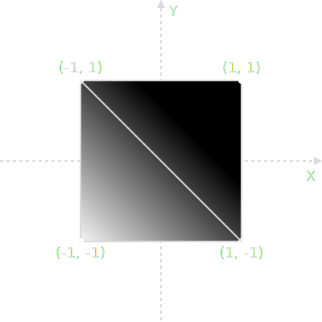
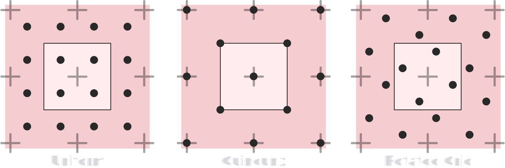
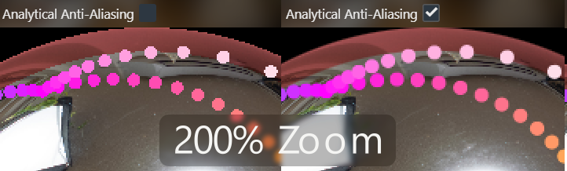
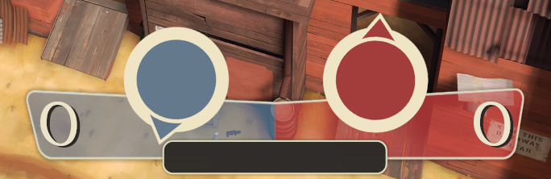

Today's journey is [Anti-Aliasing](https://en.wikipedia.org/wiki/Spatial_anti-aliasing) and the destination is **Analytical Anti-Aliasing**. Getting rid of rasterization [jaggies](https://en.wikipedia.org/wiki/Jaggies) is an art-form with decades upon decades of maths, creative techniques and non-stop innovation. With so many years of research and development, there are many flavors.

From the simple but resource intensive [**SSAA**](https://en.wikipedia.org/wiki/Supersampling), over theory dense [**SMAA**](https://www.iryoku.com/smaa/), to using machine learning with [**DLAA**](https://en.wikipedia.org/wiki/Deep_learning_anti-aliasing). Same goal - ***vastly*** different approaches. We'll take a look at how they work, before introducing a new way to look a the problem - the ✨***analytical***🌟 way. The perfect Anti-Aliasing exists and is simpler than you think.

<blockquote class="reaction"><div class="reaction_text">Having <a href=https://mirrorball.frost.kiwi>implemented</a> it multiple times over the years, I'll also share some juicy secrets I have never read anywhere before.</div></blockquote>

## The Setup
To understand the Anti-Aliasing algorithms, we will implement them along the way! Each following [WebGL canvas](https://developer.mozilla.org/en-US/docs/Web/API/WebGL_API/Tutorial/Getting_started_with_WebGL) draws a moving circle. Anti-Aliasing _cannot_ be fully understood with just images, movement is *essential* to see pixel crawling and sub-pixel filtering. The red box shows the circle's border with 4x zoom. Rendering is done without scaling at [native](https://en.wikipedia.org/wiki/1:1_pixel_mapping) resolution of your device, important to judge sharpness.
<blockquote class="reaction"><div class="reaction_text">Please pixel-peep and judge sharpness and aliasing closely. Resolution of your screen too high to see aliasing? Lower the resolution with the following buttons, which will <a href="https://tanalin.com/en/articles/integer-scaling/">integer-scale</a> the rendering.</div></blockquote>

<script src="utility.js"></script>
<script src="circleSimple.js"></script>
<script id="vertexBlit" type="x-shader/x-vertex"></script>
<script id="fragmentBlit" type="x-shader/x-fragment"></script>
<script id="vertexPost" type="x-shader/x-vertex"></script>
<script id="fragmentPost" type="x-shader/x-fragment"></script>
<script id="vertexRedBox" type="x-shader/x-vertex"></script>
<script id="fragmentRedBox" type="x-shader/x-vertex"></script>
<script id="fragmentPostFXAA" type="x-shader/x-fragment"></script>

<script id="vertex_0" type="x-shader/x-vertex"></script>
<script id="fragment_0" type="x-shader/x-fragment"></script>
<div class="toggleRes">
	<div>
	  <input type="radio" id="native" name="resSimple" value="1" checked />
	  <label for="native">Native<div>Resolution</div></label>
	</div>
	<div>
	  <input type="radio" id="half" name="resSimple" value="2" />
	  <label for="half">½<div>Resolution</div></label>
	</div>
	<div>
	  <input type="radio" id="quarter" name="resSimple" value="4" />
	  <label for="quarter">¼<div>Resolution</div></label>
	</div>
	<div>
	  <input type="radio" id="eight" name="resSimple" value="8" />
	  <label for="eight">⅛<div>Resolution</div></label>
	</div>
</div>
<canvas width="100%" height="400px" style="max-height: 400px; aspect-ratio: 1.71" id="canvasSimple"></canvas>
<script>setupSimple("canvasSimple", "vertex_0", "fragment_0", "vertexBlit", "fragmentBlit", "vertexRedBox", "fragmentRedBox", "resSimple");</script>

<blockquote>
<details><summary><a href="screenshots/simple.png">Screenshot</a>, in case WebGL doesn't work</summary>


</details>
<details><summary>WebGL Vertex Shader <a href="circle.vs">circle.vs</a></summary>

```glsl

```

</details>
<details>	
<summary>WebGL Fragment Shader <a href="circle.fs">circle.fs</a></summary>

```glsl

```

</details>
<details>	
<summary>WebGL Javascript <a href="circleSimple.js">circleSimple.js</a></summary>

```javascript

```

</details>
</blockquote>

Let's start out simple. Using [GLSL](https://en.wikipedia.org/wiki/OpenGL_Shading_Language) Shaders we tell the GPU of your device to draw a circle in the most simple and naive way possible, as seen in [circle.fs](circle.fs) above: If the [`length()`](https://docs.gl/sl4/length) from the middle point is bigger than 1.0, we [`discard`](https://www.khronos.org/opengl/wiki/Fragment_Shader#Special_operations) the pixel.

The circle looks very blocky at smaller resolutions. More painfully, there is strong "pixel crawling", an artifact that's very obvious when there is any kind of movement. As the circle moves, rows of pixels pop in and out of existence and the stair steps of the pixelation move along the side of the circle like beads with different speeds.

At lower resolutions these artifacts come together to destroy the circular form. The combination of slow movement and low resolution causes one side's pixels to come into existence, before the other side's pixels disappear, causing a wobble. Axis-alignment with the pixel grid causes "plateaus" of pixels at every 90° and 45° position.
### Technical breakdown

<blockquote class="reaction"><div class="reaction_text">Understanding the GPU code is not necessary to follow this article, but will help to grasp whats happening when we get to the analytical bits.</div></blockquote>

4 vertices making up a quad are sent to the GPU in the vertex shader [circle.vs](circle.vs), where they are received as `attribute vec2 vtx`. The coordinates are of a "unit quad", meaning the coordinates look like the following image. With [one famous exception](https://www.copetti.org/writings/consoles/sega-saturn/#segas-offering), all GPUs use triangles, so the quad is actually made up of two triangles.



The vertices are given to the fragment shader [circle.fs](circle.fs) via `varying vec2 uv`. The fragment shader is called per [fragment](https://www.khronos.org/opengl/wiki/Fragment) (here fragments are pixel-sized) and the [`varying`](http://learnwebgl.brown37.net/12_shader_language/glsl_data_types.html#storage-qualifiers) is interpolated linearly with [perspective corrected](https://en.wikipedia.org/wiki/Texture_mapping#Affine_texture_mapping), [barycentric coordinates](https://en.wikipedia.org/wiki/Barycentric_coordinate_system), giving us a `uv` coordinate per pixel from `-1` to `+1` with zero at the center.

By performing the check `if (length(uv) < 1.0)` we draw our color for fragments inside the circle and reject fragments outside of it. What we are doing is known as "Alpha testing". Without diving too deeply and just to hint at what's to come, what we have created with `length(uv)` is the [signed distance field](https://en.wikipedia.org/wiki/Signed_distance_function#Applications) of a point.

<blockquote class="reaction"><div class="reaction_text">Just to clarify, the circle isn't "drawn with geometry", which would have finite resolution of the shape, depending on how many vertices we use. It is "drawn by the shader".</div></blockquote>

## SSAA
SSAA stands for [Super Sampling Anti-Aliasing](https://en.wikipedia.org/wiki/Supersampling). Render it bigger, downsample to be smaller. The idea is as old as 3D rendering itself. In fact, the first movies with CGI all relied on this. One example is the 1986 movie "[Flight of the Navigator](https://en.wikipedia.org/wiki/Flight_of_the_Navigator)", as covered by [Captain Disillusion](https://www.youtube.com/@CaptainDisillusion) in the video below.

<figure>
	<video width="960" height="540" controls><source src="flight.mp4" type="video/mp4"></video>
	<figcaption>SSAA as used in "Flight of the Navigator" (1986)
	<br>
	Excerpt from <a href="https://www.youtube.com/watch?v=tyixMpuGEL8">"Flight of the Navigator | VFXcool"</a><br>YouTube Video by <a href="https://www.youtube.com/@CaptainDisillusion">Captain Disillusion</a>
	</figcaption>
</figure>

<blockquote class="reaction"><div class="reaction_text">1986 did it, so can we. Implemented in mere seconds. <b>Easy</b>, right?</div></blockquote>

<div class="toggleRes">
	<div>
	  <input type="radio" id="nativeSSAA" name="resSSAA" value="1" checked />
	  <label for="nativeSSAA">Native<div>Resolution</div></label>
	</div>
	<div>
	  <input type="radio" id="halfSSAA" name="resSSAA" value="2" />
	  <label for="halfSSAA">½<div>Resolution</div></label>
	</div>
	<div>
	  <input type="radio" id="quarterSSAA" name="resSSAA" value="4" />
	  <label for="quarterSSAA">¼<div>Resolution</div></label>
	</div>
	<div>
	  <input type="radio" id="eightSSAA" name="resSSAA" value="8" />
	  <label for="eightSSAA">⅛<div>Resolution</div></label>
	</div>
</div>
<canvas width="100%" height="400px" style="max-height: 400px; aspect-ratio: 1.71" id="canvasSSAA"></canvas>
<script src="circleSSAA.js"></script>
<script>setupSSAA("canvasSSAA", "vertex_0", "fragment_0", "vertexPost", "fragmentPost", "vertexBlit", "fragmentBlit", "vertexRedBox", "fragmentRedBox", "resSSAA");</script>

<blockquote>
<details><summary><a href="screenshots/ssaa.png">Screenshot</a>, in case WebGL doesn't work</summary>


</details>
<details>	
<summary>SSAA buffer Fragment Shader <a href="post.fs">post.fs</a></summary>

```glsl

```

</details>
<details>	
<summary>WebGL Javascript <a href="circleSSAA.js">circleSSAA.js</a></summary>

```javascript

```

</details>
</blockquote>

[circleSSAA.js](circleSSAA.js) draws at twice the resolution to a texture, which fragment shader [post.fs](post.fs) reads from at standard resolution with [GL_LINEAR](https://docs.gl/es2/glTexParameter) to perform SSAA. So we have *four* input pixels for every *one* output pixel we draw to the screen. But it's somewhat strange: There is definitely Anti-Aliasing happening, but less than expected.

<blockquote class="reaction"><div class="reaction_text">There should be 4 steps of transparency, but we only get two!</div></blockquote>

Especially at lower resolutions, we can see the circle *does* actually have 4 steps of transparency, but only at the 45° "diagonals" of the circle. A circle has of course no sides, but at the axis-aligned "bottom" there are only 2 steps of transparency: Fully Opaque and 50% transparent, the 25% and 75% transparency steps are missing.

### Conceptually simple, actually hard
We aren't sampling against the circle shape at twice the resolution, we are sampling against the quantized result of the circle shape. Twice the resolution, but discrete pixels nonetheless. The combination of pixelation and sample placement doesn't hold enough information where we need it the most: at the axis-aligned "flat parts". 

<blockquote class="reaction"><div class="reaction_text">Four times the memory <b>and</b> four times the calculation requirement, but only a half-assed result.</div></blockquote>

Implementing SSAA properly is a minute craft. Here we are drawing to a 2x resolution texture and down-sampling it with linear interpolation. So actually, this implementation needs 5x the amount of VRAM. A proper implementation samples the scene multiple times and combines the result without an intermediary buffer.

<blockquote class="reaction"><div class="reaction_text">With our implementation, we can't even do more than 2xSSAA with one texture read, as linear interpolation happens <a href="https://stackoverflow.com/questions/53896032/">only with 2x2 samples</a>.</div></blockquote>

To combat axis-alignment artifacts like with our circle above, we need to place our SSAA samples better. There are [multiple ways to sample with SSAA](https://en.wikipedia.org/wiki/Supersampling#Supersampling_patterns), all with pros and cons. To implement SSAA properly, we need deep integration with the rendering pipeline. This happens below API or engine, in the realm of vendors and drivers.

<figure>
	
	<figcaption>SSAA sample patterns. <a href="https://en.wikipedia.org/wiki/Supersampling#Supersampling_patterns">Source</a></figcaption>
</figure>

In fact, some of the best implementations were [discovered by vendors on accident](https://web.archive.org/web/20180716171211/https://naturalviolence.webs.com/sgssaa.htm), like [SGSSAA](https://www.youtube.com/watch?v=ntlYwrbUlWo). There are also ways in which SSAA can make your scene look *worse*. Depending on implementation, SSAA messes with [mip-map](https://en.wikipedia.org/wiki/Mipmap) calculations. As a result the mip-map lod-bias may need adjustment, as explained in the [article above](https://web.archive.org/web/20180716171211/https://naturalviolence.webs.com/sgssaa.htm).

## MSAA
[MSAA](https://en.wikipedia.org/wiki/Multisample_anti-aliasing) is super sampling, but only at the edges of triangles or textures edges if "[Alpha to Coverage](https://bgolus.medium.com/anti-aliased-alpha-test-the-esoteric-alpha-to-coverage-8b177335ae4f)" is enabled. MSAA is implemented by the graphics card in-hardware by the graphics vendors and what is supported depends on hardware. In the select box below you can choose different MSAA levels to Anti-Alias our circle.

Your hardware [may support up to MSAA x64](https://opengl.gpuinfo.org/displaycapability.php?name=GL_MAX_SAMPLES), but what is available here is implementation defined. WebGL 1 doesn't support MSAA at all, which is why the next windows will initialize a [WebGL 2](https://developer.mozilla.org/en-US/docs/Web/API/WebGL2RenderingContext) context. In WebGL NVIDIA limits MSAA to 8x, even if more is supported. On smartphones you will most likely get 4x.

<div class="center-child">
<select id="MSAA">.
    <option value="1">No MSAA</option>
    <option disabled value="2">MSAA -   2x</option>
    <option selected disabled value="4">MSAA -   4x</option>
    <option disabled value="8">MSAA -   8x</option>
    <option disabled value="16">MSAA - 16x</option>
    <option disabled value="32">MSAA - 32x</option>
    <option disabled value="64">MSAA - 64x</option>
</select>
</div>

<blockquote id="sampleErrorMessage" style="display: none" class="reaction"></blockquote>

<script id="vertexAnalytical" type="x-shader/x-fragment"></script>
<script id="fragmentAnalytical" type="x-shader/x-fragment"></script>
<div class="toggleRes">
	<div>
	  <input type="radio" id="nativeMSAA" name="resMSAA" value="1" checked />
	  <label for="nativeMSAA">Native<div>Resolution</div></label>
	</div>
	<div>
	  <input type="radio" id="halfMSAA" name="resMSAA" value="2" />
	  <label for="halfMSAA">½<div>Resolution</div></label>
	</div>
	<div>
	  <input type="radio" id="quarterMSAA" name="resMSAA" value="4" />
	  <label for="quarterMSAA">¼<div>Resolution</div></label>
	</div>
	<div>
	  <input type="radio" id="eightMSAA" name="resMSAA" value="8" />
	  <label for="eightMSAA">⅛<div>Resolution</div></label>
	</div>
</div>
<canvas width="100%" height="400px" style="max-height: 400px; aspect-ratio: 1.71" id="canvasMSAA"></canvas>
<div class="toggleRes">
	<div>
	  <input type="radio" id="1pxMSAA" name="pxSizeMSAA" value="1" checked />
	  <label for="1pxMSAA"><svg xmlns="http://www.w3.org/2000/svg" xmlns:xlink="http://www.w3.org/1999/xlink" width="3.9ex" height="2.3ex" aria-hidden="true" viewBox="0 -750 1728 1000"><defs><path id="x" d="M94 612q78 4 117 20t73 46h23V73h123V0H88v73h125v244l-1 243q-2-2-15-6t-42-8-59-6l-13-1v73h11Z"/><path id="y" d="M166 404q28 20 75 35t96 16h4q69 0 110-85 32-63 32-148 0-94-50-163T306-10q-24 0-46 5T222 7t-28 14-18 12-8 5v-232H75v638h90v-20l1-20Zm224-182q0 65-36 109t-88 45-89-36l-9-8V118q32-52 89-52 56 0 94 46t39 110Z"/><path id="z" d="M187 229 6 444h101l120-150 117 150h49l49-1q-3-6-143-175l-32-39L460 0H359l-65 88-32 43-26 35-9 11L100 0H0l47 58 93 113q47 56 47 58Z"/></defs><g fill="currentColor" stroke="currentColor" stroke-width="0" data-mml-node="math"><g data-mml-node="mstyle"><g data-mjx-texclass="ORD" data-mml-node="TeXAtom"><g data-mml-node="mtable"><g data-mml-node="mtr"><g data-mml-node="mtd"><use xlink:href="#x" data-c="1D7E3" data-mml-node="mn" transform="scale(1 -1)"/><g data-mml-node="mtext" transform="matrix(1 0 0 -1 500 0)"><use xlink:href="#y" data-c="1D5C9" transform="translate(250)"/><use xlink:href="#z" data-c="1D5D1" transform="translate(767)"/></g></g></g></g></g></g></g></svg><div>edge smoothing</div></label>
	</div>
	<div>
	  <input type="radio" id="sqrt2pxMSAA" name="pxSizeMSAA" value="1.4142135623730950488016887242097" />
	  <label for="sqrt2pxMSAA"><svg xmlns="http://www.w3.org/2000/svg" xmlns:xlink="http://www.w3.org/1999/xlink" width="18.2ex" height="3.1ex" aria-hidden="true" viewBox="0 -934 8030 1368"><defs><path id="d" d="m263 249 52-119 102-238q51-119 53-120l255 530 257 537q7 11 19 11 7 0 12-6t7-12v-6L741 243 540-176l-71-148q-10-21-16-24-4-2-17-2l-12 1L315-96 205 156l-34-26-34-26-26 26 152 119Z"/><path id="a" d="M94 612q78 4 117 20t73 46h23V73h123V0H88v73h125v244l-1 243q-2-2-15-6t-42-8-59-6l-13-1v73h11Z"/><path id="b" d="M222 599q-32 0-56-14t-38-35-20-41-11-35-4-15l-26 33-25 34 5 13q25 69 73 103t105 35q79 0 130-33 94-65 94-190 0-81-88-164l-46-40q-36-30-116-106l-62-59 156 1h156V0H50v79l166 163q68 60 101 107t34 107q0 61-36 102t-93 41Z"/><path id="c" d="M56 237v13l14 20h299v150l1 150q10 13 19 13 13 0 20-15V270h298q15-8 15-20t-15-20H409V-68q-8-14-18-14h-4q-12 0-18 14v298H70q-14 7-14 20Z"/><path id="e" d="M56 350q0 13 14 20h637q15-8 15-20 0-11-14-19l-318-1H72q-16 5-16 20Zm0-200q0 15 16 20h636q14-10 14-20 0-12-15-20H70q-14 7-14 20Z"/><path id="f" d="M95 178q-6 0-14 8t-9 14 31 30 66 50 38 29q2 2 5 2h1q6 0 14-17t54-117l31-69 85-185 104 213 206 429q103 216 107 221 6 14 20 14 7 0 12-6t7-12v-6L620 293 385-193q-4-7-19-7-9 0-12 3L256 15l-96 210-16-11-31-24q-16-12-18-12Z"/><path id="h" d="M166 404q28 20 75 35t96 16h4q69 0 110-85 32-63 32-148 0-94-50-163T306-10q-24 0-46 5T222 7t-28 14-18 12-8 5v-232H75v638h90v-20l1-20Zm224-182q0 65-36 109t-88 45-89-36l-9-8V118q32-52 89-52 56 0 94 46t39 110Z"/><path id="i" d="M187 229 6 444h101l120-150 117 150h49l49-1q-3-6-143-175l-32-39L460 0H359l-65 88-32 43-26 35-9 11L100 0H0l47 58 93 113q47 56 47 58Z"/></defs><g fill="currentColor" stroke="currentColor" stroke-width="0" data-mml-node="math"><g data-mml-node="mstyle"><g data-mjx-texclass="ORD" data-mml-node="TeXAtom"><g data-mml-node="mtable"><g data-mml-node="mtr"><g data-mml-node="mtd"><g data-mml-node="msqrt"><g data-mml-node="msup"><use xlink:href="#a" data-c="1D7E3" data-mml-node="mn" transform="matrix(1 0 0 -1 1020 184)"/><g data-mjx-texclass="ORD" data-mml-node="TeXAtom"><use xlink:href="#b" data-c="1D7E4" data-mml-node="mn" transform="matrix(.707 0 0 -.707 1553 -105)"/></g></g><use xlink:href="#c" data-c="2B" data-mml-node="mo" transform="matrix(1 0 0 -1 2179 184)"/><g data-mml-node="msup"><use xlink:href="#a" data-c="1D7E3" data-mml-node="mn" transform="matrix(1 0 0 -1 3179 184)"/><g data-mjx-texclass="ORD" data-mml-node="TeXAtom"><use xlink:href="#b" data-c="1D7E4" data-mml-node="mn" transform="matrix(.707 0 0 -.707 3712 -105)"/></g></g><use xlink:href="#d" data-c="221A" data-mml-node="mo" transform="matrix(1 0 0 -1 0 -24)"/><path stroke="none" d="M1020-814h3096v-60H1020z"/></g><use xlink:href="#e" data-c="3D" data-mml-node="mo" transform="matrix(1 0 0 -1 4393 184)"/><g data-mml-node="msqrt"><use xlink:href="#b" data-c="1D7E4" data-mml-node="mn" transform="matrix(1 0 0 -1 6302 184)"/><use xlink:href="#f" data-c="221A" data-mml-node="mo" transform="matrix(1 0 0 -1 5449 30)"/><path stroke="none" d="M6302-710h500v-60h-500z"/></g><g data-mml-node="mtext" transform="matrix(1 0 0 -1 6802 184)"><use xlink:href="#g" data-c="A0"/><use xlink:href="#h" data-c="1D5C9" transform="translate(250)"/><use xlink:href="#i" data-c="1D5D1" transform="translate(767)"/></g></g></g></g></g></g></g></svg><div>edge smoothing</div></label>
	</div>
</div>
<script src="circleMSAA.js"></script>
<script>setupMSAA("canvasMSAA", "vertexAnalytical", "fragmentAnalytical", "fragment_0", "vertexPost", "fragmentPost", "vertexBlit", "fragmentBlit", "vertexRedBox", "fragmentRedBox", "resMSAA", "pxSizeMSAA");</script>
<blockquote>
<details><summary><a href="screenshots/msaa.png">MSAA 4x Screenshot</a>, in case WebGL doesn't work</summary>


</details>
<details><summary>WebGL Vertex Shader <a href="circle-analytical.vs">circle-analytical.vs</a></summary>

```glsl

```

</details>
<details>	
<summary>WebGL Fragment Shader <a href="circle-analytical.fs">circle-analytical.fs</a></summary>

```glsl

```

</details>
<details>	
<summary>WebGL Javascript <a href="circleMSAA.js">circleMSAA.js</a></summary>

```javascript

```

</details>
</blockquote>

### Implementation specific headaches
We rely on hardware to do the Anti-Aliasing, which obviously leads to the problem that the hardware may not support what we expect. And the sampling patterns that MSAA uses may do things you don't expect. Depending on what your hardware does, you may see the circle's edge transparency steps appearing seemingly "Out of Order".

Before standardization during the OpenGL 3, DirectX 10 era of graphics hardware, MSAA support was especially hit and miss. Eg. Intel iGPUs of GM45 laptops expose the OpenGL extension [`EXT_framebuffer_multisample`](https://registry.khronos.org/OpenGL/extensions/EXT/EXT_framebuffer_multisample.txt), but don't in-fact support MSAA, [which led to confusion](https://community.khronos.org/t/yet-another-intel-multisample-thread/69614).

On mobile chips weird things happen, which usually support *exactly* 4xMSAA. Android phones will let you pick 2xMSAA, but the graphics driver will force your choice to 4xMSAA. iPhones and iPads do something quite frankly stupid: Choosing 2xMSAA will make it 4xMSAA, but the transparency will be rounded to nearest 50% multiple, leading to double transparent edges in our example. Luckily there is a good hardware related reason for this...
### Performance cost: (maybe) Zero 
...looking at modern video games, one might be led to believe that this technique is of the past. Enabling it usually brings a hefty performance penalty after all. Surprisingly, it's still the king under certain circumstances and in very specific situations, even performance free.

<blockquote class="reaction"><div class="reaction_text">As a gamer, this goes against instinct...</div></blockquote>
<figure>
	<video width="960" height="540" controls><source src="MSAA-PerformanceFree.mp4" type="video/mp4"></video>
	<figcaption>Video: MSAA 4x is performance free in certain contexts
	<br>
	Excerpt from <a href="https://gdcvault.com/play/1024538">"Developing High Performance Games for Different Mobile VR Platforms"</a><br> GDC 2017 talk by <a href="https://www.linkedin.com/in/rahulprasad2/	">Rahul Prasad</a>
	</figcaption>
</figure>

> [Rahul Prasad:](https://www.linkedin.com/in/rahulprasad2/) Use MSAA [...] It's actually not as expensive on mobile as it is on desktop, it's one of the nice things you get on mobile. [...] On some (mobile) GPUs 4x (MSAA) is free, so use it when you have it.

As explained by [Rahul Prasad](https://www.linkedin.com/in/rahulprasad2/) in the above talk, in VR 4xMSAA is a must and may come free on certain mobile GPUs. The specific reason would derail the blog post, but in case you want to go down that particular rabbit hole, here is Epic Games' [Niklas Smedberg](https://www.linkedin.com/in/niklas-smedberg-a96466/) explaining giving a run-down.

<figure>
	<video width="960" height="540" controls><source src="tile-based-gpus.mp4" type="video/mp4"></video>
	<figcaption>Video: Tiled based rendering GPU architecture
	<br>
	Excerpt from <a href="https://gdcvault.com/play/1020756">"Next-Generation AAA Mobile Rendering"</a><br> GDC 2014 talk by <a href="https://www.linkedin.com/in/niklas-smedberg-a96466/">Niklas Smedberg</a> and <a href="https://twitter.com/NOTimothyLottes">Timothy Lottes</a>
	</figcaption>
</figure>

In short, this is possible under the condition of [forward rendering](https://gamedevelopment.tutsplus.com/forward-rendering-vs-deferred-rendering--gamedev-12342a) with geometry that is not too dense and the GPU having [tiled-based rendering architecture](https://developer.arm.com/documentation/102662/0100/Tile-based-GPUs), which allows the GPU to perform MSAA calculations without heavy memory access and thus [latency hiding](/WebGL-LUTS-made-simple/#performance-cost%3A-zero) the cost of the calculation. Here's [deep dive](https://github.com/KhronosGroup/Vulkan-Samples/tree/main/samples/performance/msaa#color-resolve), if you are interested.

### A complex toolbox
MSAA gives you access to the samples, making [custom MSAA filtering curves](https://therealmjp.github.io/posts/msaa-resolve-filters/) a possibility. It also allows you to [merge both standard mesh-based and signed-distance-field rendering](https://bgolus.medium.com/rendering-a-sphere-on-a-quad-13c92025570c) via [sample to coverage](https://bgolus.medium.com/anti-aliased-alpha-test-the-esoteric-alpha-to-coverage-8b177335ae4f), as mentioned above. 

Some of the most out-of-the-box thinking I ever witnessed in graphics programming is how [Assassin's Creed Unity](https://en.wikipedia.org/wiki/Assassin%27s_Creed_Unity) used MSAA to render at half resolution but reconstruct the full resolution image from MSAA samples, as described on page 48 of the talk "[GPU-Driven Rendering Pipelines](https://advances.realtimerendering.com/s2015/aaltonenhaar_siggraph2015_combined_final_footer_220dpi.pdf)" by [Ulrich Haar](https://www.linkedin.com/in/ulrich-haar-730407218) and [Sebastian Aaltonen](https://x.com/SebAaltonen). Kinda like [variable rate shading](https://developer.nvidia.com/vrworks/graphics/variablerateshading), but implemented with duct-tape and without vendor support.

<blockquote class="reaction"><div class="reaction_text">The brain-melting lengths to which graphics programmers go to utilize hardware acceleration to the last drop has me sometimes in awe.</div></blockquote>

## Post-Process Anti-Aliasing
In 2009 a [paper](https://web.archive.org/web/20141205052029/http://visual-computing.intel-research.net/publications/papers/2009/mlaa/mlaa.pdf) by [Alexander Reshetov](https://research.nvidia.com/person/alexander-reshetov) struck the graphics programming world like a ton of bricks: take the blocky, aliased result of the rendered image, find edges and classify the pixels into tetris-like shapes to filter them and remove the blocky edge. Anti-Aliasing based on the [morphology](https://en.wikipedia.org/wiki/Mathematical_morphology) of pixels - "Morphological antialiasing". [MLAA](https://www.iryoku.com/mlaa/) was born.

Computationally cheap, easy to implement. Later it was refined with more emphasis on removing sub-pixel artifacts to become [SMAA](https://www.iryoku.com/smaa/). It became a fan favorite, with [an injector being developed early on](https://mrhaandi.blogspot.com/p/injectsmaa.html?m=1) to put SMAA into games that didn't even support it. Though equally many considered these techniques too blurry, coining the term "vaseline" on the screen.

### FXAA
We'll take a close look at an algorithm that was inspired by MLAA, developed by [Timothy Lottes](https://x.com/NOTimothyLottes). "Fast approximate anti-aliasing" - [FXAA](https://developer.download.nvidia.com/assets/gamedev/files/sdk/11/FXAA_WhitePaper.pdf). In fact, when FXAA came into wide circulation, it received some incredibly praising press releases. [Among others](https://www.realtimerendering.com/blog/fxaa-rules-ok/), [Jeff Atwood](https://blog.codinghorror.com/about-me/) pulled neither bold fonts nor punches in his [2011 blog post](https://blog.codinghorror.com/fast-approximate-anti-aliasing-fxaa/) about FXAA, which was later [republished by Kotaku](http://kotaku.com/5866780/).

> [**Jeff Atwood**](https://blog.codinghorror.com/about-me/): The FXAA method is so good, in fact, it makes all other forms of full-screen anti-aliasing pretty much obsolete overnight. **If you have an FXAA option in your game, you should enable it immediately** and ignore any other AA options.

Let's see what the hype was about. The final version publicly released was FXAA 3.11 on [August 12th 2011](https://web.archive.org/web/20120121124756/http://timothylottes.blogspot.com/2011/08/fxaa-311-bug-fixes-for-360.html) and the following demos are based on this. Let's take a look at our circle first with FXAA doing the Anti-Aliasing at default settings.

<div class="toggleRes">
	<div>
	  <input type="radio" id="nativeFXAA" name="resFXAA" value="1" checked />
	  <label for="nativeFXAA">Native<div>Resolution</div></label>
	</div>
	<div>
	  <input type="radio" id="halfFXAA" name="resFXAA" value="2" />
	  <label for="halfFXAA">½<div>Resolution</div></label>
	</div>
	<div>
	  <input type="radio" id="quarterFXAA" name="resFXAA" value="4" />
	  <label for="quarterFXAA">¼<div>Resolution</div></label>
	</div>
	<div>
	  <input type="radio" id="eightFXAA" name="resFXAA" value="8" />
	  <label for="eightFXAA">⅛<div>Resolution</div></label>
	</div>
</div>
<canvas width="100%" height="400px" style="max-height: 400px; aspect-ratio: 1.71" id="canvasFXAA"></canvas>
<script src="circleFXAA.js"></script>
<script>setupFXAA("canvasFXAA", "vertex_0", "fragment_0", "vertexPost", "fragmentPostFXAA", "vertexBlit", "fragmentBlit", "vertexRedBox", "fragmentRedBox", "resFXAA");</script>

<blockquote>
<details><summary><a href="screenshots/fxaa.png">Screenshot</a>, in case WebGL doesn't work</summary>


</details>
<details>	
<summary>WebGL FXAA Shader <a href="post-FXAA.fs">post-FXAA.fs</a></summary>

```glsl

```

</details>
<details>	
<summary>WebGL Javascript <a href="circleFXAA.js">circleFXAA.js</a></summary>

```javascript

```

</details>
</blockquote>

A bit of a weird result. It looks really good if the circle wouldn't move. Perfectly smooth edges. But the circle distorts as it moves. The axis-aligned top and bottom especially have a little nub that appears and disappears. And switching to lower resolutions, the circle even loses its round shape, [wobbling like Play Station 1 graphics](https://www.youtube.com/watch?v=x8TO-nrUtSI).

FXAA considers a 3x3 pixel grid when it does it's edge detection. It can't possibly know that the small area it works on is part of the round shape.

A little history tour, since this information is almost lost due to [link rot](https://en.wikipedia.org/wiki/Link_rot) so severe, that graphics researcher were forced to [use archive links](http://behindthepixels.io/assets/files/TemporalAA.pdf#page=14). By that time [Timothy Lottes](https://x.com/NOTimothyLottes) was already experimenting with temporal anti-aliasing, a technique of 
In fact, FXAA was supposed to [evole into FXXA v4](https://web.archive.org/web/20120120082725/http://timothylottes.blogspot.com/2011/12/fxaa-40-stills-and-features.html) and [incorporate temporal anti aliasing](https://web.archive.org/web/20120120070945/http://timothylottes.blogspot.com/2011/12/big-fxaa-update-soon.html), but instead it evolved and rebranded into [TXAA](https://web.archive.org/web/20210116205348/https://www.nvidia.com/en-gb/geforce/technologies/txaa/technology/).

```
https://web.archive.org/web/20110903074855/http://www.eurogamer.net/articles/digital-foundry-future-of-anti-aliasing?page=3
https://web.archive.org/web/20120120070945/http://timothylottes.blogspot.com/2011/12/big-fxaa-update-soon.html
https://web.archive.org/web/20120120082725/http://timothylottes.blogspot.com/2011/12/fxaa-40-stills-and-features.html
https://web.archive.org/web/20120120080002/http://timothylottes.blogspot.com/2011/12/fxaa-40-stills-and-features-part-2.html
https://web.archive.org/web/20120120051227/http://timothylottes.blogspot.com/2011/12/kotaku-what-is-fxaa.html
https://web.archive.org/web/20120120072820/http://timothylottes.blogspot.com/2011/12/fxaa-40-will-have-new-spatial-only.html
https://web.archive.org/web/20120120085634/http://timothylottes.blogspot.com/2011/12/fxaa-40-development-update-stills.html
https://web.archive.org/web/20120120075218/http://timothylottes.blogspot.com/2011/12/fxaa-40-with-178x-ssaa.html
```
We didn't do FXAA justice with our example. FXAA was created for another use case and has many settings and presets. It was created to anti-alias more complex scenes. Let's give it a fair shot!

#### FXAA full demo
A more appropriate example, from probably my favorite piece of software in existence: [NeoTokyo°](https://store.steampowered.com/app/244630/NEOTOKYO/). I created a bright area light in an NT° map and moved a bench to create an area of strong aliasing. The following demo uses the aliased output from [NeoTokyo°](https://store.steampowered.com/app/244630/NEOTOKYO/), calculates the required luminance channel and applies FXAA. All FXAA presets and settings at your finger tips.

<blockquote class="reaction"><div class="reaction_text">This has fixed resolution and will only be at you device's native resolution, if your device has no dpi scaling and the browser is at 100% zoom.</div></blockquote>

<script id="vertexInteractive" type="x-shader/x-vertex"></script>
<script id="fragmentInteractive" type="x-shader/x-fragment"></script>
<script id="vertexLuma" type="x-shader/x-fragment"></script>
<script id="fragmentLuma" type="x-shader/x-fragment"></script>
<div style="display: flex; flex-wrap: wrap; gap: 0px 12px; justify-content: space-around;">
    <span style="display: flex; gap: 8px; white-space: nowrap">
        <label style="display: flex; gap: 8px; align-items: center;">
            <input style="margin-bottom: unset;" type="checkbox" id="fxaaCheck" name="Enable FXAA" checked />
            Enable FXAA
        </label>
    </span>
    <span style="display: flex; gap: 8px; white-space: nowrap">
        <label style="font-weight: unset; display: flex; gap: 8px; align-items: center;">
            <input style="margin-bottom: unset;" type="checkbox" id="redCheck" name="Enable Red Box" checked />
            Enable Red Box
        </label>
    </span>
    <span style="display: flex; gap: 8px; white-space: nowrap">
        <label style="font-weight: unset; display: flex; gap: 8px; align-items: center;">
            <input style="margin-bottom: unset;" type="checkbox" id="pauseCheck" name="Play / Pause" checked />
            Play / Pause
        </label>
    </span>
</div>
<style>
    .settingsTable .noborder td {
        border-bottom: unset;
    }
    .variable-name-row {
        display: none;
    }
    @media screen and (max-width: 500px) {
        .variable-name-row {
            display: table-row;
			text-align: center;
        }
        .variable-name-cell {
            display: none;
        }
    }
	.settingsTable pre {
    	overflow-x: auto;
    	max-width: 100%;
    	white-space: pre-wrap;
	}
	.precolumn {
		padding: 0px;
	}
</style>
<div id="canvas-container" style="position: relative; display: inline-block;">
    <canvas width="100%" style="aspect-ratio: 1.425" id="canvasFXAAInteractive"></canvas>
    <div id="loading-overlay" style="
        position: absolute;
        top: 0;
        left: 0;
        width: 100%;
        height: 100%;
        display: flex;
        justify-content: center;
        align-items: center;
        font-size: larger;
        z-index: 10;
    ">
        Loading... 0%
    </div>
</div>
<table class="settingsTable" style="width: 100%; max-width: 100%;">
	<tr class="noborder">
		<td colspan=4 style="width:100%">
			<div style="display: flex; gap: 0px 12px; align-items: center;">
			    <div style="display: flex; flex-wrap: wrap; gap: 0px 12px; flex: 1; justify-content: space-around;">
			        <span style="display: flex; gap: 8px; white-space: nowrap;">
			            <label style="font-weight: unset; display: flex; gap: 8px; align-items: center;">
			                <input style="margin-bottom: unset;" type="checkbox" id="lumaCheck" name="Show Luma" />
			                Show Luma
			            </label>
			        </span>
			        <span style="display: flex; gap: 8px; white-space: nowrap;">
			            <label style="font-weight: unset; display: flex; gap: 8px; align-items: center;">
			                <input style="margin-bottom: unset;" type="checkbox" id="greenCheck" name="Green as Luma" />
			                Green as Luma
			            </label>
			        </span>
			    </div>
			    <button style="border-radius: 50%; font-weight: 600;" onclick="var element = document.getElementById('LumaExplanation'); element.style.display = (element.style.display === 'none' || element.style.display === '') ? 'block' : 'none';">?</button>
			</div>
		</td>
	</tr>
	<tr>
		<td class="precolumn" colspan=4>
		<pre id="LumaExplanation" style="display: none;">
-------------------------------------------------
    	INTEGRATION - RGBL AND COLORSPACE
-------------------------------------------------
FXAA3 requires RGBL as input unless the following is set, &#13;&#10;
  #define FXAA_GREEN_AS_LUMA 1&#13;&#10;
In which case the engine uses green in place of luma,
and requires RGB input is in a non-linear colorspace.&#13;&#10;
RGB should be LDR (low dynamic range).
Specifically do FXAA after tonemapping.&#13;&#10;
RGB data as returned by a texture fetch can be non-linear,
or linear when FXAA_GREEN_AS_LUMA is not set.
Note an "sRGB format" texture counts as linear,
because the result of a texture fetch is linear data.
Regular "RGBA8" textures in the sRGB colorspace are non-linear.&#13;&#10;
If FXAA_GREEN_AS_LUMA is not set,
luma must be stored in the alpha channel prior to running FXAA.
This luma should be in a perceptual space (could be gamma 2.0).
Example pass before FXAA where output is gamma 2.0 encoded,&#13;&#10;
  color.rgb = ToneMap(color.rgb); // linear color output
  color.rgb = sqrt(color.rgb);    // gamma 2.0 color output
  return color;&#13;&#10;
To use FXAA,&#13;&#10;
  color.rgb = ToneMap(color.rgb);  // linear color output
  color.rgb = sqrt(color.rgb);     // gamma 2.0 color output
  color.a = dot(color.rgb, FxaaFloat3(0.299, 0.587, 0.114)); // compute luma
  return color;&#13;&#10;
Another example where output is linear encoded,
say for instance writing to an sRGB formated render target,
where the render target does the conversion back to sRGB after blending,&#13;&#10;
  color.rgb = ToneMap(color.rgb); // linear color output
  return color;&#13;&#10;
To use FXAA,&#13;&#10;
  color.rgb = ToneMap(color.rgb); // linear color output
  color.a = sqrt(dot(color.rgb, FxaaFloat3(0.299, 0.587, 0.114))); // compute luma
  return color;&#13;&#10;
Getting luma correct is required for the algorithm to work correctly.</pre>
		</td>
	</tr>
	<tr class="variable-name-row noborder">
		<td colspan=4>
			<code>FXAA_QUALITY_PRESET</code>
		</td>
	</tr>
	<tr class="noborder">
		<td class="variable-name-cell">
			<code>FXAA_QUALITY_PRESET</code>
		</td>
		<td colspan=2 style="width:100%">
<select id="FXAA_QUALITY_PRESET" style="width: 100%; margin-bottom: unset">
	<optgroup label="Default medium dither">
		<option value="10">10 (fastest)</option>
		<option value="11">11</option>
		<option value="12" selected>12 (default)</option>
		<option value="13">13</option>
		<option value="14">14</option>
		<option value="15">15 (highest quality)</option>
	</optgroup>
	<optgroup label="Less dither, more expensive">
		<option value="20">20 (fastest)</option>
		<option value="21">21</option>
		<option value="22">22</option>
		<option value="23">23</option>
		<option value="24">24</option>
		<option value="25">25</option>
		<option value="26">26</option>
		<option value="27">27</option>
		<option value="28">28</option>
		<option value="29">29 (highest quality)</option>
	<optgroup label="No dither, very expensive">
		<option value="39">39 (EXTREME QUALITY)</option>
	</optgroup>
</select>
		</td>
		<td>
			<button style="border-radius: 50%; font-weight: 600" onclick="var element = document.getElementById('fxaaQualityExplanation'); element.style.display = (element.style.display === 'none' || element.style.display === '') ? 'block' : 'none';">?</button>
		</td>
	</tr>
	<tr>
		<td class="precolumn" colspan=4>
		<pre id="fxaaQualityExplanation" style="display: none;">
Trades performance for quality, with 3 different "styles" of dither.
 _ = the lowest digit is directly related to performance
_  = the highest digit is directly related to style</pre>
		</td>
	</tr>
	<tr class="variable-name-row noborder">
		<td colspan=4>
			<code>fxaaQualitySubpix</code>
		</td>
	</tr>
	<tr class="noborder">
		<td class="variable-name-cell">
			<code>fxaaQualitySubpix</code>
		</td>
		<td style="width:100%">
			<input class="slider" type="range" step="0.01" min="0" max="1" value="0.75" id="fxaaQualitySubpixRange" oninput="fxaaQualitySubpixValue.value = parseFloat(this.value).toFixed(2)">
		</td>
		<td style="text-align: center;">
			<output id="fxaaQualitySubpixValue">0.75</output>
		</td>
		<td>
			<button style="border-radius: 50%; font-weight: 600" onclick="var element = document.getElementById('fxaaQualitySubpixExplanation'); element.style.display = (element.style.display === 'none' || element.style.display === '') ? 'block' : 'none';">?</button>
		</td>
	</tr>
	<tr>
		<td class="precolumn" colspan=4>
		<pre id="fxaaQualitySubpixExplanation" style="display: none;">
Choose the amount of sub-pixel aliasing removal.
This can effect sharpness.
  1.00 - upper limit (softer)
  0.75 - default amount of filtering
  0.50 - lower limit (sharper, less sub-pixel aliasing removal)
  0.25 - almost off
  0.00 - completely off</pre>
		</td>
	</tr>
	<tr class="variable-name-row noborder">
		<td colspan=4>
			<code>fxaaQualityEdgeThreshold</code>
		</td>
	</tr>
	<tr class="noborder">
		<td class="variable-name-cell">
			<code>fxaaQualityEdgeThreshold</code>
		</td>
		<td style="width:100%">
			<input class="slider" type="range" step="0.001" min="0" max="1" value="0.166" id="fxaaQualityEdgeThresholdRange" oninput="fxaaQualityEdgeThresholdValue.value = parseFloat(this.value).toFixed(3)">
		</td>
		<td style="text-align: center;">
			<output id="fxaaQualityEdgeThresholdValue">0.166</output>
		</td>
		<td>
			<button style="border-radius: 50%; font-weight: 600" onclick="var element = document.getElementById('fxaaQualityEdgeThresholdExplanation'); element.style.display = (element.style.display === 'none' || element.style.display === '') ? 'block' : 'none';">?</button>
		</td>
	</tr>
	<tr>
		<td class="precolumn" colspan=4>
		<pre id="fxaaQualityEdgeThresholdExplanation" style="display: none;">
The minimum amount of local contrast required to apply algorithm.
  0.333 - too little (faster)
  0.250 - low quality
  0.166 - default
  0.125 - high quality 
  0.063 - overkill (slower)</pre>
		</td>
	</tr>
	<tr class="variable-name-row noborder">
		<td colspan=4>
			<code>fxaaQualityEdgeThresholdMin</code>
		</td>
	</tr>
	<tr class="noborder">
		<td class="variable-name-cell">
			<code>fxaaQualityEdgeThresholdMin</code>
		</td>
		<td style="width:100%">
			<input class="slider" type="range" step="0.0001" min="0" max="1" value="0.0833" id="fxaaQualityEdgeThresholdMinRange" oninput="fxaaQualityEdgeThresholdMinValue.value = parseFloat(this.value).toFixed(4)">
		</td>
		<td style="text-align: center;">
			<output id="fxaaQualityEdgeThresholdMinValue">0.0833</output>
		</td>
		<td>
			<button style="border-radius: 50%; font-weight: 600" onclick="var element = document.getElementById('fxaaQualityEdgeThresholdMinExplanation'); element.style.display = (element.style.display === 'none' || element.style.display === '') ? 'block' : 'none';">?</button>
		</td>
	</tr>
	<tr class="noborder">
		<td class="precolumn" colspan=4>
		<pre id="fxaaQualityEdgeThresholdMinExplanation" style="display: none;">
Trims the algorithm from processing darks.
  0.0833 - upper limit (default, the start of visible unfiltered edges)
  0.0625 - high quality (faster)
  0.0312 - visible limit (slower)
Special notes when using FXAA_GREEN_AS_LUMA,
  Likely want to set this to zero.
  As colors that are mostly not-green
  will appear very dark in the green channel!
  Tune by looking at mostly non-green content,
  then start at zero and increase until aliasing is a problem.</pre>
		</td>
	</tr>
</table>


<blockquote>
<details><summary><a href="screenshots/fxaainteractive.png">Screenshot</a>, in case WebGL doesn't work</summary>


</details>
<details><summary>WebGL Vertex Shader <a href="FXAA-interactive.vs">FXAA-interactive.vs</a></summary>

```glsl

```

</details>
<details>	
<summary>WebGL Fragment Shader <a href="FXAA-interactive.fs">FXAA-interactive.fs</a></summary>

```glsl

```

</details>
<details>	
<summary>WebGL Javascript <a href="FXAA-interactive.js">FXAA-interactive.js</a></summary>

```javascript

```

</details>
</blockquote>

<script id="vertexBlitSimple" type="x-shader/x-vertex"></script>
<script src="FXAA-interactive.js"></script>
<script>setupFXAAInteractive("canvasFXAAInteractive", "vertexInteractive", "fragmentInteractive", "vertexLuma", "fragmentLuma", "vertexBlitSimple", "fragmentBlit", "vertexRedBox", "fragmentRedBox");</script>

It may be performance cheap, but only if you already have post-processing in place. In mobile graphics, memory access is expensive, so saving the framebuffer to perform post processing is not always a given. If you need to setup render-to-texture in order to have FXAA, then this will be very much a performance smack to the face and the "F" in FXAA evaporates.

## Analytical Anti Aliasing

<div class="toggleRes">
	<div>
	  <input type="radio" id="nativeAnalytical" name="resAnalytical" value="1" checked />
	  <label for="nativeAnalytical">Native<div>Resolution</div></label>
	</div>
	<div>
	  <input type="radio" id="halfAnalytical" name="resAnalytical" value="2" />
	  <label for="halfAnalytical">½<div>Resolution</div></label>
	</div>
	<div>
	  <input type="radio" id="quarterAnalytical" name="resAnalytical" value="4" />
	  <label for="quarterAnalytical">¼<div>Resolution</div></label>
	</div>
	<div>
	  <input type="radio" id="eightAnalytical" name="resAnalytical" value="8" />
	  <label for="eightAnalytical">⅛<div>Resolution</div></label>
	</div>
</div>

<script id="fragment3D" type="x-shader/x-fragment"></script>
<script id="vertex3D" type="x-shader/x-fragment"></script>

<script src="mat4.js"></script>
<script src="circleAnalytical.js"></script>

<canvas width="100%" height="400px" style="max-height: 400px; aspect-ratio: 1.71" id="canvasAnalytical"></canvas>
<script>setupAnalytical("canvasAnalytical", "vertexAnalytical", "fragmentAnalytical", "vertexBlit", "fragmentBlit", "vertexRedBox", "fragmentRedBox", "resAnalytical");</script>

<blockquote>
<details><summary><a href="screenshots/analytical.png">Screenshot</a>, in case WebGL doesn't work</summary>


</details>
<details><summary>WebGL Vertex Shader <a href="circle-analytical.vs">circle-analytical.vs</a></summary>

```glsl

```

</details>
<details>	
<summary>WebGL Fragment Shader <a href="circle-analytical.fs">circle-analytical.fs</a></summary>

```glsl

```

</details>
<details>	
<summary>WebGL Javascript <a href="circleAnalytical.js">circleAnalytical.js</a></summary>

```javascript

```

</details>
</blockquote>



## Implementation comparison

<div class="toggleRes">
	<div>
	  <input type="radio" id="nativeCompare" name="resCompare" value="1" checked />
	  <label for="nativeCompare">Native<div>Resolution</div></label>
	</div>
	<div>
	  <input type="radio" id="halfCompare" name="resCompare" value="2" />
	  <label for="halfCompare">½<div>Resolution</div></label>
	</div>
	<div>
	  <input type="radio" id="quarterCompare" name="resCompare" value="4" />
	  <label for="quarterCompare">¼<div>Resolution</div></label>
	</div>
	<div>
	  <input type="radio" id="eightCompare" name="resCompare" value="8" />
	  <label for="eightCompare">⅛<div>Resolution</div></label>
	</div>
</div>

<script src="circleAnalyticalComparison.js"></script>
<canvas width="100%" height="400px" style="max-height: 400px; aspect-ratio: 1.71" id="canvasCompare"></canvas>

<script>setupAnalyticalComparison("canvasCompare", "vertexAnalytical", "fragmentAnalytical", "vertexBlit", "fragmentBlit", "vertexRedBox", "fragmentRedBox", "resCompare");</script>

<pre id="compareShader"></pre>
<script src="/ace/ace.js" type="text/javascript" charset="utf-8"></script>
<script>
    var editor = ace.edit("compareShader");
    editor.setTheme("ace/theme/gruvbox_dark_hard");
    editor.session.setMode("ace/mode/glsl");
	editor.session.setOptions({
        useWorker: false
    });
	editor.renderer.setOptions({
		showFoldWidgets: false,
        fontSize: "smaller",
        fontFamily: "Consolas, Monaco, \"Andale Mono\", monospace;",
		showPrintMargin: false,
		maxLines: 50
    })
</script>

<div class="center-child"><button id="shaderReload">Reload Shader</button></div>

## 3D
<div class="toggleRes">
	<div>
	  <input type="radio" id="native3D" name="res3D" value="1" checked />
	  <label for="native3D">Native<div>Resolution</div></label>
	</div>
	<div>
	  <input type="radio" id="half3D" name="res3D" value="2" />
	  <label for="half3D">½<div>Resolution</div></label>
	</div>
	<div>
	  <input type="radio" id="quarter3D" name="res3D" value="4" />
	  <label for="quarter3D">¼<div>Resolution</div></label>
	</div>
	<div>
	  <input type="radio" id="eight3D" name="res3D" value="8" />
	  <label for="eight3D">⅛<div>Resolution</div></label>
	</div>
</div>
<script src="3DAnalytical.js"></script>

<canvas width="100%" height="400px" style="max-height: 400px; aspect-ratio: 1.71" id="canvas3D"></canvas>
<blockquote>
<details><summary><a href="screenshots/simple.png">Screenshot</a>, in case WebGL doesn't work</summary>


</details>
<details><summary>WebGL Vertex Shader <a href="3DAnalytical.vs">3DAnalytical.vs</a></summary>

```glsl

```

</details>
<details>	
<summary>WebGL Fragment Shader <a href="3DAnalytical.fs">3DAnalytical.fs</a></summary>

```glsl

```

</details>
<details>	
<summary>WebGL Javascript <a href="3DAnalytical.js">3DAnalytical.js</a></summary>

```javascript

```

</details>
</blockquote>
<script>setup3D("canvas3D", "vertex3D", "fragment3D", "vertexBlit", "fragmentBlit", "res3D");</script>

## Signed distance field rendering
[Signed distance functions](https://en.wikipedia.org/wiki/Signed_distance_function#Applications)
### [Valve Software](https://www.valvesoftware.com/)'s implementation
Valve introduced extensive use of signed distance field rendering to the [Source engine](https://en.wikipedia.org/wiki/Source_(game_engine)) during the development of the [Orange Box](https://en.wikipedia.org/wiki/The_Orange_Box). Most prominently in [Team Fortress 2](https://www.teamfortress.com/), where it was used to create smooth yet sharp UI elements on the HUD and decals in the game world. It received even its own [Developer Commentary](https://wiki.teamfortress.com/wiki/Developer_commentary) entry.



<audio controls><source src="tf2-dev-commentary.mp3" type="audio/mpeg"></audio>
> **Alden Kroll:** Two-dimensional HUD elements present a particular art problem, because they have to look good and sharp no matter what resolution the user is running their game at. Given today's availability of high resolution wide-screen displays, this can require a lot of texture memory and a lot of work anticipating different display resolutions. The problem for Team Fortress 2 was even more daunting because of our desire to include a lot of smooth curved elements in our HUD. We developed a new shader system for drawing 'line art' images. The system allows us to create images at a fixed resolution that produced smooth silhouettes even when scaled up to a very high resolution. This shader system also handles outlining and drop-shadows, and can be applied in the 3D space to world elements such as signs.

They also released [a paper](https://steamcdn-a.akamaihd.net/apps/valve/2007/SIGGRAPH2007_AlphaTestedMagnification.pdf) describing the specific implementation.

Added as a mere footnote to the paper, was described a way to do perform this 
### The future of all things font?
Picking up on that foot note and bringing the technique to its logical conclusion was the most thorough and well composed Master Thesis I ever read: "[Shape Decomposition for Multi-channel
Distance Fields](https://github.com/Chlumsky/msdfgen/files/3050967/thesis.pdf)" by [Viktor Chlumský](https://github.com/Chlumsky).


This technique is built with either the use of GLSL's [`fwidth()`](https://docs.gl/sl4/fwidth) or a combination of [`length()`](https://docs.gl/sl4/length) + [`dFdx()`](https://docs.gl/sl4/dFdx) + [`dFdy()`](https://docs.gl/sl4/dFdy).
This has been documented many times over, by many people in different forms. I use it so often, that I wanna write it down myself.


Mention connection to Freya the stray and https://acegikmo.com/shapes/


## Secret sauce 💦
When following graphics programming literature while implementing analytical anti-aliasing in various shaders, I discovered many implementation details that I don't agree with. So from here on out, we'll go into the nitty gritty, as I spill the tea on some juicy GPU code secrets.
### Don't use [`smoothstep()`](https://en.wikipedia.org/wiki/Smoothstep)
Its use is [often associated](http://www.numb3r23.net/2015/08/17/using-fwidth-for-distance-based-anti-aliasing/) with implementing anti-aliasing in `GLSL`, but its use doesn't make sense. It performs a hermite interpolation, but the we are dealing with a function applied across 2 pixels or just inside 1. There is no curve to be witnessed here.
<blockquote class="reaction"><div class="reaction_text">To be precise, both sampling and blending witness the smoothstep curve in the sub-pixel make-up of the edge, but even after pixel peeping, it just doesn't make any difference.</div></blockquote>

Though the slight performance difference doesn't particularly matter on modern graphics cards so wasting cycles on performing the hermite interpolation doesn't make sense to me.

We can implement it ourselves, without the hermite interpolation

```
implement
```

But wait! If all we want know is the pixel size, then most of this cancels out! Infact, we don't need any kind of step function.


### We gotta talk 
See my Stackoverflow question '[How to ensure screen space derivatives are present on triangle edges?](https://stackoverflow.com/questions/73903568/how-to-ensure-screen-space-derivatives-are-present-on-triangle-edges)' for more details around the case of using this under 3D perspectives, not just 2D.
```glsl
	float dist = length(vtx_fs) - 0.9;
	float smoothedAlpha = dist / length(vec2(dFdx(dist), dFdy(dist)));
	/* float smoothedAlpha = dist / fwidth(dist); */
	gl_FragColor = vec4(color, alpha - smoothedAlpha);
```
```glsl
void main()
{
    float pixelsize = 0.5 * (fwidth(vtx_fs.x) + fwidth(vtx_fs.y));
    float dist = length(vtx_fs) - (1.0 - pixelsize);
    float smoothedAlpha = 1.5 * dist / fwidth(dist);
    gl_FragColor = vec4(color, alpha - smoothedAlpha);
}
```
```glsl
void main()
{
	float pixelsize = length(vec2(dFdx(vtx_fs.x), dFdy(vtx_fs.y)));
	float dist = length(vtx_fs) - (1.0 - pixelsize);
	float smoothedAlpha = dist / length(vec2(dFdx(dist), dFdy(dist)));
	gl_FragColor = vec4(color, alpha - smoothedAlpha);
}
```

### fwidth vs length + dFdx + dFdy
`length(vec2(dFdx(dist), dFdy(dist)))`

 https://acegikmo.com/shapes/
 https://acegikmo.com/shapes/docs/#anti-aliasing
 
 > The difference between Fast and Corrected LAA is subtle - Fast LAA has a slight bias in the diagonal directions, making circular shapes appear ever so slightly rhombous and have a slightly sharper curvature in the orthogonal directions, especially when small.

 Screen space derivatives are free, but what we do with them is not. Things are shaded in 2x2 fragment packs to get screen space derivatives. That's one of the reasons using [a full-screen triangle is faster than using a full-screen quad](https://wallisc.github.io/rendering/2021/04/18/Fullscreen-Pass.html), because the triangle diagonals are shaded more than needed.

 But wait a moment, wouldn't it be smarter to draw the shapes on a triangle instead of a quad, saving the double shaded diagonals in the middle? As per usual, the true answer is *it depends*, but long story short: no. The full screen triangle isn't shaded beyond the screen's borders, because the GPU's rasterization step that happens before the fragment shader is invoked, will clip the triangle and prevent calculations which aren't visible in the first place. That is not the case with shapes that move within the confines of screen, leading to lots of overdraw in the invisible parts outside the shape.
### OpenGL and WebGL compatibility
This is compatible with all OpenGL and GLSL versions that use shaders. For OpenGL ***ES*** 2.0 and WebGL 1.0 you have to check for the existance of [OES_standard_derivatives](https://registry.khronos.org/OpenGL/extensions/OES/OES_standard_derivatives.txt) and perform `#extension GL_OES_standard_derivatives : enable`, though I have never seen a device OpenGL ES 2.0 device, that did not support screen space derivatives.

Advanced font rendering uses `GL_EXT_blend_func_extended` sometimes to perform advanced blending, but that is not required for our Anti-Aliasing case.


```
https://www.youtube.com/watch?v=1J6aAHLCbWg
https://www.shadertoy.com/view/3stcD4
http://miciwan.com/SIGGRAPH2013/Lighting%20Technology%20of%20The%20Last%20Of%20Us.pdf
```

```
TSSAA http://web.archive.org/web/20120120082628/http://timothylottes.blogspot.com/2011_04_01_archive.html
```

April 2011 

Capsule shadows

```
https://github.com/godotengine/godot-proposals/issues/5262
https://docs.unrealengine.com/4.27/en-US/BuildingWorlds/LightingAndShadows/CapsuleShadows/Overview/
```

Modern video games often which use TAA in combination dynamic resolution scaling, a concoction resulting in blurriness. These AA algorithms come with post-process sharpening built-in to combat this. I find this a bit of graphics programming sin. 

Whole communities rally around fixing this, like the reddit communities "[r/MotionClarity](https://www.reddit.com/r/MotionClarity/)" or lovely titled "[r/FuckTAA](https://www.reddit.com/r/FuckTAA)".