Today's journey is [Anti-Aliasing](https://en.wikipedia.org/wiki/Spatial_anti-aliasing) and the destination is **Analytical Anti-Aliasing**. Getting rid of rasterization [jaggies](https://en.wikipedia.org/wiki/Jaggies) is an art-form with decades upon decades of maths, creative techniques and non-stop innovation. With so many years of research and development, there are many flavors.

From the simple but resource intensive [**SSAA**](https://en.wikipedia.org/wiki/Supersampling), over theory dense [**SMAA**](https://www.iryoku.com/smaa/), to using machine learning with [**DLAA**](https://en.wikipedia.org/wiki/Deep_learning_anti-aliasing). Same goal - **_vastly_** different approaches. We'll take a look at how they work, before introducing a new way to look a the problem - the ✨***analytical***🌟 way. The perfect Anti-Aliasing exists and is simpler than you think.

<blockquote class="reaction"><div class="reaction_text">Having <a href="https://mirrorball.frost.kiwi">implemented</a> it multiple times over the years, I'll also share some juicy secrets I have never read anywhere before.</div></blockquote>

## The Setup

To understand the Anti-Aliasing algorithms, we will implement them along the way! Following [WebGL canvases](https://developer.mozilla.org/en-US/docs/Web/API/WebGL_API/Tutorial/Getting_started_with_WebGL) draw a moving circle. Anti-Aliasing _cannot_ be fully understood with just images, movement is _essential_. The red box has 4x zoom. Rendering is done at [native](https://en.wikipedia.org/wiki/1:1_pixel_mapping) resolution of your device, important to judge sharpness.

<blockquote class="reaction"><div class="reaction_text">Please pixel-peep to judge sharpness and aliasing closely. Resolution of your screen too high to see aliasing? Lower the resolution with the following buttons, which will <a href="https://tanalin.com/en/articles/integer-scaling/">integer-scale</a> the rendering.</div></blockquote>

<script src="utility.js"></script>
<script src="circleSimple.js"></script>
<script id="vertexBlit" type="x-shader/x-vertex"></script>
<script id="fragmentBlit" type="x-shader/x-fragment"></script>
<script id="vertexPost" type="x-shader/x-vertex"></script>
<script id="fragmentPost" type="x-shader/x-fragment"></script>
<script id="vertexRedBox" type="x-shader/x-vertex"></script>
<script id="fragmentRedBox" type="x-shader/x-vertex"></script>
<script id="fragmentPostFXAA" type="x-shader/x-fragment"></script>

<script id="vertex_0" type="x-shader/x-vertex"></script>
<script id="fragment_0" type="x-shader/x-fragment"></script>
<script id="fragment_SimpleColor" type="x-shader/x-fragment"></script>
<div class="toggleRes">
	<div>
	  <input type="radio" id="native" name="resSimple" value="1" checked />
	  <label for="native">Native<div>Resolution</div></label>
	</div>
	<div>
	  <input type="radio" id="half" name="resSimple" value="2" />
	  <label for="half">½<div>Resolution</div></label>
	</div>
	<div>
	  <input type="radio" id="quarter" name="resSimple" value="4" />
	  <label for="quarter">¼<div>Resolution</div></label>
	</div>
	<div>
	  <input type="radio" id="eight" name="resSimple" value="8" />
	  <label for="eight">⅛<div>Resolution</div></label>
	</div>
</div>
<canvas width="100%" height="400px" style="max-height: 400px; aspect-ratio: 1.71" id="canvasSimple"></canvas>
<div class="toggleRes" style="border-radius: 50px">
	<div>
	  <input type="radio" id="showCirclelabel" name="showQuad" value="false" checked />
	  <label for="showCirclelabel">Draw Circle</label>
	</div>
	<div>
	  <input type="radio" id="showQuadlabel" name="showQuad" value="true" />
	  <label for="showQuadlabel">Show Quad</label>
	</div>
</div>
<script>setupSimple("canvasSimple", "vertex_0", "fragment_0", "fragment_SimpleColor", "vertexBlit", "fragmentBlit", "vertexRedBox", "fragmentRedBox", "resSimple", "showQuad");</script>

<blockquote>
<details><summary><a href="screenshots/simple.png">Screenshot</a>, in case WebGL doesn't work</summary>

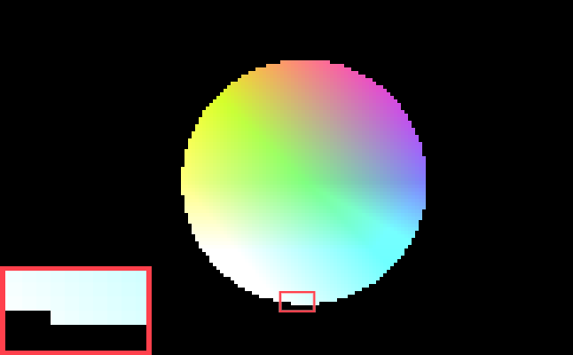

</details>
<details><summary>WebGL Vertex Shader <a href="shader/circle.vs">circle.vs</a></summary>

```glsl

```

</details>
<details>	
<summary>WebGL Fragment Shader <a href="shader/circle.fs">circle.fs</a></summary>

```glsl

```

</details>
<details>	
<summary>WebGL Javascript <a href="circleSimple.js">circleSimple.js</a></summary>

```javascript

```

</details>
</blockquote>

Let's start out simple. Using [GLSL](https://en.wikipedia.org/wiki/OpenGL_Shading_Language) Shaders we tell the GPU of your device to draw a circle in the most simple and naive way possible, as seen in [circle.fs](shader/circle.fs) above: If the [`length()`](https://docs.gl/sl4/length) from the middle point is bigger than 1.0, we [`discard`](https://www.khronos.org/opengl/wiki/Fragment_Shader#Special_operations) the pixel.

The circle is blocky, especially at smaller resolutions. More painfully, there is strong "pixel crawling", an artifact that's very obvious when there is any kind of movement. As the circle moves, rows of pixels pop in and out of existence and the stair steps of the pixelation move along the side of the circle like beads of different speeds.

<blockquote class="reaction"><div class="reaction_text">The low ¼ and ⅛ resolutions aren't just there for extreme pixel-peeping, but also to represent small elements or ones at large distance in 3D.</div></blockquote>

At lower resolutions these artifacts come together to destroy the circular form. The combination of slow movement and low resolution causes one side's pixels to come into existence, before the other side's pixels disappear, causing a wobble. Axis-alignment with the pixel grid causes "plateaus" of pixels at every 90° and 45° position.

### Technical breakdown

<blockquote class="reaction"><div class="reaction_text">Understanding the GPU code is not necessary to follow this article, but will help to grasp whats happening when we get to the analytical bits.</div></blockquote>

4 vertices making up a quad are sent to the GPU in the vertex shader [circle.vs](shader/circle.vs), where they are received as `attribute vec2 vtx`. The coordinates are of a "unit quad", meaning the coordinates look like the following image. With [one famous exception](https://www.copetti.org/writings/consoles/sega-saturn/#segas-offering), all GPUs use triangles, so the quad is actually made up of two triangles.

<figure>
	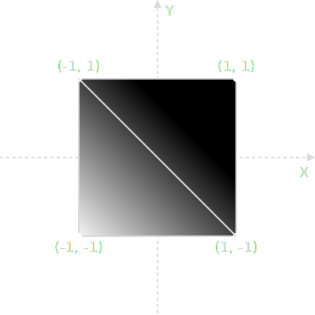
	<figcaption>Schematic make-up of the unit quad</figcaption>
</figure>

The vertices [here](utility.js) are given to the fragment shader [circle.fs](shader/circle.fs) via `varying vec2 uv`. The fragment shader is called per [fragment](https://www.khronos.org/opengl/wiki/Fragment) (here fragments are pixel-sized) and the [`varying`](http://learnwebgl.brown37.net/12_shader_language/glsl_data_types.html#storage-qualifiers) is interpolated linearly with [perspective corrected](https://en.wikipedia.org/wiki/Texture_mapping#Affine_texture_mapping), [barycentric coordinates](https://en.wikipedia.org/wiki/Barycentric_coordinate_system), giving us a `uv` coordinate per pixel from `-1` to `+1` with zero at the center.

By performing the check `if (length(uv) < 1.0)` we draw our color for fragments inside the circle and reject fragments outside of it. What we are doing is known as "Alpha testing". Without diving too deeply and just to hint at what's to come, what we have created with `length(uv)` is the [signed distance field](https://en.wikipedia.org/wiki/Signed_distance_function#Applications) of a point.

<blockquote class="reaction"><div class="reaction_text">Just to clarify, the circle isn't "drawn with geometry", which would have finite resolution of the shape, depending on how many vertices we use. It's "drawn by the shader".</div></blockquote>

## SSAA

SSAA stands for [Super Sampling Anti-Aliasing](https://en.wikipedia.org/wiki/Supersampling). Render it bigger, downsample to be smaller. The idea is as old as 3D rendering itself. In fact, the first movies with CGI all relied on this with the most naive of implementations. One example is the 1986 movie "[Flight of the Navigator](https://en.wikipedia.org/wiki/Flight_of_the_Navigator)", as covered by [Captain Disillusion](https://www.youtube.com/@CaptainDisillusion) in the video below.

<figure>
	<video poster="vid/flight_thumb.jpg" width="960" height="540" controls><source src="vid/flight.mp4" type="video/mp4"></video>
	<figcaption>SSAA as used in "Flight of the Navigator" (1986)
	<br>
	Excerpt from <a href="https://www.youtube.com/watch?v=tyixMpuGEL8">"Flight of the Navigator | VFXcool"</a><br>YouTube Video by <a href="https://www.youtube.com/@CaptainDisillusion">Captain Disillusion</a>
	</figcaption>
</figure>

<blockquote class="reaction"><div class="reaction_text">1986 did it, so can we. Implemented in mere seconds. <b>Easy</b>, right?</div></blockquote>

<div class="toggleRes">
	<div>
	  <input type="radio" id="nativeSSAA" name="resSSAA" value="1" checked />
	  <label for="nativeSSAA">Native<div>Resolution</div></label>
	</div>
	<div>
	  <input type="radio" id="halfSSAA" name="resSSAA" value="2" />
	  <label for="halfSSAA">½<div>Resolution</div></label>
	</div>
	<div>
	  <input type="radio" id="quarterSSAA" name="resSSAA" value="4" />
	  <label for="quarterSSAA">¼<div>Resolution</div></label>
	</div>
	<div>
	  <input type="radio" id="eightSSAA" name="resSSAA" value="8" />
	  <label for="eightSSAA">⅛<div>Resolution</div></label>
	</div>
</div>
<canvas width="100%" height="400px" style="max-height: 400px; aspect-ratio: 1.71" id="canvasSSAA"></canvas>
<script src="circleSSAA.js"></script>
<script>setupSSAA("canvasSSAA", "vertex_0", "fragment_0", "vertexPost", "fragmentPost", "vertexBlit", "fragmentBlit", "vertexRedBox", "fragmentRedBox", "resSSAA");</script>

<blockquote>
<details><summary><a href="screenshots/ssaa.png">Screenshot</a>, in case WebGL doesn't work</summary>

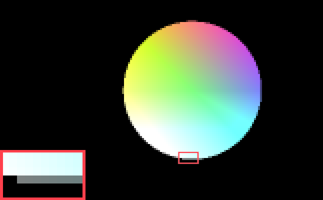

</details>
<details>	
<summary>SSAA buffer Fragment Shader <a href="shader/post.fs">post.fs</a></summary>

```glsl

```

</details>
<details>	
<summary>WebGL Javascript <a href="circleSSAA.js">circleSSAA.js</a></summary>

```javascript

```

</details>
</blockquote>

[circleSSAA.js](circleSSAA.js) draws at twice the resolution to a texture, which fragment shader [post.fs](shader/post.fs) reads from at standard resolution with [GL_LINEAR](https://docs.gl/es2/glTexParameter) to perform SSAA. So we have _four_ input pixels for every _one_ output pixel we draw to the screen. But it's somewhat strange: There is definitely Anti-Aliasing happening, but less than expected.

<blockquote class="reaction"><div class="reaction_text">There should be 4 steps of transparency, but we only get two!</div></blockquote>

Especially at lower resolutions, we can see the circle _does_ actually have 4 steps of transparency, but mainly at the 45° "diagonals" of the circle. A circle has of course no sides, but at the axis-aligned "bottom" there are only 2 steps of transparency: Fully Opaque and 50% transparent, the 25% and 75% transparency steps are missing.

### Conceptually simple, actually hard

We aren't sampling against the circle shape at twice the resolution, we are sampling against the quantized result of the circle shape. Twice the resolution, but discrete pixels nonetheless. The combination of pixelation and sample placement doesn't hold enough information where we need it the most: at the axis-aligned "flat parts".

<blockquote class="reaction"><div class="reaction_text">Four times the memory <b>and</b> four times the calculation requirement, but only a half-assed result.</div></blockquote>

Implementing SSAA properly is a minute craft. Here we are drawing to a 2x resolution texture and down-sampling it with linear interpolation. So actually, this implementation needs 5x the amount of VRAM. A proper implementation samples the scene multiple times and combines the result without an intermediary buffer.

<blockquote class="reaction"><div class="reaction_text">With our implementation, we can't even do more than 2xSSAA with one texture read, as linear interpolation happens <a href="https://stackoverflow.com/questions/53896032/">only with 2x2 samples</a>.</div></blockquote>

To combat axis-alignment artifacts like with our circle above, we need to place our SSAA samples better. There are [multiple ways to do so](https://en.wikipedia.org/wiki/Supersampling#Supersampling_patterns), all with pros and cons. To implement SSAA properly, we need deep integration with the rendering pipeline. For 3D primitives, this happens below API or engine, in the realm of vendors and drivers.

<figure>
	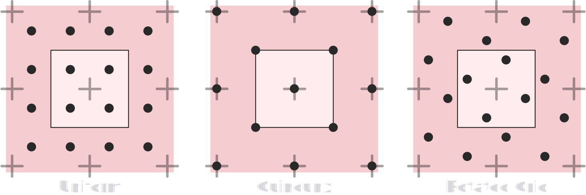
	<figcaption>SSAA sample patterns. <a href="https://en.wikipedia.org/wiki/Supersampling#Supersampling_patterns">Source</a></figcaption>
</figure>

In fact, some of the best implementations were [discovered by vendors on accident](https://web.archive.org/web/20180716171211/https://naturalviolence.webs.com/sgssaa.htm), like [SGSSAA](https://www.youtube.com/watch?v=ntlYwrbUlWo). There are also ways in which SSAA can make your scene look _worse_. Depending on implementation, SSAA messes with [mip-map](https://en.wikipedia.org/wiki/Mipmap) calculations. As a result the mip-map lod-bias may need adjustment, as explained in the [article above](https://web.archive.org/web/20180716171211/https://naturalviolence.webs.com/sgssaa.htm).

<blockquote class="reaction"><div class="reaction_text">WebXR UI package <a href="https://github.com/felixmariotto/three-mesh-ui">three-mesh-ui</a>, a package mature enough to be <a href="https://developers.meta.com/horizon/blog/project-flowerbed-a-webxr-case-study/">used by Meta</a>, uses shader-based rotated grid super sampling to achieve sharp text rendering in VR, <a href="https://github.com/felixmariotto/three-mesh-ui/blob/b9c19e542e5234bc964a44c1e7aa4eeb16676757/build/three-mesh-ui.module.js#L2964">as seen in the code</a>.</div></blockquote>

## MSAA

[MSAA](https://en.wikipedia.org/wiki/Multisample_anti-aliasing) is super sampling, but only at the silhouette of models, overlapping geometry, and texture edges if "[Alpha to Coverage](https://bgolus.medium.com/anti-aliased-alpha-test-the-esoteric-alpha-to-coverage-8b177335ae4f)" is enabled. MSAA is implemented by the graphics card in-hardware by the graphics vendors and what is supported depends on hardware. In the select box below you can choose different MSAA levels for our circle.

[There is up to MSAA x64](https://opengl.gpuinfo.org/displaycapability.php?name=GL_MAX_SAMPLES), but what is available is implementation defined. WebGL 1 has no support, which is why the next canvas initializes a [WebGL 2](https://developer.mozilla.org/en-US/docs/Web/API/WebGL2RenderingContext) context. In WebGL, NVIDIA limits MSAA to 8x on Windows, even if more is supported, whilst on Linux no such limit is in place. On smartphones you will only get exactly 4x, as discussed below.

<div class="center-child">
<select id="MSAA">.
    <option value="1">No MSAA</option>
    <option disabled value="2">MSAA -   2x</option>
    <option selected disabled value="4">MSAA -   4x</option>
    <option disabled value="8">MSAA -   8x</option>
    <option disabled value="16">MSAA - 16x</option>
    <option disabled value="32">MSAA - 32x</option>
    <option disabled value="64">MSAA - 64x</option>
</select>
</div>

<blockquote id="sampleErrorMessage" style="display: none" class="reaction"></blockquote>

<script id="vertexAnalytical" type="x-shader/x-fragment"></script>
<script id="fragmentAnalytical" type="x-shader/x-fragment"></script>
<script id="fragmentAnalyticalCompare" type="x-shader/x-fragment"></script>
<div class="toggleRes">
	<div>
	  <input type="radio" id="nativeMSAA" name="resMSAA" value="1" checked />
	  <label for="nativeMSAA">Native<div>Resolution</div></label>
	</div>
	<div>
	  <input type="radio" id="halfMSAA" name="resMSAA" value="2" />
	  <label for="halfMSAA">½<div>Resolution</div></label>
	</div>
	<div>
	  <input type="radio" id="quarterMSAA" name="resMSAA" value="4" />
	  <label for="quarterMSAA">¼<div>Resolution</div></label>
	</div>
	<div>
	  <input type="radio" id="eightMSAA" name="resMSAA" value="8" />
	  <label for="eightMSAA">⅛<div>Resolution</div></label>
	</div>
</div>
<canvas width="100%" height="400px" style="max-height: 400px; aspect-ratio: 1.71" id="canvasMSAA"></canvas>
<div class="toggleRes">
	<div>
	  <input type="radio" id="1pxMSAA" name="pxSizeMSAA" value="1" checked />
	  <label for="1pxMSAA"><svg xmlns="http://www.w3.org/2000/svg" xmlns:xlink="http://www.w3.org/1999/xlink" width="3.9ex" height="2.3ex" aria-hidden="true" viewBox="0 -750 1728 1000"><defs><path id="x" d="M94 612q78 4 117 20t73 46h23V73h123V0H88v73h125v244l-1 243q-2-2-15-6t-42-8-59-6l-13-1v73h11Z"/><path id="y" d="M166 404q28 20 75 35t96 16h4q69 0 110-85 32-63 32-148 0-94-50-163T306-10q-24 0-46 5T222 7t-28 14-18 12-8 5v-232H75v638h90v-20l1-20Zm224-182q0 65-36 109t-88 45-89-36l-9-8V118q32-52 89-52 56 0 94 46t39 110Z"/><path id="z" d="M187 229 6 444h101l120-150 117 150h49l49-1q-3-6-143-175l-32-39L460 0H359l-65 88-32 43-26 35-9 11L100 0H0l47 58 93 113q47 56 47 58Z"/></defs><g fill="currentColor" stroke="currentColor" stroke-width="0" data-mml-node="math"><g data-mml-node="mstyle"><g data-mjx-texclass="ORD" data-mml-node="TeXAtom"><g data-mml-node="mtable"><g data-mml-node="mtr"><g data-mml-node="mtd"><use xlink:href="#x" data-c="1D7E3" data-mml-node="mn" transform="scale(1 -1)"/><g data-mml-node="mtext" transform="matrix(1 0 0 -1 500 0)"><use xlink:href="#y" data-c="1D5C9" transform="translate(250)"/><use xlink:href="#z" data-c="1D5D1" transform="translate(767)"/></g></g></g></g></g></g></g></svg><div>edge smoothing</div></label>
	</div>
	<div>
	  <input type="radio" id="sqrt2pxMSAA" name="pxSizeMSAA" value="1.4142135623730950488016887242097" />
	  <label for="sqrt2pxMSAA"><svg xmlns="http://www.w3.org/2000/svg" xmlns:xlink="http://www.w3.org/1999/xlink" width="18.2ex" height="3.1ex" aria-hidden="true" viewBox="0 -934 8030 1368"><defs><path id="d" d="m263 249 52-119 102-238q51-119 53-120l255 530 257 537q7 11 19 11 7 0 12-6t7-12v-6L741 243 540-176l-71-148q-10-21-16-24-4-2-17-2l-12 1L315-96 205 156l-34-26-34-26-26 26 152 119Z"/><path id="a" d="M94 612q78 4 117 20t73 46h23V73h123V0H88v73h125v244l-1 243q-2-2-15-6t-42-8-59-6l-13-1v73h11Z"/><path id="b" d="M222 599q-32 0-56-14t-38-35-20-41-11-35-4-15l-26 33-25 34 5 13q25 69 73 103t105 35q79 0 130-33 94-65 94-190 0-81-88-164l-46-40q-36-30-116-106l-62-59 156 1h156V0H50v79l166 163q68 60 101 107t34 107q0 61-36 102t-93 41Z"/><path id="c" d="M56 237v13l14 20h299v150l1 150q10 13 19 13 13 0 20-15V270h298q15-8 15-20t-15-20H409V-68q-8-14-18-14h-4q-12 0-18 14v298H70q-14 7-14 20Z"/><path id="e" d="M56 350q0 13 14 20h637q15-8 15-20 0-11-14-19l-318-1H72q-16 5-16 20Zm0-200q0 15 16 20h636q14-10 14-20 0-12-15-20H70q-14 7-14 20Z"/><path id="f" d="M95 178q-6 0-14 8t-9 14 31 30 66 50 38 29q2 2 5 2h1q6 0 14-17t54-117l31-69 85-185 104 213 206 429q103 216 107 221 6 14 20 14 7 0 12-6t7-12v-6L620 293 385-193q-4-7-19-7-9 0-12 3L256 15l-96 210-16-11-31-24q-16-12-18-12Z"/><path id="h" d="M166 404q28 20 75 35t96 16h4q69 0 110-85 32-63 32-148 0-94-50-163T306-10q-24 0-46 5T222 7t-28 14-18 12-8 5v-232H75v638h90v-20l1-20Zm224-182q0 65-36 109t-88 45-89-36l-9-8V118q32-52 89-52 56 0 94 46t39 110Z"/><path id="i" d="M187 229 6 444h101l120-150 117 150h49l49-1q-3-6-143-175l-32-39L460 0H359l-65 88-32 43-26 35-9 11L100 0H0l47 58 93 113q47 56 47 58Z"/></defs><g fill="currentColor" stroke="currentColor" stroke-width="0" data-mml-node="math"><g data-mml-node="mstyle"><g data-mjx-texclass="ORD" data-mml-node="TeXAtom"><g data-mml-node="mtable"><g data-mml-node="mtr"><g data-mml-node="mtd"><g data-mml-node="msqrt"><g data-mml-node="msup"><use xlink:href="#a" data-c="1D7E3" data-mml-node="mn" transform="matrix(1 0 0 -1 1020 184)"/><g data-mjx-texclass="ORD" data-mml-node="TeXAtom"><use xlink:href="#b" data-c="1D7E4" data-mml-node="mn" transform="matrix(.707 0 0 -.707 1553 -105)"/></g></g><use xlink:href="#c" data-c="2B" data-mml-node="mo" transform="matrix(1 0 0 -1 2179 184)"/><g data-mml-node="msup"><use xlink:href="#a" data-c="1D7E3" data-mml-node="mn" transform="matrix(1 0 0 -1 3179 184)"/><g data-mjx-texclass="ORD" data-mml-node="TeXAtom"><use xlink:href="#b" data-c="1D7E4" data-mml-node="mn" transform="matrix(.707 0 0 -.707 3712 -105)"/></g></g><use xlink:href="#d" data-c="221A" data-mml-node="mo" transform="matrix(1 0 0 -1 0 -24)"/><path stroke="none" d="M1020-814h3096v-60H1020z"/></g><use xlink:href="#e" data-c="3D" data-mml-node="mo" transform="matrix(1 0 0 -1 4393 184)"/><g data-mml-node="msqrt"><use xlink:href="#b" data-c="1D7E4" data-mml-node="mn" transform="matrix(1 0 0 -1 6302 184)"/><use xlink:href="#f" data-c="221A" data-mml-node="mo" transform="matrix(1 0 0 -1 5449 30)"/><path stroke="none" d="M6302-710h500v-60h-500z"/></g><g data-mml-node="mtext" transform="matrix(1 0 0 -1 6802 184)"><use xlink:href="#g" data-c="A0"/><use xlink:href="#h" data-c="1D5C9" transform="translate(250)"/><use xlink:href="#i" data-c="1D5D1" transform="translate(767)"/></g></g></g></g></g></g></g></svg><div>edge smoothing</div></label>
	</div>
</div>
<script src="circleMSAA.js"></script>
<script>setupMSAA("canvasMSAA", "vertexAnalytical", "fragmentAnalytical", "fragment_0", "vertexPost", "fragmentPost", "vertexBlit", "fragmentBlit", "vertexRedBox", "fragmentRedBox", "resMSAA", "pxSizeMSAA");</script>
<blockquote>
<details><summary><a href="screenshots/msaa.png">MSAA 4x Screenshot</a>, in case WebGL 2 doesn't work</summary>


</details>
<details>	
<summary>WebGL Javascript <a href="circleMSAA.js">circleMSAA.js</a></summary>

```javascript

```

</details>
</blockquote>

<blockquote class="reaction"><div class="reaction_text">What is edge smoothing and how does MSAA even know what to sample against? For now we skip the shader code and implementation. First let's take a look at MSAA's pros and cons in general.</div></blockquote>

### Implementation specific headaches

We rely on hardware to do the Anti-Aliasing, which obviously leads to the problem that user hardware may not support what we need. The sampling patterns MSAA uses may also do things we don't expect. Depending on what your hardware does, you may see the circle's edge transparency steps appearing "in the wrong order".

<figure>
	
	<figcaption>Sample pattern and circle shape clash: pixels are seemingly "checkerboxed"</figcaption>
</figure>

When MSAA became required with [OpenGL 3](https://en.wikipedia.org/wiki/OpenGL#OpenGL_3.0) & [DirectX 10](https://en.wikipedia.org/wiki/DirectX#DirectX_10) era of hardware, support was especially hit & miss. Even latest [Intel GMA](https://en.wikipedia.org/wiki/Intel_GMA#GMA_4500) iGPUs expose the OpenGL extension [`EXT_framebuffer_multisample`](https://registry.khronos.org/OpenGL/extensions/EXT/EXT_framebuffer_multisample.txt), but don't in-fact support MSAA, [which led to confusion](https://community.khronos.org/t/yet-another-intel-multisample-thread/69614/2). But also in more recent smartphones, support just [wasn't that clear-cut](https://issues.chromium.org/issues/40114751).

<figure>
	
	<figcaption>Double edges - iOS 2xMSAA, created by iOS rounding transparency of 4xMSAA</figcaption>
</figure>

Mobile chips support *exactly* MSAAx4 and things are weird. Android will let you pick 2x, but the driver will force 4x anyways. iPhones & iPads do something rather stupid: Choosing 2x will make it 4x, but transparency will be rounded to nearest 50% multiple, leading to double edges in our example. There is hardware specific reason:

### Performance cost: (maybe) Zero

Looking at modern video games, one might believe that MSAA is of the past. It usually brings a hefty performance penalty after all. Surprisingly, it's still the king under certain circumstances and in very specific situations, even performance free.

<blockquote class="reaction"><div class="reaction_text">As a gamer, this goes against instinct...</div></blockquote>
<figure>
	<video poster="vid/MSAA-PerformanceFree_thumb.jpg" width="960" height="540" controls><source src="vid/MSAA-PerformanceFree.mp4" type="video/mp4"></video>
	<figcaption>Video: MSAA 4x is performance free in certain contexts
	<br>
	Excerpt from <a href="https://gdcvault.com/play/1024538">"Developing High Performance Games for Different Mobile VR Platforms"</a><br> GDC 2017 talk by <a href="https://www.linkedin.com/in/rahulprasad2/	">Rahul Prasad</a>
	</figcaption>
</figure>

> [Rahul Prasad:](https://www.linkedin.com/in/rahulprasad2/) Use MSAA [...] It's actually not as expensive on mobile as it is on desktop, it's one of the nice things you get on mobile. [...] On some (mobile) GPUs 4x (MSAA) is free, so use it when you have it.

As explained by [Rahul Prasad](https://www.linkedin.com/in/rahulprasad2/) in the above talk, in VR 4xMSAA is a must and may come free on certain mobile GPUs. The specific reason would derail the blog post, but in case you want to go down that particular rabbit hole, here is Epic Games' [Niklas Smedberg](https://www.linkedin.com/in/niklas-smedberg-a96466/) giving a run-down.

<figure>
	<video poster="vid/tile-based-gpus_thumb.jpg" width="960" height="540" controls><source src="vid/tile-based-gpus.mp4" type="video/mp4"></video>
	<figcaption>Video: Tiled based rendering GPU architecture
	<br>
	Excerpt from <a href="https://gdcvault.com/play/1020756">"Next-Generation AAA Mobile Rendering"</a><br> GDC 2014 talk by <a href="https://www.linkedin.com/in/niklas-smedberg-a96466/">Niklas Smedberg</a> and <a href="https://twitter.com/NOTimothyLottes">Timothy Lottes</a>
	</figcaption>
</figure>

In short, this is possible under the condition of [forward rendering](https://gamedevelopment.tutsplus.com/forward-rendering-vs-deferred-rendering--gamedev-12342a) with geometry that is not too dense and the GPU having [tiled-based rendering architecture](https://developer.arm.com/documentation/102662/0100/Tile-based-GPUs), which allows the GPU to perform MSAA calculations without heavy memory access and thus [latency hiding](/WebGL-LUTS-made-simple/#performance-cost%3A-zero) the cost of the calculation. Here's [deep dive](https://github.com/KhronosGroup/Vulkan-Samples/tree/main/samples/performance/msaa#color-resolve), if you are interested.

### A complex toolbox

MSAA [gives you access](https://docs.gl/gl3/glGetMultisample) to the samples, making [custom MSAA filtering curves](https://therealmjp.github.io/posts/msaa-resolve-filters/) a possibility. It also allows you to [merge both standard mesh-based and signed-distance-field rendering](https://bgolus.medium.com/rendering-a-sphere-on-a-quad-13c92025570c) via [alpha to coverage](https://bgolus.medium.com/anti-aliased-alpha-test-the-esoteric-alpha-to-coverage-8b177335ae4f). This complex features set made possible the most out-of-the-box thinking I ever witnessed in graphics programming:

[Assassin's Creed Unity](https://en.wikipedia.org/wiki/Assassin%27s_Creed_Unity) used MSAA to render at half resolution and reconstruct only some buffers to full-res from MSAA samples, as described on page 48 of the talk "[GPU-Driven Rendering Pipelines](https://advances.realtimerendering.com/s2015/aaltonenhaar_siggraph2015_combined_final_footer_220dpi.pdf)" by [Ulrich Haar](https://www.linkedin.com/in/ulrich-haar-730407218) and [Sebastian Aaltonen](https://x.com/SebAaltonen). Kinda like [variable rate shading](https://developer.nvidia.com/vrworks/graphics/variablerateshading), but implemented with duct-tape and without vendor support.

<blockquote class="reaction"><div class="reaction_text">The brain-melting lengths to which graphics programmers go to utilize hardware acceleration to the last drop has me sometimes in awe.</div></blockquote>

## Post-Process Anti-Aliasing

In 2009 a [paper](https://web.archive.org/web/20141205052029/http://visual-computing.intel-research.net/publications/papers/2009/mlaa/mlaa.pdf) by [Alexander Reshetov](https://research.nvidia.com/person/alexander-reshetov) struck the graphics programming world like a ton of bricks: take the blocky, aliased result of the rendered image, find edges and classify the pixels into tetris-like shapes with per-shape filtering rules and remove the blocky edge. Anti-Aliasing based on the [morphology](https://en.wikipedia.org/wiki/Mathematical_morphology) of pixels - [MLAA](https://www.iryoku.com/mlaa/) was born.

Computationally cheap, easy to implement. Later it was refined with more emphasis on removing sub-pixel artifacts to become [SMAA](https://www.iryoku.com/smaa/). It became a fan favorite, with [an injector being developed early on](https://mrhaandi.blogspot.com/p/injectsmaa.html?m=1) to put SMAA into games that didn't support it. Some considered these too blurry, the saying "vaseline on the screen" was coined.

<blockquote class="reaction"><div class="reaction_text">It was the future, a sign of things to come. No more shaky hardware support. Like <a href="https://en.wikipedia.org/wiki/Fixed-function">Fixed-Function pipelines</a> died in favor of programmable shaders Anti-Aliasing too became "shader based".</div></blockquote>

### FXAA

We'll take a close look at an algorithm that was inspired by MLAA, developed by [Timothy Lottes](https://x.com/NOTimothyLottes). "Fast approximate anti-aliasing", [FXAA](https://developer.download.nvidia.com/assets/gamedev/files/sdk/11/FXAA_WhitePaper.pdf). In fact, when it came into wide circulation, it received some incredible press. [Among others](https://www.realtimerendering.com/blog/fxaa-rules-ok/), [Jeff Atwood](https://blog.codinghorror.com/about-me/) pulled neither bold fonts nor punches in his [2011 blog post](https://blog.codinghorror.com/fast-approximate-anti-aliasing-fxaa/), later [republished by Kotaku](http://kotaku.com/5866780/).

> [**Jeff Atwood**](https://blog.codinghorror.com/about-me/): The FXAA method is so good, in fact, it makes all other forms of full-screen anti-aliasing pretty much obsolete overnight. **If you have an FXAA option in your game, you should enable it immediately** and ignore any other AA options.

Let's see what the hype was about. The final version publicly released was FXAA 3.11 on [August 12th 2011](https://web.archive.org/web/20120121124756/http://timothylottes.blogspot.com/2011/08/fxaa-311-bug-fixes-for-360.html) and the following demos are based on this. First, let's take a look at our circle with FXAA doing the Anti-Aliasing at default settings.

<div class="toggleRes">
	<div>
	  <input type="radio" id="nativeFXAA" name="resFXAA" value="1" checked />
	  <label for="nativeFXAA">Native<div>Resolution</div></label>
	</div>
	<div>
	  <input type="radio" id="halfFXAA" name="resFXAA" value="2" />
	  <label for="halfFXAA">½<div>Resolution</div></label>
	</div>
	<div>
	  <input type="radio" id="quarterFXAA" name="resFXAA" value="4" />
	  <label for="quarterFXAA">¼<div>Resolution</div></label>
	</div>
	<div>
	  <input type="radio" id="eightFXAA" name="resFXAA" value="8" />
	  <label for="eightFXAA">⅛<div>Resolution</div></label>
	</div>
</div>
<canvas width="100%" height="400px" style="max-height: 400px; aspect-ratio: 1.71" id="canvasFXAA"></canvas>
<script src="circleFXAA.js"></script>
<script>setupFXAA("canvasFXAA", "vertex_0", "fragment_0", "vertexPost", "fragmentPostFXAA", "vertexBlit", "fragmentBlit", "vertexRedBox", "fragmentRedBox", "resFXAA");</script>

<blockquote>
<details><summary><a href="screenshots/fxaa.png">Screenshot</a>, in case WebGL doesn't work</summary>

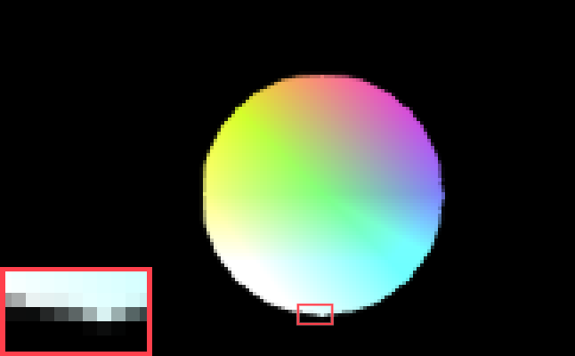

</details>
<details>	
<summary>WebGL FXAA Shader <a href="shader/post-FXAA.fs">post-FXAA.fs</a></summary>

```glsl

```

</details>
<details>	
<summary>WebGL Javascript <a href="circleFXAA.js">circleFXAA.js</a></summary>

```javascript

```

</details>
</blockquote>

A bit of a weird result. It looks good if the circle wouldn't move. Perfectly smooth edges. But the circle distorts as it moves. The axis-aligned top and bottom especially have a little nub that appears and disappears. And switching to lower resolutions, the circle even loses its round shape, [wobbling like Play Station 1 graphics](https://www.youtube.com/watch?v=x8TO-nrUtSI).

Per-pixel, FXAA considers only the 3x3 neighborhood, so it can't possibly know that this area is part of a big shape. But it also doesn't just "blur edges", as often said. As explained in the [official whitepaper](https://developer.download.nvidia.com/assets/gamedev/files/sdk/11/FXAA_WhitePaper.pdf), it finds the edge's direction and shifts the pixel's coordinates to let the performance free linear interpolation do the blending.

For our demo here, wrong tool for the job. Really, we didn't do FXAA justice with our example. FXAA was created for another use case and has many settings and presets. It was created to anti-alias more complex scenes. Let's give it a fair shot!

#### FXAA full demo

A scene from my favorite piece of software in existence: [NeoTokyo°](https://store.steampowered.com/app/244630/NEOTOKYO/). I created a bright area light in an NT° map and moved a bench to create an area of strong aliasing. The following demo uses the aliased output from [NeoTokyo°](https://store.steampowered.com/app/244630/NEOTOKYO/), calculates the required luminance channel and applies FXAA. All FXAA presets and settings at your finger tips.

<blockquote class="reaction"><div class="reaction_text">This has fixed resolution and will only be at you device's native resolution, if your device has no dpi scaling and the browser is at 100% zoom.</div></blockquote>

<script id="vertexInteractive" type="x-shader/x-vertex"></script>
<script id="fragmentInteractive" type="x-shader/x-fragment"></script>
<script id="vertexLuma" type="x-shader/x-fragment"></script>
<script id="fragmentLuma" type="x-shader/x-fragment"></script>
<div style="display: flex; flex-wrap: wrap; gap: 0px 12px; justify-content: space-around;">
    <span style="display: flex; gap: 8px; white-space: nowrap">
        <label style="display: flex; gap: 8px; align-items: center;">
            <input style="margin-bottom: unset;" type="checkbox" id="fxaaCheck" name="Enable FXAA" checked />
            Enable FXAA
        </label>
    </span>
    <span style="display: flex; gap: 8px; white-space: nowrap">
        <label style="font-weight: unset; display: flex; gap: 8px; align-items: center;">
            <input style="margin-bottom: unset;" type="checkbox" id="redCheck" name="Enable Red Box" checked />
            Enable Red Box
        </label>
    </span>
    <span style="display: flex; gap: 8px; white-space: nowrap">
        <label style="font-weight: unset; display: flex; gap: 8px; align-items: center;">
            <input style="margin-bottom: unset;" type="checkbox" id="pauseCheck" name="Play / Pause" checked />
            Play / Pause
        </label>
    </span>
</div>
<style>
    .settingsTable .noborder td {
        border-bottom: unset;
    }
    .variable-name-row {
        display: none;
    }
    @media screen and (max-width: 500px) {
        .variable-name-row {
            display: table-row;
			text-align: center;
        }
        .variable-name-cell {
            display: none;
        }
    }
	.settingsTable pre {
    	overflow-x: auto;
    	max-width: 100%;
    	white-space: pre-wrap;
		overflow-wrap: anywhere;
	}
	.precolumn {
		padding: 0px;
	}
</style>
<div id="canvas-container" style="position: relative; display: inline-block;">
    <canvas width="100%" style="aspect-ratio: 1.425" id="canvasFXAAInteractive"></canvas>
    <div id="loading-overlay" style="
        position: absolute;
        top: 0;
        left: 0;
        width: 100%;
        height: 100%;
        display: flex;
        justify-content: center;
        align-items: center;
        font-size: larger;
        z-index: 10;
    ">
        Loading... 0%
    </div>
</div>
<table class="settingsTable" style="width: 100%; max-width: 100%;">
	<tr class="noborder">
		<td colspan=4 style="width:100%">
			<div style="display: flex; gap: 0px 12px; align-items: center;">
			    <div style="display: flex; flex-wrap: wrap; gap: 0px 12px; flex: 1; justify-content: space-around;">
			        <span style="display: flex; gap: 8px; white-space: nowrap;">
			            <label style="font-weight: unset; display: flex; gap: 8px; align-items: center;">
			                <input style="margin-bottom: unset;" type="checkbox" id="lumaCheck" name="Show Luma" />
			                Show Luma
			            </label>
			        </span>
			        <span style="display: flex; gap: 8px; white-space: nowrap;">
			            <label style="font-weight: unset; display: flex; gap: 8px; align-items: center;">
			                <input style="margin-bottom: unset;" type="checkbox" id="greenCheck" name="Green as Luma" />
			                Green as Luma
			            </label>
			        </span>
			    </div>
			    <button style="border-radius: 50%; font-weight: 600;" onclick="var element = document.getElementById('LumaExplanation'); element.style.display = (element.style.display === 'none' || element.style.display === '') ? 'block' : 'none';">?</button>
			</div>
		</td>
	</tr>
	<tr>
		<td class="precolumn" colspan=4>
		<pre id="LumaExplanation" style="display: none;">
-------------------------------------------------
    	INTEGRATION - RGBL AND COLORSPACE
-------------------------------------------------
FXAA3 requires RGBL as input unless the following is set, &#13;&#10;
  #define FXAA_GREEN_AS_LUMA 1&#13;&#10;
In which case the engine uses green in place of luma,
and requires RGB input is in a non-linear colorspace.&#13;&#10;
RGB should be LDR (low dynamic range).
Specifically do FXAA after tonemapping.&#13;&#10;
RGB data as returned by a texture fetch can be non-linear,
or linear when FXAA_GREEN_AS_LUMA is not set.
Note an "sRGB format" texture counts as linear,
because the result of a texture fetch is linear data.
Regular "RGBA8" textures in the sRGB colorspace are non-linear.&#13;&#10;
If FXAA_GREEN_AS_LUMA is not set,
luma must be stored in the alpha channel prior to running FXAA.
This luma should be in a perceptual space (could be gamma 2.0).
Example pass before FXAA where output is gamma 2.0 encoded,&#13;&#10;
  color.rgb = ToneMap(color.rgb); // linear color output
  color.rgb = sqrt(color.rgb);    // gamma 2.0 color output
  return color;&#13;&#10;
To use FXAA,&#13;&#10;
  color.rgb = ToneMap(color.rgb);  // linear color output
  color.rgb = sqrt(color.rgb);     // gamma 2.0 color output
  color.a = dot(color.rgb, FxaaFloat3(0.299, 0.587, 0.114)); // compute luma
  return color;&#13;&#10;
Another example where output is linear encoded,
say for instance writing to an sRGB formated render target,
where the render target does the conversion back to sRGB after blending,&#13;&#10;
  color.rgb = ToneMap(color.rgb); // linear color output
  return color;&#13;&#10;
To use FXAA,&#13;&#10;
  color.rgb = ToneMap(color.rgb); // linear color output
  color.a = sqrt(dot(color.rgb, FxaaFloat3(0.299, 0.587, 0.114))); // compute luma
  return color;&#13;&#10;
Getting luma correct is required for the algorithm to work correctly.</pre>
		</td>
	</tr>
	<tr class="variable-name-row noborder">
		<td colspan=4>
			<code>FXAA_QUALITY_PRESET</code>
		</td>
	</tr>
	<tr class="noborder">
		<td class="variable-name-cell">
			<code>FXAA_QUALITY_PRESET</code>
		</td>
		<td colspan=2 style="width:100%">
<select id="FXAA_QUALITY_PRESET" style="width: 100%; margin-bottom: unset">
	<optgroup label="Default medium dither">
		<option value="10">10 (fastest)</option>
		<option value="11">11</option>
		<option value="12" selected>12 (default)</option>
		<option value="13">13</option>
		<option value="14">14</option>
		<option value="15">15 (highest quality)</option>
	</optgroup>
	<optgroup label="Less dither, more expensive">
		<option value="20">20 (fastest)</option>
		<option value="21">21</option>
		<option value="22">22</option>
		<option value="23">23</option>
		<option value="24">24</option>
		<option value="25">25</option>
		<option value="26">26</option>
		<option value="27">27</option>
		<option value="28">28</option>
		<option value="29">29 (highest quality)</option>
	<optgroup label="No dither, very expensive">
		<option value="39">39 (EXTREME QUALITY)</option>
	</optgroup>
</select>
		</td>
		<td>
			<button style="border-radius: 50%; font-weight: 600" onclick="var element = document.getElementById('fxaaQualityExplanation'); element.style.display = (element.style.display === 'none' || element.style.display === '') ? 'block' : 'none';">?</button>
		</td>
	</tr>
	<tr>
		<td class="precolumn" colspan=4>
		<pre id="fxaaQualityExplanation" style="display: none;">
Trades performance for quality, with 3 different "styles" of dither.
 _ = the lowest digit is directly related to performance
_  = the highest digit is directly related to style</pre>
		</td>
	</tr>
	<tr class="variable-name-row noborder">
		<td colspan=4>
			<code>fxaaQualitySubpix</code>
		</td>
	</tr>
	<tr class="noborder">
		<td class="variable-name-cell">
			<code>fxaaQualitySubpix</code>
		</td>
		<td style="width:100%">
			<input class="slider" type="range" step="0.01" min="0" max="1" value="0.75" id="fxaaQualitySubpixRange" oninput="fxaaQualitySubpixValue.value = parseFloat(this.value).toFixed(2)">
		</td>
		<td style="text-align: center;">
			<output id="fxaaQualitySubpixValue">0.75</output>
		</td>
		<td>
			<button style="border-radius: 50%; font-weight: 600" onclick="var element = document.getElementById('fxaaQualitySubpixExplanation'); element.style.display = (element.style.display === 'none' || element.style.display === '') ? 'block' : 'none';">?</button>
		</td>
	</tr>
	<tr>
		<td class="precolumn" colspan=4>
		<pre id="fxaaQualitySubpixExplanation" style="display: none;">
Choose the amount of sub-pixel aliasing removal.
This can effect sharpness.
  1.00 - upper limit (softer)
  0.75 - default amount of filtering
  0.50 - lower limit (sharper, less sub-pixel aliasing removal)
  0.25 - almost off
  0.00 - completely off
----
In the whitepaper described as a lowpass filter:
The lowpass value used to filter sub-pixel aliasing at the end of the algorithm is a box filter of the complete 3x3 pixel neighborhood.
</pre>
		</td>
	</tr>
	<tr class="variable-name-row noborder">
		<td colspan=4>
			<code>fxaaQualityEdgeThreshold</code>
		</td>
	</tr>
	<tr class="noborder">
		<td class="variable-name-cell">
			<code>fxaaQualityEdgeThreshold</code>
		</td>
		<td style="width:100%">
			<input class="slider" type="range" step="0.001" min="0" max="1" value="0.166" id="fxaaQualityEdgeThresholdRange" oninput="fxaaQualityEdgeThresholdValue.value = parseFloat(this.value).toFixed(3)">
		</td>
		<td style="text-align: center;">
			<output id="fxaaQualityEdgeThresholdValue">0.166</output>
		</td>
		<td>
			<button style="border-radius: 50%; font-weight: 600" onclick="var element = document.getElementById('fxaaQualityEdgeThresholdExplanation'); element.style.display = (element.style.display === 'none' || element.style.display === '') ? 'block' : 'none';">?</button>
		</td>
	</tr>
	<tr>
		<td class="precolumn" colspan=4>
		<pre id="fxaaQualityEdgeThresholdExplanation" style="display: none;">
The minimum amount of local contrast required to apply algorithm.
  0.333 - too little (faster)
  0.250 - low quality
  0.166 - default
  0.125 - high quality 
  0.063 - overkill (slower)</pre>
		</td>
	</tr>
	<tr class="variable-name-row noborder">
		<td colspan=4>
			<code>fxaaQualityEdgeThresholdMin</code>
		</td>
	</tr>
	<tr class="noborder">
		<td class="variable-name-cell">
			<code>fxaaQualityEdgeThresholdMin</code>
		</td>
		<td style="width:100%">
			<input class="slider" type="range" step="0.0001" min="0" max="1" value="0.0833" id="fxaaQualityEdgeThresholdMinRange" oninput="fxaaQualityEdgeThresholdMinValue.value = parseFloat(this.value).toFixed(4)">
		</td>
		<td style="text-align: center;">
			<output id="fxaaQualityEdgeThresholdMinValue">0.0833</output>
		</td>
		<td>
			<button style="border-radius: 50%; font-weight: 600" onclick="var element = document.getElementById('fxaaQualityEdgeThresholdMinExplanation'); element.style.display = (element.style.display === 'none' || element.style.display === '') ? 'block' : 'none';">?</button>
		</td>
	</tr>
	<tr class="noborder">
		<td class="precolumn" colspan=4>
		<pre id="fxaaQualityEdgeThresholdMinExplanation" style="display: none;">
Trims the algorithm from processing darks.
  0.0833 - upper limit (default, the start of visible unfiltered edges)
  0.0625 - high quality (faster)
  0.0312 - visible limit (slower)
Special notes when using FXAA_GREEN_AS_LUMA,
  Likely want to set this to zero.
  As colors that are mostly not-green
  will appear very dark in the green channel!
  Tune by looking at mostly non-green content,
  then start at zero and increase until aliasing is a problem.</pre>
		</td>
	</tr>
</table>

<blockquote>
<details><summary><a href="screenshots/fxaainteractive.png">Screenshot</a>, in case WebGL doesn't work</summary>


</details>
<details><summary>WebGL Vertex Shader <a href="shader/FXAA-interactive.vs">FXAA-interactive.vs</a></summary>

```glsl

```

</details>
<details>	
<summary>WebGL Fragment Shader <a href="shader/FXAA-interactive.fs">FXAA-interactive.fs</a></summary>

```glsl

```

</details>
<details>	
<summary>WebGL Javascript <a href="FXAA-interactive.js">FXAA-interactive.js</a></summary>

```javascript

```

</details>
</blockquote>

<script id="vertexBlitSimple" type="x-shader/x-vertex"></script>
<script src="FXAA-interactive.js"></script>
<script>setupFXAAInteractive("canvasFXAAInteractive", "vertexInteractive", "fragmentInteractive", "vertexLuma", "fragmentLuma", "vertexBlitSimple", "fragmentBlit", "vertexRedBox", "fragmentRedBox");</script>

Just looking at the [full FXAA 3.11 source](https://github.com/FrostKiwi/treasurechest/blob/main/posts/analytical-anti-aliasing/shader/FXAA-3.11.glsl), you can see the passion in every line. Portable [across OpenGL and DirectX](https://github.com/FrostKiwi/treasurechest/blob/main/posts/analytical-anti-aliasing/shader/FXAA-3.11.glsl#L611), a [PC version](https://github.com/FrostKiwi/treasurechest/blob/main/posts/analytical-anti-aliasing/shader/FXAA-3.11.glsl#L716), a [XBOX 360](https://github.com/FrostKiwi/treasurechest/blob/main/posts/analytical-anti-aliasing/shader/FXAA-3.11.glsl#L1341) version, two finely optimized [PS3 version](https://github.com/FrostKiwi/treasurechest/blob/main/posts/analytical-anti-aliasing/shader/FXAA-3.11.glsl#L1437) fighting for every GPU cycle, [including shader disassambly](https://github.com/FrostKiwi/treasurechest/blob/main/posts/analytical-anti-aliasing/shader/FXAA-3.11.glsl#L1450). Such level of professionalism and dedication, shared with the world in plain text.

<blockquote class="reaction"><div class="reaction_text">The sharing and openness is why I'm in love with graphics programming.</div></blockquote>

It may be performance cheap, but only if you already have post-processing in place or do [deferred shading](https://en.wikipedia.org/wiki/Deferred_shading). Especially in mobile graphics, memory access is expensive, so saving the framebuffer to perform post processing is not always a given. If you need to setup render-to-texture in order to have FXAA, then the "F" in FXAA evaporates.

In this article we won't jump into modern [temporal anti-aliasing](https://sugulee.wordpress.com/2021/06/21/temporal-anti-aliasingtaa-tutorial/), but before FXAA was even developed, [TAA was already experimented](https://x.com/NOTimothyLottes/status/1756732098402992584) with. In fact, FXAA was supposed to [get a new version 4](https://web.archive.org/web/20120120082725/http://timothylottes.blogspot.com/2011/12/fxaa-40-stills-and-features.html) and [incorporate temporal anti aliasing](https://web.archive.org/web/20120120070945/http://timothylottes.blogspot.com/2011/12/big-fxaa-update-soon.html) in addition [to the standard spatial one](https://web.archive.org/web/20120120072820/http://timothylottes.blogspot.com/2011/12/fxaa-40-will-have-new-spatial-only.html), but instead it evolved further and rebranded into [TXAA](https://web.archive.org/web/20210116205348/https://www.nvidia.com/en-gb/geforce/technologies/txaa/technology/).

## Analytical Anti Aliasing

Now we get to the good stuff. Analytical Anti-Aliasing approaches the problem backwards - it knows the shape you need and draws the pixel already Anti-Aliased to the screen. Whilst drawing the 2D or 3D shape you need, it fades the shape's border by exactly one pixel.

<div class="toggleRes">
	<div>
	  <input type="radio" id="nativeAnalytical" name="resAnalytical" value="1" checked />
	  <label for="nativeAnalytical">Native<div>Resolution</div></label>
	</div>
	<div>
	  <input type="radio" id="halfAnalytical" name="resAnalytical" value="2" />
	  <label for="halfAnalytical">½<div>Resolution</div></label>
	</div>
	<div>
	  <input type="radio" id="quarterAnalytical" name="resAnalytical" value="4" />
	  <label for="quarterAnalytical">¼<div>Resolution</div></label>
	</div>
	<div>
	  <input type="radio" id="eightAnalytical" name="resAnalytical" value="8" />
	  <label for="eightAnalytical">⅛<div>Resolution</div></label>
	</div>
</div>

<script id="fragment3D" type="x-shader/x-fragment"></script>
<script id="vertex3D" type="x-shader/x-fragment"></script>

<script src="mat4.js"></script>
<script src="circleAnalytical.js"></script>

<canvas width="100%" height="400px" style="max-height: 400px; aspect-ratio: 1.71" id="canvasAnalytical"></canvas>

<div class="toggleRes">
	<div>
	  <input type="radio" id="1pxAAA" name="pxSizeAAA" value="1" checked />
	  <label for="1pxAAA"><svg xmlns="http://www.w3.org/2000/svg" xmlns:xlink="http://www.w3.org/1999/xlink" width="3.9ex" height="2.3ex" aria-hidden="true" viewBox="0 -750 1728 1000"><defs><path id="x" d="M94 612q78 4 117 20t73 46h23V73h123V0H88v73h125v244l-1 243q-2-2-15-6t-42-8-59-6l-13-1v73h11Z"/><path id="y" d="M166 404q28 20 75 35t96 16h4q69 0 110-85 32-63 32-148 0-94-50-163T306-10q-24 0-46 5T222 7t-28 14-18 12-8 5v-232H75v638h90v-20l1-20Zm224-182q0 65-36 109t-88 45-89-36l-9-8V118q32-52 89-52 56 0 94 46t39 110Z"/><path id="z" d="M187 229 6 444h101l120-150 117 150h49l49-1q-3-6-143-175l-32-39L460 0H359l-65 88-32 43-26 35-9 11L100 0H0l47 58 93 113q47 56 47 58Z"/></defs><g fill="currentColor" stroke="currentColor" stroke-width="0" data-mml-node="math"><g data-mml-node="mstyle"><g data-mjx-texclass="ORD" data-mml-node="TeXAtom"><g data-mml-node="mtable"><g data-mml-node="mtr"><g data-mml-node="mtd"><use xlink:href="#x" data-c="1D7E3" data-mml-node="mn" transform="scale(1 -1)"/><g data-mml-node="mtext" transform="matrix(1 0 0 -1 500 0)"><use xlink:href="#y" data-c="1D5C9" transform="translate(250)"/><use xlink:href="#z" data-c="1D5D1" transform="translate(767)"/></g></g></g></g></g></g></g></svg><div>edge smoothing</div></label>
	</div>
	<div>
	  <input type="radio" id="sqrt2pxAAA" name="pxSizeAAA" value="1.4142135623730950488016887242097" />
	  <label for="sqrt2pxAAA"><svg xmlns="http://www.w3.org/2000/svg" xmlns:xlink="http://www.w3.org/1999/xlink" width="18.2ex" height="3.1ex" aria-hidden="true" viewBox="0 -934 8030 1368"><defs><path id="d" d="m263 249 52-119 102-238q51-119 53-120l255 530 257 537q7 11 19 11 7 0 12-6t7-12v-6L741 243 540-176l-71-148q-10-21-16-24-4-2-17-2l-12 1L315-96 205 156l-34-26-34-26-26 26 152 119Z"/><path id="a" d="M94 612q78 4 117 20t73 46h23V73h123V0H88v73h125v244l-1 243q-2-2-15-6t-42-8-59-6l-13-1v73h11Z"/><path id="b" d="M222 599q-32 0-56-14t-38-35-20-41-11-35-4-15l-26 33-25 34 5 13q25 69 73 103t105 35q79 0 130-33 94-65 94-190 0-81-88-164l-46-40q-36-30-116-106l-62-59 156 1h156V0H50v79l166 163q68 60 101 107t34 107q0 61-36 102t-93 41Z"/><path id="c" d="M56 237v13l14 20h299v150l1 150q10 13 19 13 13 0 20-15V270h298q15-8 15-20t-15-20H409V-68q-8-14-18-14h-4q-12 0-18 14v298H70q-14 7-14 20Z"/><path id="e" d="M56 350q0 13 14 20h637q15-8 15-20 0-11-14-19l-318-1H72q-16 5-16 20Zm0-200q0 15 16 20h636q14-10 14-20 0-12-15-20H70q-14 7-14 20Z"/><path id="f" d="M95 178q-6 0-14 8t-9 14 31 30 66 50 38 29q2 2 5 2h1q6 0 14-17t54-117l31-69 85-185 104 213 206 429q103 216 107 221 6 14 20 14 7 0 12-6t7-12v-6L620 293 385-193q-4-7-19-7-9 0-12 3L256 15l-96 210-16-11-31-24q-16-12-18-12Z"/><path id="h" d="M166 404q28 20 75 35t96 16h4q69 0 110-85 32-63 32-148 0-94-50-163T306-10q-24 0-46 5T222 7t-28 14-18 12-8 5v-232H75v638h90v-20l1-20Zm224-182q0 65-36 109t-88 45-89-36l-9-8V118q32-52 89-52 56 0 94 46t39 110Z"/><path id="i" d="M187 229 6 444h101l120-150 117 150h49l49-1q-3-6-143-175l-32-39L460 0H359l-65 88-32 43-26 35-9 11L100 0H0l47 58 93 113q47 56 47 58Z"/></defs><g fill="currentColor" stroke="currentColor" stroke-width="0" data-mml-node="math"><g data-mml-node="mstyle"><g data-mjx-texclass="ORD" data-mml-node="TeXAtom"><g data-mml-node="mtable"><g data-mml-node="mtr"><g data-mml-node="mtd"><g data-mml-node="msqrt"><g data-mml-node="msup"><use xlink:href="#a" data-c="1D7E3" data-mml-node="mn" transform="matrix(1 0 0 -1 1020 184)"/><g data-mjx-texclass="ORD" data-mml-node="TeXAtom"><use xlink:href="#b" data-c="1D7E4" data-mml-node="mn" transform="matrix(.707 0 0 -.707 1553 -105)"/></g></g><use xlink:href="#c" data-c="2B" data-mml-node="mo" transform="matrix(1 0 0 -1 2179 184)"/><g data-mml-node="msup"><use xlink:href="#a" data-c="1D7E3" data-mml-node="mn" transform="matrix(1 0 0 -1 3179 184)"/><g data-mjx-texclass="ORD" data-mml-node="TeXAtom"><use xlink:href="#b" data-c="1D7E4" data-mml-node="mn" transform="matrix(.707 0 0 -.707 3712 -105)"/></g></g><use xlink:href="#d" data-c="221A" data-mml-node="mo" transform="matrix(1 0 0 -1 0 -24)"/><path stroke="none" d="M1020-814h3096v-60H1020z"/></g><use xlink:href="#e" data-c="3D" data-mml-node="mo" transform="matrix(1 0 0 -1 4393 184)"/><g data-mml-node="msqrt"><use xlink:href="#b" data-c="1D7E4" data-mml-node="mn" transform="matrix(1 0 0 -1 6302 184)"/><use xlink:href="#f" data-c="221A" data-mml-node="mo" transform="matrix(1 0 0 -1 5449 30)"/><path stroke="none" d="M6302-710h500v-60h-500z"/></g><g data-mml-node="mtext" transform="matrix(1 0 0 -1 6802 184)"><use xlink:href="#g" data-c="A0"/><use xlink:href="#h" data-c="1D5C9" transform="translate(250)"/><use xlink:href="#i" data-c="1D5D1" transform="translate(767)"/></g></g></g></g></g></g></g></svg><div>edge smoothing</div></label>
	</div>
</div>
<script>setupAnalytical("canvasAnalytical", "vertexAnalytical", "fragmentAnalytical", "vertexBlit", "fragmentBlit", "vertexRedBox", "fragmentRedBox", "resAnalytical", "pxSizeAAA");</script>

<blockquote>
<details><summary><a href="screenshots/analytical.png">Screenshot</a>, in case WebGL doesn't work</summary>


</details>
<details><summary>WebGL Vertex Shader <a href="shader/circle-analytical.vs">circle-analytical.vs</a></summary>

```glsl

```

</details>
<details>	
<summary>WebGL Fragment Shader <a href="shader/circle-analytical.fs">circle-analytical.fs</a></summary>

```glsl

```

</details>
<details>	
<summary>WebGL Javascript <a href="circleAnalytical.js">circleAnalytical.js</a></summary>

```javascript

```

</details>
</blockquote>

Always smooth without artifacts and you can adjust the amount of filtering. Preserves shape even at low resolutions. No extra buffers or extra hardware requirements.

<blockquote class="reaction"><div class="reaction_text">Even runs on basic WebGL 1.0 or OpenGLES 2.0, without any extensions.</div></blockquote>

With the above buttons, you can set the smoothing to be equal to one pixel. This gives a sharp result, but comes with the caveat that axis-aligned 90° sides may still be perseved as "flat" in specific combinations of screen resolution, size and circle position.

Filtering based on the diagonal pixel size of `√2 px = 1.4142...`, ensures the "tip" of the circle in axis-aligned pixel rows and columns is always non-opaque. This removes the perception of flatness, but makes the shape ever so slightly more blurry.

<blockquote class="reaction"><div class="reaction_text">Or in other words: as soon as the border has an opaque pixel, there is already a transparent pixel "in front" of it.</div></blockquote>

This style of Anti-Aliasing is [usually implemented](http://www.numb3r23.net/2015/08/17/using-fwidth-for-distance-based-anti-aliasing/) with 3 ingredients:

- Enabled [Screen Space Derivative](https://gamedev.stackexchange.com/a/130933) extension or having a modern graphics context
- Pixel-size calculated via [`length`](https://docs.gl/sl4/length)+[`dFdx`](https://docs.gl/sl4/dFdx)+[`dFdy`](https://docs.gl/sl4/dFdy) or approximated with [`fwidth`](https://docs.gl/sl4/fwidth)
- Blending with [`smoothstep`](https://en.wikipedia.org/wiki/Smoothstep)

But if you look at the code box above, you will find [circle-analytical.fs](shader/circle-analytical.fs) having **none** of those. And this is the secret sauce we will look at. Before we dive into the implementation, let's clear the elephants in the room...

### What even _is_ "Analytical"?

In graphics programming, _Analytical_ refers to effects created by knowing the make-up of the intended shape beforehand and performing calculations against the rigid mathematical definition of said shape. This term is used **_very_** loosely across computer graphics, similar to super sampling referring to multiple things, depending on context.

<blockquote class="reaction"><div class="reaction_text">A picture is worth a thousand words...</div></blockquote>
<figure>
	
	<figcaption>Character soft-shadow from stretched spheres in The Last Of Us.<br><a href="http://miciwan.com/SIGGRAPH2013/Lighting%20Technology%20of%20The%20Last%20Of%20Us.pdf">Lighting Technology of "The Last Of Us"</a>, Siggraph 2013 talk by <a href="http://miciwan.com/">Michał Iwanicki</a></figcaption>
</figure>

Very soft soft-shadows which include [contact-hardening](http://wscg.zcu.cz/WSCG2012/short/B37-full.pdf), implemented by algorithms like [percentage-closer soft shadows](https://developer.download.nvidia.com/shaderlibrary/docs/shadow_PCSS.pdf) are very computationally intense and require both high resolution shadow maps and/or very aggressive filtering to not produce shimmering during movement.

This is why [Naughty Dog](https://en.wikipedia.org/wiki/Naughty_Dog)'s [The Last of Us](https://en.wikipedia.org/wiki/The_Last_of_Us) relied on getting soft-shadows on the main character by calculating the shadow from a rigidly defined formula of a stretched sphere, multiple of which were arranged in the shape of the main character, shown in red. An improved implementation with shader code can be seen in this [Shadertoy demo](https://www.shadertoy.com/view/3stcD4) by [romainguy](https://www.shadertoy.com/user/romainguy), with the more modern [capsule](<https://en.wikipedia.org/wiki/Capsule_(geometry)>), as opposed a stretched sphere.

This is now an integral part of modern game engines, [like Unreal](http://dev.epicgames.com/documentation/en-us/unreal-engine/capsule-shadows-overview-in-unreal-engine). As opposed to [standard shadow mapping](https://learnopengl.com/Advanced-Lighting/Shadows/Shadow-Mapping), we don't render the scene from the perspective of the light with finite resolution. We evaluate the shadow _per-pixel_ against the mathematical equation of the stretched sphere or capsule. This makes capsule shadows **_analytical_**.

<blockquote class="reaction"><div class="reaction_text">A video is worth a thousand words, 30 times a second.</div></blockquote>
<figure>
	<video poster="vid/capsule-lastofus_thumb.jpg" width="960" height="540" controls><source src="vid/capsule-lastofus.mp4" type="video/mp4"></video>
	<figcaption>Capsule representation of characters in The Last of Us Part II<br><a href="https://www.youtube.com/watch?v=1J6aAHLCbWg">YouTube Video</a> by <a href="https://www.youtube.com/@MaxLebled_ALT">"Max Lebled's 2nd channel"</a></figcaption>
</figure>

Staying with the Last of Us, [The Last of Us Part II](https://en.wikipedia.org/wiki/The_Last_of_Us_Part_II) uses the same logic for blurry real-time reflections of the main character, where [Screen Space Reflections](https://lettier.github.io/3d-game-shaders-for-beginners/screen-space-reflection.html) aren't defined. Other options like [raytracing against the scene](https://docs.unity3d.com/Packages/com.unity.render-pipelines.high-definition@8.2/manual/Ray-Traced-Reflections.html), or using a [real-time cubemap](https://www.adriancourreges.com/blog/2015/11/02/gta-v-graphics-study/#environment-cubemap) like in [GTA V](https://en.wikipedia.org/wiki/Grand_Theft_Auto_V) are either noisy and low resolution or high resolution, but low performance.

Here the reflection calculation is part of the material shader, rendering against the rigidly defined mathematical shape of the capsule _per-pixel_, multiple of which are arranged in the shape of the main character. This makes capsule reflections **_analytical_**.

<blockquote class="reaction"><div class="reaction_text">An online demo with is worth at least a million...<br>...yeah the joke is getting old.</div></blockquote>
<figure>
	
	<figcaption><a href="https://www.shadertoy.com/view/4djSDy">Shadertoy demo</a> for Analytical Ambient Occlusion by <a href="https://iquilezles.org/">Inigo Quilez</a></figcaption>
</figure>

[Ambient Occlusion](https://learnopengl.com/Advanced-Lighting/SSAO) is essential in modern rendering, bringing contact shadows and approximating global illumination. Another topic as deep as the ocean, with so many implementations. Usually implemented by some form of "raytrace a bunch of rays and blur the result".

In this [Shadertoy demo](https://www.shadertoy.com/view/4djSDy), the floor is evaluated _per-pixel_ against the rigidly defined mathematical description of the sphere to get a soft, non-noisy, non-flickering occlusion contribution from the hovering ball. This implementation is **_analytical_**. Not just spheres, there are [analytical approaches](https://research.nvidia.com/sites/default/files/pubs/2010-06_Ambient-Occlusion-Volumes/McGuire10AOV.pdf) also for complex geometry.

By extension, Unreal Engine has distance field approaches for [Soft Shadows](https://dev.epicgames.com/documentation/en-us/unreal-engine/distance-field-soft-shadows-in-unreal-engine) and [Ambient Occlusion](https://dev.epicgames.com/documentation/en-us/unreal-engine/using-distance-field-ambient-occlusion-in-unreal-engine), though one may argue, that this type of signed distance field rendering doesn't fit the description of _analytical_, considering the distance field is precalculated into a 3D texture.

### Implementation

Let's dive into the sauce. We work with [signed distance fields](https://www.youtube.com/watch?v=62-pRVZuS5c), where for every point that we sample, we know the distance to the desired shape. This information may be baked into a texture as done for [SDF text rendering](https://github.com/Chlumsky/msdf-atlas-gen) or may be derived _per-pixel_ from a mathematical formula for simpler shapes like [bezier curves or hearts](https://iquilezles.org/articles/distfunctions2d/).

Based on that distance we fade out the border of the shape. If we fade by the size of one pixel, we get perfectly smooth edges, without any strange side effects. The secret sauce is in the implementation and [under the sauce](https://www.youtube.com/watch?v=bRL8v6--bW4) is where the magic is. _How_ does the shader know the size of pixel? _How_ do we blend based on distance?

<blockquote class="reaction"><div class="reaction_text">This approach gives motion-stable pixel-perfection, but doesn't work with traditional rasterization. The <b>full</b> shape requires a signed distance field.</div></blockquote>
<div class="toggleRes">
	<div>
	  <input type="radio" id="nativeCompare" name="resCompare" value="1" checked />
	  <label for="nativeCompare">Native<div>Resolution</div></label>
	</div>
	<div>
	  <input type="radio" id="halfCompare" name="resCompare" value="2" />
	  <label for="halfCompare">½<div>Resolution</div></label>
	</div>
	<div>
	  <input type="radio" id="quarterCompare" name="resCompare" value="4" />
	  <label for="quarterCompare">¼<div>Resolution</div></label>
	</div>
	<div>
	  <input type="radio" id="eightCompare" name="resCompare" value="8" />
	  <label for="eightCompare">⅛<div>Resolution</div></label>
	</div>
</div>

<script src="circleAnalyticalComparison.js"></script>

<canvas width="100%" height="400px" style="max-height: 400px; aspect-ratio: 1.71" id="canvasCompare"></canvas>

<table class="settingsTable" style="width: 100%; max-width: 100%;">
	<tr class="variable-name-row noborder">
		<td colspan=4>
			<code>Pixel&nbsp;size&nbsp;method</code>
		</td>
	</tr>
	<tr class="noborder">
		<td class="variable-name-cell">
			<code>Pixel&nbsp;size&nbsp;method</code>
		</td>
		<td colspan=2 style="width:100%">
			<select id="pixelSizeMethod" style="width: 100%; margin-bottom: unset">
				<optgroup label="No Screen-Space Derivatives">
					<option checked value="SIMPLE">Pre-calculate pixel size</option>
				</optgroup>
				<optgroup label="Screen-Space Derivatives">
					<option value="DFD">length + dFdx + dFdy</option>
					<option value="FWIDTH">fwidth</option>
				</optgroup>
			</select>
		</td>
		<td>
			<button style="border-radius: 50%; font-weight: 600" onclick="var element = document.getElementById('pixelSizeMethodExplain'); element.style.display = (element.style.display === 'none' || element.style.display === '') ? 'block' : 'none';">?</button>
		</td>
	</tr>
	<tr>
		<td class="precolumn" colspan=4>
		<pre id="pixelSizeMethodExplain" style="display: none;">
The shader code works in NDC space with no concept of how big a pixel is. How do we get that information?</pre>
		</td>
	</tr>
	<tr class="variable-name-row noborder">
		<td colspan=4>
			<code>Blend&nbsp;method</code>
		</td>
	</tr>
	<tr class="noborder">
		<td class="variable-name-cell">
			<code>Blend&nbsp;method</code>
		</td>
		<td colspan=2 style="width:100%">
<select id="BLENDMETHOD" style="width: 100%; margin-bottom: unset">
		<option checked value="DIVISION">Simple division</option>
		<option value="LINSTEP">Linear step</option>
		<option value="LINSTEP_NO_CLAMP">Linear step, No Clamp</option>
		<option value="SMOOTHSTEP">Smooth step</option>
</select>
		</td>
		<td>
			<button style="border-radius: 50%; font-weight: 600" onclick="var element = document.getElementById('BLENDMETHODExplain'); element.style.display = (element.style.display === 'none' || element.style.display === '') ? 'block' : 'none';">?</button>
		</td>
	</tr>
	<tr>
		<td class="precolumn" colspan=4>
		<pre id="BLENDMETHODExplain" style="display: none;">How does the shader code know how to fade out the 1.0 alpha in a smooth fashion towards zero just at the edge?</pre>
		</td>
	</tr>
	<tr class="variable-name-row noborder">
		<td colspan=4>
			<code>Smoothing</code>
		</td>
	</tr>
	<tr class="noborder">
		<td class="variable-name-cell">
			<code>Smoothing</code>
		</td>
		<td style="width:100%">
			<input class="slider" type="range" step="0.1" min="0" max="9.9" value="1" id="SmoothingPxRange" oninput="SmoothingPxValue.value = parseFloat(this.value).toFixed(1)">
		</td>
		<td style="text-align: center;">
			<output id="SmoothingPxValue">1.0</output> px
		</td>
		<td>
			<button style="border-radius: 50%; font-weight: 600" onclick="var element = document.getElementById('SmoothingPxExplanation'); element.style.display = (element.style.display === 'none' || element.style.display === '') ? 'block' : 'none';">?</button>
		</td>
	</tr>
	<tr>
		<td class="precolumn" colspan=4>
		<pre id="SmoothingPxExplanation" style="display: none;">What is the distance that fading from 1.0 alpha to 0.0 alpha occurs over?</pre>
		</td>
	</tr>
	<tr class="variable-name-row noborder">
		<td colspan=4>
			<code>Radius&nbsp;adjust&nbsp;</code>
		</td>
	</tr>
	<tr class="noborder">
		<td class="variable-name-cell">
			<code>Radius&nbsp;adjust&nbsp;</code>
		</td>
		<td style="width:100%">
<input class="slider" type="range" step="0.1" min="-20" max="20" value="1" id="ShrinkAmountRange" oninput="let dec = (Math.abs(parseFloat(this.value)) >= 10) ? 0 : 1; ShrinkAmountValue.value = parseFloat(this.value).toFixed(dec)">
		</td>
		<td style="text-align: center;">
			<output id="ShrinkAmountValue">0.0</output> px
		</td>
		<td>
			<button style="border-radius: 50%; font-weight: 600" onclick="var element = document.getElementById('ShrinkAmountExplanation'); element.style.display = (element.style.display === 'none' || element.style.display === '') ? 'block' : 'none';">?</button>
		</td>
	</tr>
	<tr class="noborder">
		<td class="precolumn" colspan=4>
			<pre id="ShrinkAmountExplanation" style="display: none;">Radius adjustment of the signed distance field. Only here for illustrative purposes.</pre>
		</td>
	</tr>
</table>

<script>setupAnalyticalComparison("canvasCompare", "vertexAnalytical", "fragmentAnalyticalCompare", "vertexBlit", "fragmentBlit", "vertexRedBox", "fragmentRedBox", "resCompare");</script>

<blockquote>
<details><summary><a href="screenshots/analytical.png">Screenshot</a>, in case WebGL doesn't work</summary>


</details>
<details><summary>WebGL Vertex Shader <a href="shader/circle-analytical.vs">circle-analytical.vs</a></summary>

```glsl

```

</details>
<details>	
<summary>WebGL Fragment Shader <a href="shader/circle-analyticalCompare.fs">circle-analyticalCompare.fs</a></summary>

```glsl

```

</details>
<details>	
<summary>WebGL Javascript <a href="circleAnalyticalComparison.js">circleAnalyticalComparison.js</a></summary>

```javascript

```

</details>
</blockquote>

#### How big is a pixel?

Specifically, by how much do we fade the border? If we hardcode a static value, eg. fade at 95% of the circle's radius, we may get a pleasing result for that circle size at that screen resolution, but too much smoothing when the circle is bigger or closer to the camera and aliasing if the circle becomes small.

<figure>
	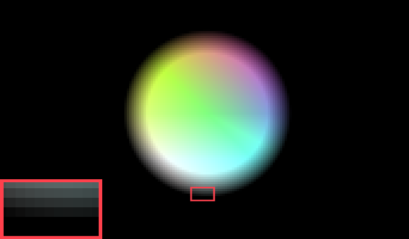
	<figcaption>Too much edge fading relative to this circle size</figcaption>
</figure>

We need to know the size of a pixel. This is in part what [Screen Space derivatives](https://gamedev.stackexchange.com/a/130933) were created for. Shader functions like [`dFdx`](https://docs.gl/sl4/dFdx), [`dFdy`](https://docs.gl/sl4/dFdy) and [`fwidth`](https://docs.gl/sl4/fwidth) allow you to get the size of a screen pixel relative to some vector. In the above [circle-analyticalCompare.fs](shader/circle-analyticalCompare.fs) we determine by how much the distance changes via two methods:

```glsl
pixelSize = fwidth(dist);
/* or */
pixelSize = length(vec2(dFdx(dist), dFdy(dist)));
```

Relying on Screen Space derivatives has the benefit, that we get the pixel size delivered to us by the graphics pipeline. It properly respects any transformations we might throw at it, including 3D perspective.

The down side is that it is not supported by the WebGL 1 standard and has to be pulled in via the extension `GL_OES_standard_derivatives` or requires the jump to WebGL 2.

<blockquote class="reaction"><div class="reaction_text">Luckily I have never witnessed any device that supported WebGL 1, but not the Screen Space derivatives. Even the GMA based <a href="https://www.youtube.com/watch?v=Fs4GjDiOie8">Thinkpad X200 & T500</a> I hardware modded do.</div></blockquote>

##### Possibly painful
Generally, there are some nasty pitfalls when using Screen Space derivatives: how the calculation happens is up to the implementation. This led to the split into `dFdxFine()` and `dFdxCoarse()` in later OpenGL revisions. The default case can be set via [`GL_FRAGMENT_SHADER_DERIVATIVE_HINT`](https://docs.gl/gl4/glHint), but the standard hates you:

> [**OpenGL Docs**](https://docs.gl/sl4/dFdx): The implementation ***may*** choose which calculation to perform based upon factors such as performance or the value of the API `GL_FRAGMENT_SHADER_DERIVATIVE_HINT` hint.

<blockquote class="reaction"><div class="reaction_text">Why do we have standards again? As a graphics programmer, anything with <code>hint</code> has me traumatized.</div></blockquote>

Luckily, neither case concerns us, as the difference doesn't show itself in the context of Anti-Aliasing. Performance technically [`dFdx`](https://docs.gl/sl4/dFdx) and [`dFdy`](https://docs.gl/sl4/dFdy) are free (or rather, their cost is already part of the rendering pipeline), though the pixel size calculation using `length()` or `fwidth()` is not. It is performed *per-pixel*.

##### [`dFdx`](https://docs.gl/sl4/dFdx) + [`dFdy`](https://docs.gl/sl4/dFdy) + [`length()`](https://docs.gl/sl4/length) vs [`fwidth()`](https://docs.gl/sl4/fwidth)
This is why there exist two ways of doing this: getting the `length()` of the vector that `dFdx` and `dFdy` make up, a step involving the historically performance expensive `sqrt()` function or using `fwidth()`, which is the approximation `abs(dFdx()) + abs(dFdy())` of the above.

<blockquote class="reaction"><div class="reaction_text">It depends on context, but on semi-modern hardware a call to <code>length()</code> should be performance trivial though, even per-pixel.</div></blockquote>

To showcase the difference, the above `Radius adjust` slider works off of the `Pixel size method` and adjusts the SDF distance. If you go with `fwidth()` and a strong radius shrink, you'll see something weird.

<figure>
	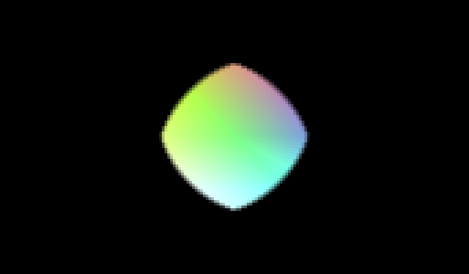
	<figcaption>Rhombous warping at small shape sizes due to use of <code>fwidth()</code></figcaption>
</figure>

The diagonals shrink more than they should, as the approximation using addition scales too much diagonally. We'll talk about professional implementations further below in a moment, but using `fwidth()` for AAA is what Unity extension "[Shapes](https://acegikmo.com/shapes/)" by [Freya Holmér](https://twitter.com/FreyaHolmer/) calls "[Fast Local Anti-Aliasing](https://acegikmo.com/shapes/docs#anti-aliasing)" with the following text:

> Fast LAA has a slight bias in the diagonal directions, making circular shapes appear ever so slightly rhombous and have a slightly sharper curvature in the orthogonal directions, especially when small. Sometimes the edges in the diagonals are slightly fuzzy as well.

This effects our fading, which will fade more on diagonals. Luckily, we fade by the amount of one pixel and thus the difference is really only visible when flicking between the methods. What to choose depends on what you care more about: Performance or Accuracy? But what if I told you can have your cake and eat it too...

##### DIY

...Calculate it yourself! For the 2D case, this is trivial and easily abstracted away. We know the size our context is rendering at and how big our quad is that we draw on. Calculating the size of the pixel is thus done per-object, not per-pixel. This is what happens in the above [circleAnalyticalComparison.js](circleAnalyticalComparison.js).

```js
/* Calculate pixel size based on height.
   Simple case: Assumes Square pixels and a square quad. */
gl.uniform1f(pixelSizeCircle, (2.0 / (canvas.height / resDiv)));
```

<blockquote class="reaction"><div class="reaction_text">No WebGL 2, no extensions, works on ancient hardware.</div></blockquote>

The results are identical to the `dFdx` + `dFdy` + `length()` case, with the benefit of fully skipping the per-pixel calculation. This does become more involved, once the quad is stretched and performance-painful when perspective is involved.

#### How do we blend?
Ok, now we have the amount we want to blend by. The next step is to perform the adjustment of opacity. If we are doing 2D, then Alpha blending is the way to go. Straight forward, will never betray you.

Another option is using MSAA + [Alpha to Coverage](https://bgolus.medium.com/anti-aliased-alpha-test-the-esoteric-alpha-to-coverage-8b177335ae4f), as is done in the MSAA demo above. There are pit falls with the latter, as discussed previously and more headaches to follow below. The reason you would need this is for depth-buffer writes for [correct blending in 3D scenes](https://bgolus.medium.com/rendering-a-sphere-on-a-quad-13c92025570c).

<blockquote class="reaction"><div class="reaction_text">For the MSAA and AAA demos above, merely an API level switch. In both cases, the shaders are 100% <a href="shader/circle-analytical.fs">identical</a>!</div></blockquote>

Still the alpha itself has to be faded based on distance. Here is where a "step" function comes in. We can input a start, an end point and the function will fade between them. [Usually](http://www.numb3r23.net/2015/08/17/using-fwidth-for-distance-based-anti-aliasing/), this is where the graphics programmer's favorite `smoothstep()` comes in and where this blog post's hot take begins:

##### Don't use [`smoothstep()`](https://en.wikipedia.org/wiki/Smoothstep)
Its use is [often associated](http://www.numb3r23.net/2015/08/17/using-fwidth-for-distance-based-anti-aliasing/) with implementing anti-aliasing in `GLSL`, but its use doesn't make sense in this context. It performs a [hermite interpolation](https://en.wikipedia.org/wiki/Smoothstep), but we 
are dealing with a function applied across 2 pixels or just inside 1. There is no curve to be witnessed here.

<blockquote class="reaction"><div class="reaction_text">To be precise, both sampling and blending witness the smoothstep curve in the sub-pixel make-up of the edge, but the difference is tiny and can be corrected using an adjusted smoothing amount.</div></blockquote>
<figure>
	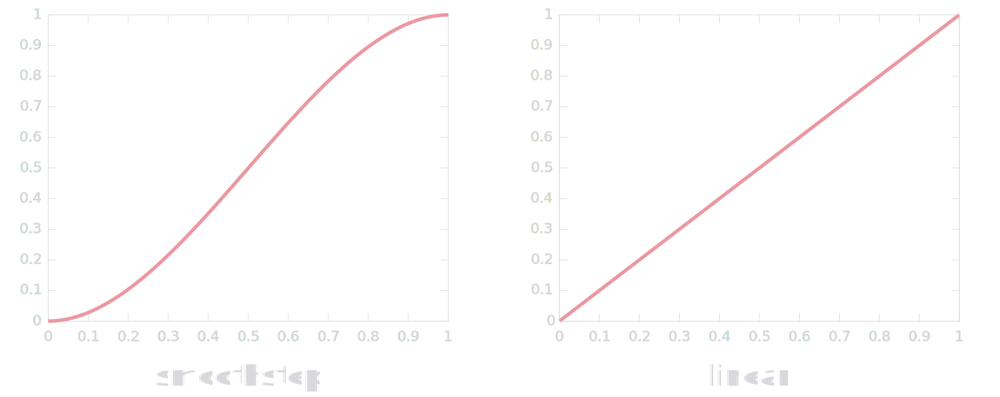
	<figcaption>Smoothstep and linear comparison</figcaption>
</figure>

Even though the slight performance difference doesn't particularly matter on modern graphics cards, wasting cycles on performing the hermite interpolation doesn't make sense to me. Let's DIY it! The implementation of [`smoothstep()`](https://en.wikipedia.org/wiki/Smoothstep) is up to the vendor, but for the `float` case it's essentially just :

```glsl
float smoothstep(float edge0, float edge1, float x) {
    float t = clamp((x - edge0) / (edge1 - edge0), 0.0, 1.0);
	return t * t * (3.0 - 2.0 * t);
}
...
float alpha = smoothstep(1.0, 1.0 - pixelSize * smoothingAmount, dist);
```

We can rip out the hermite interpolation and stick to the simple linear one. If you flick between the two in the above demo, you'll see only a slight change, with pixel sized smoothing. At pixel size, the difference can easily be counter acted with an adjustment to the smoothing factor if you like one method over the other.

```glsl
/* Step function with Linear Interpolation
   instead of the Hermite Interpolation */
float linearstep(float edge0, float edge1, float x) {
    return clamp((x - edge0) / (edge1 - edge0), 0.0, 1.0);
}
...
float alpha = linearstep(1.0, 1.0 - pixelSize * smoothingAmount, dist);
```

But why even clamp? Alpha values below 0.0 or above 1.0 will be taken care of by the rendering pipeline during the blending step and thus no clamping is required. It *is* required when having multiple shapes on one quad, something I'll go into below. But in the one shape per quad case, we can delete it.
```glsl
/* Step function with Linear Interpolation, but no clamping */
float linearstepNoclamp(float edge0, float edge1, float x) {
    return (x - edge0) / (edge1 - edge0);
}
...
float alpha = linearstepNoclamp(1.0, 1.0 - pixelSize * smoothingAmount, dist);
```

But wait a moment... When doing Anti-Aliasing we wish to affect the border of the shape, specifically distance 1.0, so most of this function cancels out! In fact, we **don't** need a step function. The blending can be performed by a simple division.

```glsl
float alpha = (1.0 - dist) / (pixelSize * smoothingAmount);
```

I have been using this simplified term in different places for years. Performance wise, the most expensive thing still remains: the per-pixel division. Modern cards should also have no issues optimizing the hermite interpolation's multiplication and addition down to a few [Fused Multiply-Add](https://en.wikipedia.org/wiki/Multiply%E2%80%93accumulate_operation#Fused_multiply%E2%80%93add) instructions. Still, I prefer the simplicity.

##### What's with the shrinking?
There is an ellusive implementation interaction with MSAA and the rasterizer. *Only* when using this with MSAA + Alpha to Coverage (regardless of sample count), there will be exactly one side of the quad with a missing 0.5 pixels, on **some** hardware. This is why there is this weird 0.5 px breathing room being added. 

<figure>
	
	<figcaption>Hard edge bug with MSAA on select hardware</figcaption>
</figure>

Our circle is drawn to the very edge of the quad, which works, but only as long the graphics card doesn't surprise us with edge cases. Specifically modern NVIDIA cards seems to eat one side of the quad too soon, though I have never seen this occur with alpha blending. To combat this, we give our SDF 0.5px of breathing room:

```glsl
/* We add half a pixel of breathing room. This is only required for the MSAA
   case. Depending on Hardware implementation, rasterization, MSAA sample
   count and placement, one row pixels may or may not disappear too soon,
   when the circle's edge is right up against the unit quad's border */
dist += pixelSizeAdjusted * 0.5;
```

<blockquote class="reaction"><div class="reaction_text">An edge case.</div></blockquote>

##### Drawing multiple?
You can draw multiple shapes in one Quad and both will be Anti-Aliased, though blending will start to get more involved. In that case both shapes will need to be evaluated per-pixel and their results will need to be clamped, weighted and summed, otherwise there won't be Anti-Aliasing when they intersect.

<figure>
	
	<figcaption>Aliasing free blending of multiple visualizations<br>From <a href="https://mirrorball.frost.kiwi">🔮 Mathematical Magic Mirrorball</a></figcaption>
</figure>

Here is what blending looks like in my WebApp [🔮 Mathematical Magic Mirrorball](https://mirrorball.frost.kiwi), a WebApp which pulls 360° panoramic projections from photos, videos and live-streams of mirror balls. There I have multiple visualizations and color overlays explaining resolution distribution of the projection. [The code](https://github.com/FrostKiwi/Mirrorball/blob/main/src/shd/crop.fs#L35) to keep all this anti-aliased is:

```glsl
float factorGreen = area_toggle * clamp((area_f - lenCircle) * pxsize_rcp, 0.0, 1.0);
float factorRed = area_toggle * clamp((lenCircle - area_b) * pxsize_rcp, 0.0, 1.0) * smoothedAlpha;
float factorBlack = mask_toggle * (1.0 - smoothedAlpha);

vec3 finalColor = baseColor * (1.0 - factorGreen - factorRed - factorBlack) +
                  greenColor * factorGreen +
                  redColor * factorRed +
                  blackColor * factorBlack;
```

All this additional stuff ... why not draw color overlays in an additional pass? The cost of drawing across that area again is an order of magnitude higher than just coloring the output in the shape we need as we go. Tinting in an Anti-Aliased fashion in one draw-call is the cleanest way to do this I think.

### 3D

Everything we talked about extends to the 3D case as well. We won't dig [into 3D shapes themselves](https://iquilezles.org/articles/distfunctions/) and will stick to a 2D rounded square in 3D perspective with a moving camera. I use this a lot when graphics programming to create a scene with a "ground floor" where my objects live on.

<div class="toggleRes">
	<div>
	  <input type="radio" id="native3D" name="res3D" value="1" checked />
	  <label for="native3D">Native<div>Resolution</div></label>
	</div>
	<div>
	  <input type="radio" id="half3D" name="res3D" value="2" />
	  <label for="half3D">½<div>Resolution</div></label>
	</div>
	<div>
	  <input type="radio" id="quarter3D" name="res3D" value="4" />
	  <label for="quarter3D">¼<div>Resolution</div></label>
	</div>
	<div>
	  <input type="radio" id="eight3D" name="res3D" value="8" />
	  <label for="eight3D">⅛<div>Resolution</div></label>
	</div>
</div>
<script src="3DAnalytical.js"></script>

<canvas width="100%" height="400px" style="max-height: 400px; aspect-ratio: 1.71" id="canvas3D"></canvas>

<div class="toggleRes" style="border-radius: 50px">
	<div>
	  <input type="radio" id="showCirclelabel3D" name="showQuad3D" value="false" checked />
	  <label for="showCirclelabel3D">Draw Rounded Square</label>
	</div>
	<div>
	  <input type="radio" id="showQuadlabel3D" name="showQuad3D" value="true" />
	  <label for="showQuadlabel3D">Show Quad</label>
	</div>
</div>
<blockquote>
<details><summary><a href="screenshots/3d.png">Screenshot</a>, in case WebGL doesn't work</summary>

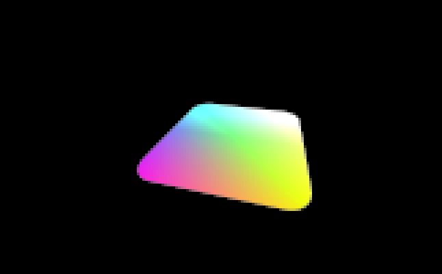

</details>
<details><summary>WebGL Vertex Shader <a href="shader/3DAnalytical.vs">3DAnalytical.vs</a></summary>

```glsl

```

</details>
<details>	
<summary>WebGL Fragment Shader <a href="shader/3DAnalytical.fs">3DAnalytical.fs</a></summary>

```glsl

```

</details>
<details>	
<summary>WebGL Javascript <a href="3DAnalytical.js">3DAnalytical.js</a></summary>

```javascript

```

</details>
</blockquote>
<script>setup3D("canvas3D", "vertex3D", "fragment3D", "fragment_SimpleColor", "vertexBlit", "fragmentBlit", "res3D", "showQuad3D");</script>

With the 3D camera and resulting perspective matrix multiplication, we use the reliable screen space derivatives again to get the pixel size. But in reality, [we can still do without](https://web.archive.org/web/20150521050627/https://www.opengl.org/wiki/Compute_eye_space_from_window_space)! This would require us to multiply of the inverse perspective matrix with the fragment coordinates _**per pixel**_. Performance-painful, yet possible.

### Unmentioned challenges
There is something I have not explained yet, a persistent misunderstanding I held until [Yakov Galka](https://stannum.io/) explained [the deetz to me on stackoverflow](https://stackoverflow.com/questions/73903568). Depending on how we setup the blending math, to perform the smoothing we may remove pixel alpha on the inside of the shape, add it to the outside or center it.

Adding or subtracting would mess with the shape every so slightly, especially at small sizes or under strong perspective. So centering is the way to go. Unfortunately, centering the fade on the border can put the edge outside our quad and lead to hard edges or clipping.

<figure>
	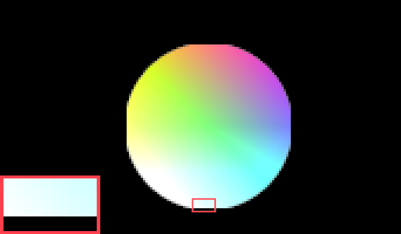
	<figcaption>Clipping of the border. (Overdone for emphasis)</figcaption>
</figure>

In 3D this is especially painful, as there is no amount of safety margin that would solve this, with the camera at oblique angles. Nvidia introduced the vendor specific extension [`NV_conservative_raster_dilate`](https://registry.khronos.org/OpenGL/extensions/NV/NV_conservative_raster_dilate.txt) to always give you an extra pixel at the border. Unfortunately it's not available in WebGL and specific to NVIDIA hardware.

<figure>
	
	<figcaption>Border pixels not rasterized due to fading overshooting the quad<br>Source: <a href="https://stackoverflow.com/questions/73903568">Explanation</a> on Stack overflow by <a href="https://stannum.io/">Yakov Galka</a></figcaption>
</figure>

So we are forced to shrink the border in all cases. This leads to smooth edges even under strong perspective, but technically influences the shape. This is absolutely *not* visible in isolation, but may lead to mismatches or unexpected behavior, as even perspective has now an influence on the shape.

<figure>
	
	<figcaption>Border pixels rasterized with shrunken border<br>Source: <a href="https://stackoverflow.com/questions/73903568">Explanation</a> on Stack overflow by <a href="https://stannum.io/">Yakov Galka</a></figcaption>
</figure>

For the 2D case, we could implement a kind of [`NV_conservative_raster_dilate`](https://registry.khronos.org/OpenGL/extensions/NV/NV_conservative_raster_dilate.txt) ourselves, by growing the quad in the vertex shader by half a pixel and shrinking the signed distance field by half a pixel in the fragment shader. And this *is* exactly what's happening in the 2D demos on this page!

<blockquote class="reaction"><div class="reaction_text">This is really pedantic and just here for correctness. In most cases, you don't need to be so precise.</div></blockquote>

That is the reason the red box always lines up with the border, at all resolution switches and with all 2D demos on this page. Specifically in the vertex shader, the line responsible for this is:

```glsl
/* Grow the Quad and thus the "canvas", that the circle is drawn on. The
   pixelSize is added for two reasons: 0.5px to get the original circle size
   again, as the AAA fading is set to fade the edge on the circle inside,
   preventing hard edges due to unrasterized pixels. And another 0.5px is
   to correct the "breathing room" added in the fragment shader,
   specifically for the MSAA sampling case, as hardware specific issues
   around MSAA sampling may or may not result in transparent pixels
   disappearing too soon. */
vertex *= size + pixelSize;
```

<blockquote class="reaction"><div class="reaction_text">Not messing up gamma and multiplied vs premultiplied alpha are important for all forms of AA, but are very context dependant. This blog post is about AAA specifically, thus we ignore these.</div></blockquote>

## What are the big boys doing?

This rendering approach has found its way into many professional products. Let's finish by looking at some of them.

### ["Shapes"](https://acegikmo.com/shapes) for Unity

Feature-wise the most complete implementation of this approach is in Unity extension [Shapes](https://acegikmo.com/shapes) by [Freya Holmér](https://twitter.com/FreyaHolmer/). There the SDFs are either anti-aliased by MSAA or are blended like in this blog post, though it's referred to as "[Fast Local Anti-Aliasing](https://acegikmo.com/shapes/docs/#anti-aliasing)" for the `fwidth()` case and "[Corrected Local Anti-Aliasing](https://acegikmo.com/shapes/docs/#anti-aliasing)" for the `length()` case.

<figure>
	<video poster="vid/shapes_thumb.jpg" width="960" height="540" controls><source src="vid/shapes.mp4" type="video/mp4"></video>
	<figcaption>Trailer for <a href="https://acegikmo.com/shapes">"Shapes"</a> by <a href="https://twitter.com/FreyaHolmer/">Freya Holmér</a></figcaption>
</figure>

With motion-blur, [shape-respecting color gradients](https://acegikmo.com/shapes/docs/#shapes-feature-table) and lines [below 1px being opacity faded](https://acegikmo.com/shapes/docs/#anti-aliasing) to prevent further aliasing, this is signed-distance field rendering and AAA by extension, implemented to its logical conclusion.

### [Valve Software](https://www.valvesoftware.com/)'s implementation

<figure>
	
	<figcaption>Hud elements in <a href="https://www.teamfortress.com/">Team Fortress 2</a></figcaption>
</figure>

Valve introduced extensive use of signed distance field rendering to the [Source engine](<https://en.wikipedia.org/wiki/Source_(game_engine)>) during the development of the [Orange Box](https://en.wikipedia.org/wiki/The_Orange_Box). Most prominently in [Team Fortress 2](https://www.teamfortress.com/), where it was used to create smooth yet sharp UI elements on the HUD. It even received its own [Developer Commentary](https://wiki.teamfortress.com/wiki/Developer_commentary) entry.

<audio controls><source src="tf2-dev-commentary.mp3" type="audio/mpeg"></audio>

> **Alden Kroll:** Two-dimensional HUD elements present a particular art problem, because they have to look good and sharp no matter what resolution the user is running their game at. Given today's availability of high resolution wide-screen displays, this can require a lot of texture memory and a lot of work anticipating different display resolutions. The problem for Team Fortress 2 was even more daunting because of our desire to include a lot of smooth curved elements in our HUD. We developed a new shader system for drawing 'line art' images. The system allows us to create images at a fixed resolution that produced smooth silhouettes even when scaled up to a very high resolution. This shader system also handles outlining and drop-shadows, and can be applied in the 3D space to world elements such as signs.

<figure>
	
	<figcaption>64x64 Texture: Alpha blended, Alpha Tested and SDF rendering<br>Paper: <a href="https://steamcdn-a.akamaihd.net/apps/valve/2007/SIGGRAPH2007_AlphaTestedMagnification.pdf">Improved Alpha-Tested Magnification for Vector Textures and Special Effect</a></figcaption>
</figure>

They also released [a paper](https://steamcdn-a.akamaihd.net/apps/valve/2007/SIGGRAPH2007_AlphaTestedMagnification.pdf) describing the specific implementation, including a showcase for use in the 3D game world, though I have never seen it used in the game world itself in Valve titles. Added as a mere footnote to the paper, was a way to improve rendering with sharp corners...

### The future of all things font?

If you save a signed distance field into a texture and sample it with linear interpolation, you will get perfectly sharp characters at any size, but the limited resolution will result in clipped or rounded corners, depending on implementation math.

Picking up on that foot note and bringing the technique to its logical conclusion was the most thorough and well composed Master Thesis I ever read: "[Shape Decomposition for Multi-channel Distance Fields](https://github.com/Chlumsky/msdfgen/files/3050967/thesis.pdf)" by [Viktor Chlumský](https://github.com/Chlumsky), which included code for the [font-file to SDF conversion](https://github.com/Chlumsky/msdfgen) and a full [font atlas generator](https://github.com/Chlumsky/msdf-atlas-gen?tab=readme-ov-file).

Basically, use RGB and a median term to get perfectly sharp text at any size, including an Alpha channel with the classical SDF for effects like glows and drop shadows, all done on the GPU with no run-time baking or intense processing. If you dig around in video games, you will find SDF based font rendering from time to time!

<figure>
	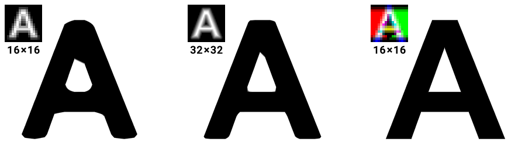
	<figcaption>Multi-Channel SDF demo from <a href="https://github.com/Chlumsky/msdf-atlas-gen?tab=readme-ov-file">msdf-atlas-gen</a></figcaption>
</figure>

From experience I can tell you, that there are more implementation headaches. Chinese, Japanese, Korean characters require bigger textures to resolve their minute details. Bigger textures means you'll often minimize during rendering, but minimizing may introduce artifacts on its own...

But considering the current state of browser font baking + rendering and the _pure insanity_ of edge-cases covered, including [synthetic fallbacks for missing italic or bold variants](https://faultlore.com/blah/text-hates-you/) and baking 4 variants with 0.25px offsets to account for minute sampling issues, I think SDF text rendering has not been given enough serious consideration.

<blockquote class="reaction"><div class="reaction_text">"<a href="https://faultlore.com/blah/text-hates-you/">Text rendering hates you</a>" is a recommended read if you want to see how crushingly complex this topic gets.</div></blockquote>

You may be wondering, if we can get the [analytical solution for a bezier curve](https://www.shadertoy.com/view/MlKcDD), why bake into textures instead? We may know the solution for **one** segment, but to get the full shape we need to sum up all the contributions from all segments. This works, but performance tanks hard, as we solve _every_ bezier curve segment **per pixel**.

<blockquote class="reaction"><div class="reaction_text">This post is already long enough, but there <b>are</b> new text rendering approaches going the analytical route, like <a href="http://sluglibrary.com/">Slug</a>.</div></blockquote>

## Clarity should not be a luxury

Modern video games often use TAA in combination with dynamic resolution scaling, a concoction guaranteed to result in blurriness. These AA algorithms come with post-process sharpening built-in to combat this, as is done in [FSR](https://gpuopen.com/fidelityfx-cas/) or [TAA](https://docs.unity3d.com/Packages/com.unity.postprocessing@3.4/manual/Anti-aliasing.html#temporal-anti-aliasing). Fixing blurring by sharpening, I find this a bit of graphics programming sin.

<figure>
	
	<figcaption>TAA Sharpening in <a href="https://www.warframe.com/">Warframe</a></figcaption>
</figure>

Whole communities rally around fixing this, like the reddit communities "[r/MotionClarity](https://www.reddit.com/r/MotionClarity/)" or the lovingly titled "[r/FuckTAA](https://www.reddit.com/r/FuckTAA)", all with the understanding, that Anti-Aliasing should not come at the cost of clarity. FXAA creator Timothy Lottes mentioned, that this is [solvable to some degree with adjustments to filtering](https://x.com/NOTimothyLottes/status/1756733156877578611), though even the most modern titles suffer from this.

What we have not talked about are the newer machine learning approaches as done for instance with NVIDIA's [**DLAA**](https://en.wikipedia.org/wiki/Deep_learning_anti-aliasing), as that is really outside the scope of this post. Suffice to say Timothy Lottes is [not a fan](https://x.com/NOTimothyLottes/status/1756746848402800785). As for AAA, it's lovely being able to draw smooth yet sharp, motion-stable shapes of any size at native resolutions.

<blockquote class="reaction"><div class="reaction_text">Please feel free to use these techniques in your projects.</div></blockquote>

## Addendum

Here are some extra comments from other graphics programmers, that came from discussions after this article was posted on [Hacker News](https://news.ycombinator.com/item?id=42191709), [Lobste.rs](https://lobste.rs/s/6e8zc3/aaa_analytical_anti_aliasing) and E-Mail.

### Google Maps
[Google Maps](http://maps.google.com/) is using this method to draw street segments, as [mentioned](https://news.ycombinator.com/item?id=42197506) by user [aappleby](https://news.ycombinator.com/user?id=aappleby) on Hacker News.

> [**aappleby**](https://news.ycombinator.com/user?id=aappleby): Google Maps uses AAA on capsule shapes for all road segments - I wrote it ~10 years ago. :D

Checking with a [WebGL debugger](https://spector.babylonjs.com/) it seems to be indeed the case. Sometimes there is no local rendering and a tile is fetched from memory or from the server, but sometimes the local drawing kicks-in an indeed, the shader code seems to indicate shape dependant blended alpha on the draw call that draws the streets.

<details>	
<summary>Google Maps Fragment Shader during streets draw call</summary>

Captured via https://spector.babylonjs.com/
It's minified, so a bit hard to read. Comments added by me.

```glsl
precision highp float;
varying vec4 s, u; /* s is color, u must be size and line width */
varying vec3 t;
const float B = 1.;
float L(float C) {
	/* Never actually called ? */
    const float D = 0.;
    const float E = 1.;
    const float F = .3;
    const float G = .3;
    const float H = 2.*D-2.*E+F+G;
    const float I = 3.*E-3.*D-2.*F-G;
    const float J = F;
    const float K = D;
    return clamp(((H*C+I)*C+J)*C+K, 0., 1.);
}
void main() {
    vec2 C = vec2(t.x-clamp(t.x, 0., 1.), t.y);
    float D, E, F, G, H, I, J;
    D = C.x*C.x+C.y*C.y; /* Capsule Shape Calculation */
    E = u.x; /* Should be the scale */
    F = u.y; /* Should be the line width */
    G = sqrt(D)*E; /* Distance to the capsule shape border */
    H = clamp(G-F+1., 0., 1.);
    I = clamp(G+F, 0., 1.);
    if(B>1.) {
        H = L(H);
        I = L(I);
    }
    J = clamp(H-I, 0., 1.); /* Smoothing, based on the distance */
    if(J == 0.)discard; /* Fragment discard when alpha fully zero */
    gl_FragColor = s; 
    gl_FragColor.a *= J;
}
```

</details>
<br>

<figure>
	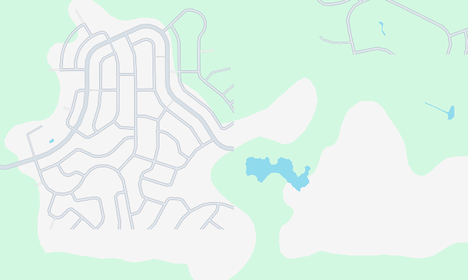
	<figcaption>Google maps rendering during streets draw call</figcaption>
</figure>

<figure>
	
	<figcaption>Google maps after rendering</figcaption>
</figure>

<blockquote class="reaction"><div class="reaction_text">That's pretty damn fire!</div></blockquote>

### Limit's of SDFs
Yakov Galka emphasized when this drawing style breaks down:

> [**Yakov Galka**](https://stannum.io/): I think it's worth mentioning that the SDF approach still samples the SDF at a particular point, which may cause aliasing if the SDF has high-frequency components. E.g. if you rasterize a circle smaller than a pixel, then the discussed approach won't fully eliminate the aliasing.
> \
> There is a truly analytical method of rasterizing antialiased polygonal and bezier shapes: [Wavelet Rasterization by J. Manson and S. Schaefer](https://people.engr.tamu.edu/schaefer/research/wavelet_rasterization.pdf).

Indeed a limit of this drawing style. I guess this is why "[Shapes](https://acegikmo.com/shapes/docs/#anti-aliasing)" by [Freya Holmér](https://twitter.com/FreyaHolmer/) limits lines to a minimum 1px size and performs alpha fading instead, a technique named [Line Thinness Fading](https://acegikmo.com/shapes/docs/#anti-aliasing) in "Shapes". And this is part of the issues around minimization I mentioned in chapter "The future of all things font?".

As for the demos on this page, you can radius adjust the circle to be below 1px in the [implementation comparison](#implementation) above. With ⅛ Resolution on a 1080p Screen and an shrunk radius, you can push the rendering below 1px and see how this code handles it. In this specific case, quite well.

### TAA
In the comments below, GitHub user [presentfactory](https://github.com/presentfactory) mentioned me going too hard on TAA. Indeed, this blog post didn't go into which problems TAA tries to solve, that other techniques cannot. In a [tweet thread](https://twitter.com/NOTimothyLottes/status/1859225171678159318), Timothy Lottes also mentioned TAA as the clear technological evolution, but also states that there *are* limits to motion clarity.

> [**Timothy Lottes**](https://twitter.com/NOTimothyLottes): Also FXAA 4 (2-frame blender) and TXAA are radically different, no MLAA in TXAA (MSAA based instead). I dropped FXAA 4, because I believed the MSAA based TAA's (like the one in The Order on PS4) had been a much better technical evolution (MLAA's cannot handle sub-pixel geometry)
> \
> So to be clear, I think it was a radical improvement for the ML-scaling-TAA's compared to where say UE4's first TAA ended up. BUT fully solving the ghosting/flicker/artifact problems in the frame-jitter TAA framework might not actually be possible ...

TAA goes ***deep*** and the way jitter resolves things other techniques can't, takes some time to grasp intuitively. [Previously](/GLSL-noise-and-radial-gradient) I introduced my favorite GLSL one-liner for dithering, which can also help TAA with resolve effects temporally. Sledgehammer games used it for shadow filtering.

<blockquote class="reaction"><div class="reaction_text">TAA is some fascinating stuff! This post was too full to appreciate it properly. Here's a recommended <a href="https://gdcvault.com/play/1023254/Temporal-Reprojection-Anti-Aliasing-in">deep-dive talk</a> by "<a href="https://en.wikipedia.org/wiki/Inside_(video_game)">Inside</a>" developer <a href="https://twitter.com/codeverses">Lasse Jon Fuglsang Pedersen</a></div></blockquote>
