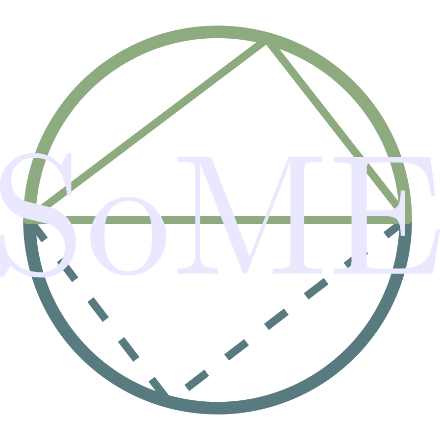
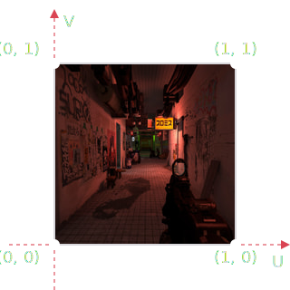
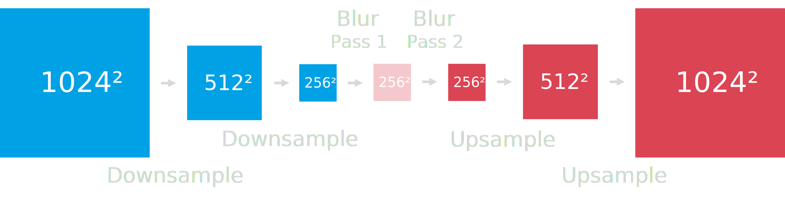
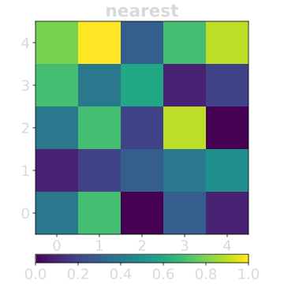
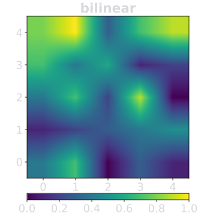



Blurs are the basic building block for many [video game post-processing effects](https://en.wikipedia.org/wiki/Video_post-processing#Uses_in_3D_rendering) and essential for sleek and modern [GUIs](https://en.wikipedia.org/wiki/Graphical_user_interface). Video game [Depth of Field](https://dev.epicgames.com/documentation/en-us/unreal-engine/depth-of-field-in-unreal-engine) and [Bloom](https://en.wikipedia.org/wiki/Bloom_(shader_effect)) or [frosted panels](https://blog.frost.kiwi/GLSL-noise-and-radial-gradient/#microsoft-windows-acrylic) in modern user interfaces - used subtly or obviously - they're everywhere. <span style="transition: filter 0.2s; filter: none" onmouseover="this.style.filter='blur(4px)'" onmouseout="this.style.filter='none'">Even your browser can do it, just tap this sentence!</span>

<figure>
	
	<figcaption>Effect of "<a href="https://en.wikipedia.org/wiki/Bloom_(shader_effect)" target="_blank">Bloom</a>", one of many use-cases for blur algorithms</figcaption>
</figure>

Conceptually, *"Make thing go blurry"* is easy, boiling down to some form of *"average colors in radius"*. Doing so in [realtime](https://en.wikipedia.org/wiki/Real-time_computing) however, took many a graphics programmer through decades upon decades of research and experimentation, across computer science and maths. In this article, we'll follow their footsteps.

<blockquote class="reaction"><div class="reaction_text">A graphics programming time travel, if you will.</div></blockquote>

Using the [GPU](https://en.wikipedia.org/wiki/Graphics_processing_unit) in the device you are reading this article on, and the [WebGL](https://developer.mozilla.org/en-US/docs/Web/API/WebGL_API) capability of your browser, we'll implement realtime blurring techniques and retrace the trade-offs graphics programmers had to make in order to marry two, sometimes opposing, worlds: **Mathematical theory** and **Technological reality**.

<blockquote class="reaction"><div class="reaction_text">This is my submission to this year's <a target="_blank" href="https://some.3b1b.co/">Summer of Math Exposition</a></div></blockquote>

With many interactive visualizations to guide us, we'll journey through a bunch of blurs, make a detour through frequency space manipulations, torture your graphics processor to measure performance, before finally arriving at an algorithm with years worth of cumulative graphics programmer sweat - The ✨ Dual Kawase Blur 🌟

## Setup - No blur yet
In the context of video game post-processing, a 3D scene is drawn, also called [rendering](https://en.wikipedia.org/wiki/Rendering_(computer_graphics)), and saved to an intermediary image - a [framebuffer](https://learnopengl.com/Advanced-OpenGL/Framebuffers). In turn, this framebuffer is processed to achieve [various effects](https://en.wikipedia.org/wiki/Video_post-processing#Uses_in_3D_rendering). Since this *processing* happens *after* a 3D scene is rendered, it's called *post-processing*. All that, _many_ times a second.

<blockquote class="reaction"><div class="reaction_text"><strong>Depending on technique</strong>, framebuffers <a target="_blank" href="https://learnopengl.com/Advanced-Lighting/Deferred-Shading">can hold non-image data</a> and post-processing effects like <a target="_blank" href="https://en.wikipedia.org/wiki/Color_correction">Color-correction</a> or <a target="_blank" href="https://en.wikipedia.org/wiki/Tone_mapping">Tone-mapping</a> don't even require intermediate framebuffers: There's <a target="_blank" href="https://takahirox.github.io/three.js/examples/webgl_tonemapping.html">more</a> than <a target="_blank" href="https://gdcvault.com/play/1020631/The-Revolution-in-Mobile-Game">one way (@35:20)</a></div></blockquote>

This is where we jump in: with a framebuffer in hand, after the 3D scene was drawn. We'll use a scene from a [mod](https://en.wikipedia.org/wiki/Video_game_modding) called [NEOTOKYO°](https://store.steampowered.com/app/244630/NEOTOKYO/). Each time we'll implement a blur, there will be a box, a [canvas](https://developer.mozilla.org/en-US/docs/Web/HTML/Reference/Elements/canvas) instructed with [WebGL 1.0](https://developer.mozilla.org/en-US/docs/Web/API/WebGL_API), rendering at [**native** resolution](https://en.wikipedia.org/wiki/1:1_pixel_mapping) of your device. Each box has controls and relevant parts of its code below.

<blockquote class="reaction"><div class="reaction_text">No coding or graphics programming knowledge required to follow along. <a target="_blank" href="https://github.com/FrostKiwi/treasurechest/tree/main/posts/dual-kawase">But also no curtains!</a> You can always see <a target="_blank" href="https://www.youtube.com/watch?v=ONH-pxBMJu4">how we talk</a> with your GPU. Terms and meanings will be explained, once it's relevant.</div></blockquote>



We don't have a blur implemented yet, not much happening. Above the box you have an `Animate` button, which will move the scene around to tease out problems of upcoming algorithms. Movement happens **before** our blur will be applied, akin to the player character moving. To see our blur in different use-cases, there are 3 modes:

<blockquote class="reaction"><div class="reaction_text">Different blur algorithms behave differently based on use-case. Some are very performance efficient, but break under movement. Some reveal their flaws with small, high contrast regions like far-away lights</div></blockquote>

- In `Scene` mode the blur will be applied across the whole image
- In `Lights` mode we see and blur just the [Emission](https://docs.blender.org/manual/en/latest/render/shader_nodes/shader/principled.html#emission) parts of the scene, sometimes called "[Self-Illumination](https://developer.valvesoftware.com/wiki/Glowing_textures_(Source)#$selfillum)"
  - This also unlocks the `lightBrightness` slider, where you can boost the energy output of the lights
- In `Bloom` mode, we use the original scene and add the blurred lights from the previous mode on top to create a moody scene. This implements the effect of [Bloom](https://en.wikipedia.org/wiki/Bloom_(shader_effect)), an important use-case for blurs in real-time 3D graphics

<blockquote class="reaction"><div class="reaction_text">Adding the blurred emission <a target="_blank" href="https://chrismillervfx.wordpress.com/2013/04/15/understanding-render-passes/">pass</a> as we do in this article, or <a target="_blank" href="https://en.wikipedia.org/wiki/Thresholding_(image_processing)">thresholding</a> the scene and blurring that, is <strong>not</strong> actually how modern video games do bloom. We'll get into that a bit later.</div></blockquote>

Finally, you see [Resolution](https://en.wikipedia.org/wiki/Image_resolution) of the canvas and [Frames per Second / time taken per frame, aka "frametime"](https://en.wikipedia.org/wiki/Frame_rate). A very important piece of the puzzle is ***performance***, which will become more and more important as the article continues and the [mother of invention](https://en.wikipedia.org/wiki/Necessity_is_the_mother_of_invention) behind our story.

<blockquote class="reaction"><div class="reaction_text">Frame-rate will be capped at your screen's <a target="_blank" href="https://www.intel.com/content/www/us/en/gaming/resources/highest-refresh-rate-gaming.html">refresh rate</a>, most likely 60 fps / 16.6 ms. We'll get into proper <a target="_blank" href="https://en.wikipedia.org/wiki/Benchmark_(computing)">benchmarking</a> as our hero descents this article into blurry madness</div></blockquote>

### Technical breakdown

<blockquote class="reaction"><div class="reaction_text">Understanding the GPU code is not necessary to follow this article, but if you do choose to <a target="_blank" href="https://github.com/FrostKiwi/treasurechest/tree/main/posts/dual-kawase">peek behind the curtain</a>, here is what you need to know</div></blockquote>

We'll implement our blurs as a [fragment shader](https://learnopengl.com/Getting-started/Hello-Triangle) written in [GLSL](https://en.wikipedia.org/wiki/OpenGL_Shading_Language). In a nut-shell, a fragment shader is code that runs on the GPU for every output-pixel, in-parallel. Image inputs in shaders are called [Textures](https://learnopengl.com/Getting-started/Textures). These textures have coordinates, often called [UV coordinates](https://en.wikipedia.org/wiki/UV_mapping) - _these_ are the numbers we care about.

<blockquote class="reaction"><div class="reaction_text">Technically, fragment shaders run per <a target="_blank" href="https://www.khronos.org/opengl/wiki/Fragment">fragment</a>, which aren't necessarily pixel sized and there are <a target="_blank" href="https://registry.khronos.org/OpenGL/extensions/EXT/EXT_shader_framebuffer_fetch.txt">other ways</a> to read framebuffers, but none of that matters in the context of this article.</div></blockquote>

<figure>
	
	<figcaption>Texture coordinates, also called "UV" Coordinates or "UVs" for short<br>Note the squished appearance of the image</figcaption>
</figure>

UV coordinates specify the position we read in the image, with bottom left being `0,0` and the top right being `1,1`. Neither UV coordinates, nor shaders themselves have any concept of image resolution, screen resolution or aspect ratio. If we want to address individual pixels, it's on us to express that in terms of UV coordinates.

<blockquote class="reaction"><div class="reaction_text">Although <a target="_blank" href="https://michaldrobot.com/2014/04/01/gcn-execution-patterns-in-full-screen-passes/">there are ways to find out</a>, we don't know which order output-pixels are processed in, and although the <a target="_blank" href="https://docs.gl/sl4/gl_FragCoord">graphics pipeline can tell us</a>, the shader doesn't even know which output-pixel it currently processes</div></blockquote>

The framebuffer is passed into the fragment shader in line `uniform sampler2D texture` as a texture. Using the blur shader, we draw a "Full Screen Quad", a rectangle covering the entire canvas, with matching `0,0` in the bottom-left and `1,1` in the top-right `varying vec2 uv` UV coordinates to read from the texture.

Due to automatic interpolation 

The texture's aspect-ratio and resolution are the same as the output canvas's aspect-ratio and resolution, thus there is a 1:1 pixel mapping between the texture we will process and our output canvas. The [graphics pipeline steps](https://github.com/FrostKiwi/treasurechest/blob/main/posts/dual-kawase/js/blur/simple.js) and [vertex shader](https://github.com/FrostKiwi/treasurechest/blob/main/posts/dual-kawase/shader/simpleQuad.vs) responsible for this are not important for this article.

The blur fragment shader accesses the color of the texture with `texture2D(texture, uv)`, at the matching output pixel's position. In following examples, we'll read from neighboring pixels, for which we'll need to calculate a UV coordinate offset, a decimal fraction corresponding to one pixel step, calculated with with `1 / canvasResolution`

<blockquote class="reaction"><div class="reaction_text">One way to think of fragment shader code is "What are the instructions to construct this output pixel?"</div></blockquote>

Graphics programming is [uniquely challenging](https://www.youtube.com/watch?v=xJQ0qXh1-m0) in the beginning, because of how many rules and limitations the hardware, [graphics APIs](https://en.wikipedia.org/wiki/Graphics_library) and the [rendering pipeline](https://fgiesen.wordpress.com/2011/07/09/a-trip-through-the-graphics-pipeline-2011-index/) impose. But it also unlocks incredible potential, as other limitations dissolve. Let's find out how graphics programmers have leveraged that potential.

## Box Blur
From a programmer's perspective, the most straight forward way is to average the neighbors of a pixel using a [for-loop](https://en.wikipedia.org/wiki/For_loop). What the fragment shader is expressing is: "_look Y pixels up & down, X pixels left & right and average the colors_". The more we want to blur, the more we have to increase `kernelSize`, the bounds of our for-loop.

```glsl
/* Read from the texture y amount of pixels above and below */
for (int y = -kernel_size; y <= kernel_size; ++y) {
/* Read from the texture x amount of pixels to the left and the right */
	for (int x = -kernel_size; x <= kernel_size; ++x) {
		/* Offset from current pixel, indicating which pixel to read */
		vec2 offset = vec2(x, y) * samplePosMult * frameSizeRCP;
		/* Read and sum up the color contribution of that pixel */
		sum += texture2D(texture, uv + offset);
	}
}
```

The bigger the for-loop, the more texture reads we perform, **per output-pixel**. Each texture read is often called a "texture tap" and the total amount of those "taps" per-frame will now also be displayed. New controls, new `samplePosMultiplier`, new terms - Play around with them, get a feel for them, with a constant eye on FPS.



Visually, the result doesn't look very pleasing. The stronger the blur, the more "boxy" features of the image become. This is due to us reading and averaging the texture in a square shape. Especially in bloom mode, with strong `lightBrightness` and big `kernelSize`, lights become literally squares.

Performance is also really bad. With bigger `kernelSizes`, our `Texture Taps` count skyrockets and performance drops. Mobile devices will come to a slog. Even the worlds fastest PC graphics cards will fall below screen refresh-rate by cranking `kernelSize` and zooming the article on PC, thus raising canvas resolution.

<blockquote class="reaction"><div class="reaction_text">We kinda failed on all fronts. It looks bad <strong>and</strong> runs bad.</div></blockquote>

Then, there's this `samplePosMultiplier`. It seems to *also* seemingly increase blur strength, *without* increasing textureTaps or lowering performance (or lowering performance just a little on certain devices). But if we crank *that* too much, we get artifacts in the form of repeating patterns. Let's play with a schematic example:

<!-- <blockquote class="reaction"><div class="reaction_text">What you may have noticed, is that increasing the sample Multiplier just a little bit, between 100% and 150% does not introduce artifacts. Something deeper is happening. Put at a pin in that...</div></blockquote> -->

- The white center square represents the output pixel
- Grey squares are the pixels we would read, with the current `kernelSize`, with `samplePosMult` untouched
- the black dots are our *actual* texture reads ***per-output-pixel***, our "sample" positions



On can say, that an image is a "continous 2D signal". When we texture tap at a specific coordinate, we are _sampling the "image signal" at that coordinate_. As previously mentioned, we use UV coordinates and are not bound by concepts like "pixels position". ***Where*** we place our samples is completely up to us.

A fundamental blur algorithm option is increasing the sample distance away from the center, thus increasing the amount of image we cover with our samples - more bang for your sample buck. This works by multiplying the offset distance. That is what `samplePosMult` does and is something you will have access to going forward.

Doing it too much, brings ugly repeating patterns. This of course leaves some fundamental questions, like where these artifacts come from and what it even means to read between two pixels. ***And*** on top of that we have to address performance and the boxyness of our blur! But first...

## What even _is_ a kernel?
What we have created with our for-loop, is a [convolution](https://www.youtube.com/watch?v=KuXjwB4LzSA0). Very simplified, in the context of image processing, it's usually a square of numbers constructing an output pixel, by gathering and weighting pixels, that the square covers. The square is called a kernel and was the thing we visualized previously.

For blurs, the kernel weights must sum up to 1. If that were not the case, we would either brighten or darken the image. Ensuring that is the normalization step. In the box blur above, this happens by dividing the summed pixel color by `totalSamples`, the total amount of samples taken. A basic "calculate the average" expression.

The same can be expressed as weights of a kernel, a number multiplied with each sample at that position. Since the box blur weighs all sample the same regardless of position, all weights are the same. This is visualized next. The bigger the kernel size, the smaller the weights.



Kernels applied at the edges of our image will read from areas "outside" the image, with UV coordinates smaller than `0,0` and bigger than `1,1`. Luckily, the GPU handles this for us and we are free to decide what happens to those outside samples, by setting the [Texture Wrapping mode](https://learnopengl.com/Getting-started/Textures#:~:text=Texture%20Wrapping).

<figure>
	
	<figcaption>Texture Wrapping Modes and results on blurring (Note the color black bleeding-in)<br><strong>Top</strong>: Framebuffer, zoomed out. <strong>Bottom</strong>: Framebuffer normal, with strong blur applied</figcaption>
</figure>

Among others, we can define a solid color to be used, or to "clamp" to the nearest edge's color. If we choose a solid color, then we will get color bleeding at the edges. Thus for almost all post-processing use-cases, edge color clamping is used, as it prevents weird things happening at the edges. [This article does too](https://github.com/FrostKiwi/treasurechest/blob/main/posts/dual-kawase/js/utility.js#L49).

<blockquote class="reaction"><div class="reaction_text">You may have noticed a black "blob" streaking with stronger blur levels along the bottom. Specifically here, it happens because the lines between the floor tiles align with the bottom edge, extending black color to infinity</div></blockquote>

Convolution as a mathematical concept is surprisingly deep and [3blue1brown](https://www.youtube.com/@3blue1brown) has an excellent video on it, that even covers the image processing topic. Theoretically, we won't depart from convolutions. We ***can*** dissect our code and express it as weights and kernels. With the for-loop box blur, that ***was*** quite easy!
<figure>
	<iframe width="100%" style="aspect-ratio: 1.78;" src="https://www.youtube-nocookie.com/embed/KuXjwB4LzSA" title="YouTube video player" frameborder="0" allow="accelerometer; autoplay; clipboard-write; encrypted-media; gyroscope; picture-in-picture; web-share" allowfullscreen loading="lazy"></iframe>
	<figcaption>But what is a convolution?<br><a target="_blank" href="https://www.youtube.com/watch?v=KuXjwB4LzSA">YouTube Video</a> by <a target="_blank" href="https://www.youtube.com/@3blue1brown">3Blue1Brown</a></figcaption>
</figure>

On a practical level though, understanding where the convolution is, how many there are and what kernels are at play will become more and more difficult, once we leave the realm of classical blurs and consider the wider implications of reading between pixel bounds. But for now, we stay with the classics:

## Gaussian Blur
The most famous of blur algorithms is the Gaussian Blur. It uses the [normal distribution](https://en.wikipedia.org/wiki/Normal_distribution), also known as the [bell Curve](https://en.wikipedia.org/wiki/Normal_distribution) to weight the samples inside the kernel, with a new variable `sigma σ` to control the flatness of the curve. Other than generating the kernel weights, the algorithm is identical to the box blur algorithm.

<figure>
	
	<figcaption>Gaussian blur weights formula for point <code>(x,y)</code> <a target="_blank" href="https://en.wikipedia.org/wiki/Gaussian_blur#Mathematics">(Source)</a></figcaption>
</figure>

To calculate the weights for point `(x,y)`, the [above formula is used](https://en.wikipedia.org/wiki/Gaussian_blur#Mathematics). The gaussian formula has a weighting multiplier `1/√(2πσ²)`. In the code, there is no such thing though. The formula expresses the gaussian curve as a _continuous_ function going to _infinity_. But our code and its for-loop are different - ***discrete*** and ***finite***.

```glsl
float gaussianWeight(float x, float y, float sigma)
{
	/* (x² + y²) / 2 σ² */
	return exp(-(x * x + y * y) / (2.0 * sigma * sigma));
}
```

<blockquote class="reaction"><div class="reaction_text">For clarity, the kernel is generated in the fragment shader. Normally, that should be avoided. Fragment shaders run per-output-pixel, but the kernel weights stay the same, making this inefficient.</div></blockquote>

Just like with the box blur, weights are summed up and divided at the end, instead of the term `1/√(2πσ²)` precalculating weights. `sigma` controls the sharpness of the curve and thus the blur strength, but wasn't that the job of `kernelSize`? Play around with all the values below and get a feel for how the various values behave.



The blur looks way smoother than our previous box blur, with things generally taking on a "rounder" appearance, due to the bell curve's smooth signal response. That is, unless you move the `sigma` slider down. If you move `sigma` too low, you will get our previous box blur like artifacts again. 

Let's clear up what the values actually represent and how they interact. The following visualization shows the kernel with its weights expressed as height in an [~~Isometric~~](https://en.wikipedia.org/wiki/Isometric_projection) [Dimetric](https://en.wikipedia.org/wiki/Axonometric_projection#Three_types) perspective projection. There are two different interaction modes with `sigma` when changing `kernelSize` and two ways to express `sigma`.



`sigma` describes the flatness of our mathematical curve, a curve going to infinity. But our algorithm has a limited `kernelSize`. Where the kernel stops, no more pixel contributions occur, leading to box-blur-like artifacts due to the cut-off. In the context of image processing, there are two ways to setup a gaussian blur...

<blockquote class="reaction"><div class="reaction_text">A small sigma, thus a flat bell curve, paired with a small kernel size effectively <strong>is</strong> a box blur, with the weights making the kernel box-shaped.</div></blockquote>

... way 1: [Absolute Sigma](https://www.youtube.com/watch?v=ueNY30Cs8Lk). `sigma` is an absolute value in pixels independent of `kernelSize`, with `kernelSize` acting as a "window into the curve" or way 2: `sigma` is expressed ***relative*** to the current `kernelSize`. For practical reasons (finicky sliders) the relative to `kernelSize` mode is used everywhere.

Eitherway, the infinite gaussian curve ***will*** have a cut-off _somewhere_. `sigma` too small? - We get box blur like artifacts. `sigma` too big? - We waste blur efficiency, as the same perceived blur strength requires bigger kernels, thus bigger for-loops with lower performance. An artistic trade-off every piece of software has to make.

<blockquote class="reaction"><div class="reaction_text">An optimal kernel would be one, where the outer weights are almost zero. Thus, if we increased <code>kernelSize</code> in Absolute Sigma mode by one, it would make close to no more <strong>visual</strong> difference.</div></blockquote>

There are other ways of creating blur kernels, with other properties. One way is to follow [Pascal's triangle](https://en.wikipedia.org/wiki/Pascal%27s_triangle) to get a set of predefined kernel sizes and weights. These are called [Binomial Filters](https://bartwronski.com/2021/10/31/practical-gaussian-filter-binomial-filter-and-small-sigma-gaussians/) and lock us into specific "kernel presets", but solve the infinity vs cut-off dilemma, by moving weights to zero within the sampling window.

Binomial Kernels are also Gaussian-like in their frequency response. We won't expand on these further, just know that we ***can*** choose kernels by different mathematical criteria, chasing different signal response characteristics. But speaking of which, what even *is* Gaussian Like? Why do we care?

### What is Gaussian-like?
In Post-Processing Blur algorithms you generally find two categories. [Bokeh](https://en.wikipedia.org/wiki/Bokeh) Blurs and Gaussian-Like Blurs. The gaussian is chosen for its natural appearance, its ability to smooth colors without "standout features". Gaussian Blurs are generally used as an ingredient in an overarching visual effect, be it frosted glass Interfaces or Bloom.

<figure>
	
	<figcaption>Bokeh Blur and Gaussian Blur compared.</figcaption>
</figure>

In contrast to that, when emulating lenses and or creating [Depth of Field](https://dev.epicgames.com/documentation/en-us/unreal-engine/depth-of-field-in-unreal-engine), is "[Bokeh Blur](https://dev.epicgames.com/documentation/en-us/unreal-engine/cinematic-depth-of-field-method?application_version=4.27)" - also known as "Lens Blur" or "Cinematic Blur". This type of blur ***is*** the target visual effect. The challenges and approaches are very much related, but algorithms used differ.

Algorithms get really creative in this space, all with different trade-offs and visuals. Some sample using a [poission disk distribution](https://mynameismjp.wordpress.com/2011/02/28/bokeh/) and some have cool out of the box thinking: Computerphile covered a comlex numbers based approach to creating Bokeh Blurs, a fascinating number theory cross-over.

<figure>
	<iframe width="100%" style="aspect-ratio: 1.78;" src="https://www.youtube-nocookie.com/embed/vNG3ZAd8wCc" title="YouTube video player" frameborder="0" allow="accelerometer; autoplay; clipboard-write; encrypted-media; gyroscope; picture-in-picture; web-share" allowfullscreen loading="lazy"></iframe>
	<figcaption>Video Game & Complex Bokeh Blurs<br><a target="_blank" href="https://www.youtube.com/watch?v=vNG3ZAd8wCc">YouTube Video</a> by <a target="_blank" href="https://www.youtube.com/@Computerphile">Computerphile</a></figcaption>
</figure>

This article though doesn't care about these stylistics approaches. We are here to chase a basic building block of graphics programming and realtime visual effects, a "Gaussian-Like" with good performance. Speaking of which!

## Performance
The main motivator of our journey here, is the chase of realtime performance. Everything we do must happen within few milliseconds. The expected performance of an algorithm and the practical cost once placed in the graphics pipeline, are sometimes surprisingly different numbers though. Gotta measure!

<blockquote class="reaction"><div class="reaction_text">This chapter is about a very <strong>technical</strong> motivation. If you don't care about how fast a GPU does what it does, feel free to skip this section.</div></blockquote>

With performance being such a driving motivator, it would be a shame if we couldn't measure it in this article. Each WebGL Box has a benchmark function, which blurs random noise at a fixed resolution of `1600x1200` with the respective blur settings you chose and a fixed iteration count workload, a feature hidden so far.

<blockquote class="reaction"><div class="reaction_text">Realtime graphics programming is sometimes more about measuring than programming.</div></blockquote>

Benchmarking is best done by measuring shader execution time. This [can be done](https://registry.khronos.org/webgl/extensions/EXT_disjoint_timer_query_webgl2/) in the browser reliably, but only on some platforms. No way exists to do so across all platforms. Luckily, there is the classic method of "stalling the graphics pipeline", forcing a wait until all commands finish, a moment in time we can measure.

<blockquote class="reaction"><div class="reaction_text">Across all platforms a stall is guaranteed to occur on command <a target="_blank" href="https://developer.mozilla.org/en-US/docs/Web/API/WebGLRenderingContext/readPixels"><code>gl.readPixels()</code></a>. Interestingly, the standards conform command for this: <a target="_blank" href="https://developer.mozilla.org/en-US/docs/Web/API/WebGLRenderingContext/finish"><code>gl.finish()</code></a> is simply ignored by mobile apple devices.</div></blockquote>

Below is a button, that unlocks this benchmarking feature, unhiding a benchmark button and `Detailed Benchmark Results` section under each blur. This allows you to start a benchmark with a preset workload, on a separate [Browser Worker](https://developer.mozilla.org/en-US/docs/Web/API/Web_Workers_API/Using_web_workers). There is only one issue: Browsers get ***very*** angry if you full-load the GPU this way.

If the graphics pipeline is doing work without reporting back (called "yielding") to the browser for too long, browsers will simply kill all GPU access for the whole page, until tab reload. If we yield back, then the measured results are useless and from inside WebGL, we can't stop the GPU, once its commands are issued.

<blockquote>⚠️ Especially on mobile: <strong>please</strong> increase <code>kernelSize</code> and iterations slowly. The previous algorithms have bad <code>kernelSize</code> performance scaling on purpose, be especially careful with them.<br><br>Stay below <strong>2</strong> seconds of execution time, or the browser will lock GPU access for the page, disabling all blur examples, until a browser restart is performed. On iOS Safari this requires a trip to the App Switcher, a page reload won't be enough.</blockquote>



<blockquote class="reaction"><div class="reaction_text">iOS and iPad OS are <strong>especially</strong> strict, will keep GPU access disabled, even on Tab Reload. You will have go to the App Switcher (Double Tap Home Button), Swipe Safari Up to close it and relaunch it from scratch.</div></blockquote>

### What are we optimizing for?
With the [above Box Blur](#box-blur) and [above Gaussian Blur](#gaussian-blur), you will measure performance scaling very badly with `kernelSize`. Expressed in the [Big O notation](https://en.wikipedia.org/wiki/Big_O_notation), it has a performance scaling of `O(pixelCount * kernelSize²)`. Quadratic scaling of required texture taps in terms of `kernelSize`. We need to tackle this going forward.

<blockquote class="reaction"><div class="reaction_text">Especially dedicated Laptop GPUs are slow to get out of their lower power states. Pressing the benchmark button multiple times in a row may result in the performance numbers getting better.</div></blockquote>

Despite the gaussian blur calculating the kernel [completely from scratch on every single pixel in our implementation](https://github.com/FrostKiwi/treasurechest/blob/main/posts/dual-kawase/shader/gaussianBlur.fs#L18), the performance of the box blur and gaussian blur are very close to each other at higher iteration counts. In fact, by precalculating the those kernels we could performance match both.

<blockquote class="reaction"><div class="reaction_text">But isn't gaussian blur a more complicated algorithm?</div></blockquote>

As opposed to chips from decades ago, modern graphics cards have very fast arithmetic, but comparatively slow memory access times. With workloads like these, the slowest thing becomes the memory access, in our case the texture taps. The more taps, the slower the algorithm.

<blockquote class="reaction"><div class="reaction_text">Our blurs perform a <strong>dependant texture read</strong>, a graphics programming sin. This is when texture coordinates are determined <strong>during</strong> shader execution, which opts out of a many automated shader optimizations.</div></blockquote>

Especially on personal computers, you may also have noticed that increasing `samplePosMultiplier` will negatively impact performance (up to a point), even though the required texture taps stay the same.

This is due hardware texture caches accelerating texture reads which are spatially close together and not being able to do so effectively, if the texture reads are all too far apart. Platform dependant tools like [Nvidia NSight](https://developer.nvidia.com/blog/identifying-shader-limiters-with-the-shader-profiler-in-nvidia-nsight-graphics/) can measure GPU cache utilization. The browser cannot.

These are key numbers graphics programmers chase when writing fragment shaders: <strong>Texture Taps</strong> and <strong>Cache Utilization</strong>. There is another one, we will get into in a moment. Clearly, our Blurs are ***slow***. Time for a speed up!

## Separable Gaussian Blur
We have not yet left the *classics* of blur algorithms. One fundamental concept left on the table is "convolution separability". Certain Convolutions like our [Box Blur](#box-blur), [our Gaussian Blur](#gaussian-blur) and the [Binominal filtering](https://bartwronski.com/2021/10/31/practical-gaussian-filter-binomial-filter-and-small-sigma-gaussians/) mentioned in passing previously can all be performed in two separate passes, by two ***separate*** 1D Kernels.

<figure>
	 
	<figcaption>Gaussian blur weights formula for, separated</a></figcaption>
</figure>

Not all convolutions are separable. In the context of graphics programming: If you can express the kernel weights as a formula with axes `X, Y` and factor-out both `X` and `Y` into two separate formulas, then you have gained separability of a 2D kernel and can perform the convolution in two passes, massively saving on texture taps.

<blockquote class="reaction"><div class="reaction_text">Some big budget video games have used effects with kernels that are <strong>not</strong> separable, but did it anyway in two passes + 1D Kernel for the performance gain, with the resulting artifacts being deemed not too bad.</div></blockquote>

Computerphile covered the concept of separability in the context of 2D image processing really well, if you are interested in a more formal explanation.

<figure>
	<iframe width="100%" style="aspect-ratio: 1.78;" src="https://www.youtube-nocookie.com/embed/SiJpkucGa1o" title="YouTube video player" frameborder="0" allow="accelerometer; autoplay; clipboard-write; encrypted-media; gyroscope; picture-in-picture; web-share" allowfullscreen loading="lazy"></iframe>
	<figcaption>Separable Filters and a Bauble<br><a target="_blank" href="https://www.youtube.com/watch?v=SiJpkucGa1o">YouTube Video</a> by <a target="_blank" href="https://www.youtube.com/@Computerphile">Computerphile</a></figcaption>
</figure>

Here is our Gaussian Blur, but expressed as a separable Version. You can see just Pass 1 and Pass 2 in isolation or see the final result. Same visual quality as our Gaussian Blur, same dials, but massively faster, with no more quadratic scaling of required texture taps.



If you benchmark the performance, you will see a massive performance uplift, as compared to our Gaussian Blur! But there *is* a trade-off made, that's not quite obvious. In order to have two passes, we are writing out a new framebuffer. Remember the "modern chips are fast but memory access in relation is not" thing?

With a modern High-res 4k screen video game, multi-pass anything implies writing out 8.2 Million Pixels to memory, just to read them back in. With smaller kernels on high-res displays, a separable kernel may not always be faster. But with bigger kernels, it almost always is. With a massive speed-up gained, how much faster can we go?

## The magic of frequency space
...how about blurs that happen so fast, that they are considered free! We are doing a bit of a detour into ***Frequency Space*** image manipulation.

Any 2D image can be converted and edited in frequency space, which unlocks a whole new sort of image manipulation. To blur an image in this paradigm, we perform an [image Fast Fourier Transform](https://usage.imagemagick.org/fourier/#introduction), then [mask high frequency areas to perform the blur](https://usage.imagemagick.org/fourier/#blurring) and finally do the inverse transformation.

A Fourier Transform decomposes a signal into its underlying Sine Frequencies. The output of an _image Fast Fourier Transform_ are "Magnitude" and "Phase" component images.  These images can be combined back together with the inverse image FFT to produce the original image again...

<figure>
	
	<figcaption>Input image for the following interactive FFT example<br>The green stripes are not an error, they are baked into the image on purpose.</figcaption>
</figure>

...but before doing so, we can manipulate the frequency representation of the image in various ways. [Less reading, more interaction!](https://www.youtube.com/watch?v=qHvdLwSZmF8) In the following interactive visualization you have the magnitude image, brightness boosted into a human visible representation on the left and the reconstructed image on the right.

For now, play around with removing energy. You can paint on the magnitude image with your fingers or with the mouse. The output image will be reconstructed accordingly. Also, play around with the circular mask and the feathering sliders. Try to build intuition for what's happening.



The magnitude image represents the frequency make-up of the image, with the lowest frequencies in the middle and higher at the edges. Horizontal frequencies (vertical features in the image) follow the X Axis and vertical frequencies (Horizontal features in the image) follow the Y Axis, with in-betweens being the diagonals.

Repeating patterns in the image lighten up as bright-points in the magnitude representation. Or rather, their frequencies have high energy: E.g. the green grid I added. Removing it in photoshop wouldn't be easy! But in frequency space it ***is*** easy! Just paint over the blueish 3 diagonal streaks.

<blockquote class="reaction"><div class="reaction_text">Removing repeating features by finger-painting black over frequencies still blows me away.</div></blockquote>

As you may have noticed, the Magnitude representation holds mirrored information. This is due to the FFT being a complex number analysis and our image having only "real" component pixels, leaving redundant information. The underlying number theory was covered in great detail by 3Blue1Brown:

<figure>
	<iframe width="100%" style="aspect-ratio: 1.78;" src="https://www.youtube-nocookie.com/embed/spUNpyF58BY" title="YouTube video player" frameborder="0" allow="accelerometer; autoplay; clipboard-write; encrypted-media; gyroscope; picture-in-picture; web-share" allowfullscreen loading="lazy"></iframe>
	<figcaption>But what is the Fourier Transform? A visual introduction.<br><a target="_blank" href="https://www.youtube.com/watch?v=spUNpyF58BY">YouTube Video</a> by <a target="_blank" href="https://www.youtube.com/@3blue1brown">3Blue1Brown</a></figcaption>
</figure>

The underlying code this time is not written by me, but is from [@turbomaze](https://github.com/turbomaze/)'s repo [JS-Fourier-Image-Analysis](https://github.com/turbomaze/JS-Fourier-Image-Analysis). There is no standard on how you are supposed to plot the magnitude information and how the quadrants are layed out. I changed the implementation by [@turbomaze](https://github.com/turbomaze/) to follow the [convention used by ImageMagick](https://usage.imagemagick.org/fourier/#introduction).

We can blur the image by painting the frequency energy black in a radius around the center, thus eliminating higher frequencies and blurring the image. If we do so with a pixel perfect circle, then we get ringing artifacts - The [Gibbs phenomenon](https://en.wikipedia.org/wiki/Gibbs_phenomenon). By feathering the circle, we lessen this ringing and the blur cleans up.

<blockquote class="reaction"><div class="reaction_text">Drawing a circle like this? That's essentially free on the GPU! We get the equivalent of get super big kernels for free!</div></blockquote>

But not everything is gold that glitters. First of all, performance. Yes, the "blur" in frequency space is essentially free, but the trip to frequency space, is everything but. The main issue comes down to [FFT transformations](https://en.wikipedia.org/wiki/Butterfly_diagram) performing writes to exponentially many pixels per input pixel, a performance killer.

<blockquote class="reaction"><div class="reaction_text"><strong>And</strong> then there's still the inverse conversion!</div></blockquote>

But our shaders work the other way around, expressing the "instructions to construct an output pixel". There *are* [fragment shader based GPU implementations](https://github.com/rreusser/glsl-fft), but they rely on many passes for calculation, a lot of memory access back and forth. Furthermore, non-power of two images [require a slower algorithm](https://rocm.docs.amd.com/projects/rocFFT/en/latest/design/bluestein.html).

This article is in the realm of fragment shaders and the graphics pipeline a GPU is part of, but there are also [GPGPU](https://en.wikipedia.org/wiki/General-purpose_computing_on_graphics_processing_units) and [compute shader implementations](https://github.com/bane9/OpenGLFFT) with no fragment shader specific limitations. Unfortunately the situation remains: Conversion of high-res images to frequency space is too costly in the context of realtime graphics.

<blockquote class="reaction"><div class="reaction_text">Deleting the frequencies of that grid is magical, but leaves artifacts. In reality it's worse, as my example is idealized. Click <strong>Upload Image</strong>, take a photo of a repeating pattern and see how cleanly you can get rid of it.</div></blockquote>

Then there are the artifacts I have glossed over. The FFT transformation considers the image as an infinite 2D signal. By blurring, we are bleeding through color from the neighbor copies. And that's not to mention various ringing artifacts that happen. ***None*** of this is unsolvable! But there a more underlying issue...

### What is a Low-Pass filter?

<blockquote class="reaction"><div class="reaction_text">It's a filter that removes high frequencies and leaves the low ones, easy!</div></blockquote>

Try the FFT Example again and decrease the `frequencyCutRadius` to blur. At some point the green lines disappear, right? It ***is*** a low pass filter, one where high frequencies are literally annihilated. Small bright lights in the distance? Also annihilated...



If we were to use this to build an effect like bloom, it would remove small lights that are meant to bloom as well! Our gaussian blur on the other hand, [also a low-pass filter](https://en.wikipedia.org/wiki/Gaussian_blur#Low-pass_filter), samples and weights ***every*** pixel. In a way it "_takes the high frequency energy and spreads it into low frequency energy_".

So Low Pass Filter ≠ Low Pass Filter, it depends on context as to what is meant by that word and the reason the article didn't use it until now. Frequency Space energy attenuations are simply not the correct tool for our goal of a "basic graphics programming building block" for visual effects.

<blockquote class="reaction"><div class="reaction_text">This is a <strong>deep misunderstanding</strong> I held for year, as in why <strong>didn't</strong> video games such a powerful tool?<output></output></div></blockquote>

There are other frequency space image representations, not just FFT Magnitude + Phase. Another famous one is [Discrete cosine transform](https://en.wikipedia.org/wiki/Discrete_cosine_transform). Again, computerphile covered it in great detail in a video. As for realtime hires images, no. DCT conversion is multiple magnitudes slower. Feel free to dive deeper into frequency space...

<figure>
	<iframe width="100%" style="aspect-ratio: 1.78;" src="https://www.youtube-nocookie.com/embed/Q2aEzeMDHMA" title="YouTube video player" frameborder="0" allow="accelerometer; autoplay; clipboard-write; encrypted-media; gyroscope; picture-in-picture; web-share" allowfullscreen loading="lazy"></iframe>
	<figcaption>JPEG DCT, Discrete Cosine Transform (JPEG Pt2)<br><a target="_blank" href="https://www.youtube.com/watch?v=Q2aEzeMDHMA">YouTube Video</a> by <a target="_blank" href="https://www.youtube.com/@Computerphile">Computerphile</a></figcaption>
</figure>

...as for this article, it's the end of our frequency space detour. We talked so much about what's slow on the GPU. Let's talk about something that's not just fast, but free:

## Bilinear Interpolation
Reading from textures comes with a freebie. When reading between pixels, the closet four pixel are interpolated [bilinearly](https://en.wikipedia.org/wiki/Bilinear_interpolation) to create the final read, unless you switch to [Nearest Neightbor mode](https://learnopengl.com/Getting-started/Textures#:~:text=Texture%20Filtering). Below you can drag the color sample with finger touch or the mouse. Take note of how and when the color changes in the respective modes.



Since reading between pixels gets a linear mix of pixel neighbors, we can [linearly interpolate part of our gaussian kernel](https://www.rastergrid.com/blog/2010/09/efficient-gaussian-blur-with-linear-sampling/), sometimes called a [Linear Gaussian](https://www.rastergrid.com/blog/2010/09/efficient-gaussian-blur-with-linear-sampling/). By tweaking gaussian weights and reducing the amount of samples we could do a 7 × 7 gaussian kernel worth of information with only a 4 × 4 kernel, as shown in the [linked article](https://www.rastergrid.com/blog/2010/09/efficient-gaussian-blur-with-linear-sampling/).

<blockquote class="reaction"><div class="reaction_text">Though mathematically not the same, visually the result is very close. There are a lot of hand-crafted variations on this, different mixes of kernel sizes and interpolation amounts.</div></blockquote>

Bilinear interpolation allows us to resize an image by reading from it at lower resolution. In a way, it's a free bilinear resize built into every graphics chip, zero performance impact. But there *is* a limit - the bilinear interpolation is limited to a 2 × 2 sample square. Try to resize the kiwi below in different modes.

<blockquote class="reaction"><div class="reaction_text">To make this more obvious, the following canvas renders at 25% of <a href="https://en.wikipedia.org/wiki/1:1_pixel_mapping" target="_blank">native resolution</a>.</div></blockquote>



Nearest Neightbor looks pixelated, if the size is not at 100% size, which is equivalent to 1:1 pixel mapping. At 100% it moves "jittery", as it "snaps" to the nearest neighbor. Bilinear keeps things smooth, but going below 50%, especially below 25%, we get exactly the same kind of aliasing, as we would get from nearest neighbor!

<blockquote class="reaction"><div class="reaction_text">You may have noticed similar aliasing when playing YouTube Videos at a very high manually selected video resolution, but in a small window. Same thing!</div></blockquote>

With 2 × 2 samples, we start skipping over color information, if the underlying pixels are smaller than half a pixel in size. Below 50% size, our bilinear interpolation starts to act like nearest neighbor interpolation. So as a result, we can shrink image in steps of 50%, without "skipping over information" and creating aliasing. Let's use that!

## Downsampling
One fundamental thing thing you can do in post-processing is to shrink "downsample" first, perform the processing at a lower resolution and upsample again. With the idea being, that you wouldn't notice the lowered resolution. Below is the [Separable Gaussian Blur](#separable-gaussian-blur) again, with a variable downsample / upsample chain.

Each increase of `downSample` adds a 50% scale step. Let's visualize the framebuffers in play, as it gets quite complex. Here is an example of a square 1024 px² image, a `downSample` of `2` and our two pass separable Gaussian blur.

<figure>
	
	<figcaption>Framebuffers and their sizes, as used during the downsample + blur chain</figcaption>
</figure>

<blockquote class="reaction"><div class="reaction_text">One unused optimization is that the blur can read straight from the 512 px² framebuffer and output the 256 px² directly, skipping one downsample step.</div></blockquote>

Below you have the option to skip part of the downsample or part of the upsample chain, if you have `downSample` set to higher than 1. What may not be quite obvious is why we also upsample in steps. Play around with all the dials and modes, to get a feel for what's happening.



With each downsample step, our kernel covers more and more area, thus increasing the blur radius. Performance is again, a massive lift up, as we quadratically get less and less pixels to blur with each step. We get bigger blurs with the same `kernelSize` and with stronger blurs in `Scene` mode, the resolution drop is not visible.

With smaller blurs you will get "shimmering", as aliasing artifacts begin, even with our bilinear filtering in place. Small blurs and lower resolution don't mix. This is ***especially*** painful in bloom mode with strong `lightBrightness`, as lights will start to "turn on and off" as they are not resolved correctly at lower resolutions.

<blockquote class="reaction"><div class="reaction_text">There must be some kind of sweet spot of low resolution and blur strong enough to hide the the low resolution.</div></blockquote>

Skipping Downsample steps will bring obviously horrible aliasing. As for upsampling, there is a deep misunderstanding I held for years, until I read the SIGGRAPH 2014 presentation [Next Generation Post Processing in Call of Duty: Advanced Warfare](https://www.iryoku.com/next-generation-post-processing-in-call-of-duty-advanced-warfare/) by graphics magician [Jorge Jimenez](https://www.iryoku.com/). One page stuck out to me:

<figure>
	
	<figcaption>Page 159 from presentation <a href="https://www.iryoku.com/next-generation-post-processing-in-call-of-duty-advanced-warfare/" target="_blank">Next Generation Post Processing in Call of Duty: Advanced Warfare</a> by <a href="https://www.iryoku.com/" target="_blank">Jorge Jimenez</a></figcaption>
</figure>

With upsampling, even when going from low res to high res in one jump, we aren't "skipping" any information, right? Nothing is missed. But if you look closely at the above demo with larger `downSample` chains with `Skip Upsample Steps` mode, then you will see a vague grid like artifact appearing, especially with strong blurs.

<figure>
<div style="display: flex; flex-wrap: wrap;">
	
	
</div>
	<figcaption>Visualization of the bilinear interpolation (<a href="https://en.wikipedia.org/wiki/Bicubic_interpolation" target="_blank">Source</a>)</figcaption>
</figure>

How to keeps things smooth when upsampling is the field of "Reconstruction filters". By skipping intermediate upsampling steps we are performing a 2 × 2 sample bilinear reconstruction of very small pixels. As a result we get the bilinear filtering characteristic pyramid shaped hot spots. ***How*** we upscale matters.

### Smooth Blur Animation
One fundamental challenge with advanced blur algorithms is that it becomes challenging to get smooth blur sliders and smooth blur strength animations. Eg. with our separable gaussian blur, you could set `kernelSize` to the maximum required and adjust `samplePosMultiplier` smoothly between 0% and 100%.

With downsampling in the picture, this becomes more difficult and solutions to this are very context dependant, so we won't dive into it. One approach you see from time to time is to simply give up on animating blur strength and blend between a blurred and unblurred version of the scene, as shown below. Visually, not very pleasing.



## Kawase Blur
Now we get away from the classical blur approaches. It's the early 2000s and graphics programmer Masaki Kawase, today senior graphics programmer at Tokyo based company [Silicon Studio](https://www.siliconstudio.co.jp/), is programming the Xbox video game [DOUBLE-S.T.E.A.L](https://www.youtube.com/watch?v=JjR9VugWoHY), a game with vibrant post-processing effects.

During the creation of those visual effects, Masaki Kawase used a new blurring technique that he presented in the 2003 Game Developers Conference talk [Frame Buffer Postprocessing Effects in DOUBLE-S.T.E.A.L (Wreckless)](https://gdcvault.com/browse?keyword=Frame+Buffer+Postprocessing+Effects). This technique became later referred to as the "Kawase Blur". Let's take a look at it:

<figure>
	<div style="width: 100%; display: flex; flex-wrap: wrap; justify-content: space-between; gap: 12px">
		
		
	</div>
	<figcaption>Sample placement in what later become known as the "Kawase Blur"<br>Excerpt from GDC presentation <a href="https://web.archive.org/web/20060909063116/http://www.daionet.gr.jp/~masa/archives/GDC2003_DSTEAL.ppt" target="_blank">Frame Buffer Postprocessing Effects in DOUBLE-S.T.E.A.L</a> (2003)</figcaption>
</figure>

This technique does not have a `kernelSize` parameter anymore. It works in passes of 4 equally weighted samples, placed diagonally from the center output pixel, in the middle where the corners of 4 pixels touch. These samples get color contributions equally from their neighbors, due to bilinear filtering.

<blockquote class="reaction"><div class="reaction_text">This is new, there is no center pixel sample and, except for the required normalization, no explicit weights! The weighting happens as a result of bilinear filtering.</div></blockquote>

After a pass is complete, that pass is used as the input to the next pass, where the outer 4 diagonal samples increase in distance by one pixel length. With each pass, this distance grows. Two framebuffers are required for this, which switch between being input and output between passes. This setup is often called "ping-ponging".



Akin to the [Central Limit Theorem](https://en.wikipedia.org/wiki/Central_limit_theorem) making repeated passes of a box-blur approach a gaussian blur, our Kawase blur provides a smooth gaussian-like results, due to the iterative convolution at play. Technically, there are two convolutions happening at the same time - bilinear filtering and the diagonal samples with increasing distance.

<blockquote class="reaction"><div class="reaction_text">Two different origins: The Gaussian blur came from a mathematical concept entering graphics programming. The Kawase blur was born to get the most out of what hardware provides for free.</div></blockquote>

It is not a separable convolution, due to its diagonal sampling nature. As no downsampling is used, this means that we write all pixels out to memory, each pass. Even if we could separate, the cost of writing out twice as many passes to memory would outweigh the benefit of going from 4 samples per-pass to 2.

<blockquote class="reaction"><div class="reaction_text">With so few samples, you cannot increase <code>samplePosMultiplier</code> without instantly getting artifacts. We mess up the sample pattern.</div></blockquote>

Take note of textures taps: They grow linearly, with increasing blur radius. In DOUBLE-S.T.E.A.L, Masaki Kawase used it to create the bloom effect, calculated at a lower resolution. But there is one more evolution coming up - We have blur, we have downsampling. Two separate concepts. What if we "fused" them?

## Dual Kawase Blur
[Marius Bjørge](https://theorg.com/org/arm/org-chart/marius-bjorge), principal graphics architect at [ARM](https://www.arm.com/) took this thought to its logical conclusion, when he was optimizing mobile graphics rendering with ARM graphics chips. In a SIGGRAPH 2015 [talk](https://dl.acm.org/doi/10.1145/2776880.2787664) he presented an algorithm, that would later become knows as the ✨ Dual Kawase Blur 🌟, this article's final destination.

<figure>
	
	<figcaption>Dual Kawase sampling patterns<br>Excerpt from <a href="https://www.iryoku.com/next-generation-post-processing-in-call-of-duty-advanced-warfare/" target="_blank">Bandwidth-Efficient Rendering</a>, talk by <a href="https://theorg.com/org/arm/org-chart/marius-bjorge" target="_blank">Marius Bjørge</a></figcaption>
</figure>

This blur works with the idea of Masaki Kawase's "placing diagonal samples at increasing distance", but does so in conjunction with downsampling, which effectively performs this "increase in distance". There is also a dedicated upsample filter. I'll let Marius Bjørge explain this one, an excerpt [from his talk mentioned above](https://dl.acm.org/doi/suppl/10.1145/2776880.2787664/suppl_file/a184.mp4)

<audio controls><source src="audio/dualKawaseTalk.mp3" type="audio/mpeg"></audio>

<blockquote><strong>Marius Bjørge</strong>: For lack for a better name, dual filter is something I come up with when playing with different downsampling and upsampling patterns. It's sort of a derivative of the Kawase filter, but instead of ping-ponging between two equally sized textures, this filter works by having the same filter for down sampling and having another filter for upsampling.<br><br>The downsample filter works by sampling four pixels covering the target pixel, and you also have four pixels on the corner of this pixel to smudge in some information from all the neighboring pixels. So the end upsample filter works by reconstructing information from the downsample pass. So this pattern was chosen to get a nice smooth circular shape.</blockquote>

Let's try it. This time, there are two blur shaders, as there is an upsample and downsample stage. Again, there is no `kernelSize`. Instead there are `downsampleLevels`, which performs the blur in conjunction with the down sampling. Play around with all the slider and get a feel for it.



It's also a gaussian-like blur. Remember our first gaussian Blur? Its performance tanked exponentially, as we increased kernel radius. But now, with each downsample step, the required texture taps grow slower and slower. The stronger our blur, the less _additional_ samples we require!

This was of special interest to Marius Bjørge, as his goal was to reduce memory access, which is especially slow on mobile devices, and still produce a motion-stable non shimmering blur. Speaking of which, go into bloom mode, crank `lightBrightness` and compare it to our [downsample](#downsampling) example.

Even though the resolution is reduced to the same `downSample` level, no shimmering! That's the Dual Kawase Blur for you - A gaussian-like post-processing blur, with good performance, no heavy repeated memory writes and motion stable output. This makes it ideal as a basic building block for visual effects like bloom.

## What are the big boys doing?
The Dual Kawase Blur has found its way into game engines and user interfaces alike. For instance the Linux Desktop Environment [KDE](https://kde.org/) uses it as the frosted backdrop effect [since in 2018](https://web.archive.org/web/20220427124712/https://phabricator.kde.org/D9848), where it remains the [algorithm of choice to this day](https://invent.kde.org/plasma/kwin/-/tree/master/src/plugins/blur). I used KDE's implementation as a guide when creating my demo above.

<figure>
	
	<figcaption>KDE Plasma's Blur with noise at max strength (<a target="_blank" href="https://web.archive.org/web/20220427124712/https://phabricator.kde.org/D9848">Source</a>)</figcaption>
</figure>

Of course, graphics programming didn't stop in 2015 and there have been new developments. The previously mentioned talk [Next Generation Post Processing in Call of Duty: Advanced Warfare](https://www.iryoku.com/next-generation-post-processing-in-call-of-duty-advanced-warfare/) by [Jorge Jimenez](https://www.iryoku.com/) showcased an evolution on the "downsample while blurring" idea to handle far-away and very bright lights at high blur strengths better.

<figure>
	<video poster="img/jimenezBlurThumb.jpg" playsinline muted controls><source src="img/jimenezBlur.mp4" type="video/mp4"></video>
	<figcaption>Uneven interpolation of bright, small light sources (Left), Page 156 from presentation<br><a href="https://www.iryoku.com/next-generation-post-processing-in-call-of-duty-advanced-warfare/" target="_blank">Next Generation Post Processing in Call of Duty: Advanced Warfare</a> by <a href="https://www.iryoku.com/" target="_blank">Jorge Jimenez</a></figcaption>
</figure>

In turn, this technique got picked up two years later by graphics programmer [Mikkel Gjoel](https://x.com/pixelmager), when working on the video game [INSIDE](https://en.wikipedia.org/wiki/Inside_(video_game)) by Studio [Playdead](https://playdead.com/). In the GDC 2016 talk [Low Complexity, High Fidelity - INSIDE Rendering](https://gdcvault.com/play/1023304/Low-Complexity-High-Fidelity-INSIDE) he showcased a further optimization, reducing the number of texture reads required.

<figure>
	<video poster="img/gdcInsideThumb.jpg" playsinline controls><source src="img/gdcInside.mp4" type="video/mp4"></video>
	<figcaption>Blur algorithm used for Bloom in video game Inside<br>Excerpt from talk <a href="https://gdcvault.com/play/1023304/Low-Complexity-High-Fidelity-INSIDE" target="_blank">Low Complexity, High Fidelity - INSIDE Rendering</a> by Mikkel Gjoel & Mikkel Svendsen</figcaption>
</figure>

I showcased the bloom use-case a lot. The technique used in my demos is rather primitive, akin to the time of video game [bloom disasters](https://gangles.ca/2008/07/18/bloom-disasters/), where some many games had radioactive levels of bloom, showing off a then novel technique. In this older style an extra lights pass or the scene after [thresholding](https://en.wikipedia.org/wiki/Thresholding_(image_processing)), was blurred and added on top.

<figure>
	
	<figcaption>Bloom in Video game <a href="https://en.wikipedia.org/wiki/The_Elder_Scrolls_IV:_Oblivion" target="_blank">The Elder Scrolls IV: Oblivion</a>, from article by <a href="https://gangles.ca/2008/07/18/bloom-disasters/" target="_blank">Bloom Disasters</a></figcaption>
</figure>

These days 3D engines follow a [Physically based shading](https://learnopengl.com/PBR/Theory) model, with HDR framebuffers capturing pixels in an [energy conserving](https://learnopengl.com/Getting-started/Textures#:~:text=Energy%20conservation) manner. Specular light reflections preserve the super bright pixels from the lamp they originated from.

With such a wide range of energy values, light that should bloom doesn't need special selection anymore. Instead of defining what to blur, everything is blurred and the bright parts naturally start glowing, without predefined "parts to blur".

<figure>
	
	<figcaption>Multiple blurs stacked to create a natural light fall-off<br> Page 144 in <a href="https://www.iryoku.com/next-generation-post-processing-in-call-of-duty-advanced-warfare/" target="_blank">Next Generation Post Processing in Call of Duty: Advanced Warfare</a> by <a href="https://www.iryoku.com/" target="_blank">Jorge Jimenez</a></figcaption>
</figure>

The result isn't just blurred once, but rather multiple blur strengths are stacked on top of each other, for a more natural light fall-off, as shown in the previously mentioned talk by Jorge Jimenez. This isn't an article about bloom, but the underlying building block. The Blur.

This was a journey through blurs and I hope you enjoyed the ride! If you are a new visitor from the <a target="_blank" href="https://some.3b1b.co/">Summer of Math Exposition</a> and enjoyed this article, you'll enjoy my other graphics programming deep-dives on this blog. Also during SoME 3, my submission was a WebApp + Video Adventure into Mirrorballs:

<figure>
	<iframe width="100%" style="aspect-ratio: 1.78;" src="https://www.youtube-nocookie.com/embed/rJPKTCdk-WI" title="YouTube video player" frameborder="0" allow="accelerometer; autoplay; clipboard-write; encrypted-media; gyroscope; picture-in-picture; web-share" allowfullscreen loading="lazy"></iframe>
	<figcaption>Mathematical Magic Mirrorball #SoME3<br><a target="_blank" href="https://www.youtube.com/watch?v=rJPKTCdk-WI">YouTube Video</a> by <a target="_blank" href="https://www.youtube.com/@FrostKiwi">FrostKiwi</a></figcaption>
</figure>