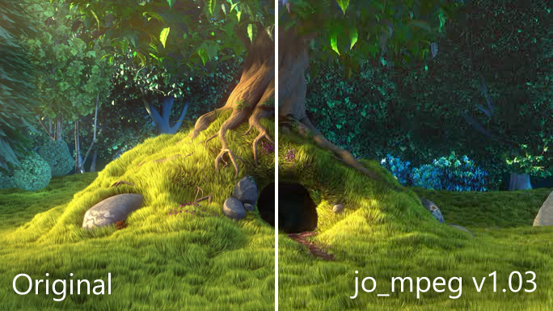

jo_mpeg is a C++ [single header library](https://github.com/nothings/single_file_libs) written by [Jon Olick](https://www.jonolick.com/home/mpeg-video-writer), which creates [MPEG-1](https://en.wikipedia.org/wiki/MPEG-1) videos (without audio). It is [listed as a C++ only library](https://github.com/nothings/single_file_libs#video) in stb's single header library collection. However, only the & reference format is what makes this library C++ only. Replacing those with simple pointers makes this compile with both C and C++. I'm also a big fan of [stb-type of library code](https://github.com/nothings/stb?tab=readme-ov-file#why-single-file-headers), so I converted the library to C.

<details>
<summary>Full source of the C compatible <a target="_blank" href="jo_mpeg.h">jo_mpeg.h</a></summary>

```c

```
</details>

## Results
I encoded a couple of seconds from [Big Buck Bunny](https://peach.blender.org/) as a sample: [sample.mpeg](sample.mpeg)
Thanks to [jsmpeg](https://jsmpeg.com/) we can see the output directly in the browser, after [muxing it into an MPEG-TS](https://github.com/phoboslab/jsmpeg/issues/432) container.

<script src="jsmpeg.min.js"></script>
<div class="jsmpeg" data-url="sample.ts"></div>

Quality is hardcoded and results in roughly `8mbps` at a resolution of `684x385`. The encoder performs only [intra-frame compression](https://en.wikipedia.org/wiki/Intra-frame_coding), no [inter-frame compression](https://en.wikipedia.org/wiki/Inter_frame), so in its current state it's more of a image encoder than a video encoder, as it just appends [I-frames](https://en.wikipedia.org/wiki/MPEG-1#I-frames). Quality measurements are at roughly `27db` [PSNR](https://en.wikipedia.org/wiki/Peak_signal-to-noise_ratio#Quality_estimation_with_PSNR) and `0.9` [SSIM](https://medium.com/srm-mic/all-about-structural-similarity-index-ssim-theory-code-in-pytorch-6551b455541e). These values showcase the advanced age of MPEG-1...

<figure>
	<video width="684" height="342" controls><source src="not-terrible.mp4" type="video/mp4"></video>
	<figcaption>...Or in other words</figcaption>
</figure>


## Code changes
<figure>
	
	<figcaption>Input frame vs Output frame. Side effect of conversion: Increased saturation and contrast.</figcaption>
</figure>

Unfortunately, the output has increased saturation and contrast. This is due to RGB -> [YCbCr](https://en.wikipedia.org/wiki/YCbCr#RGB_conversion) conversion in line `230` - `232` scaling the final color vectors scaled too much. I [fixed this by reverting](https://github.com/FrostKiwi/treasurechest/commit/d312b20f37e91fe818692c75a0a7cbba91601114#diff-06f83bdf1cb85a74bec97a3f11b76e759a46aa77d29454544206af7cd7efd3c8L230) the color space math changes that happened with the update to `v1.02`.

<figure>
	
	<figcaption>Input frame vs Output frame. Reverted to old color math.</figcaption>
</figure>

I'm not sure why the code change credited to `r- lyeh` happened, but I guess the used video player handled color space incorrectly. Both [VLC](https://www.videolan.org/) and [MPV](https://mpv.io/) playback the colors correctly with `v1.03`.

## Addendum
As [clarified](https://github.com/FrostKiwi/treasurechest/issues/5#issuecomment-2602237649) by [@r-lyeh](https://github.com/r-lyeh) in the [comments](#comments), the color space fix was regarding the YUV math. I reinserted the fix, as it was always meant to be and bumped the version to `v1.04`. Here is a sample with the correct color math, shown scene from [NeoTokyo°](https://store.steampowered.com/app/244630/NEOTOKYO/).

<video poster="v104Thumb.png" width="684" height="512" controls mute autoplay loop><source src="compareV104.mp4" type="video/mp4"></video>

The conversion to [YCbCr](https://en.wikipedia.org/wiki/YCbCr) was this in `v1.02`, scaling the color vectors too much.
```c
  Y[i] = ( 0.299f*r + 0.587f*g + 0.114f*b) * (219.f/255) + 16;
CBx[i] = (-0.299f*r - 0.587f*g + 0.886f*b) * (224.f/255) + 128;
CRx[i] = ( 0.701f*r - 0.587f*g - 0.114f*b) * (224.f/255) + 128;
```
Here is the same but in `v1.03`, correct scale but mixed up color components.
```c
  Y[i] = ( 0.59f*r + 0.30f*g + 0.11f*b) * (219.f/255) + 16;
CBx[i] = (-0.17f*r - 0.33f*g + 0.50f*b) * (224.f/255) + 128;
CRx[i] = ( 0.50f*r - 0.42f*g - 0.08f*b) * (224.f/255) + 128;
```
And finally the new fix, as pointed out by [@r-lyeh](https://github.com/r-lyeh) in `v1.04`.
```c
  Y[i] = ( 0.59f*g + 0.30f*r + 0.11f*b) * (219.f/255) + 16;
CBx[i] = (-0.17f*r - 0.33f*g + 0.50f*b) * (224.f/255) + 128;
CRx[i] = ( 0.50f*r - 0.42f*g - 0.08f*b) * (224.f/255) + 128;
```