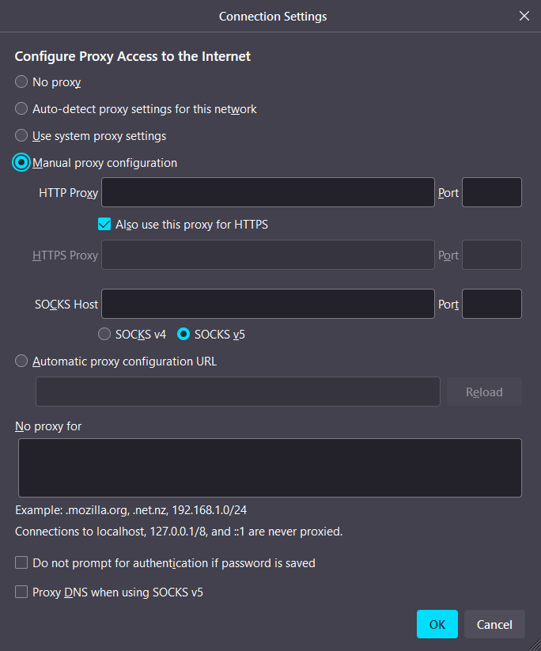
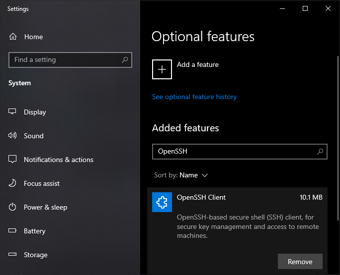
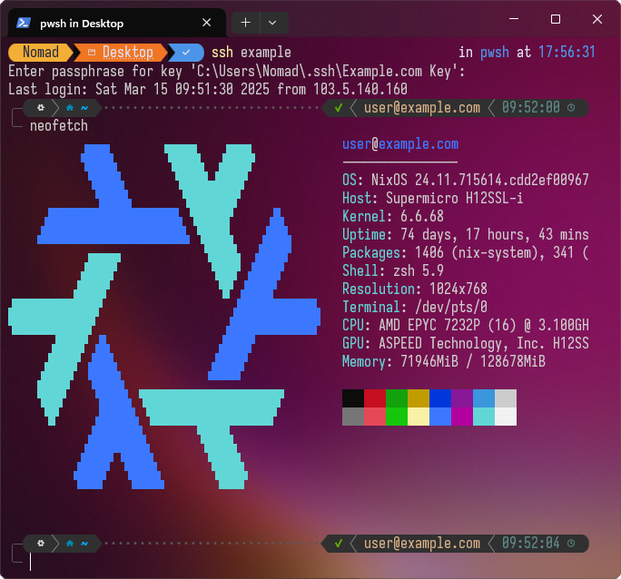

When you have a project, online service or WebApp that you manage and deploy, you usually have something that you [SSH](https://en.wikipedia.org/wiki/Secure_Shell) into. It maybe a real server, a [VPS](https://en.wikipedia.org/wiki/Virtual_private_server), a container, a [Kubernetes](https://kubernetes.io/) node and what have you.

<blockquote class="reaction"><div class="reaction_text">...unless your project is purely <a target="_blank" href="https://en.wikipedia.org/wiki/Serverless_computing">serverless</a> and built with a bunch of <a target="_blank" href="https://cloud.google.com/learn/paas-vs-iaas-vs-saas">(Insert Random Letter) as a Service</a> bricks.</div></blockquote>

Being able to setup a connection you trust and where your dev tools work is important. How you connect to the server where you deploy your projects isn't always straight forward though, when there are proxies, packet sniffing firewalls and network monitoring in-between you, the internet and the target server.

<blockquote class="reaction"><div class="reaction_text">The "correct" answer is: <a target="_blank" href="https://tailscale.com/blog/hamachi">setup a VPN</a>! But that's sometimes not possible. <a target="_blank" href="https://www.microsoft.com/en-us/microsoft-365/business-insights-ideas/resources/what-is-endpoint-management">Endpoint management</a> may forbid it client-side. Server-side infrastructure may be managed by a third party, kicking off costly service requests.</div></blockquote>

Ultimately, this is what this post is about - how to SSH into machines, when there is stuff in the way preventing that and make sure that your tools like git, [scp](https://man.openbsd.org/scp.1), [rsync](https://en.wikipedia.org/wiki/Rsync) or editing files directly on the server via [VSCode's SSH integration](https://code.visualstudio.com/docs/remote/ssh) work, with no new software installed and the ***absolute minimum*** of modifications to your server.

## Tunneling - So many flavors
If you control both Source and Destination, then you can tunnel everything through anything in complete secrecy and ultimately there is nothing anyone can do about it. This shouldn't be news to anyone working with networks. There are countless articles and videos going over a multitude of tunneling combinations.

- [Internet and SSH over ICMP (Pings)](https://github.com/DhavalKapil/icmptunnel)
- [Internet and SSH over DNS requests](https://github.com/yarrick/iodine)
- [Internet and SSH over WebSockets](https://github.com/erebe/wstunnel)

As for this article, we'll deep-dive ✨***SSH over HTTP(S)***✨. Be it Linux, Mac or Windows, we will look at how to setup everything up, what the underlying network traffic looks like and most importantly: how your digital infrastructure is **already** capable of all this ... even if it wasn't supposed to.

<blockquote class="reaction"><div class="reaction_text">Get your hard hats ready, <a target="_blank" href="https://youtu.be/DrYXGwMZrV4&t=8">for tonight we drill the firewall</a></div></blockquote>

## Basic SSH Connection Scenarios
We'll go through all the ways you may SSH into your server, with increasing levels of filtering, monitoring and connection blocking. As this is in the context of web development, I will always include how your main WebApps are reached as well. 

<blockquote class="reaction"><div class="reaction_text">In modern web deployments, your service may sit behind an <a target="_blank" href="https://learn.microsoft.com/en-us/azure/application-gateway/overview">application gateway</a>, potentially with multiple micro-services at play. We are going to simplify and consider no such factors in this article.</div></blockquote>

### Simple, direct connection



Let's start with a classic default setup: [SSHD](https://man.openbsd.org/sshd.8), the SSH daemon of OpenSSH is listening on Port 22, your WebApp is accessed via HTTP and HTTPS on Port 80 and 443 respectively. Server-side, these ports are [port-forwarded](https://en.wikipedia.org/wiki/Port_forwarding) and accessible by anyone via a static IP address or a domain name.

You have the basics of SSH security: [fail2ban to prevent password brute forcing](https://github.com/fail2ban/fail2ban) and/or configured `SSHD` to [reject logins via password](https://www.cyberciti.biz/faq/how-to-disable-ssh-password-login-on-linux/) and only allow [key based authentication](https://www.digitalocean.com/community/tutorials/how-to-configure-ssh-key-based-authentication-on-a-linux-server). Whilst [security through obscurity](https://en.wikipedia.org/wiki/Security_through_obscurity) is bad, we don't have to make it *too* obvious for [random port scans](https://support.censys.io/hc/en-us/articles/25692846962708-Censys-Internet-Scanning-Introduction) and `SSHD` on ports like [59274](https://datatracker.ietf.org/doc/html/rfc6335#section-6) is just as valid.

This "direct" connection also covers the case, that any intermediate corporate proxy has whitelisted this connection to be `direct`, is part of a company internal subnet not going through a proxy to the outside or that the target is within your company VPN.

#### Network capture
Let's take a look at what happens inside the network. All [captures](https://en.wikipedia.org/wiki/Packet_analyzer) are performed with [wireshark](https://github.com/wireshark/wireshark). **Source** 💻 is a Laptop attempting `ssh user@example.com`. **Target** 🌍 is the server with port 22 open. The capture concerns just this specific [TCP connection](https://en.wikipedia.org/wiki/Transmission_Control_Protocol). As there is no intermediary yet, the capture is performed on **Source** 💻.

Each individual packet's **Direction** is determined by the Source and Destination [IP address](https://en.wikipedia.org/wiki/IP_address), **Protocol** is judged by wireshark based on packet contents and connection history, **Length** is the packet size in bytes and **Info** is wireshark's quick summary of what the packet is or does. IPs and ports are left our for brevity.

<blockquote class="reaction"><div class="reaction_text">Rows with 💻 ➡ 🌍 mean outgoing <a target="_blank" href="https://en.wikipedia.org/wiki/Network_packet">packets</a>, aka <strong>Source ➡ Target</strong>. Rows with 🌍 ➡ 💻 and a <span style="background-color: #0006">dark background</span> indicate incoming packets, aka <strong>Target ➡ Source</strong>.</div></blockquote>
<style>
	.targetSourceRow{
		background-color: #0004;
	}
	.mobileRow{
		display: none;
		max-width: 1px;
	}
	.mobileRow pre {
		margin-bottom: unset;
		padding-top: 0.5em;
		padding-bottom: 0.5em
	}
	@media screen and (max-width: 500px) {
		table td:nth-child(4),
		table th:nth-child(4) {
		    display: none;
		}
		table td{
			border-bottom: none;
		}
		.mobileRow{
			display: table-row;
		}
		.mobileRow td{
			max-width: 1px;
			border-bottom: 1px solid #40363a;
		}
	}
</style>
<table>
	<thead>
		<tr>
			<th>Direction</th>
			<th>Protocol</th>
			<th>Length</th>
			<th>Info</th>
		</tr>
	</thead>
	<tbody>
		<tr>
			<td>💻 ➡ 🌍</td>
			<td>TCP</td>
			<td>66</td>
			<td><code>[SYN] Seq=0 Win=64240 Len=0 MSS=1460 WS=256 SACK_PERM</code></td>
		</tr>
		<tr class="mobileRow">
			<td colspan=4><pre>[SYN] Seq=0 Win=64240 Len=0 MSS=1460 WS=256 SACK_PERM</pre></td>
		</tr>
		<tr class="targetSourceRow">
			<td>🌍 ➡ 💻</td>
			<td>TCP</td>
			<td>66</td>
			<td><code>[SYN, ACK] Seq=0 Ack=1 Win=64240 Len=0 MSS=1460 SACK_PERM WS=128</code></td>
		</tr>
		<tr class="mobileRow targetSourceRow">
			<td colspan=4><pre>[SYN, ACK] Seq=0 Ack=1 Win=64240 Len=0 MSS=1460 SACK_PERM WS=128</pre></td>
		</tr>
		<tr>
			<td>💻 ➡ 🌍</td>
			<td>TCP</td>
			<td>54</td>
			<td><code>[ACK] Seq=1 Ack=1 Win=131328 Len=0</code></td>
		</tr>
		<tr class="mobileRow">
			<td colspan=4><pre>[ACK] Seq=1 Ack=1 Win=131328 Len=0</pre></td>
		</tr>
		<tr>
			<td>💻 ➡ 🌍</td>
			<td>SSHv2</td>
			<td>87</td>
			<td><code>Protocol (SSH-2.0-OpenSSH_for_Windows_9.5)</code></td>
		</tr>
		<tr class="mobileRow">
			<td colspan=4><pre>Protocol (SSH-2.0-OpenSSH_for_Windows_9.5)</pre></td>
		</tr>
		<tr class="targetSourceRow">
			<td>🌍 ➡ 💻</td>
			<td>TCP</td>
			<td>60</td>
			<td><code>[ACK] Seq=1 Ack=34 Win=64256 Len=0</code></td>
		</tr>
		<tr class="mobileRow targetSourceRow">
			<td colspan=4><pre>[ACK] Seq=1 Ack=34 Win=64256 Len=0</pre></td>
		</tr>
		<tr class="targetSourceRow">
			<td>🌍 ➡ 💻</td>
			<td>SSHv2</td>
			<td>95</td>
			<td><code>Protocol (SSH-2.0-OpenSSH_8.2p1 Ubuntu-4ubuntu0.9)</code></td>
		</tr>
		<tr class="mobileRow targetSourceRow">
			<td colspan=4><pre>Protocol (SSH-2.0-OpenSSH_8.2p1 Ubuntu-4ubuntu0.9)</pre></td>
		</tr>
		<tr>
			<td>💻 ➡ 🌍</td>
			<td>SSHv2</td>
			<td>1486</td>
			<td><code>Key Exchange Init</code></td>
		</tr>
		<tr class="mobileRow">
			<td colspan=4><pre>Key Exchange Init</pre></td>
		</tr>
		<tr class="targetSourceRow">
			<td>🌍 ➡ 💻</td>
			<td>SSHv2</td>
			<td>1110</td>
			<td><code>Key Exchange Init</code></td>
		</tr>
		<tr class="mobileRow targetSourceRow">
			<td colspan=4><pre>Key Exchange Init</pre></td>
		</tr>
		<tr>
			<td>💻 ➡ 🌍</td>
			<td>SSHv2</td>
			<td>102</td>
			<td><code>Elliptic Curve Diffie-Hellman Key Exchange Init</code></td>
		</tr>
		<tr class="mobileRow">
			<td colspan=4><pre>Elliptic Curve Diffie-Hellman Key Exchange Init</pre></td>
		</tr>
		<tr class="targetSourceRow">
			<td>🌍 ➡ 💻</td>
			<td>TCP</td>
			<td>60</td>
			<td><code>[ACK] Seq=1098 Ack=1514 Win=64128 Len=0</code></td>
		</tr>
		<tr class="mobileRow targetSourceRow">
			<td colspan=4><pre>[ACK] Seq=1098 Ack=1514 Win=64128 Len=0</pre></td>
		</tr>
		<tr class="targetSourceRow">
			<td>🌍 ➡ 💻</td>
			<td>SSHv2</td>
			<td>562</td>
			<td><code>Elliptic Curve Diffie-Hellman Key Exchange Reply, New Keys, Encrypted packet (len=228)</code></td>
		</tr>
		<tr class="mobileRow targetSourceRow">
			<td colspan=4><pre>Elliptic Curve Diffie-Hellman Key Exchange Reply, New Keys, Encrypted packet (len=228)</pre></td>
		</tr>
		<tr>
			<td>💻 ➡ 🌍</td>
			<td>SSHv2</td>
			<td>70</td>
			<td><code>New Keys</code></td>
		</tr>
		<tr class="mobileRow">	
			<td colspan=4><pre>New Keys</pre></td>
		</tr>
		<tr class="targetSourceRow">
			<td>🌍 ➡ 💻</td>
			<td>TCP</td>
			<td>60</td>
			<td><code>[ACK] Seq=1606 Ack=1530 Win=64128 Len=0</code></td>
		</tr>
		<tr class="mobileRow targetSourceRow">
			<td colspan=4><pre>[ACK] Seq=1606 Ack=1530 Win=64128 Len=0</pre></td>
		</tr>
		<tr>
			<td>💻 ➡ 🌍</td>
			<td>SSHv2</td>
			<td>98</td>
			<td><code>Encrypted packet (len=44)</code></td>
		</tr>
		<tr class="mobileRow">
			<td colspan=4><pre>Encrypted packet (len=44)</pre></td>
		</tr>
		<tr class="targetSourceRow">
			<td>🌍 ➡ 💻</td>
			<td>TCP</td>
			<td>60</td>
			<td><code>[ACK] Seq=1606 Ack=1574 Win=64128 Len=0</code></td>
		</tr>
		<tr class="mobileRow targetSourceRow">
			<td colspan=4><pre>[ACK] Seq=1606 Ack=1574 Win=64128 Len=0</pre></td>
		</tr>
		<tr class="targetSourceRow">
			<td>🌍 ➡ 💻</td>
			<td>SSHv2</td>
			<td>98</td>
			<td><code>Encrypted packet (len=44)</code></td>
		</tr>
		<tr class="mobileRow targetSourceRow">
			<td colspan=4><pre>Encrypted packet (len=44)</pre></td>
		</tr>
		<tr>
			<td>💻 ➡ 🌍</td>
			<td>SSHv2</td>
			<td>114</td>
			<td><code>Encrypted packet (len=60)</code></td>
		</tr>
		<tr class="mobileRow">
			<td colspan=4><pre>Encrypted packet (len=60)</pre></td>
		</tr>
		<tr class="targetSourceRow">
			<td>🌍 ➡ 💻</td>
			<td>TCP</td>
			<td>60</td>
			<td><code>[ACK] Seq=1650 Ack=1634 Win=64128 Len=0</code></td>
		</tr>
		<tr class="mobileRow targetSourceRow">
			<td colspan=4><pre>[ACK] Seq=1650 Ack=1634 Win=64128 Len=0</pre></td>
		</tr>
		<tr class="targetSourceRow">
			<td>🌍 ➡ 💻</td>
			<td>SSHv2</td>
			<td>98</td>
			<td><code>Encrypted packet (len=44)</code></td>
		</tr>
		<tr class="mobileRow targetSourceRow">
			<td colspan=4><pre>Encrypted packet (len=44)</pre></td>
		</tr>
		<tr>
			<td>💻 ➡ 🌍</td>
			<td>SSHv2</td>
			<td>554</td>
			<td><code>Encrypted packet (len=500)</code></td>
		</tr>
		<tr class="mobileRow">
			<td colspan=4><pre>Encrypted packet (len=500)</pre></td>
		</tr>
		<tr style="text-align: center; border-bottom: 1px solid #40363a;">
			<td colspan=4 ><code>Encrypted packets</code> go back and forth for the duration of the session</td>
		</tr>
	</tbody>
</table>

The first 3 packets are the standard [TCP handshake](https://en.wikipedia.org/wiki/Transmission_Control_Protocol#Connection_establishment). After that SSH begins its authentication, key change and encryption setup. You can *kinda* imply this to be SSH, as the communication happens on port 22. More obviously, anyone looking at the traffic can easily clock this as SSH, as the setup phase [loudly proclaims](https://datatracker.ietf.org/doc/html/rfc4253#section-4.2) to be SSH.

Even after the communication became fully encrypted, we can still infer this communication to be SSH, as this is still one specific connection, that we **know** previously talked with a "SSH smell". Inferring the connection type by looking at the packets and connection history is what's known as [packet-sniffing](https://en.wikipedia.org/wiki/Packet_analyzer).

### Blocked by a "dumb" firewall



<blockquote class="reaction"><div class="reaction_text">Click the image for fullscreen, or finger zoom on mobile. The illustrations will get wider and wider going forward.</div></blockquote>

A "dumb" [firewall](https://en.wikipedia.org/wiki/Firewall_(computing)), which performs no packet sniffing, is unable to block SSH *specifically*. These firewalls control which type ([UDP](https://en.wikipedia.org/wiki/User_Datagram_Protocol), [TCP](https://en.wikipedia.org/wiki/Transmission_Control_Protocol), [etc.](https://github.com/Hawzen/hdp)) of packet can go from and to which port, address or application. This applies to both stateless firewalls and [stateful firewalls](https://en.wikipedia.org/wiki/Stateful_firewall), a distinction which we'll ignore going forward.

<blockquote class="reaction"><div class="reaction_text">Of course "dumb" and "smart" are not technical, it's all about rule-sets and policies. Specific security products, specific configs, placement in the <a target="_blank" href="https://en.wikipedia.org/wiki/OSI_model">OSI Model</a>, is a can of worms this article will not touch.</div></blockquote>

For now we look at client-side firewalls only. A popular "set and forget" firewall ruleset to allow internet access but block users from doing other stuff is to only permit outbound TCP Port 80 for HTTP, TCP Port 443 for HTTPS and block everything else. We are ignoring things like [DNS](https://en.wikipedia.org/wiki/Domain_Name_System), E-Mail, etc. here.

Our default SSH connection attempt will error out in such an environment. Provided the domain itself isn't blacklisted, [DNS](https://en.wikipedia.org/wiki/Domain_Name_System) resolves correctly and the OS isn't aware of the firewall rule giving you a `ssh: connect to host example.com port 44422: Permission denied`, you'll get this [timeout](https://en.wikipedia.org/wiki/Timeout_(computing)) error after waiting a period:

```tunnelingArticleShell
$ ssh user@example.com
ssh: connect to host example.com port 22: Connection timed out
```

#### Network capture
**Source** 💻 is a Laptop attempting `ssh user@example.com`. **Target** 🌍 is the server with port 22 open. Here is what traffic look like if the firewall is blocking the outgoing communication via a simple port block. Capture is again on **Source** 💻.

<table>
	<thead>
		<tr>
			<th>Direction</th>
			<th>Protocol</th>
			<th>Length</th>
			<th>Info</th>
		</tr>
	</thead>
	<tbody>
<tr><td>💻 ➡ 🌍</td><td>TCP</td><td>74</td><td><code>[SYN] Seq=0 Win=64240 Len=0 MSS=1460 SACK_PERM=1 WS=128</code></td></tr>
<tr class="mobileRow"><td colspan=4><pre>[SYN] Seq=0 Win=64240 Len=0 MSS=1460 SACK_PERM=1 WS=128</pre></td></tr>
<tr><td>💻 ➡ 🌍</td><td>TCP</td><td>74</td><td><code>[TCP Retransmission] [SYN] Seq=0 Win=64240 Len=0 MSS=1460 SACK_PERM=1 WS=128</code></td></tr>
<tr class="mobileRow"><td colspan=4><pre>[TCP Retransmission] [SYN] Seq=0 Win=64240 Len=0 MSS=1460 SACK_PERM=1 WS=128</pre></td></tr>
		<tr style="text-align: center; border-bottom: 1px solid #40363a;">
			<td colspan=4>This goes on for 5 more <code>[TCP Retransmission]</code> packets</td>
		</tr>
	</tbody>
</table>

As you might have expected, SSH sends a TCP Handshake `SYN`, which never reaches the server, prompting a bunch of `[TCP Retransmission]` before giving up with a timeout error.

### SSH on port 443



Let's start with the most obvious workaround for our "dumb" firewall case: Set the SSH port to 443. As two services cannot share the same port, we must either disable our HTTP and HTTPS service or set one of them to another port.

This will get us past our dumb firewall case, but will obviously prevent our WebApp from being reachable. Except for the port number, the network capture will look identical to the direct connection case and any packet sniffer will still be able to tell that this is an SSH connection.

### [SSLH](https://github.com/yrutschle/sslh): HTTP and SSH on the same port



One popular solution to this is the connection multiplexer [SSLH](https://github.com/yrutschle/sslh). It's usually setup to listen on port 443, checks whether the incoming connection is SSH or HTTPS and establishes the connection to SSHD or your HTTP service respectively. SSLH can do more, but that's the gist of it.

<blockquote class="reaction"><div class="reaction_text">To be clear, the connections themselves are not mixed protocol and the clients need no modification. SSLH only determines where the connection is established to.</div></blockquote>

From the perspective of the client, nothing changed as compared to a direct connection. However, it requires a **new piece of software** to sit in front of your entire server-side communication stack. One more thing to maintain, one more thing to fail. Still subject to be blocked by corporate proxies and packet sniffing firewalls.

### Blocked by a "smart" firewall



A "smart" firewall can additionally look inside packets and block connections based on what traffic it sees. We'll ignore the semantics and [OSI-Layer](https://en.wikipedia.org/wiki/OSI_model) discussion for now. When faced with a smart firewall setup to block either SSH specifically or only allow "normal" HTTPS traffic, you will get a timeout error like this:

```tunnelingArticleShell
$ ssh user@example.com
kex_exchange_identification: read: Connection timed out
banner exchange: Connection to example.com port 22: Connection timed out
```

#### Network capture
**Source** 💻 is a Laptop attempting `ssh user@example.com`. **Target** 🌍 is the server with port 22 open. Here is what traffic look like if it's not going through and being filtered by a smart firewall, which inspects traffic.

<table>
	<thead>
	<tr>
		<th>Direction</th>
		<th>Protocol</th>
		<th>Length</th>
		<th>Info</th>
	</tr>
	</thead>
	<tbody>
	<tr>
		<td>💻 ➡ 🌍</td>
		<td>TCP</td>
		<td>66</td>
		<td><code>[SYN] Seq=0 Win=64240 Len=0 MSS=1460 WS=256 SACK_PERM</code></td>
	</tr>
	<tr class="mobileRow">
			<td colspan=4><pre>[SYN] Seq=0 Win=64240 Len=0 MSS=1460 WS=256 SACK_PERM</pre></td>
	</tr>
	<tr class="targetSourceRow">
		<td>🌍 ➡ 💻</td>
		<td>TCP</td>
		<td>66</td>
		<td><code>[SYN, ACK] Seq=0 Ack=1 Win=64240 Len=0 MSS=1452 SACK_PERM WS=128</code></td>
	</tr>
	<tr class="mobileRow targetSourceRow">
			<td colspan=4><pre>[SYN, ACK] Seq=0 Ack=1 Win=64240 Len=0 MSS=1452 SACK_PERM WS=128</pre></td>
	</tr>
	<tr>
		<td>💻 ➡ 🌍</td>
		<td>TCP</td>
		<td>54</td>
		<td><code>[ACK] Seq=1 Ack=1 Win=132096 Len=0</code></td>
	</tr>
	<tr class="mobileRow">
			<td colspan=4><pre>[ACK] Seq=1 Ack=1 Win=132096 Len=0</pre></td>
	</tr>
	<tr>
		<td>💻 ➡ 🌍</td>
		<td>SSHv2</td>
		<td>87</td>
		<td><code>[PSH, ACK] Seq=1 Ack=1 Win=132096 Len=33, Payload: SSH-2.0-OpenSSH_for_Windows_9.5</code></td>
	</tr>
	<tr class="mobileRow">
			<td colspan=4><pre>[PSH, ACK] Seq=1 Ack=1 Win=132096 Len=33, Payload: SSH-2.0-OpenSSH_for_Windows_9.5</pre></td>
	</tr>
	<tr>
		<td>💻 ➡ 🌍</td>
		<td>SSHv2</td>
		<td>87</td>
		<td><code>[TCP Retransmission] [PSH, ACK] Seq=1 Ack=1 Win=132096 Len=33, Payload: SSH-2.0-OpenSSH_for_Windows_9.5</code></td>
	</tr>
	<tr class="mobileRow">
			<td colspan=4><pre>[TCP Retransmission] [PSH, ACK] Seq=1 Ack=1 Win=132096 Len=33, Payload: SSH-2.0-OpenSSH_for_Windows_9.5</pre></td>
	</tr>	
	<tr style="text-align: center; border-bottom: 1px solid #40363a;">
		<td colspan=4>This goes on for 7 more <code>[TCP Retransmission]</code> packets</td>
	</tr>
	<tr>
		<td>💻 ➡ 🌍</td>
		<td>TCP</td>
		<td>54</td>
		<td><code>[RST, ACK] Seq=34 Ack=1 Win=0 Len=0</code></td>
	</tr>
	<tr class="mobileRow">
			<td colspan=4><pre>[RST, ACK] Seq=34 Ack=1 Win=0 Len=0</pre></td>
	</tr>	
	</tbody>
</table>

<blockquote class="reaction"><div class="reaction_text">Wireshark wasn't smart enough to label the failed banner exchange packets as SSH, even though the packets clearly indicate it was. I changed it manually above and below for completeness.</div></blockquote>

The target successfully answers our call for a TCP connection, but never responds to our requests, before our clients gives up with the [`RST`](https://developers.cloudflare.com/fundamentals/reference/tcp-connections/#tcp-connections-and-keep-alives) signal. In the case of TCP connections, "smart" firewalls allow the initial connection to take place, look at what comes next and judge based on that.

After initial TCP connection, the next thing to be sent is the [SSH identification string](https://datatracker.ietf.org/doc/html/rfc4253#section-4.2), something that unequivocally flags our connection as SSH, which the firewall blocks. That's the reason SSH doesn't timeout outright, but rather with this specific `banner exchange` timeout. The [identification strings](https://datatracker.ietf.org/doc/html/rfc4253#section-4.2) never make it to the other side.

Let's reverse our perspective and take a look at server-side. **Source** 🖥️ is the server with SSHD on port 22 and **Target** 🌍 is a Laptop attempting `ssh user@example.com`, the very same connection attempt as above.

<table>
	<thead>
	<tr>
		<th>Direction</th>
		<th>Protocol</th>
		<th>Length</th>
		<th>Info</th>
	</tr>
	</thead>
	<tbody>
<tr class="targetSourceRow"><td>🌍 ➡ 🖥️</td><td>TCP</td><td>66</td><td><code>[SYN] Seq=0 Win=64240 Len=0 MSS=1452 WS=256 SACK_PERM
</code></td>
	</tr>
	<tr class="mobileRow targetSourceRow"><td colspan=4><pre>[SYN] Seq=0 Win=64240 Len=0 MSS=1452 WS=256 SACK_PERM</pre></td>
	</tr>
<tr><td>🖥️ ➡ 🌍</td><td>TCP</td><td>66</td><td><code>[SYN, ACK] Seq=0 Ack=1 Win=64240 Len=0 MSS=1460 SACK_PERM WS=128
</code></td>
	</tr>
	<tr class="mobileRow"><td colspan=4><pre>[SYN, ACK] Seq=0 Ack=1 Win=64240 Len=0 MSS=1460 SACK_PERM WS=128</pre></td>
	</tr>
<tr class="targetSourceRow"><td>🌍 ➡ 🖥️</td><td>TCP</td><td>60</td><td><code>[ACK] Seq=1 Ack=1 Win=132096 Len=0
</code></td>
	</tr>
	<tr class="mobileRow targetSourceRow"><td colspan=4><pre>[ACK] Seq=1 Ack=1 Win=132096 Len=0</pre></td>
	</tr>
<tr><td>🖥️ ➡ 🌍</td><td>SSHv2</td><td>75</td><td><code>[PSH, ACK] Seq=1 Ack=1 Win=64256 Len=21, Payload: SSH-2.0-OpenSSH_9.9
</code></td>
	</tr>
	<tr class="mobileRow"><td colspan=4><pre>[PSH, ACK] Seq=1 Ack=1 Win=64256 Len=21, Payload: SSH-2.0-OpenSSH_9.9</pre></td>
	</tr>
<tr><td>🖥️ ➡ 🌍</td><td>SSHv2</td><td>75</td><td><code>[TCP Retransmission] [PSH, ACK] Seq=1 Ack=1 Win=64256 Len=21, Payload: SSH-2.0-OpenSSH_9.9
</code></td>
	</tr>
	<tr class="mobileRow"><td colspan=4><pre>[TCP Retransmission] [PSH, ACK] Seq=1 Ack=1 Win=64256 Len=21, Payload: SSH-2.0-OpenSSH_9.9</pre></td>
	</tr>
	<tr style="text-align: center; border-bottom: 1px solid #40363a;">
		<td colspan=4>This goes on for 7 more <code>[TCP Retransmission]</code> packets</td>
	</tr>
	<tr><td>🖥️ ➡ 🌍</td><td>TCP</td><td>54</td><td><code>[FIN, ACK] Seq=22 Ack=1 Win=64256 Len=0
</code></td>
	</tr>
	<tr class="mobileRow"><td colspan=4><pre>[FIN, ACK] Seq=22 Ack=1 Win=64256 Len=0</pre></td>
	</tr>
		</tbody>
</table>

Same deal here. We observe the initial TCP connection being established, but with a sudden stop of communication, followed by [slow whimper](https://archive.org/details/poems19091925030616mbp/page/n133/mode/2up) of server-side identification string Retransmission call-outs.

<blockquote class="reaction"><div class="reaction_text">You may see server-side <a target="_blank" href="https://github.com/openssh/openssh-portable/blob/6c49e5f7dcaf886b4a702a6c003cae9dca04d3ea/sshd.c#L596"><code>Not allowed at this time</code></a> packets instead, as OpenSSH is <a target="_blank" href="https://github.com/openssh/openssh-portable/blob/6c49e5f7dcaf886b4a702a6c003cae9dca04d3ea/sshd.c#L596">rate-limiting by default via the <code>MaxStartups</code> and penalty system</a>. Either way, these packets are never heard.</div></blockquote>

Before we get out our hammer drill to circumvent this, let's introduce another antagonist of today's journey...

## The corporate proxy



A corporate proxy is an exit point to the internet, deployed for security and compliance reasons within a company to monitor for threats and forbid anything that isn't explicitly allowed. Furthermore it's supposed to curb [data exfiltration](https://en.wikipedia.org/wiki/Data_exfiltration) and ensure employees don't setup infrastructure, without clearing it with IT prior.

<blockquote class="reaction"><div class="reaction_text"><strong>Far</strong> beyond any malicious hacking, employees misconfiguring things, uploading sensitive data to 3rd parties and similar faux pas are <strong>the</strong> prime reason far data leaks.</div></blockquote>

These proxies are usually part of an overarching IT and endpoint security package sold by companies like [ThreatLocker](https://www.threatlocker.com), [Forcepoint](https://forcepoint.com) and [Cisco](https://www.cisco.com), among others. In Windows land, these are usually setup by [Group policies](https://en.wikipedia.org/wiki/Group_Policy) pre-configuring a system-wide proxy and in *Nix land these are usually pre-configured with an initial OS image.

<blockquote class="reaction"><div class="reaction_text">On a personal point, I'm not a fan of Forcepoint's <a target="_blank" href="https://en.wikipedia.org/wiki/Forcepoint#Forcepoint">ties to the military industrial complex</a>, but they are diligent and quick with upkeep of their underlying products like false blocks from <a target="_blank" href="https://en.wikipedia.org/wiki/BlackSpider_Technologies_Limited">blackspider / SurfControl</a>.</div></blockquote>

Among these corporate proxies, it's standard to have packet sniffing capabilities, preventing connections that don't pass the sniff-test of "looks like normal internet access". Going forward, we will circumvent this and do so in a way that makes dev tools happy. Before that, let's clear the elephants in the room...

<blockquote class="reaction"><div class="reaction_text">Probably the time to mention, that as much as any other post, my blog's <a target="_blank" href="/about/#disclaimer">disclaimer</a> applies.</div></blockquote>

...why would you need to? Can't you simply open a ticket at your IT department? Certain situations may make a deeper architectural solution impossible on the timescale that a project needs delivering, happenings need to happen and things need to thing. 

There may be intermediary companies which are responsible for digital infrastructure, kicking-off complicated inter-contract reviews; engineer access gateways may be on unreliable subnets; or simply, the present digital infrastructure may be such a mess, that trust just can't be established in the first place.

<blockquote class="reaction"><div class="reaction_text">Man, have I seen some s*#$.</div></blockquote>
<a></a>

### Honoring the proxy
Proxies are such a vital piece of infrastructure, that we expect the operating system's proxy settings to be honored by default, built proxy settings into most network connected software and have additional defacto standards to specify them like the environment variables `http_proxy`, `HTTPS_PROXY`, `NO_PROXY` and friends.

<figure>
	
	<figcaption>Firefox's proxy settings</figcaption>
</figure>

But what may come as a surprise, is that such a fundamental piece of infrastructure like OpenSSH doesn't support it, with the exception of [SSH as a proxy itself](https://goteleport.com/blog/ssh-proxyjump-ssh-proxycommand/). Because [Unix philosophy](https://en.wikipedia.org/wiki/Unix_philosophy#Origin) and all that. SSH clients like [Putty](https://www.putty.org/) do, but we'll stick with OpenSSH. It's [FOSS](https://en.wikipedia.org/wiki/Free_and_open-source_software), other tools rely on it and it comes pre-installed on every OS by now.

<figure>
	
	<figcaption>OpenSSH Client installed by default in Windows 10 and 11</figcaption>
</figure>

<blockquote class="reaction"><div class="reaction_text">With OpenSSH instead of tools like Putty we also get to use Terminals like the <a target="_blank" href="https://github.com/microsoft/terminal">new Windows Terminal</a> or <a target="_blank" href="https://ghostty.org/"> GhostTTY</a> with modern design, good font support and copy-paste that doesn't make you <a target="_blank" href="https://superuser.com/a/180045">blow your brains out</a></div></blockquote>
<a></a>

<figure>
	
	<figcaption>OpenSSH Connection in Windows Terminal</figcaption>
</figure>

OpenSSH supplies `ProxyCommand` and relies on other tools proxying for it. Many ways to do this. For now, let's start with the simplest ones, with no extra encryption at play. There are FOSS [`connect.c` aka `ssh-connect`](https://github.com/gotoh/ssh-connect) and [corkscrew](https://github.com/bryanpkc/corkscrew), working on Linux, BSD, Mac OS and Windows.

<blockquote class="reaction"><div class="reaction_text">Linux, BSD and MacOS have <a target="_blank" href="https://en.wikipedia.org/wiki/Netcat"><code>nc</code></a> preinstalled, which can also be used. But we are ignoring it for brevity, as it's more of a general purpose tool and the <a target="_blank" href="https://scoop.sh/#/apps?q=netcat&id=8bec774707c893d2baf0cb999c13936c7bebc306">windows builds</a> are flagged by Windows Defender.</div></blockquote>

`ssh-connect` created by [@gotoh](https://github.com/gotoh) recently moved to GitHub. Most online documentation now points to [a dead bitbucket repo](https://bitbucket.org/gotoh/connect). On Windows specifically it comes as `connect.exe`, installed by default with [Git for Windows](https://gitforwindows.org/) and can also [be installed via Sccop](https://scoop.sh/#/apps?q=connect&id=bdf819b2986269a3c7c29074c2d26870a17c4a88) or [MSYS](https://packages.msys2.org/base/mingw-w64-connect).

Though not quite the same, in the context of the article [corkscrew](https://github.com/bryanpkc/corkscrew) does the same. It is more well known as a project, [just 260 lines of C](https://github.com/bryanpkc/corkscrew/blob/master/corkscrew.c), but in contrast to `ssh-connect` has no widely distributed Windows build. For x64 Windows, I have compiled it myself and here it is as a shortcut for testing: [corkscrew.zip](corkscrew.zip).

### Baby's first tunnel
Both `corkscrew` and `ssh-connect` are very simple and can authenticate if the proxy uses `basic auth`. To confirm connection to `SSHD` you don't need to configure SSH. All proxy commands are supposed to return the [SSH identification string](https://datatracker.ietf.org/doc/html/rfc4253#section-4.2), which is how you can check if a connection is established.

<blockquote class="reaction"><div class="reaction_text">Let's use <a target="_blank" href="https://datatracker.ietf.org/doc/html/rfc5737#section-3"><code>198.51.100.4</code></a> and port <code>8080</code> for our corporate proxy.</div></blockquote>

```tunnelingArticleShell
$ corkscrew 198.51.100.4 8080 example.com 22
SSH-2.0-OpenSSH_9.9

/* or */

$ connect -H 198.51.100.4:8080 example.com 22
SSH-2.0-OpenSSH_9.9
```

If those proxy commands successfully return the [server-side SSH identification string](https://datatracker.ietf.org/doc/html/rfc4253#section-4.2), we are good to go and can use it with SSH. If not, you can diagnose and look for the reason at this stage, without SSH spewing errors at you. Now to use it with SSH, we can supply the `ProxyCommand` like:

```tunnelingArticleShell
$ ssh -o ProxyCommand="corkscrew 198.51.100.4 8080 example.com 22" user@

/* or */

$ ssh -o ProxyCommand="connect -H 198.51.100.4:8080 example.com 22" user@
```

<blockquote class="reaction"><div class="reaction_text">This annoyingly long command is <strong>not</strong> how you use SSH. We skip proper SSH configuration until later in the article.</div></blockquote>

Using this and optionally `-i` for the keyfile, we can connect to our target server. Note how `ProxyCommand` now determines destination and port. Whilst we can use [placeholders `%h %p`](https://man.openbsd.org/ssh_config#ProxyCommand), `ssh` itself is not involved in matters of routing anymore, so neither `-p` for non-default ports, nor destination after `user@` is required.



By using `corkscrew` or `ssh-connect`, we instruct the intermediate proxy to handle the connection to SSH port 22 for us and OpenSSH now gets SSH packets delivered by `ProxyCommand`. But why would a corporate proxies do this? How do you make HTTP talk in SSH? [That's the neat thing, you don't...](https://www.youtube.com/watch?v=se17_0zbZds&t=10s)

#### Network capture
**Source** 💻 is a Laptop performing `ssh -o ProxyCommand="corkscrew 198.51.100.4 8080 example.com 22" user@`. **Target** 🏢 is an intermediate proxy sitting in between a private subnet and the internet. The capture is performed on this intermediate proxy **Target** 🏢.

<table>
	<thead>
		<tr>
			<th>Direction</th>
			<th>Protocol</th>
			<th>Length</th>
			<th>Info</th>
		</tr>
	</thead>
	<tbody>
		<tr>
			<td>💻 ➡ 🏢</td>
			<td>TCP</td>
			<td>66</td>
			<td><code>[SYN] Seq=0 Win=64240 Len=0 MSS=1460 WS=256 SACK_PERM=1</code></td>
	</tr>
	<tr class="mobileRow">
			<td colspan=4><pre>[SYN] Seq=0 Win=64240 Len=0 MSS=1460 WS=256 SACK_PERM=1</pre></td>
	</tr>
	<tr class="targetSourceRow"><td>🏢 ➡ 💻</td><td>TCP</td><td>66</td>
<td><code>[SYN, ACK] Seq=0 Ack=1 Win=64240 Len=0 MSS=1460 SACK_PERM=1 WS=128</code></td>
	</tr>
	<tr class="mobileRow targetSourceRow">
			<td colspan=4><pre>[SYN, ACK] Seq=0 Ack=1 Win=64240 Len=0 MSS=1460 SACK_PERM=1 WS=128</pre></td>
	</tr>
<tr><td>💻 ➡ 🏢</td><td>TCP</td><td>60</td>
<td><code>[ACK] Seq=1 Ack=1 Win=131328 Len=0</code></td>
	</tr>
	<tr class="mobileRow">
			<td colspan=4><pre>[ACK] Seq=1 Ack=1 Win=131328 Len=0</pre></td>
	</tr>
<tr><td>💻 ➡ 🏢</td><td>TCP</td><td>89</td>
<td><code>CONNECT  example.com:22 HTTP/1.0  [TCP segment of a reassembled PDU]</code></td>
	</tr>
	<tr class="mobileRow">
			<td colspan=4><pre>CONNECT  example.com:22 HTTP/1.0  [TCP segment of a reassembled PDU]</pre></td>
	</tr>
<tr class="targetSourceRow"><td>🏢 ➡ 💻</td><td>TCP</td><td>54</td>
<td><code>[ACK] Seq=1 Ack=36 Win=64256 Len=0</code></td>
	</tr>
	<tr class="mobileRow targetSourceRow">
			<td colspan=4><pre>[ACK] Seq=1 Ack=36 Win=64256 Len=0</pre></td>
	</tr>
<tr><td>💻 ➡ 🏢</td><td>HTTP</td><td>60</td>
<td><code>CONNECT  example.com:22 HTTP/1.0</code></td>
	</tr>
	<tr class="mobileRow">
			<td colspan=4><pre>CONNECT  example.com:22 HTTP/1.0</pre></td>
	</tr>
<tr class="targetSourceRow"><td>🏢 ➡ 💻</td><td>TCP</td><td>54</td>
<td><code>[ACK] Seq=1 Ack=38 Win=64256 Len=0</code></td>
	</tr>
	<tr class="mobileRow targetSourceRow">
			<td colspan=4><pre>[ACK] Seq=1 Ack=38 Win=64256 Len=0</pre></td>
	</tr>
<tr class="targetSourceRow"><td>🏢 ➡ 💻</td><td>HTTP</td><td>93</td>
<td><code>HTTP/1.0 200 Connection established</code></td>
	</tr>
	<tr class="mobileRow targetSourceRow">
			<td colspan=4><pre>HTTP/1.0 200 Connection established</pre></td>
	</tr>
<tr class="targetSourceRow"><td>🏢 ➡ 💻</td><td>SSH</td><td>95</td>
<td><code>Protocol (SSH-2.0-OpenSSH_8.2p1 Ubuntu-4ubuntu0.9)</code></td>
	</tr>
	<tr class="mobileRow targetSourceRow">
			<td colspan=4><pre>Protocol (SSH-2.0-OpenSSH_8.2p1 Ubuntu-4ubuntu0.9)</pre></td>
	</tr>
<tr><td>💻 ➡ 🏢</td><td>SSHv2</td><td>87</td>
<td><code>Protocol (SSH-2.0-OpenSSH_for_Windows_9.5)</code></td>
	</tr>
	<tr class="mobileRow">
			<td colspan=4><pre>Protocol (SSH-2.0-OpenSSH_for_Windows_9.5)</pre></td>
	</tr>
<tr class="targetSourceRow"><td>🏢 ➡ 💻</td><td>TCP</td><td>54</td>
<td><code>[ACK] Seq=81 Ack=71 Win=64256 Len=0</code></td>
	</tr>
	<tr class="mobileRow targetSourceRow">
			<td colspan=4><pre>[ACK] Seq=81 Ack=71 Win=64256 Len=0</pre></td>
	</tr>
<tr class="targetSourceRow"><td>🏢 ➡ 💻</td><td>SSHv2</td><td>1110</td>
<td><code>Key Exchange Init</code></td>
	</tr>
	<tr class="mobileRow targetSourceRow">
			<td colspan=4><pre>Key Exchange Init</pre></td>
	</tr>
<tr><td>💻 ➡ 🏢</td><td>TCP</td><td>1078</td>
<td><code>[TCP segment of a reassembled PDU]</code></td>
	</tr>
	<tr class="mobileRow">
			<td colspan=4><pre>[TCP segment of a reassembled PDU]</pre></td>
	</tr>
<tr class="targetSourceRow"><td>🏢 ➡ 💻</td><td>TCP</td><td>54</td>
<td><code>[ACK] Seq=1137 Ack=1095 Win=64128 Len=0</code></td>
	</tr>
	<tr class="mobileRow targetSourceRow">
			<td colspan=4><pre>[ACK] Seq=1137 Ack=1095 Win=64128 Len=0</pre></td>
	</tr>
<tr><td>💻 ➡ 🏢</td><td>SSHv2</td><td>510</td>
<td><code>Key Exchange Init, Diffie-Hellman Key Exchange Init</code></td>
	</tr>
	<tr class="mobileRow">
			<td colspan=4><pre>Key Exchange Init, Diffie-Hellman Key Exchange Init</pre></td>
	</tr>
<tr class="targetSourceRow"><td>🏢 ➡ 💻</td><td>TCP</td><td>54</td>
<td><code>[ACK] Seq=1137 Ack=1551 Win=64128 Len=0</code></td>
	</tr>
	<tr class="mobileRow targetSourceRow">
			<td colspan=4><pre>[ACK] Seq=1137 Ack=1551 Win=64128 Len=0</pre></td>
	</tr>
<tr class="targetSourceRow"><td>🏢 ➡ 💻</td><td>SSHv2</td><td>562</td>
<td><code>Diffie-Hellman Key Exchange Reply, New Keys, Encrypted packet (len=228)</code></td>
	</tr>
	<tr class="mobileRow targetSourceRow">
			<td colspan=4><pre>Diffie-Hellman Key Exchange Reply, New Keys, Encrypted packet (len=228)</pre></td>
	</tr>
<tr><td>💻 ➡ 🏢</td><td>SSHv2</td><td>114</td>
<td><code>New Keys, Encrypted packet (len=44)</code></td>
	</tr>
	<tr class="mobileRow">
			<td colspan=4><pre>New Keys, Encrypted packet (len=44)</pre></td>
	</tr>
<tr class="targetSourceRow"><td>🏢 ➡ 💻</td><td>SSHv2</td><td>98</td>
<td><code>Encrypted packet (len=44)</code></td>
	</tr>
	<tr class="mobileRow targetSourceRow">
			<td colspan=4><pre>Encrypted packet (len=44)</pre></td>
	</tr>
<tr><td>💻 ➡ 🏢</td><td>SSHv2</td><td>114</td>
<td><code>Encrypted packet (len=60)</code></td>
	</tr>
	<tr class="mobileRow">
			<td colspan=4><pre>Encrypted packet (len=60)</pre></td>
	</tr>
<tr class="targetSourceRow"><td>🏢 ➡ 💻</td><td>SSHv2</td><td>98</td>
<td><code>Encrypted packet (len=44)</code></td>
	</tr>
	<tr class="mobileRow targetSourceRow">
			<td colspan=4><pre>Encrypted packet (len=44)</pre></td>
	</tr>
<tr><td>💻 ➡ 🏢</td><td>SSHv2</td><td>554</td>
<td><code>Encrypted packet (len=500)</code></td>
	</tr>
	<tr class="mobileRow">
			<td colspan=4><pre>Encrypted packet (len=500)</pre></td>
	</tr>
		<tr style="text-align: center; border-bottom: 1px solid #40363a;">
		<td colspan=4><code>Encrypted packets</code> go back and forth for the duration of the session</td>
		</tr>
	</tbody>
</table>

We communicate by SSH (a TCP protocol) over the corporate proxy, which speaks HTTP (also a TCP protocol). Though that term is a bit murky, this classifies our setup as **tunneling**. The center point of all this is packet number 6 - [✨ HTTP CONNECT ✨](https://developer.mozilla.org/en-US/docs/Web/HTTP/Methods/CONNECT)

`Corkscrew` and `ssh-connect` instruct the corporate proxy to connect to our target server's SSH port via the command `HTTP CONNECT` and relay back what it hears. HTTP CONNECT works by relaying RAW TCP. Similar to the dumb firewall we talked about previously, HTTP CONNECT doesn't understand ***what*** TCP it's actually relaying.

So why not forbid HTTP CONNECT? - Because that would break proxy connections with [HTTP***S***](https://en.wikipedia.org/wiki/HTTPS), a basic building block of modern web. Ignoring the unencrypted [SNI](https://en.wikipedia.org/wiki/Server_Name_Indication), the point of HTTPS is that the communication is encrypted. For the proxy to work in the first place, it has to relay TCP blindly. That's what [HTTP CONNECT](https://developer.mozilla.org/en-US/docs/Web/HTTP/Methods/CONNECT) is for.

<blockquote class="reaction"><div class="reaction_text">Yes, <a href="https://www.youtube.com/watch?v=5eJl2Y8yh_4">put your hand down</a>, we'll get into TLS decryption and DPI.</div></blockquote>

If you take a look at the traffic, you *still* see the connection being clocked as SSH. The intermediate proxy talks to the target `example.com:22` server and thus can see the unencrypted SSH setup. If the corporate proxy performs packet sniffing, it will have no issues blocking this. Let's fix that.

<blockquote class="reaction"><div class="reaction_text">So far, our tunneling method <strong>doesn't hide anything</strong>, but I've seen this setup work more often than not, even in environments where outgoing SSH was supposedly blocked.</div></blockquote>

## HTTP***S*** Tunneling
We looked at different setups so far, but ultimately, the reasons they exist and the environments they would fail in. Now we get into the meat and potatoes. If we want to hide from packet inspection based filtering, 



As previously, you don't need to configure SSH to confirm connection to `SSHD`.

```tunnelingArticleShell
$ proxytunnel -X -z -p 198.51.100.4:8080 -r example.com:443 -d 127.0.0.1:22
Via 198.51.100.4:8080 -> example.com:443 -> 127.0.0.1:22
SSH-2.0-OpenSSH_9.9
```

```tunnelingArticleShell
$ ssh -o ProxyCommand="proxytunnel -X -z -p 198.51.100.4:8080 -r example.com:443 -d 127.0.0.1:22" user@
```

All of these need HTTP/1.1 () If the intermediate Proxy communicates with HTTP/2, your connections will error out
https://github.com/ScoopInstaller/Main/pull/6409
### Network capture


<table>
	<thead>
		<tr>
			<th>Direction</th>
			<th>Protocol</th>
			<th>Length</th>
			<th>Info</th>
		</tr>
	</thead>
	<tbody>
	<td>💻 ➡ 🏢</td><td>TCP		</td><td> 66</td>
<td><code>	[SYN] Seq=0 Win=64240 Len=0 MSS=1460 WS=256 SACK_PERM=1
</code></td>
	</tr>
	<tr class="mobileRow"><td colspan=4><pre>[SYN] Seq=0 Win=64240 Len=0 MSS=1460 WS=256 SACK_PERM=1</pre></td>
	</tr>
<tr class="targetSourceRow"><td>🏢 ➡ 💻</td><td>TCP		</td><td> 66</td>
<td><code>	[SYN, ACK] Seq=0 Ack=1 Win=64240 Len=0 MSS=1460 SACK_PERM=1 WS=128
</code></td>
	</tr>
	<tr class="mobileRow"><td colspan=4><pre>[SYN, ACK] Seq=0 Ack=1 Win=64240 Len=0 MSS=1460 SACK_PERM=1 WS=128</pre></td>
	</tr>
<td>💻 ➡ 🏢</td><td>TCP		</td><td> 60</td>
<td><code>	[ACK] Seq=1 Ack=1 Win=131328 Len=0
</code></td>
	</tr>
	<tr class="mobileRow"><td colspan=4><pre>[ACK] Seq=1 Ack=1 Win=131328 Len=0</pre></td>
	</tr>
<td>💻 ➡ 🏢</td><td>HTTP		</td><td> 157</td>
<td><code>	CONNECT example.com:443 HTTP/1.1
</code></td>
	</tr>
	<tr class="mobileRow"><td colspan=4><pre>CONNECT example.com:443 HTTP/1.1</pre></td>
	</tr>
<tr class="targetSourceRow"><td>🏢 ➡ 💻</td><td>TCP		</td><td> 54</td>
<td><code>	[ACK] Seq=1 Ack=104 Win=64256 Len=0
</code></td>
	</tr>
	<tr class="mobileRow"><td colspan=4><pre>[ACK] Seq=1 Ack=104 Win=64256 Len=0</pre></td>
	</tr>
<tr class="targetSourceRow"><td>🏢 ➡ 💻</td><td>HTTP		</td><td> 93</td>
<td><code>	HTTP/1.1 200 Connection established
</code></td>
	</tr>
	<tr class="mobileRow"><td colspan=4><pre>HTTP/1.1 200 Connection established</pre></td>
	</tr>
<td>💻 ➡ 🏢</td><td>TLSv1		</td><td> 380</td>
<td><code>	Client Hello
</code></td>
	</tr>
	<tr class="mobileRow"><td colspan=4><pre>Client Hello</pre></td>
	</tr>
<tr class="targetSourceRow"><td>🏢 ➡ 💻</td><td>TCP		</td><td> 54</td>
<td><code>	[ACK] Seq=40 Ack=430 Win=64128 Len=0
</code></td>
	</tr>
	<tr class="mobileRow"><td colspan=4><pre>[ACK] Seq=40 Ack=430 Win=64128 Len=0</pre></td>
	</tr>
<tr class="targetSourceRow"><td>🏢 ➡ 💻</td><td>TLSv1.2	</td><td>	 2666</td>
<td><code>	Server Hello, Certificate, Server Key Exchange, Server Hello Done
</code></td>
	</tr>
	<tr class="mobileRow"><td colspan=4><pre>Server Hello, Certificate, Server Key Exchange, Server Hello Done</pre></td>
	</tr>
<td>💻 ➡ 🏢</td><td>TCP		</td><td> 60</td>
<td><code>	[ACK] Seq=430 Ack=2652 Win=131328 Len=0
</code></td>
	</tr>
	<tr class="mobileRow"><td colspan=4><pre>[ACK] Seq=430 Ack=2652 Win=131328 Len=0</pre></td>
	</tr>
<td>💻 ➡ 🏢</td><td>TLSv1.2	</td><td>	 212</td>
<td><code>	Client Key Exchange, Change Cipher Spec, Encrypted Handshake Message
</code></td>
	</tr>
	<tr class="mobileRow"><td colspan=4><pre>Client Key Exchange, Change Cipher Spec, Encrypted Handshake Message</pre></td>
	</tr>
<tr class="targetSourceRow"><td>🏢 ➡ 💻</td><td>TCP		</td><td> 54</td>
<td><code>	[ACK] Seq=2652 Ack=588 Win=64128 Len=0
</code></td>
	</tr>
	<tr class="mobileRow"><td colspan=4><pre>[ACK] Seq=2652 Ack=588 Win=64128 Len=0</pre></td>
	</tr>
<tr class="targetSourceRow"><td>🏢 ➡ 💻</td><td>TLSv1.2	</td><td>	 105</td>
<td><code>	Change Cipher Spec, Encrypted Handshake Message
</code></td>
	</tr>
	<tr class="mobileRow"><td colspan=4><pre>Change Cipher Spec, Encrypted Handshake Message</pre></td>
	</tr>
<td>💻 ➡ 🏢</td><td>TLSv1.2	</td><td>	 184</td>
<td><code>	Application Data
</code></td>
	</tr>
	<tr class="mobileRow"><td colspan=4><pre>Application Data</pre></td>
	</tr>
<tr class="targetSourceRow"><td>🏢 ➡ 💻</td><td>TCP		</td><td> 54</td>
<td><code>	[ACK] Seq=2703 Ack=718 Win=64128 Len=0
</code></td>
	</tr>
	<tr class="mobileRow"><td colspan=4><pre>[ACK] Seq=2703 Ack=718 Win=64128 Len=0</pre></td>
	</tr>
<tr class="targetSourceRow"><td>🏢 ➡ 💻</td><td>TLSv1.2	</td><td>	 142</td>
<td><code>	Application Data
</code></td>
	</tr>
	<tr class="mobileRow"><td colspan=4><pre>Application Data</pre></td>
	</tr>
<tr class="targetSourceRow"><td>🏢 ➡ 💻</td><td>TLSv1.2	</td><td>	 124</td>
<td><code>	Application Data
</code></td>
	</tr>
	<tr class="mobileRow"><td colspan=4><pre>Application Data</pre></td>
	</tr>
<td>💻 ➡ 🏢</td><td>TLSv1.2	</td><td>	 116</td>
<td><code>	Application Data
</code></td>
	</tr>
	<tr class="mobileRow"><td colspan=4><pre>Application Data</pre></td>
	</tr>
<tr class="targetSourceRow"><td>🏢 ➡ 💻</td><td>TLSv1.2	</td><td>	 1139</td>
<td><code>	Application Data
</code></td>
	</tr>
	<tr class="mobileRow"><td colspan=4><pre>Application Data</pre></td>
	</tr>
		<tr style="text-align: center; border-bottom: 1px solid #40363a;">
		<td colspan=4><code>Application Data</code> and <code>TCP ACK</code> packets go back and forth for the duration of the session</td>
		</tr>
	</tbody>
</table>

Effectively what we have created with ...
```
proxy_connect;
proxy_connect_allow 22;
proxy_connect_address 127.0.0.1;
```
... is port-forwarding, without the ability to do so.

The proxy is [non the wiser](https://www.youtube.com/watch?v=otCpCn0l4Wo&t=15s)! Now there is no way for the proxy to know what's going on and block our connection. Except [with specialized tooling mostly relegated to research](https://inria.hal.science/hal-01273160/file/HTTPS_traffic_identification_framework_NOMS16.pdf), which looks at the encrypted traffic and squints *really* hard.

There are impressive papers with [LLMs guessing somewhat accurately what LLMs are outputting](https://www.youtube.com/watch?v=UfenH7xKO1s) based purely on <strong>encrypted</strong> packet length, as currently ChatBot interfaces like Microsoft's CoPilot send the output token by token as packet by packet.

Unless... [\*cue scary music\*](https://youtu.be/AfjqL0vaBYU?t=5)



## Deep Packet Inspection 👻
There is only one way to detect this properly at scale: [Deep packet inspection (DPI)](https://en.wikipedia.org/wiki/Deep_packet_inspection). In the context of HTTPs or corporate connections, this involved pre-installing a [Trusted Root Certification Authority](https://en.wikipedia.org/wiki/Certificate_authority) on the user's machine (i.e. via Windows' group policy), which allows the corporate proxy to strip encryption. But this is such a bad idea, that even the [NSA](https://en.wikipedia.org/wiki/National_Security_Agency) issued [an advisory](https://web.archive.org/web/20191119195359/https://media.defense.gov/2019/Nov/18/2002212783/-1/-1/0/MANAGING%20RISK%20FROM%20TLS%20INSPECTION_20191106.PDF) and the [Cypersecurity & Infrastructure Security Agency CISA](https://en.wikipedia.org/wiki/Cybersecurity_and_Infrastructure_Security_Agency) outright [cautions against it](https://www.cisa.gov/news-events/alerts/2017/03/16/https-interception-weakens-tls-security).

Now browsers are actually supposed to protect against this and do [indeed have ways to do detect DPI](https://www.grc.com/fingerprints.htm). However, the browsers are kinda in cahoots with the corporate proxy on this one. If your system is told to trust a CA, it will.

Also comment `https://stackoverflow.com/questions/58671007` Yes this is detectable, see `https://www.grc.com/fingerprints.htm` on the server it's a simple fingerprint check, but automating it in JS is a bit tougher due to know way of getting the cert, but possible via `https://stackoverflow.com/questions/2402121`

```
openssl s_client -proxy <Corporate Proxy IP>:<Corporate Proxy Port> -connect <Site which is not blocked>:443 -servername <Site which is not blocked> | openssl x509 -noout -fingerprint -sha1
```

### Trust is earned, not bought
```nix
httpd = {
  enable = true;
  virtualHosts = {
    "example.com" = {
      listen = [
        {
          ip = "*";
          port = 8080;
          ssl = true;
        }
      ];
      sslServerCert = "/etc/nixos/proxy-selfsigned.crt"; # Don't actually handle certs manually, just enableACME
      sslServerKey = "/etc/nixos/proxy-selfsigned.key"; # Don't actually handle certs manually, just enableACME
      documentRoot = "/var/www/static";
      extraConfig = ''
        LoadModule proxy_connect_module modules/mod_proxy_connect.so
        ProxyRequests On
        AllowCONNECT 22
        <Proxy localhost>
        </Proxy>
      '';
    };
  };
};
```

## What *not* to do
There are some projects which go the jackhammer route of exposing the shell as an HTTP service. The more popular ones are [Wetty](https://github.com/butlerx/wetty) and [Shell in a Box](https://github.com/shellinabox/shellinabox). Besides 

## Dev tools
### Rsync
#### Rsync on Windows
This is a bit of an interesting [story](https://en.wikipedia.org/wiki/CwRsync). On Windows there exist two versions of rsync. The standard FOSS rsync client with [source code from the Samba project](https://rsync.samba.org/) and [cwRsync](https://en.wikipedia.org/wiki/CwRsync), which has a free client but is closed sourced and [monetized via it's server component](https://itefix.net/store/buy?product=49.00000004) by [itefix](https://itefix.net/).

<blockquote class="reaction"><div class="reaction_text">cwRsync has a right to exist, though I do find it a bit scummy to capitalize on FOSS projects <a target="_blank" href="https://www.cygwin.com/">Cygwin</a> and Rsync, considering the client presumably mostly the FOSS Rsync source, compiled via cygwin.</div></blockquote>
<a></a>

Anyhow, connecting to proxies with cwRsync simply won't work, if you don't call it from a unix emulating environment. cwRsync will error out with `/bin/sh not found`, due to how [itefix](https://itefix.net/) setup the compilation. Luckily the free open source way works, though the calling convention in windows is a bit of a mess.

The issue is, that rsync needs to be called with the OpenSSH that it was built with, as it is linked against a specific version. But OpenSSH in turn ***also*** needs to call our proxy command. The way this call happens depends on compilation environment and settings. In Windows' Powershell, cygwin is responsible for translating these calls.

The call of `rsync.exe` ➡ `ssh.exe` works, but the subsequent call of `ssh.exe` ➡ `proxytunnel.exe`, `connect.exe` or `corkscrew.exe` fails, due to cygwin and its requirement of `sh.exe` to be present. Providing your own `sh.exe` won't work due to binary incompatibility.

<blockquote class="reaction"><div class="reaction_text">With <a target="_blank" href="https://itefix.net/">itefix</a>'s cwRsync there is no way to fix it, since it's closed source. 👎</div></blockquote>
<a></a>

This calling convention needs the binary to be in a `usr/bin/` subfolder with `sh.exe` present, due to how cygwin hardcodes things, otherwise you get a `/bin/sh: No such file or directory`.  Unfortunately, the flexible windows package managers like [scoop](https://scoop.sh/) ships with cwRsync only, something I hope fix in a PR.

Without resorting to [WSL](https://learn.microsoft.com/en-us/windows/wsl/install), we would need to install [MSYS2](https://www.msys2.org/), install rsync and make it available in PATH. Big fan of MSYS, but that's too much of a mess. As a shortcut, I extracted rsync `v3.3.0` from MSYS2 and the associated `ssh`. Beware that the `usr/bin/` needs to be intact due to Cygwin hardcoding.

<blockquote class="reaction"><div class="reaction_text">Took me a while to figure this mess out.</div></blockquote>
<a></a>

Needs the ssh it comes with. You could specify the command via -e or the environment var `RSYNC_RSH`, but it doesn't get you far, as the way cwRsync ships, it won't work as it invokes the ProxyCommand in an incompatible way. /bin/sh not found, but if you give it that it has to use the libraries it was compiled with, which we don't have.

So we need to give it's own ssh, but we lose the ability to run config, unless we install MSYS to provide that functionality. So it's back to specifying our proxycommand as a long tail of commands. 

`C:\msys64\usr\bin\rsync.exe -e "C:\msys64\usr\bin\ssh.exe -i C:\Users\<User>\.ssh\key -o ProxyCommand='proxytunnel.exe -X -z -p localproxy:port -r domain:443 -d 127.0.0.1:22'" -avz --progress user@<targetNotRequired>:bulb.bash .`

We could just call it from inside MSYS2 and everything would be fine. But you may have *other* tools calling in-turn rsync, so this needs to work outside of MSYS. This works, but we won't have a `/home` anymore and not config file, or `known_hosts` file. If you don't want to `ED25519 key fingerprint is SHA256:f913xxxxxxxxxxxxxxxxxxxxxxxc. This key is not known by any other names.` each time, you will need to hardcode separate paths.

or we can specify our default config file and call via

`C:\rsync\rsync.exe -e "C:\rsync\ssh.exe -F C:\Users\<USER>\.ssh\config" -avz --progress CONFIGNAME:bulb.bash .`

But we have to take care, that the identity file is specified as an absolute path, so
`IdentityFile ~/.ssh/key` is a no go.

Without a unix environment
also `known_hosts` needs an absolute path, so both windows' ssh and our rsync's ssh can read from the same.

And finally, we don't want to that huge call each time and we can't expect other tooling relying on rsync to know this huge command. So we can make rsync fetch it from an environment variable. `RSYNC_RSH`.

[corkscrew.zip](corkscrew.zip)
[rsync-3.3.1-windows.zip](rsync-3.3.1-windows.zip)


<blockquote class="reaction"><div class="reaction_text">It's kind of bananas what we have to go through on Windows to get basic tooling without resorting to <a target="_blank" href="https://learn.microsoft.com/en-us/windows/wsl/install">WSL</a> or <a target="_blank" href="https://www.msys2.org/">MSYS 2</a>. Makes me really appreciate what a fine piece of engineering <a target="_blank" href="https://www.msys2.org/">MSYS 2</a> is.</div></blockquote>
<a></a>

## Other options
You can use

## Tunneled
### `connect.exe` and `corkscrew.exe`
Let's see what it looks like from the intermediate, corporate proxy. We are looking at the communication between the Proxy and the Laptop specifically. And this is again the output of wireshark.


As you can see, even though we speak HTTP, the proxy still clocks that SSH is going here.


## Quick tip:
Don't retype your SSH Key's password until reboot or time limit. On windows 


Everything we talked about applies to circumventing internet filters as well, as SSH [supports Dynamic port forwarding](https://man.openbsd.org/ssh#D), allowing you to browse the web, if you connect via `ssh -D 8080 user@example.com` and point your browser to `localhost:8080` as a `SOCKS5` proxy [in the network settings](https://support.mozilla.org/en-US/kb/connection-settings-firefox).

This turns your server into a quasi browser VPN, browsing the web from the perspective of the server and circumventing content filters.

<blockquote class="reaction"><div class="reaction_text">One of many reason, that Windows allows you to block browser proxy settings via group policy. But it's up <strong>to the browser</strong> to enforce that, making it a useless security measure.</div></blockquote>