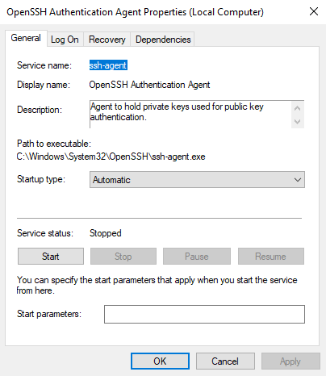

When you have a project, online service or WebApp that you manage and deploy, you usually have something that you [SSH](https://en.wikipedia.org/wiki/Secure_Shell) into. It maybe a real server, a [VPS](https://en.wikipedia.org/wiki/Virtual_private_server), a container, a [Kubernetes](https://kubernetes.io/) node and what have you.

<blockquote class="reaction"><div class="reaction_text">...unless your project is purely <a target="_blank" href="https://en.wikipedia.org/wiki/Serverless_computing">serverless</a> and built with a bunch of <a target="_blank" href="https://cloud.google.com/learn/paas-vs-iaas-vs-saas">(Insert Random Letter) as a Service</a> bricks.</div></blockquote>

Being able to setup a connection you trust and where your dev tools work is important. How you connect to the server where you deploy your projects isn't always straight forward though, when there are proxies, packet sniffing firewalls and network monitoring in-between you, the internet and the target server.

<blockquote class="reaction"><div class="reaction_text">The "correct" answer is: <a target="_blank" href="https://tailscale.com/blog/hamachi">setup a VPN</a>! But that's sometimes not possible. <a target="_blank" href="https://www.microsoft.com/en-us/microsoft-365/business-insights-ideas/resources/what-is-endpoint-management">Endpoint management</a> may forbid it client-side. Server-side infrastructure may be managed by a third party, kicking off costly service requests.</div></blockquote>

Ultimately, this is what this post is about - how to SSH into machines, when there is stuff in the way preventing that and make sure that your tools like git, [scp](https://man.openbsd.org/scp.1), [rsync](https://en.wikipedia.org/wiki/Rsync) or editing files directly on the server via [VSCode's SSH integration](https://code.visualstudio.com/docs/remote/ssh) work, with no new software and the ***absolute minimum*** of modifications to your server.

## Tunneling - So many flavors
If you control both Source and Destination, then you can tunnel everything through anything in complete secrecy and ultimately there is nothing anyone can do about it. This shouldn't be news to anyone working with networks. There are countless articles and videos going over a multitude of tunneling combinations.

- [Internet and SSH over ICMP (Pings)](https://github.com/DhavalKapil/icmptunnel)
- [Internet and SSH over DNS requests](https://github.com/yarrick/iodine)
- [Internet and SSH over WebSockets](https://github.com/erebe/wstunnel)

As for this article, we'll deep-dive ✨***SSH over HTTP(S)***✨. Be it Linux or Windows, we will look at how to setup everything up, what the underlying network traffic looks like and most importantly: how your digital infrastructure is already capable of all this ... even if it didn't intend to.

<blockquote class="reaction"><div class="reaction_text">As for what even qualifies as tunneling, we'll get into that...</div></blockquote>
<a></a>

## A normal SSH connection
A "dumb" firewall which performs no packet sniffing, is unable to block SSH *specifically*. These firewalls control which type (UDP, TCP, etc.) of packet can go from which port, address or application to which port, address or application. This applies to both stateless firewalls and [stateful firewalls](https://en.wikipedia.org/wiki/Stateful_firewall), a distinction which we'll ignore going forward.

When we SSH into something, 

## The corporate proxy
Let's define quickly, what even is a corporate proxy? I'm talking about the modern company with IT setup to control and monitor its employees. Usually, there is nothing malicious about this and sometimes enforced by compliance rules outside the company's influence.

So why is any of this required? Can't you simply open a ticket at your IT department? There may be points situations that makes this impossible on the timescale that a project needs delivering. Reasons for this are many, especially if there are intermediary companies which are responsible for digital infrastructure, kicking-off complicated inter-contract reviews.

### Maybe you don't need to
Local proxies are such a vital piece of infrastructure, that we expect the operating system's proxy settings to be honored by default, built proxy settings into most network connected software and have additional defacto standards to specify them like the environment variables `http_proxy`, `HTTPS_PROXY`, `NO_PROXY` and friends.

But what may come as a surprise, is that such a fundamental piece of infrastructure like OpenSSH doesn't support it, with the exception of [SSH as a proxy itself](https://goteleport.com/blog/ssh-proxyjump-ssh-proxycommand/). The reasons for this are multiple, with one being the [unix philosophy](https://en.wikipedia.org/wiki/Unix_philosophy#Origin) of doing one thing only and doing it well.

But mainly it's because how a proxy works may change based on environment and a basic building block like SSH needs to be compatible with all possibilities. Or to quote from the unix philosophy any future, ***as yet unknown*** protocols.


OpenSSH, as comes preinstalled on Windows these days, doesn't support proxies natively, [except an SSH proxy itself](https://goteleport.com/blog/ssh-proxyjump-ssh-proxycommand/). Instead, OpenSSH gives the generic [`ProxyCommand`](https://goteleport.com/blog/ssh-proxyjump-ssh-proxycommand/)

## [HTTP CONNECT](https://developer.mozilla.org/en-US/docs/Web/HTTP/Methods/CONNECT)
Wait... what? How does the proxy speak with OpenSSH? Since when do HTTP Proxies support SSH? How does a  -insert that's the neat post you don't- Well, they don't. HTTP CONNECT works by relaying RAW TCP. Similar to the dumb firewall we talked about previously, HTTP CONNECT doesn't understand what TCP it's actually relaying. Which bring us to the obvious point: Why don't corporate proxies simply forbid HTTP CONNECT? - Because that would break HTTPS proxy connections. There are stills ways to prohibit this, a bit of a boogie man we'll get into at the end, but corporate proxies are bound by a catch 22 here: You have to look inside to tell apart what is being sent, but looking inside entails breaking encryption.

### Trust is earned, not bought

## Rsync
### Rsync on Windows
This is a bit of an interesting [story](https://en.wikipedia.org/wiki/CwRsync). On Windows there exist two versions of rsync. The standard rsync client with [source code from the Samba project](https://rsync.samba.org/) and [cwRsync](https://en.wikipedia.org/wiki/CwRsync), which has a free client but is closed sourced and [monetized via it's server component](https://itefix.net/store/buy?product=49.00000004) by [itefix](https://itefix.net/). Although cwRsync has a right to exist, I do find it a bit scummy to capitalize on FOSS projects [Cygwin](https://www.cygwin.com/) and Rsync in such a way, considering the client is just the FOSS Rsync source, compiled via cygwin and presumably some custom patches to work with their rsync windows server.

Anyhow, connecting to proxies with cwRsync simply won't work, if you don't call it from a unix emulating environment. cwRsync will error out with `/bin/sh not found`, due to how [itefix](https://itefix.net/) setup the compilation. Luckily the free open source way works, though the calling convention in windows is a bit of a mess.

The issue to overcome for both rsync is: It needs to be called with the OpenSSH, that it was built with, as it links against OpenSSH of a specific version. But OpenSSH also needs to call our proxy command. The way this call happens depends on the environment and the settings it was built in. If we execute rsync in Windows' Powershell, cygwin is responsible for translating these calls. The call of `rsync.exe` ➡ `ssh.exe` works, but the subsequent call of `ssh.exe` ➡ `proxytunnel.exe`, `connect.exe` or `corkscrew.exe` fails due to cygwin is involved and it's requirement of `sh.exe` to be present. Providing your own `sh.exe` won't work due to binary incompatibility.

<blockquote class="reaction"><div class="reaction_text">With <a target="_blank" href="https://itefix.net/">itefix</a>'s cwRsync there is no way to fix it, since it's closed source. 👎</div></blockquote>
<a></a>

This calling convention needs the binary to be in a `usr/bin/` subfolder with `sh.exe` present, due to how cygwin hardcodes things, otherwise you get a `/bin/sh: No such file or directory`. 

Unfortunately, the flexible windows package managers like [scoop](https://scoop.sh/) ships with cwRsync only, something I hope fix in a PR. So we need to install MSYS2, install rsync and make it available in PATH.

As a shortcut, I extracted rsync `v3.3.0` from MSYS2 and the associated `ssh`. Beware that the `usr/bin/` needs to be intact due to Cygwin hardcoding.

<blockquote class="reaction"><div class="reaction_text">Took me a while to figure this mess out.</div></blockquote>
<a></a>

Needs the ssh it comes with. You could specify the command via -e or the environment var `RSYNC_RSH`, but it doesn't get you far, as the way cwRsync ships, it won't work as it invokes the ProxyCommand in an incompatible way. /bin/sh not found, but if you give it that it has to use the libraries it was compiled with, which we don't have.

So we need to give it's own ssh, but we lose the ability to run config, unless we install MSYS to provide that functionality. So it's back to specifying our proxycommand as a long tail of commands. 

`C:\msys64\usr\bin\rsync.exe -e "C:\msys64\usr\bin\ssh.exe -i C:\Users\<User>\.ssh\key -o ProxyCommand='proxytunnel.exe -X -z -p localproxy:port -r domain:443 -d 127.0.0.1:22'" -avz --progress user@<targetNotRequired>:bulb.bash .`

We could just call it from inside MSYS2 and everything would be fine. But you may have *other* tools calling in-turn rsync, so this needs to work outside of MSYS. This works, but we won't have a `/home` anymore and not config file, or `known_hosts` file. If you don't want to `ED25519 key fingerprint is SHA256:f913xxxxxxxxxxxxxxxxxxxxxxxc. This key is not known by any other names.` each time, you will need to hardcode separate paths.

or we can specify our default config file and call via

`C:\rsync\rsync.exe -e "C:\rsync\ssh.exe -F C:\Users\<USER>\.ssh\config" -avz --progress CONFIGNAME:bulb.bash .`

But we have to take care, that the identity file is specified as an absolute path, so
`IdentityFile ~/.ssh/key` is a no go.

Without a unix environment
also `known_hosts` needs an absolute path, so both windows' ssh and our rsync's ssh can read from the same.

And finally, we don't want to that huge call each time and we can't expect other tooling relying on rsync to know this huge command. So we can make rsync fetch it from an environment variable. `RSYNC_RSH`.

[corkscrew.zip](corkscrew.zip)
[rsync-3.4.1-windows.zip](rsync-3.4.1-windows.zip)


<blockquote class="reaction"><div class="reaction_text">It's kind of bananas what we have to go through on Windows to get basic tooling without resorting to <a target="_blank" href="https://learn.microsoft.com/en-us/windows/wsl/install">WSL</a> or <a target="_blank" href="https://www.msys2.org/">MSYS 2</a>. Makes me really appreciate what a fine piece of engineering <a target="_blank" href="https://www.msys2.org/">MSYS 2</a> is.</div></blockquote>
<a></a>

## Corporate proxy
Now, in modern endpoint security there is usually a VPN what talks to what in what scope is fairly diverse. 

<blockquote class="reaction"><div class="reaction_text">You cannot prevent data exfiltration, there is always a way around it. I wish corporate tech would give its engineers the best tools to succeed instead of blindly chasing compliance.<a target="_blank" href="/about/#disclaimer">disclaimer</a> applies.</div></blockquote>

## Other options
You can use
https://github.com/butlerx/wetty or https://github.com/shellinabox/shellinabox , but exposing the shell on as a website is not the best idea, as HTTPS itself may be compromised in a corporate environment due to DPI.


There is the connection multiplexer [https://github.com/yrutschle/sslh](SSLH), which can sit in front of your HTTP server and redirect the packets based on type. However, such a modification of infrastructure may simply be impossible and doesn't solve the issue of SSH connections being potentially filtered. It remains a popular choice for many.

<blockquote class="reaction"><div class="reaction_text">Man, I have seen some s*#$.</div></blockquote>
<a></a>

There are many ways to build your tunnel. Over ICMP.

All of these need HTTP/1.1 () If the intermediate Proxy communicates with HTTP/2, your connections will error out

## Filtered
```
$ ssh -p <SSH Port> user@domain.com

kex_exchange_identification: read: Connection timed out
banner exchange: Connection to domain.com port <SSH Port>: Connection timed out
```


Here is what traffic **may** look like if it's not going through and being filtered.

**Source** 💻 is a Laptop attempting `ssh -p 22 user@domain.com`, shows up in the capture with its **local** IPv4 Address. **Target** 🌍 is the server with port 22 open, shows up in the capture with its **public** IPv4 Address.

<blockquote class="reaction"><div class="reaction_text">Rows with 💻 ➡ 🌍 mean outgoing packets, aka <strong>Source ➡ Target</strong>. Rows with 🌍 ➡ 💻 and a <span style="background-color: #0006">dark background</span> indicate incoming packets, aka <strong>Target ➡ Source</strong>.</div></blockquote>
<a></a>
<table>
	<thead>
	<tr>
		<th>Direction</th>
		<th>Protocol</th>
		<th>Length</th>
		<th>Info</th>
	</tr>
	</thead>
	<tbody>
	<tr>
		<td>💻 ➡ 🌍</td>
		<td>TCP</td>
		<td>66</td>
		<td><code>[SYN] Seq=0 Win=64240 Len=0 MSS=1460 WS=256 SACK_PERM</code></td>
	</tr>
	<tr style="background-color: #0004;">
		<td>🌍 ➡ 💻</td>
		<td>TCP</td>
		<td>66</td>
		<td><code>[SYN, ACK] Seq=0 Ack=1 Win=64240 Len=0 MSS=1452 SACK_PERM WS=128</code></td>
	</tr>
	<tr>
		<td>💻 ➡ 🌍</td>
		<td>TCP</td>
		<td>54</td>
		<td><code>[ACK] Seq=1 Ack=1 Win=132096 Len=0</code></td>
	</tr>
	<tr>
		<td>💻 ➡ 🌍</td>
		<td>TCP</td>
		<td>87</td>
		<td><code>[PSH, ACK] Seq=1 Ack=1 Win=132096 Len=33</code></td>
	</tr>
	<tr>
		<td>💻 ➡ 🌍</td>
		<td>TCP</td>
		<td>87</td>
		<td><code>[TCP Retransmission] [PSH, ACK] Seq=1 Ack=1 Win=132096 Len=33</code></td>
	</tr>
	<tr style="text-align: center">
		<td colspan=4>This goes on for 7 more <code>[TCP Retransmission]</code> packets</td>
	</tr>
	<tr>
		<td>💻 ➡ 🌍</td>
		<td>TCP</td>
		<td>54</td>
		<td><code>[RST, ACK] Seq=34 Ack=1 Win=0 Len=0</code></td>
	</tr>
	</tbody>
</table>

The target never responds to our requests, before our clients gives up with the [`RST`](https://developers.cloudflare.com/fundamentals/reference/tcp-connections/#tcp-connections-and-keep-alives) signal.
Note the three two packets of exchange, aka the [TCP handshake](https://www.cloudflare.com/learning/ssl/what-happens-in-a-tls-handshake/), the [MSS, maximum segment size](https://www.cloudflare.com/learning/network-layer/what-is-mss/) is not identical, a (weak) indication that whoever responded to us it not our actual target, but some kind of firewall or whatever.

## Whitelisted

<table>
	<thead>
		<tr>
			<th>Direction</th>
			<th>Protocol</th>
			<th>Length</th>
			<th>Info</th>
		</tr>
	</thead>
	<tbody>
		<tr>
			<td>💻 ➡ 🌍</td>
			<td>TCP</td>
			<td>66</td>
			<td><code>[SYN] Seq=0 Win=64240 Len=0 MSS=1460 WS=256 SACK_PERM</code></td>
		</tr>
		<tr style="background-color: #0004;">
			<td>🌍 ➡ 💻</td>
			<td>TCP</td>
			<td>66</td>
			<td><code>[SYN, ACK] Seq=0 Ack=1 Win=64240 Len=0 MSS=1460 SACK_PERM WS=128</code></td>
		</tr>
		<tr>
			<td>💻 ➡ 🌍</td>
			<td>TCP</td>
			<td>54</td>
			<td><code>[ACK] Seq=1 Ack=1 Win=131328 Len=0</code></td>
		</tr>
		<tr>
			<td>💻 ➡ 🌍</td>
			<td>SSHv2</td>
			<td>87</td>
			<td><code>Client: Protocol (SSH-2.0-OpenSSH_for_Windows_9.5)</code></td>
		</tr>
		<tr style="background-color: #0004;">
			<td>🌍 ➡ 💻</td>
			<td>TCP</td>
			<td>60</td>
			<td><code>[ACK] Seq=1 Ack=34 Win=64256 Len=0</code></td>
		</tr>
		<tr style="background-color: #0004;">
			<td>🌍 ➡ 💻</td>
			<td>SSHv2</td>
			<td>95</td>
			<td><code>Server: Protocol (SSH-2.0-OpenSSH_8.2p1 Ubuntu-4ubuntu0.9)</code></td>
		</tr>
		<tr>
			<td>💻 ➡ 🌍</td>
			<td>SSHv2</td>
			<td>1486</td>
			<td><code>Client: Key Exchange Init</code></td>
		</tr>
		<tr style="background-color: #0004;">
			<td>🌍 ➡ 💻</td>
			<td>SSHv2</td>
			<td>1110</td>
			<td><code>Server: Key Exchange Init</code></td>
		</tr>
		<tr>
			<td>💻 ➡ 🌍</td>
			<td>SSHv2</td>
			<td>102</td>
			<td><code>Client: Elliptic Curve Diffie-Hellman Key Exchange Init</code></td>
		</tr>
		<tr style="background-color: #0004;">
			<td>🌍 ➡ 💻</td>
			<td>TCP</td>
			<td>60</td>
			<td><code>[ACK] Seq=1098 Ack=1514 Win=64128 Len=0</code></td>
		</tr>
		<tr style="background-color: #0004;">
			<td>🌍 ➡ 💻</td>
			<td>SSHv2</td>
			<td>562</td>
			<td><code>Server: Elliptic Curve Diffie-Hellman Key Exchange Reply, New Keys, Encrypted packet (len=228)</code></td>
		</tr>
		<tr>
			<td>💻 ➡ 🌍</td>
			<td>SSHv2</td>
			<td>70</td>
			<td><code>Client: New Keys</code></td>
		</tr>
		<tr style="background-color: #0004;">
			<td>🌍 ➡ 💻</td>
			<td>TCP</td>
			<td>60</td>
			<td><code>[ACK] Seq=1606 Ack=1530 Win=64128 Len=0</code></td>
		</tr>
		<tr>
			<td>💻 ➡ 🌍</td>
			<td>SSHv2</td>
			<td>98</td>
			<td><code>Client: Encrypted packet (len=44)</code></td>
		</tr>
		<tr style="background-color: #0004;">
			<td>🌍 ➡ 💻</td>
			<td>TCP</td>
			<td>60</td>
			<td><code>[ACK] Seq=1606 Ack=1574 Win=64128 Len=0</code></td>
		</tr>
		<tr style="background-color: #0004;">
			<td>🌍 ➡ 💻</td>
			<td>SSHv2</td>
			<td>98</td>
			<td><code>Server: Encrypted packet (len=44)</code></td>
		</tr>
		<tr>
			<td>💻 ➡ 🌍</td>
			<td>SSHv2</td>
			<td>114</td>
			<td><code>Client: Encrypted packet (len=60)</code></td>
		</tr>
		<tr style="background-color: #0004;">
			<td>🌍 ➡ 💻</td>
			<td>TCP</td>
			<td>60</td>
			<td><code>[ACK] Seq=1650 Ack=1634 Win=64128 Len=0</code></td>
		</tr>
		<tr style="background-color: #0004;">
			<td>🌍 ➡ 💻</td>
			<td>SSHv2</td>
			<td>98</td>
			<td><code>Server: Encrypted packet (len=44)</code></td>
		</tr>
		<tr>
			<td>💻 ➡ 🌍</td>
			<td>SSHv2</td>
			<td>554</td>
			<td><code>Client: Encrypted packet (len=500)</code></td>
		</tr>
		<tr style="background-color: #0004;">
			<td>🌍 ➡ 💻</td>
			<td>TCP</td>
			<td>60</td>
			<td><code>[ACK] Seq=1694 Ack=2134 Win=64128 Len=0</code></td>
		</tr>
		<tr style="background-color: #0004;">
			<td>🌍 ➡ 💻</td>
			<td>SSHv2</td>
			<td>514</td>
			<td><code>Server: Encrypted packet (len=460)</code></td>
		</tr>
		<tr>
			<td>💻 ➡ 🌍</td>
			<td>SSHv2</td>
			<td>962</td>
			<td><code>Client: Encrypted packet (len=908)</code></td>
		</tr>
		<tr style="background-color: #0004;">
			<td>🌍 ➡ 💻</td>
			<td>SSHv2</td>
			<td>82</td>
			<td><code>Server: Encrypted packet (len=28)</code></td>
		</tr>
		<tr>
			<td>💻 ➡ 🌍</td>
			<td>SSHv2</td>
			<td>166</td>
			<td><code>Client: Encrypted packet (len=112)</code></td>
		</tr>
		<tr style="background-color: #0004;">
			<td>🌍 ➡ 💻</td>
			<td>TCP</td>
			<td>60</td>
			<td><code>[ACK] Seq=2182 Ack=3154 Win=64128 Len=0</code></td>
		</tr>
		<tr style="background-color: #0004;">
			<td>🌍 ➡ 💻</td>
			<td>SSHv2</td>
			<td>830</td>
			<td><code>Server: Encrypted packet (len=776)</code></td>
		</tr>
		<tr>
			<td>💻 ➡ 🌍</td>
			<td>TCP</td>
			<td>54</td>
			<td><code>[ACK] Seq=3154 Ack=2958 Win=130048 Len=0</code></td>
		</tr>
		<tr style="background-color: #0004;">
			<td>🌍 ➡ 💻</td>
			<td>SSHv2</td>
			<td>246</td>
			<td><code>Server: Encrypted packet (len=192)</code></td>
		</tr>
		<tr>
			<td>💻 ➡ 🌍</td>
			<td>SSHv2</td>
			<td>190</td>
			<td><code>Client: Encrypted packet (len=136)</code></td>
		</tr>
		<tr style="background-color: #0004;">
			<td>🌍 ➡ 💻</td>
			<td>TCP</td>
			<td>60</td>
			<td><code>[ACK] Seq=3150 Ack=3290 Win=64128 Len=0</code></td>
		</tr>
		<tr style="background-color: #0004;">
			<td>🌍 ➡ 💻</td>
			<td>SSHv2</td>
			<td>162</td>
			<td><code>Server: Encrypted packet (len=108)</code></td>
		</tr>
		<tr style="background-color: #0004;">
			<td>🌍 ➡ 💻</td>
			<td>SSHv2</td>
			<td>242</td>
			<td><code>Server: Encrypted packet (len=188)</code></td>
		</tr>
		<tr style="background-color: #0004;">
			<td>🌍 ➡ 💻</td>
			<td>SSHv2</td>
			<td>406</td>
			<td><code>Server: Encrypted packet (len=352)</code></td>
		</tr>
		<tr style="background-color: #0004;">
			<td>🌍 ➡ 💻</td>
			<td>SSHv2</td>
			<td>170</td>
			<td><code>Server: Encrypted packet (len=116)</code></td>
		</tr>
		<tr style="background-color: #0004;">
			<td>🌍 ➡ 💻</td>
			<td>SSHv2</td>
			<td>138</td>
			<td><code>Server: Encrypted packet (len=84)</code></td>
		</tr>
		<tr style="background-color: #0004;">
			<td>🌍 ➡ 💻</td>
			<td>SSHv2</td>
			<td>274</td>
			<td><code>Server: Encrypted packet (len=220)</code></td>
		</tr>
		<tr style="background-color: #0004;">
			<td>🌍 ➡ 💻</td>
			<td>SSHv2</td>
			<td>306</td>
			<td><code>Server: Encrypted packet (len=252)</code></td>
		</tr>
		<tr style="background-color: #0004;">
			<td>🌍 ➡ 💻</td>
			<td>SSHv2</td>
			<td>146</td>
			<td><code>Server: Encrypted packet (len=92)</code></td>
		</tr>
		<tr style="background-color: #0004;">
			<td>🌍 ➡ 💻</td>
			<td>SSHv2</td>
			<td>226</td>
			<td><code>Server: Encrypted packet (len=172)</code></td>
		</tr>
		<tr style="background-color: #0004;">
			<td>🌍 ➡ 💻</td>
			<td>SSHv2</td>
			<td>146</td>
			<td><code>Server: Encrypted packet (len=92)</code></td>
		</tr>
		<tr>
			<td>💻 ➡ 🌍</td>
			<td>TCP</td>
			<td>54</td>
			<td><code>[ACK] Seq=3290 Ack=4826 Win=131328 Len=0</code></td>
		</tr>
		<tr style="background-color: #0004;">
			<td>🌍 ➡ 💻</td>
			<td>SSHv2</td>
			<td>1514</td>
			<td><code>Server: Encrypted packet (len=1460)</code></td>
		</tr>
		<tr style="background-color: #0004;">
			<td>🌍 ➡ 💻</td>
			<td>SSHv2</td>
			<td>86</td>
			<td><code>Server: Encrypted packet (len=32)</code></td>
		</tr>
		<tr>
			<td>💻 ➡ 🌍</td>
			<td>TCP</td>
			<td>54</td>
			<td><code>[ACK] Seq=3290 Ack=6318 Win=131328 Len=0</code></td>
		</tr>
		<tr style="background-color: #0004;">
			<td>🌍 ➡ 💻</td>
			<td>SSHv2</td>
			<td>98</td>
			<td><code>Server: Encrypted packet (len=44)</code></td>
		</tr>
		<tr style="background-color: #0004;">
			<td>🌍 ➡ 💻</td>
			<td>SSHv2</td>
			<td>130</td>
			<td><code>Server: Encrypted packet (len=76)</code></td>
		</tr>
		<tr>
			<td>💻 ➡ 🌍</td>
			<td>TCP</td>
			<td>54</td>
			<td><code>[ACK] Seq=3290 Ack=6438 Win=131072 Len=0</code></td>
		</tr>
		<tr style="background-color: #0004;">
			<td>🌍 ➡ 💻</td>
			<td>SSHv2</td>
			<td>1514</td>
			<td><code>Server: Encrypted packet (len=1460)</code></td>
		</tr>
		<tr style="background-color: #0004;">
			<td>🌍 ➡ 💻</td>
			<td>SSHv2</td>
			<td>62</td>
			<td><code>Server: Encrypted packet (len=8)</code></td>
		</tr>
		<tr style="background-color: #0004;">
			<td>🌍 ➡ 💻</td>
			<td>SSHv2</td>
			<td>98</td>
			<td><code>Server: Encrypted packet (len=44)</code></td>
		</tr>
		<tr>
			<td>💻 ➡ 🌍</td>
			<td>TCP</td>
			<td>54</td>
			<td><code>[ACK] Seq=3290 Ack=7950 Win=131328 Len=0</code></td>
		</tr>
		<tr style="background-color: #0004;">
			<td>🌍 ➡ 💻</td>
			<td>SSHv2</td>
			<td>98</td>
			<td><code>Server: Encrypted packet (len=44)</code></td>
		</tr>
		<tr style="background-color: #0004;">
			<td>🌍 ➡ 💻</td>
			<td>SSHv2</td>
			<td>98</td>
			<td><code>Server: Encrypted packet (len=44)</code></td>
		</tr>
		<tr>
			<td>💻 ➡ 🌍</td>
			<td>TCP</td>
			<td>54</td>
			<td><code>[ACK] Seq=3290 Ack=8038 Win=131072 Len=0</code></td>
		</tr>
	</tbody>
</table>


# Tunneled
## `connect.exe` and `corkscrew.exe`
Let's see what it looks like from the intermediate, corporate proxy. We are looking at the communication between the Proxy and the Laptop specifically. And this is again the output of wireshark.

| Direction | Protocol | Length | Info |
| --- | --- | --- | --- |
| 💻 →  🖥 |TCP	| 66	| `62543 → 9999 [SYN] Seq=0 Win=64240 Len=0 MSS=1460 WS=256 SACK_PERM=1`|
| 🖥 →  💻 |TCP	| 66	| `9999 → 62543 [SYN, ACK] Seq=0 Ack=1 Win=64240 Len=0 MSS=1460 SACK_PERM=1 WS=128`|
| 💻 →  🖥 |TCP	| 60	| `62543 → 9999 [ACK] Seq=1 Ack=1 Win=131328 Len=0`|
| 💻 →  🖥 |TCP	| 89	| `CONNECT  🖥:22 HTTP/1.0  [TCP segment of a reassembled PDU]`|
| 🖥 →  💻 |TCP	| 54	| `9999 → 62543 [ACK] Seq=1 Ack=36 Win=64256 Len=0`|
| 💻 →  🖥 |HTTP	| 60	| `CONNECT  🖥:22 HTTP/1.0`|
| 🖥 →  💻 |TCP	| 54	| `9999 → 62543 [ACK] Seq=1 Ack=38 Win=64256 Len=0`|
| 🖥 →  💻 |HTTP	| 93	| `HTTP/1.0 200 Connection established`|
| 🖥 →  💻 |SSH	| 95	| `Client: Protocol (SSH-2.0-OpenSSH_8.2p1 Ubuntu-4ubuntu0.9)`|
| 💻 →  🖥 |SSHv2	| 87	| `Server: Protocol (SSH-2.0-OpenSSH_for_Windows_9.5)`|
| 🖥 →  💻 |TCP	| 54	| `9999 → 62543 [ACK] Seq=81 Ack=71 Win=64256 Len=0`|
| 🖥 →  💻 |SSHv2	| 1110	| `Client: Key Exchange Init`|
| 💻 →  🖥 |TCP	| 1078	| `[TCP segment of a reassembled PDU]`|
| 🖥 →  💻 |TCP	| 54	| `9999 → 62543 [ACK] Seq=1137 Ack=1095 Win=64128 Len=0`|
| 💻 →  🖥 |SSHv2	| 510	| `Server: Server: Key Exchange Init, Diffie-Hellman Key Exchange Init`|
| 🖥 →  💻 |TCP	| 54	| `9999 → 62543 [ACK] Seq=1137 Ack=1551 Win=64128 Len=0`|
| 🖥 →  💻 |SSHv2	| 562	| `Client: Diffie-Hellman Key Exchange Reply, New Keys, Encrypted packet (len=228)`|
| 💻 →  🖥 |SSHv2	| 114	| `Server: New Keys, Encrypted packet (len=44)`|
| 🖥 →  💻 |SSHv2	| 98	| `Client: Encrypted packet (len=44)`|
| 💻 →  🖥 |SSHv2	| 114	| `Server: Encrypted packet (len=60)`|
| 🖥 →  💻 |SSHv2	| 98	| `Client: Encrypted packet (len=44)`|
| 💻 →  🖥 |SSHv2	| 554	| `Server: Encrypted packet (len=500)`|
| 🖥 →  💻 |SSHv2	| 514	| `Client: Encrypted packet (len=460)`|
| 💻 →  🖥 |SSHv2	| 962	| `Server: Encrypted packet (len=908)`|
| 🖥 →  💻 |SSHv2	| 82	| `Client: Encrypted packet (len=28)`|
| 💻 →  🖥 |SSHv2	| 166	| `Server: Encrypted packet (len=112)`|
| 🖥 →  💻 |TCP	| 54	| `9999 → 62543 [ACK] Seq=2221 Ack=3191 Win=64128 Len=0`|
| 🖥 →  💻 |SSHv2	| 830	| `Client: Encrypted packet (len=776)`|
| 🖥 →  💻 |SSHv2	| 202	| `Client: Encrypted packet (len=148)`|
| 🖥 →  💻 |SSHv2	| 98	| `Client: Encrypted packet (len=44)`|
| 💻 →  🖥 |TCP	| 60	| `62543 → 9999 [ACK] Seq=3191 Ack=3189 Win=131328 Len=0`|
| 💻 →  🖥 |SSHv2	| 190	| `Server: Encrypted packet (len=136)`|
| 🖥 →  💻 |TCP	| 54	| `9999 → 62543 [ACK] Seq=3189 Ack=3327 Win=64128 Len=0`|
| 🖥 →  💻 |SSHv2	| 162	| `Client: Encrypted packet (len=108)`|
| 🖥 →  💻 |SSHv2	| 754	| `Client: Encrypted packet (len=700)`|
| 🖥 →  💻 |SSHv2	| 370	| `Client: Encrypted packet (len=316)`|
| 🖥 →  💻 |SSHv2	| 346	| `Client: Encrypted packet (len=292)`|

As you can see, even though we speak HTTP, the proxy still clocks that SSH is going here.

## proxytunnel.exe
https://github.com/ScoopInstaller/Main/pull/6409

| Direction | Protocol | Length | Info |
| --- | --- | --- | --- |
| Source ➡  Target | TCP		|	66 | `49928 → 9999 [SYN] Seq=0 Win=64240 Len=0 MSS=1460 WS=256 SACK_PERM`|
| Target ➡  Source | TCP		|	66 | `9999 → 49928 [SYN, ACK] Seq=0 Ack=1 Win=64240 Len=0 MSS=1460 SACK_PERM WS=128`|
| Source ➡  Target | TCP		|	54 | `49928 → 9999 [ACK] Seq=1 Ack=1 Win=131328 Len=0`|
| Source ➡  Target | HTTP	|	157 | `CONNECT domain.com:443 HTTP/1.1 `|
| Target ➡  Source | TCP		|	60 | `9999 → 49928 [ACK] Seq=1 Ack=104 Win=64256 Len=0`|
| Target ➡  Source | HTTP	|	93 | `HTTP/1.1 200 Connection established `|
| Source ➡  Target | TLSv1.2	|		380 | `Client Hello (SNI=domain.com)`|
| Target ➡  Source | TCP		|	60 | `9999 → 49928 [ACK] Seq=40 Ack=430 Win=64128 Len=0`|
| Target ➡  Source | TLSv1.2	|		1514 | `Server Hello`|
| Target ➡  Source | TLSv1.2	|		1206 | `Certificate, Server Key Exchange, Server Hello Done`|
| Source ➡  Target | TCP		|	54 | `49928 → 9999 [ACK] Seq=430 Ack=2652 Win=131328 Len=0`|
| Source ➡  Target | TLSv1.2	|		212 | `Client Key Exchange, Change Cipher Spec, Encrypted Handshake Message`|
| Target ➡  Source | TCP		|	60 | `9999 → 49928 [ACK] Seq=2652 Ack=588 Win=64128 Len=0`|
| Target ➡  Source | TLSv1.2	|		105 | `Change Cipher Spec, Encrypted Handshake Message`|
| Source ➡  Target | TLSv1.2	|		184 | `Application Data`|
| Target ➡  Source | TCP		|	60 | `9999 → 49928 [ACK] Seq=2703 Ack=718 Win=64128 Len=0`|
| Target ➡  Source | TLSv1.2	|		142 | `Application Data`|
| Source ➡  Target | TLSv1.2	|		116 | `Application Data`|
| Target ➡  Source | TLSv1.2	|		124 | `Application Data`|
| Source ➡  Target | TLSv1.2	|		1515 | `Application Data`|
| Target ➡  Source | TLSv1.2	|		1139 | `Application Data`|
| Source ➡  Target | TLSv1.2	|		131 | `Application Data`|
| Target ➡  Source | TCP		|	60 | `9999 → 49928 [ACK] Seq=3946 Ack=2241 Win=64128 Len=0`|
| Target ➡  Source | TLSv1.2	|		591 | `Application Data`|
| Source ➡  Target | TLSv1.2	|		143 | `Application Data`|
| Target ➡  Source | TLSv1.2	|		127 | `Application Data`|
| Source ➡  Target | TLSv1.2	|		143 | `Application Data`|
| Target ➡  Source | TLSv1.2	|		127 | `Application Data`|
| Source ➡  Target | TLSv1.2	|		583 | `Application Data`|
| Target ➡  Source | TLSv1.2	|		543 | `Application Data`|

What does the proxy see?

| Direction | Protocol | Length | Info |
| --- | --- | --- | --- |
|Source →  Target	| TCP		| 66	|  `51450 → 9999 [SYN] Seq=0 Win=64240 Len=0 MSS=1460 WS=256 SACK_PERM=1`|
| Target → Source	| TCP		| 66	|  `9999 → 51450 [SYN, ACK] Seq=0 Ack=1 Win=64240 Len=0 MSS=1460 SACK_PERM=1 WS=128`|
|Source →  Target	| TCP		| 60	|  `51450 → 9999 [ACK] Seq=1 Ack=1 Win=131328 Len=0`|
|Source →  Target	| HTTP		| 157	|  `CONNECT domain.com:443 HTTP/1.1`|
| Target → Source	| TCP		| 54	|  `9999 → 51450 [ACK] Seq=1 Ack=104 Win=64256 Len=0`|
| Target → Source	| HTTP		| 93	|  `HTTP/1.1 200 Connection established`|
|Source →  Target	| TLSv1		| 380	|  `Client Hello`|
| Target → Source	| TCP		| 54	|  `9999 → 51450 [ACK] Seq=40 Ack=430 Win=64128 Len=0`|
| Target → Source	| TLSv1.2	|	 2666	|  `Server Hello, Certificate, Server Key Exchange, Server Hello Done`|
|Source →  Target	| TCP		| 60	|  `51450 → 9999 [ACK] Seq=430 Ack=2652 Win=131328 Len=0`|
|Source →  Target	| TLSv1.2	|	 212	|  `Client Key Exchange, Change Cipher Spec, Encrypted Handshake Message`|
| Target → Source	| TCP		| 54	|  `9999 → 51450 [ACK] Seq=2652 Ack=588 Win=64128 Len=0`|
| Target → Source	| TLSv1.2	|	 105	|  `Change Cipher Spec, Encrypted Handshake Message`|
|Source →  Target	| TLSv1.2	|	 184	|  `Application Data`|
| Target → Source	| TCP		| 54	|  `9999 → 51450 [ACK] Seq=2703 Ack=718 Win=64128 Len=0`|
| Target → Source	| TLSv1.2	|	 142	|  `Application Data`|
| Target → Source	| TLSv1.2	|	 124	|  `Application Data`|
|Source →  Target	| TLSv1.2	|	 116	|  `Application Data`|
| Target → Source	| TLSv1.2	|	 1139	|  `Application Data`|
|Source →  Target	| TCP		| 60	|  `51450 → 9999 [ACK] Seq=780 Ack=3946 Win=130048 Len=0`|
|Source →  Target	| TCP		| 1514	|  `[TCP segment of a reassembled PDU]`|
|Source →  Target	| TLSv1.2	|	 103	|  `Application Data`|
| Target → Source	| TCP		| 54	|  `9999 → 51450 [ACK] Seq=3946 Ack=2289 Win=64128 Len=0`|
| Target → Source	| TLSv1.2	|	 591	|  `Application Data`|
|Source →  Target	| TLSv1.2	|	 143	|  `Application Data`|
| Target → Source	| TLSv1.2	|	 127	|  `Application Data`|
|Source →  Target	| TLSv1.2	|	 143	|  `Application Data`|
| Target → Source	| TLSv1.2	|	 127	|  `Application Data`|
|Source →  Target	| TLSv1.2	|	 583	|  `Application Data`|
| Target → Source	| TLSv1.2	|	 543	|  `Application Data`|
|Source →  Target	| TLSv1.2	|	 991	|  `Application Data`|
| Target → Source	| TLSv1.2	|	 111	|  `Application Data`|
|Source →  Target	| TLSv1.2	|	 195	|  `Application Data`|
| Target → Source	| TCP		| 54	|  `9999 → 51450 [ACK] Seq=5175 Ack=4074 Win=64128 Len=0`|
| Target → Source	| TLSv1.2	|	 859	|  `Application Data`|
| Target → Source	| TLSv1.2	|	 275	|  `Application Data`|
|Source →  Target	| TCP		| 60	|  `51450 → 9999 [ACK] Seq=4074 Ack=6201 Win=131328 Len=0`|
|Source →  Target	| TLSv1.2	|	 219	|  `Application Data`|
| Target → Source	| TCP		| 54	|  `9999 → 51450 [ACK] Seq=6201 Ack=4239 Win=64128 Len=0`|
| Target → Source	| TLSv1.2	|	 191	|  `Application Data`|
| Target → Source	| TLSv1.2	|	 1319	|  `Application Data`|
|Source →  Target	| TCP		| 60	|  `51450 → 9999 [ACK] Seq=4239 Ack=7603 Win=129792 Len=0`|
| Target → Source	| TLSv1.2	|	 1575	|  `Application Data`|
|Source →  Target	| TCP		| 60	|  `51450 → 9999 [ACK] Seq=4239 Ack=9124 Win=131328 Len=0`|
| Target → Source	| TLSv1.2	|	 232	|  `Application Data, Application Data`|
| Target → Source	| TLSv1.2	|	 1551	|  `Application Data`|
| Target → Source	| TLSv1.2	|	 127	|  `Application Data`|
| Target → Source	| TLSv1.2	|	 127	|  `Application Data`|
| Target → Source	| TLSv1.2	|	 127	|  `Application Data`|
|Source →  Target	| TCP		| 60	|  `51450 → 9999 [ACK] Seq=4239 Ack=10872 Win=131328 Len=0`|
|Source →  Target	| TCP		| 60	|  `51450 → 9999 [ACK] Seq=4239 Ack=11018 Win=131072 Len=0`|

Effectively what we have created with ...
```
proxy_connect;
proxy_connect_allow 22;
proxy_connect_address 127.0.0.1;
```
... is port-forwarding, without the ability to do so.

The proxy is [non the wiser](https://www.youtube.com/watch?v=otCpCn0l4Wo&t=15s)! Now there is no way for the proxy to know what's going on and block our connection. Except [with specialized tooling mostly relegated to research](https://inria.hal.science/hal-01273160/file/HTTPS_traffic_identification_framework_NOMS16.pdf), which looks at the encrypted traffic and squints *really* hard.

Unless... [\*cue scary music\*](https://youtu.be/AfjqL0vaBYU?t=5)

## Deep Packet Inspection 👻
There is only one way to detect this properly at scale: [Deep packet inspection (DPI)](https://en.wikipedia.org/wiki/Deep_packet_inspection). In the context of HTTPs or corporate connections, this involved pre-installing a [Trusted Root Certification Authority](https://en.wikipedia.org/wiki/Certificate_authority) on the user's machine (i.e. via Windows' group policy), which allows the corporate proxy to strip encryption. But this is such a bad idea, that even the [NSA](https://en.wikipedia.org/wiki/National_Security_Agency) issued [an advisory](https://web.archive.org/web/20191119195359/https://media.defense.gov/2019/Nov/18/2002212783/-1/-1/0/MANAGING%20RISK%20FROM%20TLS%20INSPECTION_20191106.PDF) and the [Cypersecurity & Infrastructure Security Agency CISA](https://en.wikipedia.org/wiki/Cybersecurity_and_Infrastructure_Security_Agency) outright [cautions against it](https://www.cisa.gov/news-events/alerts/2017/03/16/https-interception-weakens-tls-security).

Now browsers are actually supposed to protect against this and do [indeed have ways to do detect DPI](https://www.grc.com/fingerprints.htm). However, the browsers are kinda cahoots with the corporate proxy on this one. If your system is told to trust a a CA, it will.

Also comment `https://stackoverflow.com/questions/58671007` Yes this is detectable, see `https://www.grc.com/fingerprints.htm` on the server it's a simple fingerprint check, but automating it in JS is a bit tougher due to know way of getting the cert, but possible via `https://stackoverflow.com/questions/2402121`

```
openssl s_client -proxy <Corporate Proxy IP>:<Corporate Proxy Port> -connect <Site which is not blocked>:443 -servername <Site which is not blocked> | openssl x509 -noout -fingerprint -sha1
```

## Quick tip:
Don't retype your SSH Key's password until reboot or time limit. On windows 

