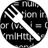

[WaniKani](https://www.wanikani.com/) is a Japanese [Kanji](https://en.wikipedia.org/wiki/Kanji) study service, with strong community support [extending the service creating all kinds of features](https://community.wanikani.com/t/the-new-and-improved-list-of-api-and-third-party-apps/7694?u=frostkiwi). One of my favorites being a [connection to a huge Anime sentences database](https://community.wanikani.com/t/userscript-anime-context-sentences/54003?u=frostkiwi), which allows to hear the vocabulary you learn in a short snippet from Ghibli movies, among others.


The Question prompts of WaniKani are in English though, which I always found kind of ironic. A Userscript was created to fix this, which Greasyfork user [hoovard](https://greasyfork.org/en/users/9284-hoovard) updated to become ["WK Custom Review Question (KunOn+)"](https://greasyfork.org/en/scripts/8193-wk-custom-review-question-kunon). However, the script didn't properly function, which [I fixed](https://community.wanikani.com/t/the-new-and-improved-list-of-api-and-third-party-apps/7694/568) by modifying the script. The script was broken again by a big WaniKani update. Now I have rewritten the script from scratch to work with the current (see post modification date) version of WaniKani.

This script now properly replaces the prompts to be Japanese and specifies whether or not it's supposed to be [OnYomi](https://en.wikipedia.org/wiki/Kanji#On'yomi_(Sino-Japanese_reading)) or [KunYomi](https://en.wikipedia.org/wiki/Kanji#Kun'yomi_(native_reading)). Get it [on Greasyfork](https://greasyfork.org/en/scripts/444836-wanikani-japanese-review-questions) or directly [from the repo of this blog](https://github.com/FrostKiwi/treasurechest/raw/main/posts/wanikani-userscript/WaniKani%20Japanese%20Review%20Questions.user.js). The detection of OnYomi vs KunYomi is provided by [HaraldN](https://greasyfork.org/en/users/856931-haraldn) in his Userscript [WaniKani Katakana For On'yomi](https://greasyfork.org/en/scripts/437497-wanikani-katakana-for-on-yomi).

<a target="_blank" href="https://greasyfork.org/en/scripts/444836-wanikani-japanese-review-questions" class="no_border" style="display: flex; align-items: center; gap: 10px">Download on Greasyfork</a>

<details>
<summary>Source code of the <a target="_blank" href="WaniKani Japanese Review Questions.user.js">Userscript</a></summary>

```js

```
</details>

| Original | Modified |
| ----------------- | ------------------- |
|  |  |
